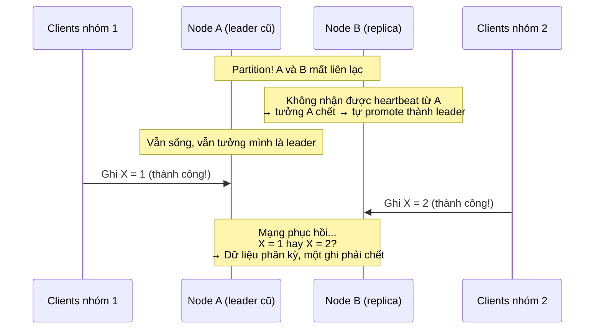

+++
title = "4.4. Clock Synchronization, Network Partition & Split Brain"
date = "2026-07-13T08:00:00+07:00"
draft = false
tags = ["backend", "system-design"]
series = ["System Design — Tư Duy Thiết Kế Hệ Thống"]
+++

## 1. Problem Statement

Ba "sự thật khó chịu" của hệ phân tán mà mọi thiết kế phải đối mặt:

1. **Không có đồng hồ chung.** Mỗi máy một đồng hồ, và chúng lệch nhau.
2. **Mạng sẽ đứt** — theo những cách kỳ quặc hơn bạn tưởng (đứt một chiều, đứt chập chờn, chậm-như-đứt).
3. Hệ quả của (1) + (2): **split brain** — hai phần của hệ thống cùng tin rằng mình là "chính", cùng nhận ghi, và dữ liệu phân kỳ.

Chương này nối các nguyên lý ở 4.1–4.3 với các sự cố thực tế nhất của Phần 13.

## 2. Clock — vì sao không tin được đồng hồ

### 2.1. Thực tế vật lý

Đồng hồ thạch anh trong server trôi (drift) cỡ **~10⁻⁵** — tức có thể lệch vài trăm mili-giây đến hàng giây mỗi ngày nếu không đồng bộ. NTP kéo về nhưng: qua mạng nên chính xác cỡ mili-giây trong LAN tốt, tệ hơn nhiều qua WAN; khi chênh lớn NTP có thể làm đồng hồ **nhảy lùi**; leap second từng làm sập hàng loạt hệ thống lớn. VM còn tệ hơn: pause/migrate làm đồng hồ đứng hình rồi nhảy vọt.

### 2.2. Hệ quả thiết kế

**Không bao giờ dùng timestamp của hai máy khác nhau để xác định thứ tự sự kiện** khi thứ tự đó có ý nghĩa nghiệp vụ. Đây là lỗi gốc của Last-Write-Wins: máy A có đồng hồ chạy nhanh 200ms sẽ "thắng" mọi xung đột với máy B trong 200ms đó — ghi của B biến mất không dấu vết.

Phân biệt hai loại đồng hồ (và dùng đúng loại):

- **Time-of-day clock** (`System.currentTimeMillis()`): để hiển thị, log, TTL dài. Có thể nhảy lùi → cấm dùng đo khoảng thời gian.
- **Monotonic clock** (`System.nanoTime()`): chỉ tiến, không có ý nghĩa tuyệt đối → dùng đo timeout, latency, khoảng cách giữa hai sự kiện *trên cùng một máy*.

Khi cần **thứ tự** giữa các máy, dùng đồng hồ logic thay cho đồng hồ vật lý:

- **Lamport clock:** counter tăng theo mỗi sự kiện, gửi kèm message, nhận thì lấy max — cho thứ tự nhất quán với nhân quả (nhưng không phát hiện được concurrent).
- **Vector clock / version vector:** phát hiện được hai bản ghi là nối tiếp hay **đồng thời** (xung đột thật) — nền của hòa giải xung đột kiểu Dynamo.
- **Term/epoch/fencing token** ([chương 4.3](/series/system-design/04-distributed-systems/03-consensus-quorum-leader-election/)): số nguyên tăng đơn điệu do consensus cấp — dạng đồng hồ logic đơn giản nhất và hữu dụng nhất trong thực chiến.

(Tham khảo mở rộng: Google Spanner mua strong consistency toàn cầu bằng TrueTime — đồng hồ nguyên tử + GPS cho *khoảng* bất định vài ms, và **chờ hết khoảng bất định** trước khi commit. Bài học không phải "hãy mua đồng hồ nguyên tử" mà là: ngay cả Google cũng không tin một con số timestamp — họ tin một *khoảng* kèm theo sự chờ đợi.)

## 3. Network Partition — mạng đứt như thế nào

Partition không chỉ là "cáp đứt đôi cụm". Các dạng thực tế, xếp theo độ quái:

- **Đứt gọn:** hai nhóm không thấy nhau. Dạng "đẹp" nhất — quorum xử được.
- **Đứt một chiều (asymmetric):** A gửi được cho B, B không gửi lại được A. Health check chiều này pass, chiều kia fail → hai node bất đồng về "ai sống".
- **Chập chờn (flapping):** rớt 30%, lúc được lúc không → hệ thống dao động join/leave liên tục, bầu cử liên miên — thường *tệ hơn* đứt hẳn.
- **Chậm-như-đứt:** GC pause 20 giây, disk treo, CPU steal trên VM — node "sống" nhưng vượt mọi timeout. **Với phần còn lại của hệ thống, chậm quá ngưỡng và chết là không phân biệt được** — đây là mệnh đề nền tảng: mọi phát hiện lỗi trong hệ bất đồng bộ đều là *phỏng đoán qua timeout*, không phải tri thức.
- **Partition tầng ứng dụng:** mạng OS thông nhưng connection pool cạn, thread treo — "partition" mà ping không thấy.

Hệ quả: thiết kế phải trả lời "khi không chắc node kia sống hay chết, ta làm gì?" — và câu trả lời phải **an toàn trong cả hai trường hợp**. Đó chính là điều quorum + lease + fencing mang lại.

## 4. Split Brain — giải phẫu tai nạn kinh điển

Điều kiện đủ để split brain: (1) cơ chế phát hiện lỗi dựa trên timeout — luôn có thể sai; (2) promote **không cần đa số**; (3) leader cũ **không bị chặn** (không fencing). Ba lớp phòng thủ tương ứng:

1. **Quorum cho quyết định promote** ([4.3](/series/system-design/04-distributed-systems/03-consensus-quorum-leader-election/)): chỉ phía có đa số được có leader. Phía thiểu số tự dừng nhận ghi.
2. **Lease cho leader:** leadership có hạn dùng; leader phải gia hạn qua quorum; không gia hạn được → *tự* rút về read-only **trước khi** phía kia kịp bầu leader mới (điều kiện: lease timeout của leader cũ < election timeout của phía mới, có tính cả clock drift — đồng hồ quay lại ám ở đây).
3. **Fencing:** chặn vật lý leader cũ — fencing token tăng đơn điệu mà storage kiểm tra (từ chối ghi mang token cũ), hoặc STONITH ("Shoot The Other Node In The Head" — tắt hẳn node cũ qua API quản trị nguồn/cloud). Lớp này bắt kịch bản lease chưa kịp hết + GC pause.

Hệ thống nghiêm túc dùng **cả ba**. Patroni (PostgreSQL HA) là ví dụ mẫu mực: leadership = lease trong etcd; mất lease → tự demote; watchdog giết process nếu treo — đúng ba lớp trên.

## 5. First Principles

**Vì sao mọi giải pháp cuối cùng đều quay về quorum + số tăng đơn điệu?** Vì chỉ có hai thứ đáng tin trong hệ bất đồng bộ: giao nhau của các tập đa số (toán, không cần đồng hồ) và so sánh số nguyên tăng đơn điệu (không cần đồng hồ). Mọi thứ dựa trên thời gian thực đều dựa trên một phỏng đoán.

**Nếu chấp nhận split brain thì sao?** Đôi khi... chấp nhận được! Hệ AP kiểu Dynamo *chủ động* cho hai phía cùng ghi rồi hòa giải bằng version vector — split brain được thuần hóa thành chế độ hoạt động bình thường. Điều không chấp nhận được là split brain **ngoài thiết kế**: hệ thống tưởng mình CP nhưng failover tự chế biến nó thành AP-không-có-hòa-giải. Tệ nhất không phải chọn C hay A — mà là không biết mình đã chọn gì.

**Giả định cần soi trong mọi thiết kế HA:** "timeout X giây nghĩa là node chết". Sai. Nghĩa là "node không phản hồi trong X giây". Mọi hành động sau timeout phải an toàn kể cả khi node kia còn sống.

## 6. Trade-off

| Quyết định | Được | Mất |
|---|---|---|
| Timeout ngắn (phát hiện lỗi nhanh) | Failover nhanh, RTO thấp | Dương tính giả nhiều → failover oan, flapping, retry storm |
| Timeout dài | Ổn định, ít báo động nhầm | Downtime thực kéo dài hơn |
| Fencing bằng token (storage kiểm tra) | Không cần can thiệp hạ tầng | Mọi đường ghi phải tôn trọng token — sót một đường là thủng |
| STONITH | Chặn tuyệt đối | Cần quyền điều khiển nguồn/API cloud; tự nó cũng có thể fail |
| Chấp nhận split brain + hòa giải (AP) | Availability tối đa | Toàn bộ độ phức tạp dồn vào merge logic + trải nghiệm "dữ liệu nhảy" |

Không có timeout "đúng" — chỉ có timeout phù hợp với tương quan giữa chi phí downtime và chi phí failover oan của từng hệ thống.

## 7. Production Considerations

- **Giám sát lệch đồng hồ như một metric hạng nhất:** NTP offset của mọi node, alert khi > ngưỡng (ví dụ 100ms). Nhiều hệ (Cassandra LWW, Kerberos, TLS, JWT `exp`) hỏng *âm thầm* khi đồng hồ lệch.
- **Giám sát các dấu hiệu partition:** tỷ lệ timeout giữa các node/AZ, số lần leader election, số node flapping membership.
- **Chaos test định kỳ:** giết leader, chặn mạng một chiều (`iptables -A INPUT -s <peer> -j DROP`), tiêm GC pause (SIGSTOP 30 giây) — trên staging, và trên production khi đã trưởng thành. Hệ thống HA chưa từng bị bắn thử là hệ thống HA trên giấy.
- **Runbook split brain:** phát hiện thế nào (hai node cùng báo mình primary), cô lập phía nào, hòa giải dữ liệu phân kỳ ra sao, ai quyết định hy sinh ghi nào. Viết lúc bình tĩnh, vì lúc xảy ra không ai bình tĩnh.
- Sau failover, **leader cũ không được tự động quay lại cụm** trước khi được reset đúng quy trình (rejoin như follower sạch, đồng bộ lại từ leader mới).

## 8. Anti-patterns

- **LWW theo timestamp vật lý cho dữ liệu quan trọng** — mất ghi âm thầm theo độ lệch đồng hồ.
- **Đo timeout/latency bằng time-of-day clock** — NTP nhảy lùi một cái, "latency âm 2 giây" và timeout loạn.
- **Health check một chiều rồi kết luận hai chiều** — partition bất đối xứng biến kết luận thành sai.
- **Failover tự động không fencing** — nguồn split brain số một trong thực tế, thường tự chế bằng cron + script promote.
- **Đặt cả cụm quorum sau cùng một switch/AZ** — partition biến thành mất quorum toàn phần đúng lúc cần nó nhất.
- **TTL cache/session/lock tính bằng đồng hồ của client** — mỗi client một đồng hồ, TTL thành ngẫu nhiên.

## 9. Khi nào KHÔNG cần quan tâm sâu

Hệ thống một node, hoặc nhiều node nhưng **không node nào giữ trạng thái có thẩm quyền** (stateless app sau LB — node chết thì LB loại, không có gì phân kỳ): các vấn đề chương này gần như không chạm đến bạn. Chúng kích hoạt khi có *trạng thái* + *nhiều bản sao* + *tự động failover*. Đây là lý do sâu sắc để giữ tầng app stateless và dồn mọi trạng thái vào các hệ thống chuyên nghiệp (RDBMS, etcd, Kafka) đã giải các bài toán này bằng nhiều năm kỹ nghệ — thay vì tự giải lại trong code nghiệp vụ.

---

*Hết Phần 4. Xem các nguyên lý này vận hành trong sự cố thật: [Phần 13 — Production Failure Cases](/series/system-design/13-production-failure-cases/00-tong-quan/), và trong tiến hóa kiến trúc: [Phần 12](/series/system-design/12-evolution/00-tong-quan/).*
