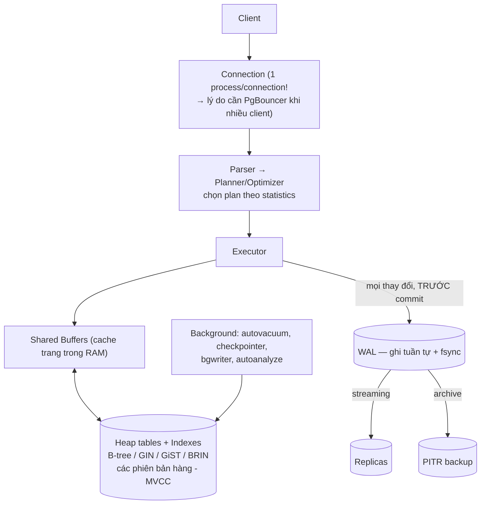

+++
title = "5.1. PostgreSQL — mặc định đúng cho dữ liệu nghiệp vụ"
date = "2026-07-13T08:20:00+07:00"
draft = false
tags = ["backend", "system-design"]
series = ["System Design — Tư Duy Thiết Kế Hệ Thống"]
+++

## 1. Problem Statement

Mọi hệ thống cần một nơi lưu **sự thật nghiệp vụ**: đơn hàng, tài khoản, số dư — dữ liệu mà nếu sai hoặc mất thì không xin lỗi được. Nơi đó phải: không mất dữ liệu đã xác nhận (durability), không cho hai thao tác giẫm nhau tạo trạng thái vô lý (isolation), giữ ràng buộc nghiệp vụ (constraint), và trả lời được các câu hỏi *chưa biết trước* (query linh hoạt). PostgreSQL là câu trả lời mặc định của ngành cho bài toán này — chương này giải thích vì sao, và quan trọng hơn: giới hạn của nó nằm ở đâu.

## 2. Tại sao giải pháp này tồn tại

- **Business problem:** dữ liệu giao dịch cần đúng tuyệt đối và truy vấn đa chiều — báo cáo hôm nay hỏi câu mà lúc thiết kế schema không ai nghĩ tới.
- **Technical problem:** tự đảm bảo atomicity/durability trong code ứng dụng là bất khả thi thực tế (crash giữa hai câu ghi thì sao?). ACID phải nằm ở tầng storage.
- **Reliability problem:** disk hỏng, process chết giữa chừng ghi — cần cơ chế phục hồi về trạng thái nhất quán *bằng chứng minh được*, không phải bằng may mắn.

## 3. First Principles

**Vì sao RDBMS làm được lời hứa ACID? Toàn bộ đứng trên một ý tưởng: Write-Ahead Log (WAL).** Mọi thay đổi được ghi *tuần tự* vào log và fsync **trước khi** được coi là commit; dữ liệu trong bảng cập nhật sau, thong thả. Crash lúc nào cũng được: replay log từ checkpoint là dựng lại đúng trạng thái. Ghi tuần tự là thao tác nhanh nhất của disk — đó là lý do transaction bền mà vẫn nhanh. (WAL cũng chính là thứ được truyền cho replica — replication ([4.2](/series/system-design/04-distributed-systems/02-replication-consistency/)) và PITR ([12.10](/series/system-design/12-evolution/10-disaster-recovery/)) đều là "tái sử dụng" WAL.)

**Vì sao đọc và ghi không chặn nhau? MVCC.** PostgreSQL không sửa hàng tại chỗ — mỗi UPDATE tạo **phiên bản hàng mới**; mỗi transaction nhìn snapshot phiên bản phù hợp với thời điểm của nó. Reader không chờ writer, writer không chờ reader. Cái giá: các phiên bản chết tích tụ, phải có người dọn — **VACUUM**. Hiểu câu này là hiểu 50% các sự cố vận hành PostgreSQL: bloat, vacuum tụt hậu, transaction ID wraparound đều là hệ quả của quyết định thiết kế "không sửa tại chỗ".

**Nếu bỏ RDBMS đi thì sao?** Ứng dụng phải tự làm: ordering các ghi, khôi phục sau crash, kiểm tra ràng buộc dưới concurrency, và mọi query mới là một lần viết code mới. Đó chính xác là những gì các hệ NoSQL đời đầu bắt ứng dụng gánh — và là lý do "quay về Postgres" là xu hướng bền vững hơn mọi trào lưu.

**Giả định của PostgreSQL cần biết:** working set (dữ liệu + index nóng) vừa hoặc gần vừa RAM; một node ghi duy nhất (single-writer); schema tồn tại và đáng đầu tư. Phá giả định nào thì đau ở đó.

## 4. Internal Architecture

- **Data flow ghi:** thay đổi vào shared buffers + WAL record; commit = WAL đã fsync (điểm không quay đầu); trang bẩn xuống disk sau, theo checkpoint.
- **Data flow đọc:** planner chọn giữa index scan / seq scan dựa trên **statistics** — thống kê sai (sau import lớn, chưa ANALYZE) là nguồn kinh điển của "query đột nhiên chậm 100 lần vì đổi plan".
- **Failure flow:** crash → recovery replay WAL từ checkpoint → về đúng trạng thái commit cuối. Replica lag, failover, split brain: đã phân tích tại [4.2–4.4](/series/system-design/04-distributed-systems/02-replication-consistency/) và [13.4](/series/system-design/13-production-failure-cases/04-distributed-failures/).
- Điểm mạnh riêng đáng biết: **kho index đa dạng** — GIN cho JSONB/full-text (một cột JSONB + GIN index thay được MongoDB trong rất nhiều case), GiST cho geo, BRIN cho bảng time-series khổng lồ (index vài MB cho bảng trăm GB); **partial index** và **transactional DDL** (migration nằm trong transaction — MySQL không có).

### Con số định hướng (single node tốt, NVMe, tuning hợp lý)

| Thao tác | Bậc độ lớn |
|---|---|
| Đọc điểm theo index, cache nóng | hàng chục nghìn–100K+ QPS |
| Ghi transactional (fsync mỗi commit) | hàng nghìn–vài chục nghìn TPS |
| Kích thước thoải mái | hàng trăm GB–vài TB (vượt xa RAM thì mọi thứ xấu dần) |
| Connection | vài trăm là nhiều (process-per-connection) — hơn nữa cần PgBouncer |

## 5. Trade-off

| Quyết định thiết kế của PG | Được | Giá |
|---|---|---|
| MVCC không sửa tại chỗ | Đọc/ghi không chặn nhau | VACUUM + bloat + write amplification khi UPDATE nhiều |
| WAL + fsync mỗi commit | Durability chứng minh được | Trần ghi = trần fsync; `synchronous_commit=off` đổi durability vài trăm ms lấy throughput — quyết định có ý thức |
| Single-writer | Không xung đột ghi, ACID trọn vẹn | Trần ghi = 1 máy; vượt trần → sharding (Citus) với toàn bộ chi phí [Phần 8](/series/system-design/08-data-partitioning/00-tong-quan/) |
| Planner thông minh + statistics | Query linh hoạt, tự tối ưu | Plan có thể "lật" bất ngờ khi statistics/data đổi — cần theo dõi |
| Process per connection | Cô lập tốt | Connection đắt → bài toán pool ([13.2](/series/system-design/13-production-failure-cases/02-database-failures/)) |

## 6. Production Considerations

- **Metric hạng nhất:** replication lag (giây *và* byte), autovacuum tụt hậu (`n_dead_tup` tăng không hồi), transaction ID age (wraparound là sự cố dừng-cả-DB hiếm nhưng chết người), cache hit ratio (`pg_stat_database`), lock wait, connection count vs max, WAL generation rate, longest running transaction (transaction già chặn vacuum toàn cụm — một `idle in transaction` treo 6 giờ làm bloat cả DB).
- **Backup:** pg_basebackup/pgBackRest + WAL archiving cho PITR; **test restore định kỳ** ([12.10](/series/system-design/12-evolution/10-disaster-recovery/)).
- **HA:** Patroni (lease trên etcd + fencing — [4.3](/series/system-design/04-distributed-systems/03-consensus-quorum-leader-election/)); đừng tự viết failover script.
- **Tuning tối thiểu đáng làm:** `shared_buffers` ~25% RAM, `work_mem` theo workload, autovacuum **mạnh tay hơn mặc định** cho bảng ghi nhiều (mặc định quá rụt rè là nguồn bloat số một), `pg_stat_statements` bật từ ngày 1.
- **Nâng cấp major version:** cần kế hoạch (logical replication/pg_upgrade) — không phải apt upgrade.

## 7. Best Practices

- Schema có kỷ luật: khóa ngoại, NOT NULL, CHECK — constraint là hàng phòng thủ rẻ nhất chống dữ liệu rác; nới lỏng khi có bằng chứng hiệu năng, không nới trước.
- Index theo query thật (từ `pg_stat_statements`), xóa index không dùng (mỗi index là thuế lên mọi INSERT/UPDATE); nhớ partial index và covering index (`INCLUDE`).
- JSONB cho phần dữ liệu *thật sự* phi cấu trúc — cột quan hệ cho phần còn lại; "JSONB hóa mọi thứ" là ném đi 80% sức mạnh của PG.
- Migration an toàn: `CREATE INDEX CONCURRENTLY`, thêm cột NOT NULL theo hai bước, timeout cho DDL — bảng lớn + lock = downtime tự gây.
- Transaction ngắn; không gọi API ngoài trong transaction ([13.2 — pool exhaustion, deadlock](/series/system-design/13-production-failure-cases/02-database-failures/)).
- Partition (declarative) cho bảng time-series/log từ sớm — xóa dữ liệu cũ bằng DROP PARTITION (tức thời) thay vì DELETE (bloat khổng lồ).

## 8. Anti-patterns

- **Dùng PG làm queue bằng polling thô** — `SELECT ... FOR UPDATE SKIP LOCKED` làm queue *tử tế* được ở tải vừa, nhưng polling dày + xóa liên tục = bloat máy; tải lớn → dùng queue thật ([12.4](/series/system-design/12-evolution/04-message-queue/)).
- **UPDATE hàng đếm nóng nghìn lần/giây** — hotspot + bloat kép ([13.2](/series/system-design/13-production-failure-cases/02-database-failures/)).
- **Connection pool mỗi instance 100 × 50 instance** — 5000 connection đè chết DB trong khi mỗi connection làm việc 2% thời gian; PgBouncer transaction-mode là câu trả lời.
- **Tin ORM tuyệt đối:** N+1 ([13.2](/series/system-design/13-production-failure-cases/02-database-failures/)), query sinh tự động không ai đọc plan.
- **`SELECT *` trên bảng có cột TOAST lớn** — kéo MB dữ liệu cho mỗi hàng khi chỉ cần 3 cột.

## 9. Khi nào KHÔNG nên dùng

- **Ghi append tốc độ rất cao, đọc chủ yếu tổng hợp** (log, event, metrics, clickstream): WAL + MVCC + B-tree đều trả giá vô ích ở đây → [ClickHouse](/series/system-design/05-data-layer/05-clickhouse/) hoặc pipeline Kafka → columnar.
- **Working set vượt RAM nhiều lần và access ngẫu nhiên toàn bộ:** mọi DB đều khổ, nhưng PG khổ rõ; cân nhắc partition/tiering/kiến trúc lại dữ liệu trước.
- **Cần multi-region ghi nhiều nơi:** single-writer là trần cứng → thiết kế home-region ([12.9](/series/system-design/12-evolution/09-multi-region/)) hoặc lớp NewSQL (CockroachDB/Spanner-class — mua consistency toàn cầu bằng latency).
- **Cache, session, counter phù du:** đó là việc của [Redis](/series/system-design/05-data-layer/04-redis/) — rẻ hơn 10 lần cho đúng việc đó.

---

*Tiếp theo: [5.2. MySQL](/series/system-design/05-data-layer/02-mysql/)*
