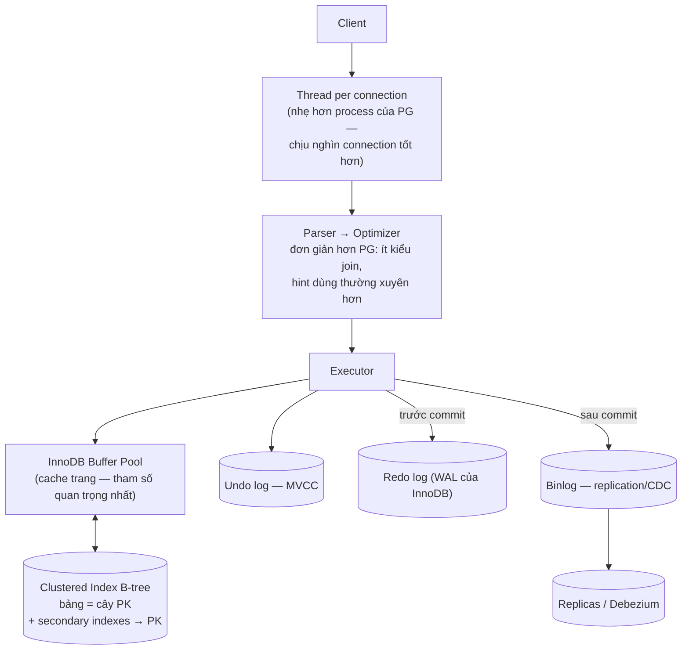

+++
title = "5.2. MySQL — người anh em song sinh khác tính cách"
date = "2026-07-13T08:30:00+07:00"
draft = false
tags = ["backend", "system-design"]
series = ["System Design — Tư Duy Thiết Kế Hệ Thống"]
+++

## 1. Problem Statement

Cùng bài toán với PostgreSQL: nguồn sự thật ACID cho dữ liệu nghiệp vụ. Câu hỏi thực tế của chương này không phải "MySQL là gì" mà là: **hai RDBMS hàng đầu khác nhau ở đâu về bản chất, và khi nào sự khác biệt đó nghiêng cán cân?** Đa số bài so sánh trên mạng liệt kê tính năng; chương này so sánh **quyết định thiết kế gốc** — vì tính năng đổi theo phiên bản, quyết định gốc thì không.

## 2. Tại sao giải pháp này tồn tại

Như PostgreSQL (xem [5.1](/series/system-design/05-data-layer/01-postgresql/)) — cộng một lý do lịch sử có hệ quả kỹ thuật thật: MySQL lớn lên cùng web scale-out thời kỳ đầu (Facebook, YouTube, Booking đều xây trên MySQL), nên **hệ sinh thái replication, failover, sharding middleware của nó trưởng thành sớm và dày dạn trận mạc** — orchestrator, ProxySQL, Vitess (tầng sharding sinh ra ở YouTube, nay chạy dưới PlanetScale) đều là đồ MySQL trước tiên.

## 3. First Principles — ba khác biệt gốc so với PostgreSQL

**Một — Clustered index (InnoDB) vs Heap (PG).** InnoDB lưu *toàn bộ hàng* trong B-tree của primary key — bảng *chính là* index. PG lưu hàng trong heap, index trỏ vào heap.

- Hệ quả InnoDB: đọc theo PK cực nhanh (một lần dò B-tree là có cả hàng); **range scan theo PK** nhanh (hàng vật lý liền kề); nhưng secondary index phải đi hai bước (index → PK → hàng), và **PK to/ngẫu nhiên (UUID v4) làm phình mọi secondary index + phá locality** — chọn PK ở MySQL là quyết định hiệu năng lớn hơn nhiều so với ở PG.
- Hệ quả PG: mọi index bình đẳng trỏ heap; UPDATE tạo phiên bản mới ở heap làm *mọi* index phải cập nhật (trừ khi HOT update) — nguồn write amplification riêng của PG.

**Hai — UPDATE tại chỗ + undo log (InnoDB) vs phiên bản mới + VACUUM (PG).** InnoDB sửa hàng tại chỗ, giữ bản cũ trong undo log để MVCC; dọn dẹp (purge) nhẹ nhàng hơn VACUUM. Hệ quả thực chiến: **workload UPDATE-rất-nhiều trên hàng nóng, InnoDB thường chịu trận tốt hơn** (không bloat kiểu PG); đổi lại, transaction đọc rất dài trên MySQL làm undo log phình và mọi thứ chậm theo kiểu riêng của nó.

**Ba — Replication logic (binlog) là công dân hạng nhất.** MySQL replicate bằng binlog (logical, theo sự kiện hàng) từ thời cổ đại; PG dùng WAL vật lý là chính (logical replication đến sau). Hệ quả: hệ sinh thái MySQL quen làm những trò mà PG làm vất vả hơn: replicate giữa version khác nhau, topology phức tạp (chain, multi-source), CDC (Debezium đọc binlog) cực kỳ chín, failover tooling lâu đời. Đổi lại: binlog + statement lỗi thời từng là nguồn drift replica kinh điển (row-based đã giải quyết phần lớn).

**Điều KHÔNG khác biệt đáng kể ở 2025:** ACID, độ tin cậy, hiệu năng OLTP thuần cho app web điển hình — hai engine ngang tài; chọn theo ba khác biệt trên + hệ sinh thái + kỹ năng team, không chọn theo tín ngưỡng.

## 4. Internal Architecture

- **Failure flow:** crash recovery bằng redo log (như PG với WAL). Chú ý vận hành: hai log (redo + binlog) phải nhất quán — two-phase commit nội bộ, các tham số `innodb_flush_log_at_trx_commit` và `sync_binlog` là núm vặn durability-vs-throughput **phải hiểu trước khi chỉnh** (1/1 = an toàn đầy đủ; nhiều "MySQL nhanh hơn X lần" trên blog là do vặn hai núm này về chế độ mất-dữ-liệu-được).
- **Con số định hướng:** cùng bậc với PostgreSQL cho OLTP (hàng chục nghìn QPS đọc điểm, nghìn–chục nghìn TPS ghi trên NVMe). Khác biệt hiệu năng thực tế nằm ở *hình dạng workload* (ba khác biệt gốc ở trên) nhiều hơn ở "engine nào nhanh hơn".

## 5. Trade-off — MySQL vs PostgreSQL, bảng quyết định

| Nghiêng về MySQL khi | Nghiêng về PostgreSQL khi |
|---|---|
| Đọc/ghi theo PK và range-PK là chủ đạo (clustered index tỏa sáng) | Query phân tích phức tạp, CTE, window function nặng — optimizer PG giỏi hơn rõ |
| UPDATE dày đặc trên working set nóng (undo log vs bloat) | Kiểu dữ liệu phong phú: JSONB+GIN, array, PostGIS (không có đối thủ), full-text tử tế |
| Cần topology replication phức tạp / CDC / failover tooling đã chín từ lâu | Cần transactional DDL (migration an toàn hơn hẳn), extension (TimescaleDB, pgvector, Citus) |
| Team/tổ chức đã vận hành MySQL nhiều năm | Team bắt đầu mới, không di sản — mặc định ngành hiện nay |
| Đường sharding đến Vitess/PlanetScale là kế hoạch thật | Muốn một engine ôm nhiều vai (OLTP + chút search + chút geo + chút time-series) trước khi tách hệ chuyên |
| Nghìn connection trực tiếp không muốn đặt proxy | — |

Chi phí chuyển đổi giữa hai bên (migration, viết lại query, học lại vận hành) **gần như luôn lớn hơn lợi ích** nếu hệ đang chạy ổn — lời khuyên thực dụng: *hệ đang chạy MySQL ổn thì ở lại MySQL; dự án mới không di sản thì PostgreSQL.*

## 6. Production Considerations

- **Metric hạng nhất:** replica lag (`Seconds_Behind_Source` — và hiểu nó nói dối thế nào với transaction lớn), buffer pool hit rate, history list length (undo log phình = có transaction già), `Threads_running` (>> số core là báo động), lock wait + deadlock rate, binlog disk.
- **HA:** orchestrator/MHA + ProxySQL, hoặc InnoDB Cluster (group replication — quorum tích hợp); nguyên tắc quorum + fencing của [4.3–4.4](/series/system-design/04-distributed-systems/03-consensus-quorum-leader-election/) áp dụng nguyên vẹn.
- **Backup:** XtraBackup (physical, không khóa) + binlog cho PITR; test restore như mọi khi.
- **Migration schema trên bảng lớn:** DDL không transactional + khóa bảng → dùng gh-ost / pt-online-schema-change (tạo bảng bóng, sao chép dần) — quy trình chuẩn ngành, phải nằm trong tooling của team từ sớm.
- Tham số đáng biết tên: `innodb_buffer_pool_size` (~70% RAM máy thuần DB), hai núm durability nói trên, `long_query_time` + slow log bật từ ngày 1.

## 7. Best Practices

- **PK nhỏ, đơn điệu tăng** (BIGINT auto-increment hoặc UUIDv7) — vì clustered index; UUID v4 làm PK là lỗi đắt nhất riêng-của-MySQL.
- Secondary index tinh gọn (mỗi cái mang theo PK — PK to thì mọi index to theo).
- Row-based binlog (mặc định hiện đại) + GTID — bỏ hẳn thời statement-based.
- Transaction đọc dài (báo cáo) đẩy sang replica — giữ history list ngắn.
- Các practice chung với PG áp dụng nguyên: constraint, index theo query thật, transaction ngắn, không API ngoài trong transaction.

## 8. Anti-patterns

- Chạy `innodb_flush_log_at_trx_commit=0` / `sync_binlog=0` trên dữ liệu tiền bạc "vì nhanh hơn" — đang chạy chế độ mất-giao-dịch-khi-crash mà không khai với business.
- Đọc replica ngay sau ghi không có cơ chế session consistency ([13.2 — replica lag](/series/system-design/13-production-failure-cases/02-database-failures/)).
- `ALTER TABLE` thẳng trên bảng trăm GB giờ cao điểm.
- Tin `Seconds_Behind_Source = 0` tuyệt đối — đo lag bằng heartbeat table cho chắc.
- Mọi anti-pattern của [5.1](/series/system-design/05-data-layer/01-postgresql/): queue polling thô, hotspot counter, ORM không kiểm soát.

## 9. Khi nào KHÔNG nên dùng

Trùng với PostgreSQL ([5.1 §9](/series/system-design/05-data-layer/01-postgresql/)): analytics quét lớn → [ClickHouse](/series/system-design/05-data-layer/05-clickhouse/); cache/counter → [Redis](/series/system-design/05-data-layer/04-redis/); search → [Elasticsearch](/series/system-design/05-data-layer/06-elasticsearch/). Riêng thêm: nếu dự án cần *ngay* các sở trường PG (PostGIS, JSONB nặng, extension) — đừng chọn MySQL rồi vá bằng service phụ; và ngược lại, đừng chọn PG cho tổ chức 50 DBA MySQL chỉ vì "Postgres đang mốt".

---

*Tiếp theo: [5.3. MongoDB](/series/system-design/05-data-layer/03-mongodb/)*
