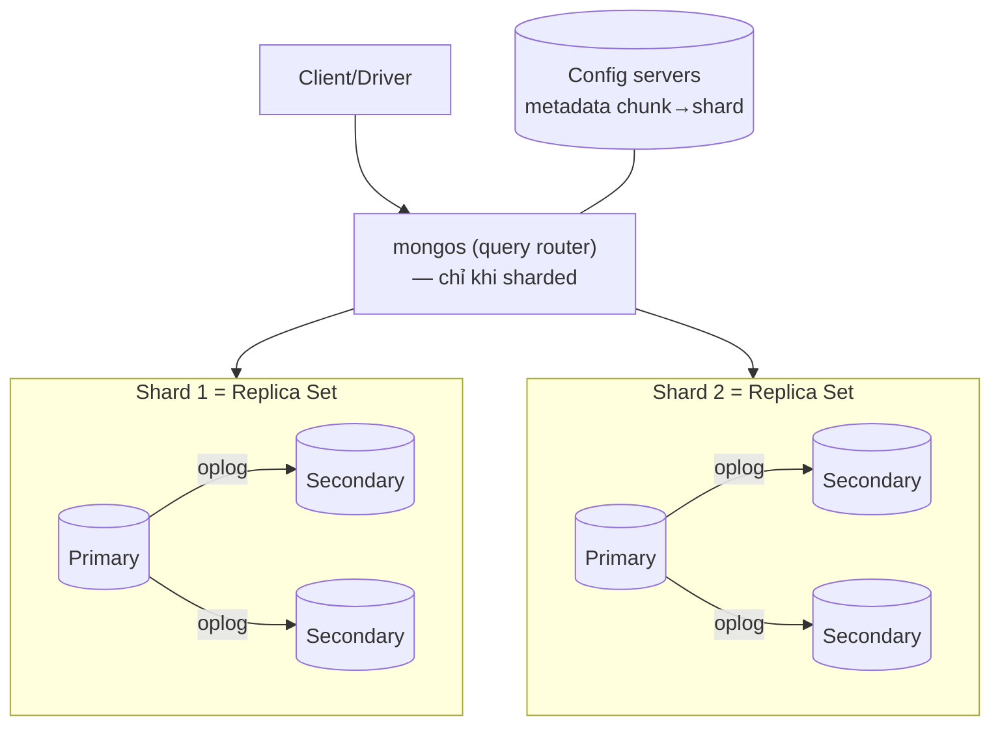

+++
title = "5.3. MongoDB — khi dữ liệu thật sự là document"
date = "2026-07-13T08:40:00+07:00"
draft = false
tags = ["backend", "system-design"]
series = ["System Design — Tư Duy Thiết Kế Hệ Thống"]
+++

## 1. Problem Statement

Một số dữ liệu chống lại việc trải phẳng thành bảng: catalog sản phẩm nơi mỗi ngành hàng một bộ thuộc tính (điện thoại có RAM/chip, áo có size/màu, sách có ISBN/tác giả), hồ sơ người dùng với cấu trúc lồng nhau nhiều tầng, payload sự kiện từ trăm nguồn khác nhau. Ép chúng vào quan hệ cho ra một trong hai thứ xấu: bảng 300 cột toàn NULL, hoặc EAV (entity-attribute-value — query 5 tầng join để dựng lại một object). MongoDB đặt cược vào mô hình khác: **đơn vị lưu trữ = document (BSON) — object lồng nhau được lưu, đọc, ghi như một khối.**

## 2. Tại sao giải pháp này tồn tại

- **Business problem:** schema thay đổi theo tốc độ sản phẩm (thêm ngành hàng mới = thêm bộ thuộc tính mới) — không thể mỗi lần là một migration toàn bảng.
- **Technical problem:** impedance mismatch — ứng dụng nghĩ bằng object, RDBMS lưu bằng bảng; ORM là lớp keo đắt đỏ ở giữa.
- **Scale problem:** MongoDB thiết kế sharding vào lõi từ đầu (mongos + config server + chunk migration) — scale ngang là đường có sẵn, không phải công trình gắn thêm như với RDBMS.

## 3. First Principles

**Đơn vị nhất quán = document.** Mọi thao tác trên *một* document là atomic — kể cả update sâu nhiều field lồng nhau. Đây là điểm mấu chốt của thiết kế schema Mongo: **cái gì phải nhất quán cùng nhau thì nhét vào cùng document** (embed); cái gì sống đời riêng thì tách (reference). Làm đúng câu này thì hầu như không cần multi-document transaction (có từ 4.0 nhưng đắt và là dấu hiệu schema đang chống lại engine).

**Nếu access pattern là "lấy cả object theo id" — Mongo cho đúng thứ đó bằng một lần đọc.** Không join, không N+1, không ORM dựng object từ 6 bảng. Nhưng đảo lại: **query cắt ngang document (hỏi theo chiều khác) là điểm yếu cấu trúc** — "các đơn hàng chứa sản phẩm X của mọi user" trên schema embed đơn-trong-user là quét toàn collection.

**Giả định cốt tử: biết access pattern trước khi thiết kế schema.** RDBMS chuẩn hóa để *mọi* câu hỏi đều trả lời được tàm tạm; Mongo denormalize để *các câu hỏi đã biết* trả lời cực nhanh — và câu hỏi chưa biết trả giá đắt. Đây là lý do [12.1](/series/system-design/12-evolution/01-monolith-postgresql/) khuyên startup chưa rõ access pattern bắt đầu bằng RDBMS: giữ mọi cánh cửa mở.

**Nếu bỏ đi thì sao?** PostgreSQL JSONB + GIN index phủ được phần lớn use case "cần document trong app quan hệ" ([5.1](/series/system-design/05-data-layer/01-postgresql/)) — một cột JSONB cho thuộc tính động, cột quan hệ cho phần cốt lõi. MongoDB thắng khi document là *trung tâm* chứ không phải *phụ kiện*: toàn bộ workload xoay quanh document + cần sharding tích hợp + cần schema tiến hóa tự do.

## 4. Internal Architecture

- **Storage:** WiredTiger — B-tree, document-level locking, nén mặc định, journal (WAL) cho durability.
- **Replica set = đơn vị HA:** 3 node, bầu primary bằng giao thức họ Raft ([4.3](/series/system-design/04-distributed-systems/03-consensus-quorum-leader-election/)) — failover tự động tích hợp, điểm cộng vận hành lớn so với tự lắp Patroni/orchestrator.
- **Tunable consistency per-operation** — hiện thân đẹp của [PACELC](/series/system-design/04-distributed-systems/01-cap-pacelc/): `writeConcern` (w:1 nhanh-rủi ro; w:majority bền-chậm hơn) × `readConcern`/`readPreference` (đọc primary nhất quán vs đọc secondary nhanh-stale). Bài học đắt: **mặc định lịch sử w:1 từng gây tiếng xấu "Mongo mất dữ liệu"** — ghi nhận ở primary chưa kịp replicate, primary chết, rollback. Từ 5.0 mặc định là majority; hệ cũ phải kiểm tra.
- **Sharding:** chọn shard key là quyết định một-lần-đau-mãi (đổi rất khó) — toàn bộ lý thuyết [Phần 8](/series/system-design/08-data-partitioning/00-tong-quan/) và [13.2 — hot partition](/series/system-design/13-production-failure-cases/02-database-failures/) áp vào đây: cardinality cao, phân bố đều, khớp query (không thì scatter-gather).
- **Con số định hướng:** đọc/ghi theo `_id` trên replica set tốt: hàng chục nghìn–trăm nghìn ops/s; document tối đa 16MB (chạm trần này = schema sai, thường do mảng lồng phình vô hạn).

## 5. Trade-off

| Được | Giá |
|---|---|
| Object nguyên khối: một lần đọc, không join, không ORM mismatch | Câu hỏi cắt ngang document đắt; aggregation pipeline mạnh nhưng không thay được SQL analytics |
| Schema tiến hóa tự do — thêm field không migration | "Schema tồn tại trong code chứ không trong DB": mọi version document từng ghi vẫn sống trong collection — code phải đọc được tất cả, hoặc phải backfill (chính là migration quay lại, dưới dạng đau hơn) |
| Sharding + failover tích hợp, ít phải lắp ráp | Shard key sai = án chung thân; rebalancing (chunk migration) ăn I/O lúc chạy |
| Atomic per-document đủ cho schema thiết kế đúng | Multi-document transaction có nhưng đắt — nghiệp vụ đa-thực-thể kiểu tiền bạc vẫn thuộc về RDBMS |
| Embed = denormalize sẵn = đọc nhanh | Dữ liệu lặp (tên sản phẩm trong 1 triệu đơn) — update lan tỏa hoặc chấp nhận stale |

## 6. Production Considerations

- **Metric hạng nhất:** replication lag (oplog window — secondary tụt quá window là phải resync toàn bộ!), cache dirty/used của WiredTiger, ticket available (concurrency), connection count, chunk balancer hoạt động, queue đọc/ghi.
- **Đặt writeConcern/readConcern có ý thức theo từng luồng nghiệp vụ** — đây là "CAP theo từng thao tác" ([4.1 §5](/series/system-design/04-distributed-systems/01-cap-pacelc/)); viết vào ADR.
- Backup: mongodump (nhỏ), snapshot/Ops Manager + oplog cho PITR (lớn); test restore.
- Index: vẫn là B-tree, vẫn cần theo query thật; `explain()` là bạn; index trên field mảng nở theo số phần tử.
- Sharded cluster là nhiều bộ phận chuyển động (mongos, config, balancer) — chỉ shard khi replica set đơn thật sự hết cỡ (scale-up + tối ưu trước, [1.5](/series/system-design/01-foundations/05-bottleneck-analysis/)).

## 7. Best Practices

- Thiết kế schema từ access pattern, không từ mô hình E-R: liệt kê query trước, vẽ document sau.
- Quy tắc embed vs reference: embed khi quan hệ là "chứa trong" + đọc cùng nhau + bên trong có giới hạn kích thước; reference khi thực thể sống độc lập hoặc mảng lớn không giới hạn (đơn hàng reference user, không embed vào user).
- Giữ "schema version" field trong document + chiến lược đọc đa version — kỷ luật thay cho schema enforcement của RDBMS (hoặc dùng JSON Schema validation của Mongo — có, và nên bật).
- Shard key: hash trên field cardinality cao cho phân bố, hoặc compound key khớp query chính; **mô phỏng với dữ liệu thật trước khi chốt**.

## 8. Anti-patterns

- **Dùng Mongo như RDBMS không constraint:** collection chuẩn hóa kiểu bảng + "join" bằng `$lookup` khắp nơi — trả chi phí của cả hai mô hình, hưởng lợi ích của không mô hình nào.
- **Mảng lồng phình vô hạn** (comments embed trong post viral) — document 16MB, update ngày càng chậm, working set nổ.
- **w:1 cho dữ liệu không được mất** — ghi vào RAM của một máy và gọi đó là "đã lưu".
- **Đọc secondary rồi quyết định ghi** — stale read đưa vào transaction nghiệp vụ ([4.2](/series/system-design/04-distributed-systems/02-replication-consistency/)).
- **Shard key = timestamp/đơn điệu** — mọi ghi dồn một chunk cuối: hot partition có lịch hẹn ([13.2](/series/system-design/13-production-failure-cases/02-database-failures/)).

## 9. Khi nào KHÔNG nên dùng

- **Dữ liệu quan hệ đậm, nghiệp vụ đa-thực-thể transactional** (đơn hàng + kho + ví): RDBMS cho ACID đa hàng miễn phí — [5.1](/series/system-design/05-data-layer/01-postgresql/).
- **Chưa biết access pattern** (startup giai đoạn dò tìm): chuẩn hóa của RDBMS là bảo hiểm cho sự chưa biết.
- **Chỉ cần "một chút document" trong app quan hệ:** PostgreSQL JSONB rẻ hơn cả một hệ thống mới.
- **Analytics quét lớn:** [ClickHouse](/series/system-design/05-data-layer/05-clickhouse/); **search:** [Elasticsearch](/series/system-design/05-data-layer/06-elasticsearch/) — aggregation pipeline không phải câu trả lời cho hai việc này ở scale.

---

*Tiếp theo: [5.4. Redis](/series/system-design/05-data-layer/04-redis/)*
