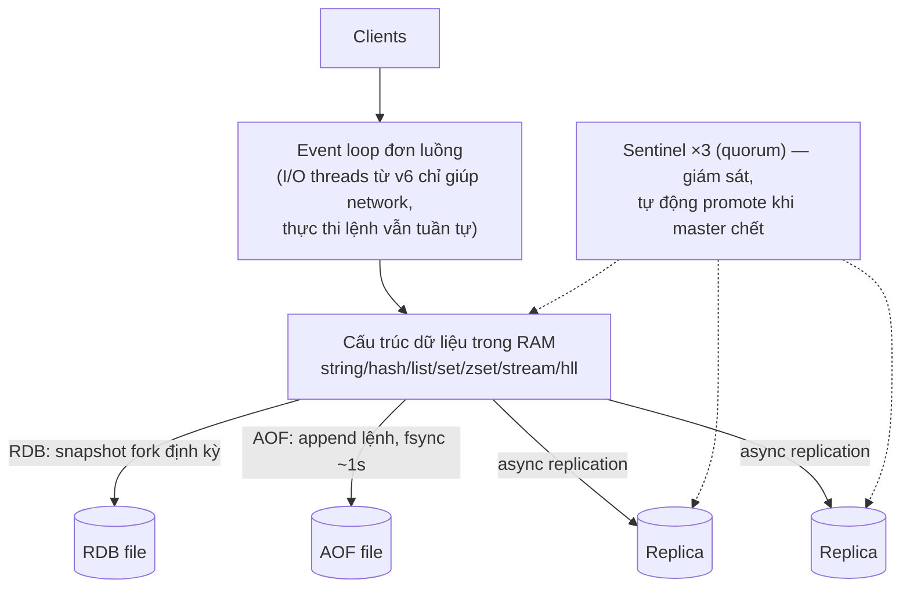

+++
title = "5.4. Redis — cấu trúc dữ liệu trong RAM"
date = "2026-07-13T08:50:00+07:00"
draft = false
tags = ["backend", "system-design"]
series = ["System Design — Tư Duy Thiết Kế Hệ Thống"]
+++

## 1. Problem Statement

Có một lớp dữ liệu mà disk-based DB nào cũng phục vụ *được* nhưng đều phục vụ *đắt*: truy cập cực dày (chục nghìn–triệu ops/s), latency yêu cầu sub-ms, vòng đời ngắn hoặc dựng lại được — cache, session, counter, rate limit, bảng xếp hạng, khóa tạm, hàng đợi nhẹ. Dùng PostgreSQL cho việc này là thuê container chở thư tay. Redis tồn tại để phục vụ đúng lớp này: **cấu trúc dữ liệu quen thuộc (map, list, set, sorted set) sống trong RAM, thao tác atomic, latency ~0.1–1ms.**

## 2. Tại sao giải pháp này tồn tại

- **Technical problem:** RAM nhanh hơn disk 3 bậc độ lớn ([chương 00 §3](/series/system-design/00-tu-duy-thiet-ke/)) — nhưng RAM của *process ứng dụng* thì chết theo process và không chia sẻ được giữa N instance. Cần "RAM chung, sống lâu hơn app, có cấu trúc".
- **Scale problem:** tầng app stateless hóa để scale ngang ([12.2](/series/system-design/12-evolution/02-them-redis/)) thì state dọn đi đâu? Session, cache — về Redis.
- **Reliability problem của cách cũ:** memcached thuần key-value đã làm vai cache; Redis thắng thế nhờ *cấu trúc dữ liệu* + atomic ops + persistence tùy chọn + replication — một công cụ phủ chục use case.

## 3. First Principles

**Vì sao Redis nhanh? Ba lý do, không phải một.** (1) RAM. (2) **Single-threaded event loop** cho phần thực thi lệnh — không lock, không context switch, mỗi lệnh chạy trọn vẹn → mọi lệnh là atomic *miễn phí*. (3) Cấu trúc dữ liệu cài đặt sát kim loại (skiplist cho sorted set, các encoding nén cho tập nhỏ).

**Hệ quả nghịch của single-thread — điều quan trọng nhất phải hiểu:** Redis xử lý *một lệnh tại một thời điểm*. Một lệnh chậm (`KEYS *`, `SMEMBERS` trên set 10 triệu phần tử, Lua script dài) **chặn toàn bộ mọi client**. Quy tắc sắt: độ phức tạp mỗi lệnh phải O(1) hoặc O(log n); mọi lệnh O(n) trên n không chặn trên là bug đang ủ. Đây cũng là lý do một node Redis dùng đúng cách đạt ~100K ops/s dễ dàng — và một node dùng sai cách chết ở 1K.

**Atomic per-command + single-thread = công cụ concurrency rẻ nhất hệ thống.** `INCR` làm counter đúng dưới nghìn client song song; `SETNX` làm khóa tạm; sorted set làm leaderboard/rate-limiter — những bài mà làm trên RDBMS là lock contention ([13.2 — hotspot](/series/system-design/13-production-failure-cases/02-database-failures/)).

**Giả định phải khai báo thành văn: dữ liệu trong Redis mất được — hoặc dựng lại được.** Persistence của Redis (RDB snapshot định kỳ; AOF ghi lệnh, fsync thường là mỗi giây) là *giảm nhẹ*, không phải cam kết durability cấp RDBMS; failover async có thể mất ghi cuối ([4.1 §6](/series/system-design/04-distributed-systems/01-cap-pacelc/)). Thiết kế đúng: mọi thứ trong Redis thuộc một trong hai loại — (a) phù du chấp nhận mất (cache, session ngắn), (b) dựng lại được từ nguồn sự thật. Thứ không thuộc hai loại đó **không được ở trong Redis**.

## 4. Internal Architecture

- **HA hai con đường:** Sentinel (1 master + replicas + 3 sentinel bầu quorum — [4.3](/series/system-design/04-distributed-systems/03-consensus-quorum-leader-election/)) cho một node đủ chứa dữ liệu; **Redis Cluster** (16384 hash slot chia cho nhiều master — consistent-hashing-kiểu-slot, [Phần 8](/series/system-design/08-data-partitioning/00-tong-quan/)) khi dữ liệu/throughput vượt một node. Cluster đổi lấy: lệnh đa key phải cùng slot (hash tag `{user:1}`), client phải cluster-aware, vận hành nhiều bộ phận hơn.
- **Failure flow đáng nhớ:** master chết → Sentinel bầu + promote (mất vài giây, **các ghi async chưa kịp replicate mất vĩnh viễn**); RDB fork trên instance lớn gây spike memory (copy-on-write) — instance 50GB fork lúc ghi dày có thể cần thêm hàng chục GB tạm thời.
- **Eviction khi đầy RAM:** `maxmemory-policy` — `allkeys-lru` cho cache thuần; `noeviction` (mặc định!) làm ghi **lỗi** khi đầy — cache mà để mặc định là tự cài bom.
- **Con số định hướng:** ~100K+ ops/s một node cho lệnh O(1), pipeline đẩy lên hàng trăm nghìn; latency p99 dưới 1ms trong DC. Trần thực tế thường là **băng thông mạng** (value to × ops dày) trước khi là CPU.

## 5. Trade-off

| Được | Giá |
|---|---|
| Latency 0.1–1ms, trăm nghìn ops/s một node | RAM đắt gấp ~10–20 lần SSD mỗi GB — dataset phải chọn lọc |
| Atomic miễn phí, cấu trúc dữ liệu phong phú | Single-thread: một lệnh O(n) chặn tất cả |
| Đa vai: cache, session, lock, queue, pub/sub, stream | Đa vai = dễ thành bãi rác không ai quản; và các vai *nghiêm túc* đều có công cụ chuyên tốt hơn (queue → [12.4](/series/system-design/12-evolution/04-message-queue/), lock chặt → [4.3 §7](/series/system-design/04-distributed-systems/03-consensus-quorum-leader-election/)) |
| Persistence + replication tùy chọn | Không phải durability cấp RDBMS; failover có thể mất ghi cuối |
| Cluster scale ngang có sẵn | Multi-key bị ràng buộc slot; resharding là việc vận hành thật |

## 6. Production Considerations

- **Metric hạng nhất:** memory used vs maxmemory (+ fragmentation ratio), evicted keys/s, hit rate, **slowlog** (`SLOWLOG GET` — soi lệnh chặn loop), connected clients, replication lag/offset, latency p99 (redis tự đo: `LATENCY`), keyspace theo pattern (đo bằng `SCAN` sampling, không bao giờ `KEYS`).
- **Failover drill:** giết master ở staging, đo app phản ứng — client có reconnect đúng? Ghi trong cửa sổ failover đi đâu? ([12.2 §7](/series/system-design/12-evolution/02-them-redis/) — kịch bản cold start khi Redis chết là bài load test bắt buộc).
- Chạy managed (ElastiCache/MemoryDB/Upstash...) trừ khi có lý do mạnh — bài toán fork-memory, upgrade, failover đáng để trả tiền người khác lo.
- Bảo mật: Redis không được phơi ra internet (lịch sử đầy vụ Redis mở toang bị cài coin miner); AUTH + network isolation là tối thiểu.

## 7. Best Practices

- **TTL cho gần như mọi key + jitter** ([13.1](/series/system-design/13-production-failure-cases/01-caching-failures/)); key không TTL phải là quyết định có chủ đích, có chủ sở hữu.
- Key schema có version và namespace: `v2:sess:{user_id}` — đổi format không cần flush; đo được theo pattern.
- Value nhỏ (KB, không MB); nén phía app nếu cần; hash cho object nhiều field thay vì N key rời.
- Pipeline/batch cho chuỗi lệnh; Lua script cho atomic đa bước — nhưng script phải ngắn (nhớ: nó chặn loop).
- Rate limiter, dedupe, leaderboard: dùng đúng cấu trúc có sẵn (INCR+EXPIRE, set, zset) thay vì sáng chế trên string.
- Local cache (in-process, TTL vài giây) đứng trước Redis cho key cực nóng — chống cả hot key lẫn băng thông ([13.2 — hot partition](/series/system-design/13-production-failure-cases/02-database-failures/)).

## 8. Anti-patterns

- **`KEYS *` trên production** — O(n) toàn keyspace, chặn tất cả; dùng `SCAN`.
- **Redis làm nguồn sự thật duy nhất** cho dữ liệu không dựng lại được — sai hợp đồng durability.
- **Cache mà `maxmemory-policy=noeviction`** — đầy RAM là app nhận lỗi ghi giữa giờ cao điểm.
- **Distributed lock "nghiêm túc" bằng SETNX đơn** cho thao tác không được phép chạy đôi — GC pause + failover async = hai bên cùng cầm khóa; cần fencing ([4.3 §7](/series/system-design/04-distributed-systems/03-consensus-quorum-leader-election/)).
- **Hot key một node gánh cả hệ** (celebrity, config toàn cục đọc mỗi request) — local cache + nhân bản key ([13.2](/series/system-design/13-production-failure-cases/02-database-failures/)).
- **Nhét việc của queue thật vào Redis list** khi cần durability/ack/DLQ — [12.4](/series/system-design/12-evolution/04-message-queue/) đã trả lời vì sao và khi nào phải rời đi.

## 9. Khi nào KHÔNG nên dùng

- **Dữ liệu phải sống sót mọi kịch bản crash:** RDBMS/queue bền — Redis chỉ đứng trước chúng, không thay chúng.
- **Dataset lớn truy cập thưa** (100GB, phần lớn nguội): trả tiền RAM cho dữ liệu ngủ — để nó nằm DB + cache phần nóng; các bản Redis-trên-flash/disk (nay có cả tùy chọn mã nguồn mở lẫn managed) là thỏa hiệp đáng xem xét trước khi bê nguyên lên RAM.
- **Query đa chiều, filter, join:** không phải mô hình của nó — đừng dựng "index thủ công bằng 20 set" khi một cột index PostgreSQL làm xong việc.
- **Hệ quá nhỏ:** app một instance với 500 user — cache in-process (một `Map` có TTL) là đủ; Redis là thành phần vận hành thêm chưa cần thiết ([12.2 — tín hiệu chuyển](/series/system-design/12-evolution/02-them-redis/)).

---

*Tiếp theo: [5.5. ClickHouse](/series/system-design/05-data-layer/05-clickhouse/)*
