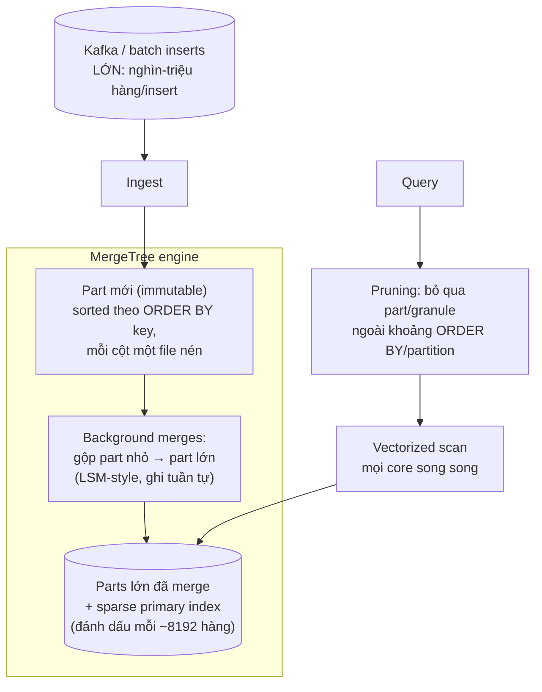

+++
title = "5.5. ClickHouse — cỗ máy quét tỷ hàng"
date = "2026-07-13T09:00:00+07:00"
draft = false
tags = ["backend", "system-design"]
series = ["System Design — Tư Duy Thiết Kế Hệ Thống"]
+++

## 1. Problem Statement

Nhớ lại bảng ước lượng của [chương 1.4](/series/system-design/01-foundations/04-scale-estimation-capacity-planning/): dữ liệu *nghiệp vụ* của VietShop là 4.4GB/năm — còn log/event là **11TB/năm**. Đây là quy luật chung: dữ liệu hành vi (event, click, log, metric, telemetry) lớn hơn dữ liệu nghiệp vụ 2–3 bậc độ lớn, và câu hỏi đặt lên nó luôn có dạng: *"tổng/đếm/trung bình của X, nhóm theo Y, trong khoảng thời gian Z"* — quét triệu tới tỷ hàng, trả về vài trăm hàng kết quả. Chạy loại query này trên PostgreSQL là xem nó bò hàng chục phút và giết luôn OLTP đang chạy cạnh ([12.8 — vấn đề mở màn của CQRS](/series/system-design/12-evolution/08-cqrs/)). ClickHouse được thiết kế cho đúng một việc này.

## 2. Tại sao giải pháp này tồn tại

- **Business problem:** dashboard/analytics cần tương tác (giây, không phải "chạy báo cáo rồi đi uống cà phê") trên dữ liệu khổng lồ; và chi phí lưu 11TB/năm phải chịu được.
- **Technical problem:** row-store đọc *cả hàng* dù query chỉ cần 3/50 cột; B-tree + MVCC + fsync mỗi commit — toàn bộ bộ máy OLTP là chi phí vô ích cho append + scan.
- **Scale problem:** ingest hàng trăm nghìn–triệu event/giây — trần ghi transactional của RDBMS thua 2 bậc.

## 3. First Principles

**Vì sao columnar nhanh 100–1000× cho analytics? Hai nhân với nhau:**

1. **Chỉ đọc cột cần.** Query đụng 3 cột trên bảng 50 cột → I/O giảm ~17 lần ngay lập tức.
2. **Nén cực mạnh vì dữ liệu cùng cột giống nhau.** Một cột `country` triệu hàng chỉ có 200 giá trị; cột timestamp tăng đều delta-encode còn vài bit/giá trị. Nén 10–30× là bình thường → 11TB/năm thành dưới 1TB thật trên disk → đọc từ disk ít hơn chừng đó lần nữa.

Cộng thêm: thực thi **vectorized** (xử lý theo khối cả nghìn giá trị bằng SIMD thay vì từng hàng) và song song hóa mọi core. Kết quả thực tế: quét *hàng trăm triệu tới hàng tỷ hàng/giây* cho aggregation đơn giản trên một máy tốt.

**Cái giá cấu trúc — mặt kia của cùng đồng xu:** dữ liệu xếp theo cột, nén theo khối, ghi theo part lớn ⇒ (a) **đọc một hàng theo key = việc dở nhất** (phải mở nhiều cột, giải nén nhiều khối); (b) **UPDATE/DELETE từng hàng gần như không có** (mutation là thao tác nền nặng nề, không phải lệnh OLTP); (c) **không transaction đa hàng**. ClickHouse không "thiếu" các thứ này — nó *đánh đổi* chúng lấy tốc độ quét. Muốn cả hai trong một engine là muốn hai cực của cùng trục vật lý.

**Giả định:** dữ liệu append-only (hoặc gần thế), query là aggregation/scan theo thời gian, chấp nhận eventual (ingest trễ giây), nguồn sự thật nằm nơi khác.

## 4. Internal Architecture

- **MergeTree = họ engine trung tâm:** insert tạo part bất biến đã sort; nền gộp dần — vì thế insert phải **to** (nghìn+ hàng); insert từng hàng lẻ tạo bão part nhỏ, merge không kịp, lỗi "too many parts" — sai lầm vận hành số 1 của người mới.
- **Sparse index ≠ B-tree:** không tìm hàng, chỉ *khoanh vùng* khối cần quét. Chọn `ORDER BY` (thường `(tenant_id, timestamp)` hoặc tương tự) là quyết định thiết kế quan trọng nhất — nó là "index" duy nhất thật sự.
- **Các engine chuyên trị việc "sửa dữ liệu" kiểu analytics:** ReplacingMergeTree (dedupe khi merge — [13.3 — duplication](/series/system-design/13-production-failure-cases/03-messaging-failures/): at-least-once từ Kafka được "tha thứ" tại đây), SummingMergeTree/AggregatingMergeTree (cộng dồn sẵn), TTL xóa dữ liệu già tự động.
- **Materialized View:** transform-on-insert — bảng thô + N view tổng hợp sẵn cập nhật lúc ghi; chính là mô hình projection của [CQRS 12.8](/series/system-design/12-evolution/08-cqrs/) thu nhỏ trong một engine.
- **Phân tán:** replication qua Keeper (Raft — [4.3](/series/system-design/04-distributed-systems/03-consensus-quorum-leader-election/)), sharding qua Distributed table — cụm nhiều node cho ingest/scan vượt một máy.
- **Con số định hướng:** ingest trăm nghìn–triệu hàng/giây/node (insert batch); scan tỷ hàng aggregation trong dưới giây–vài giây; nén 10–30×; point lookup: mili-giây tới chục ms — *chậm hơn PG cho việc đó*, đúng như thiết kế.

## 5. Trade-off

| Được | Giá |
|---|---|
| Analytics tương tác trên tỷ hàng; dashboard giây thay vì phút | Point read/update/delete dở tệ — không bao giờ làm OLTP store |
| Nén 10–30×: 11TB/năm thành chuyện nhỏ | Insert phải batch; streaming từng event cần buffer (Kafka + insert theo khối) |
| Ingest triệu hàng/giây | Không transaction; dedupe là eventual (ReplacingMergeTree gộp *lúc nào đó*) — đọc phải `FINAL` hoặc chấp nhận trùng tạm |
| SQL quen thuộc + Materialized View | JOIN lớn không phải sở trường (được, nhưng tư duy denormalize-trước vẫn thắng) |
| Một node đi rất xa (trước khi cần cụm) | Vận hành cụm (Keeper, replication, resharding) là nghề riêng khi vượt một node |

## 6. Production Considerations

- **Metric hạng nhất:** số part mỗi partition (bão part nhỏ = còi báo động sớm nhất), merge backlog, insert rate & kích thước batch, query memory (một query aggregation tham ăn có thể OOM — đặt `max_memory_usage`), replication queue, disk.
- **Ingest pipeline chuẩn:** Kafka → (Kafka engine table hoặc consumer tự viết) → insert batch 10K–500K hàng, mỗi giây một lần — giải quyết cùng lúc batch-size và backpressure ([12.7](/series/system-design/12-evolution/07-kafka-event-driven/)).
- **Schema quyết định 90% hiệu năng:** `ORDER BY` khớp filter chính; `PARTITION BY` theo tháng/ngày (để TTL/DROP rẻ — đừng partition quá mịn); LowCardinality cho cột chuỗi lặp; codec nén theo cột khi cần.
- Backup: dữ liệu dựng lại được từ Kafka/nguồn trong retention window là một chiến lược hợp lệ ([12.10 — RPO class thấp](/series/system-design/12-evolution/10-disaster-recovery/)); ngoài window thì backup part (công cụ có sẵn) — quyết định có ý thức, đừng mặc định "nó là derived nên khỏi backup" khi retention Kafka chỉ 7 ngày.
- Quota/limit theo user cho ad-hoc query — một câu `SELECT *` không WHERE của analyst là một cú DoS tự nhiên.

## 7. Best Practices

- Denormalize lúc ingest (event mang đủ ngữ cảnh — đúng tinh thần event-carried state của [12.7](/series/system-design/12-evolution/07-kafka-event-driven/)) thay vì JOIN lúc query.
- Bảng thô giữ nguyên (source of truth của analytics) + Materialized View cho từng dashboard — view sai thì dựng lại từ bảng thô, đúng triết lý rebuild của [12.8](/series/system-design/12-evolution/08-cqrs/).
- TTL phân tầng: thô 90 ngày, tổng hợp theo giờ 2 năm — chi phí giảm chục lần, câu hỏi kinh doanh vẫn trả lời được.
- Đặt câu hỏi "ai đọc bảng này bằng query hình gì?" trước khi tạo bảng — ORDER BY sinh ra từ câu trả lời, không phải từ thói quen PK.

## 8. Anti-patterns

- **Insert từng hàng / batch bé** — bão part; "too many parts" là lời nguyền nhập môn.
- **Dùng ClickHouse làm OLTP** vì "nó nhanh mà" — nhanh cho scan; ứng dụng CRUD trên nó là ngược thớ toàn diện.
- **UPDATE/DELETE thường xuyên như RDBMS** (mutation nặng nề, đồng bộ chậm) — thiết kế lại thành append + ReplacingMergeTree/TTL.
- **ORDER BY tùy tiện** (hoặc để trống) — mất pruning, mọi query thành full scan; sửa ORDER BY = tạo bảng mới + đổ lại dữ liệu.
- **Partition quá mịn** (theo giờ × tenant) — nổ số part, chết vì metadata.
- **Trộn ad-hoc analyst và dashboard production chung cụm không quota** — noisy neighbor tự mời vào nhà.

## 9. Khi nào KHÔNG nên dùng

- **Dữ liệu nghiệp vụ cần update/transaction:** RDBMS, chấm hết ([5.1](/series/system-design/05-data-layer/01-postgresql/)).
- **Volume bé:** vài chục GB, query phút một lần — PostgreSQL (+ index tốt, thậm chí + partition/BRIN) làm được và bạn khỏi nuôi hệ mới ([Phần 12 bài học 1](/series/system-design/12-evolution/00-tong-quan/)); TimescaleDB (extension PG) là bước trung gian đáng giá cho time-series vừa.
- **Search text/facet cho user cuối:** đó là [Elasticsearch](/series/system-design/05-data-layer/06-elasticsearch/) — inverted index, không phải columnar scan.
- **Team chưa có ai từng vận hành nó và nhu cầu chưa cháy:** managed ClickHouse (Cloud) hoặc ở lại PG thêm một quý — cột mốc chuyển đúng là khi dashboard PG bò sang phút và volume phi lên TB, như đúng vị trí của nó trong hành trình [12.8](/series/system-design/12-evolution/08-cqrs/).

---

*Tiếp theo: [5.6. Elasticsearch](/series/system-design/05-data-layer/06-elasticsearch/)*
