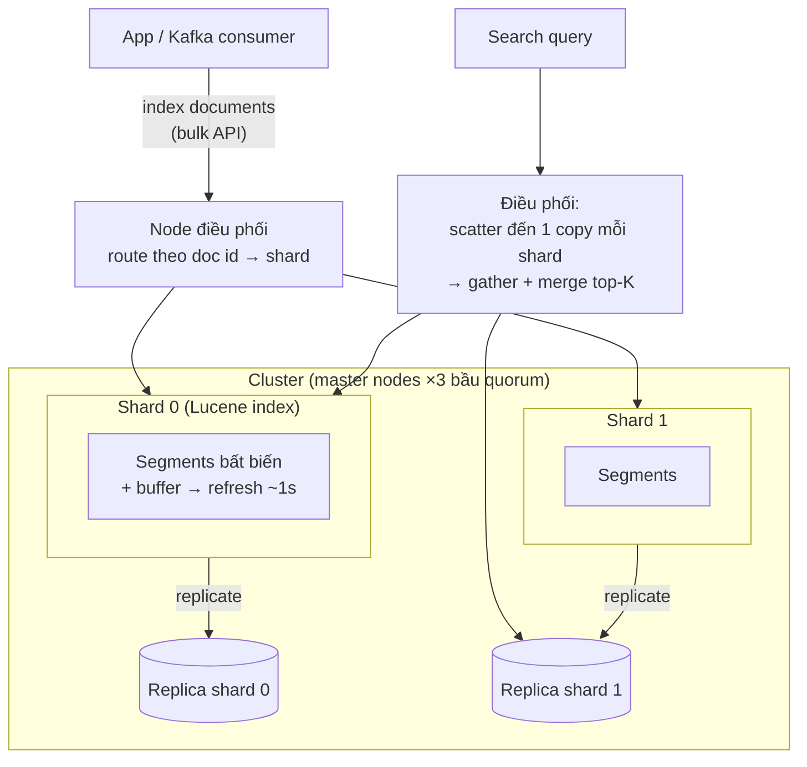

+++
title = "5.6. Elasticsearch — index, không phải database"
date = "2026-07-13T09:10:00+07:00"
draft = false
tags = ["backend", "system-design"]
series = ["System Design — Tư Duy Thiết Kế Hệ Thống"]
+++

## 1. Problem Statement

User gõ "ao khoac nam mua dong gia re" và mong đợi: kết quả *liên quan* (không phải khớp chuỗi), chịu được thiếu dấu/sai chính tả, filter theo giá/size/thương hiệu, facet đếm sẵn từng nhóm, autocomplete — tất cả dưới 100ms trên hàng triệu sản phẩm. Không cấu trúc nào ở các chương trước làm được việc này: B-tree trả lời "bằng/trong khoảng", columnar trả lời "tổng theo nhóm" — không cái nào trả lời **"chứa khái niệm X, xếp theo độ liên quan"**. `LIKE '%áo khoác%'` là quét toàn bảng *và* vẫn sai về nghiệp vụ (không xếp hạng, không xử lý dấu, không tách từ).

## 2. Tại sao giải pháp này tồn tại

- **Business problem:** search là cỗ máy doanh thu của e-commerce/marketplace/content — khác biệt giữa search tốt và tồi đo được bằng conversion.
- **Technical problem:** cần cấu trúc dữ liệu khác hẳn — inverted index — cộng cả một tầng xử lý ngôn ngữ (tokenize, chuẩn hóa) và xếp hạng (BM25).
- **Scale problem:** search + facet trên chục triệu document, nghìn QPS — cần scale ngang được (shard/replica tích hợp).
- Lý do thứ hai của sự phổ biến: **log analytics** (ELK) — "search trên log" là cùng bài toán inverted index, khác SLA.

## 3. First Principles

**Inverted index — đảo ngược quan hệ lưu trữ.** Thay vì `document → nội dung`, lưu `từ → danh sách document chứa nó` (posting list). Tìm "áo khoác nam" = lấy 2–3 posting list, giao chúng (thao tác trên danh sách đã sort — rất nhanh), chấm điểm BM25 (từ hiếm điểm cao, document ngắn chứa từ = liên quan hơn), trả top-K. Mọi phép màu của search nằm gọn trong cấu trúc này.

**Chất lượng search = chất lượng phân tích văn bản, không phải chất lượng engine.** Pipeline analyzer (tokenize → lowercase → bỏ/chuẩn hóa dấu → synonym → stem) quyết định "ao khoac" có khớp "Áo Khoác" không. Với tiếng Việt: chuẩn hóa unicode (hai cách gõ dấu!), folding dấu (`asciifolding`), và cân nhắc tách từ ghép — đây là nơi đầu tư công sức, không phải nơi mua máy to hơn.

**Vì sao "near-real-time" chứ không real-time?** Segment bất biến (kiến trúc Lucene): document mới vào buffer, chỉ tìm thấy được sau **refresh** (mặc định ~1 giây) khi buffer thành segment mới; nền merge segment dần (giống part của ClickHouse — cùng họ LSM/immutable). Update = đánh dấu xóa + ghi mới. Hệ quả: (a) ghi xong không thấy ngay — hợp đồng phải khai với sản phẩm; (b) update dày trên cùng document là ngược thớ; (c) refresh nhanh hơn = ingest chậm hơn — núm vặn latency-vs-throughput ([1.3](/series/system-design/01-foundations/03-throughput-latency/)).

**Giả định lớn nhất — và là ranh giới an toàn: ES là index dẫn xuất, KHÔNG phải nguồn sự thật.** Lịch sử của nó có những vết sẹo mất dữ liệu trong các kịch bản partition (được mổ xẻ công khai bởi các kiểm định Jepsen, đã cải thiện nhiều từ ES 7 với cluster coordination mới — nhưng triết lý đúng không đổi): mọi document trong ES phải **dựng lại được từ nguồn sự thật** ([Phần 9](/series/system-design/09-search/00-tong-quan/), [12.8](/series/system-design/12-evolution/08-cqrs/)). Thiết kế theo giả định này thì mọi sự cố ES đều là sự cố *hiệu năng*, không bao giờ là sự cố *mất dữ liệu*.

## 4. Internal Architecture

- **Scatter-gather là hình dạng của mọi search:** query chạm *mọi* shard rồi gộp — latency = shard chậm nhất ([tail amplification, 1.3](/series/system-design/01-foundations/03-throughput-latency/)); đây là lý do **số shard vừa đủ, không phải càng nhiều càng tốt**, và oversharding là bệnh kinh niên (nghìn shard bé = nghìn Lucene index, mỗi cái ăn heap + file handle, cluster state phình).
- **Master nodes (×3, quorum)** giữ cluster state — mọi bài học [4.3](/series/system-design/04-distributed-systems/03-consensus-quorum-leader-election/) áp dụng: node master chuyên trách, disk nhanh, không kiêm data ở cụm lớn.
- **JVM và GC:** ES sống trên heap — [GC pause](/series/system-design/13-production-failure-cases/05-infrastructure-failures/) làm node "biến mất" (bị loại khỏi cluster → shard relocate ồ ạt → I/O storm) là failure mode kinh điển; heap ~50% RAM và ≤ ~30GB (compressed oops), phần còn lại cho page cache — Lucene sống bằng page cache.
- **Trạng thái cụm xanh/vàng/đỏ:** vàng = replica chưa phân bổ (mất một node nữa là mất dữ liệu chưa replicate); đỏ = có primary shard mất — search trả kết quả *thiếu một phần* (âm thầm sai, nguy hiểm hơn lỗi to).
- **Con số định hướng:** search đơn giản + filter trên index chục triệu doc: p99 vài chục ms; ingest bulk: chục nghìn–trăm nghìn doc/s/node; aggregation (facet) đắt hơn search thuần đáng kể.

## 5. Trade-off

| Được | Giá |
|---|---|
| Search liên quan + facet + autocomplete — không thay thế được | Một hệ phân tán nặng ký nữa để nuôi (JVM, shard, master, upgrade) |
| Near-real-time trên chục triệu doc | "Near" = trễ refresh; và index lag từ nguồn ([12.8 — projection lag](/series/system-design/12-evolution/08-cqrs/)) |
| Scale ngang tích hợp (shard/replica) | Scatter-gather: tail latency; oversharding dễ mắc |
| Schema linh hoạt (dynamic mapping) | Dynamic mapping là bẫy ([§8](#8-anti-patterns)); mapping đổi = **reindex toàn bộ** — không có ALTER |
| Kiêm được log analytics (ELK) | Kiêm nhiệm trên cùng cụm = search sản phẩm chết theo đợt log bùng nổ — tách cụm theo SLA |

## 6. Production Considerations

- **Metric hạng nhất:** trạng thái cluster (vàng/đỏ), search latency p99 theo index, **indexing lag từ nguồn sự thật** (đo bằng timestamp document mới nhất — SLO riêng, [12.8](/series/system-design/12-evolution/08-cqrs/)), heap + GC old-gen time, segment merge backlog, rejected threadpool (search/write bị từ chối = quá tải thật), disk watermark (chạm là ES tự khóa ghi index — sự cố "vì sao không index được" kinh điển).
- **Reindex là quy trình chuẩn, không phải sự cố:** alias trỏ index (`products` → `products_v7`), đổi mapping = build `products_v8` song song từ nguồn → switch alias → xóa cũ. Không alias từ ngày 1 = tự trói tay.
- **Ingest qua pipeline có backpressure:** Kafka → consumer → bulk API (batch vài MB), retry có backoff khi rejected — đúng bộ bài [12.7](/series/system-design/12-evolution/07-kafka-event-driven/) + [13.3](/series/system-design/13-production-failure-cases/03-messaging-failures/).
- Sizing shard: nhắm **chục GB mỗi shard** (bậc 10–50GB), số shard tính từ dung lượng dự kiến ÷ cỡ đó — không phải từ số node × hằng số truyền miệng.
- Snapshot định kỳ vào object storage — kể cả khi "dựng lại được từ nguồn": reindex 50M doc mất nhiều giờ, restore snapshot mất phút — RTO khác nhau một bậc ([12.10](/series/system-design/12-evolution/10-disaster-recovery/)).

## 7. Best Practices

- **Mapping tường minh, tắt dynamic cho field lạ** (`dynamic: strict` hoặc `false`); text vs keyword phân định rõ (search vs filter/sort/facet — sai chỗ này là bug relevance + đắt oan).
- Analyzer tiếng Việt: chuẩn hóa unicode + `asciifolding` (bản có dấu và không dấu đều khớp), test bằng bộ query thật của user; synonym theo domain ("áo khoác" ↔ "jacket").
- Index theo thời gian + ILM (hot-warm-cold-delete) cho log/time-series — xóa bằng drop index, như DROP PARTITION của ClickHouse.
- Search sản phẩm: kết hợp điểm BM25 với tín hiệu nghiệp vụ (bán chạy, tồn kho, margin) bằng function score — relevance thuần văn bản hiếm khi là relevance kinh doanh.
- Query nặng (deep pagination, aggregation to) có guard: `search_after` thay `from+size` sâu, giới hạn bucket, timeout per-query.

## 8. Anti-patterns

- **ES làm primary store** — vi phạm giả định nền tảng; ngày mất cluster là ngày mất dữ liệu thật.
- **Dynamic mapping thả nổi trên dữ liệu ngoài kiểm soát** — mapping explosion (mỗi key JSON lạ thành một field, cluster state phình đến chết) — [13.5 — OOM](/series/system-design/13-production-failure-cases/05-infrastructure-failures/) phiên bản ES.
- **Oversharding** ("cứ 100 shard cho oách") và **undersharding** (1 shard 500GB không chia lại được — chỉ còn đường reindex).
- **Deep pagination `from=99000`** — mỗi shard phải dựng 99K+10 kết quả rồi vứt — scatter-gather × lãng phí.
- **Wildcard đầu chuỗi `*khoac`** — vô hiệu hóa inverted index, quét từ điển.
- **Chung một cụm cho search sản phẩm (SLO 50ms) và log DevOps (bursty TB)** — noisy neighbor có hợp đồng dài hạn.
- **Coi số đếm từ ES là số liệu kế toán** — đếm tiền bạc lấy từ nguồn sự thật; ES đếm để *hiển thị*.

## 9. Khi nào KHÔNG nên dùng

- **Search vừa phải trên dataset vừa:** PostgreSQL FTS (`tsvector` + GIN, `pg_trgm` cho fuzzy) đi xa đáng ngạc nhiên — đúng tinh thần đừng-thêm-hệ-thống ([Phần 9](/series/system-design/09-search/00-tong-quan/) có bảng định hướng); Meilisearch/Typesense cho search sản phẩm gọn với DX nhanh.
- **Analytics số liệu thuần** (tổng, đếm, group-by không có chiều văn bản): [ClickHouse](/series/system-design/05-data-layer/05-clickhouse/) làm việc đó nhanh hơn và rẻ hơn nhiều lần — aggregation của ES là tính năng phụ, đừng xây data warehouse trên nó.
- **Log ở quy mô nhỏ:** Loki/CloudWatch/quản lý bằng grep-trên-object-storage rẻ hơn cả bậc so với nuôi cụm ELK.
- **Dữ liệu cần consistency giao dịch** — chưa bao giờ là ứng viên.

---

*Tiếp theo: [5.7. So sánh & khung quyết định lựa chọn](/series/system-design/05-data-layer/07-so-sanh-lua-chon/)*
