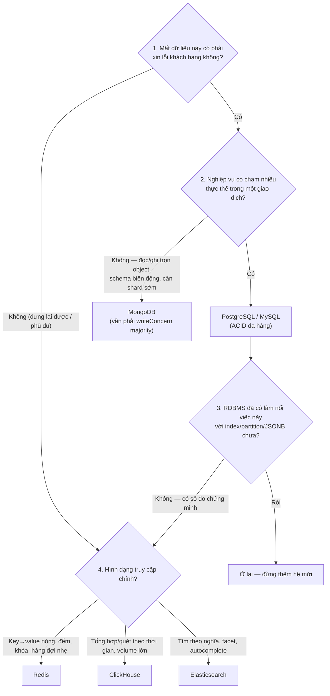
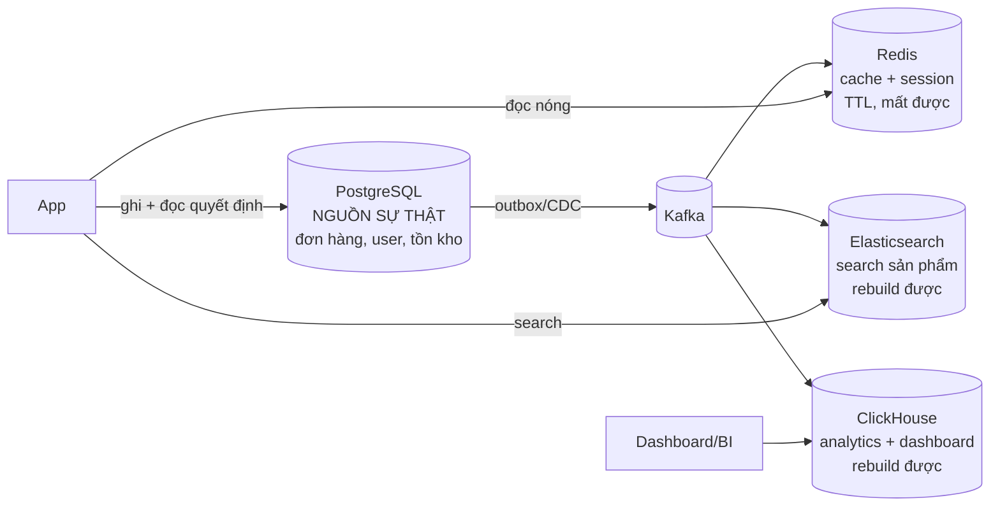

+++
title = "5.7. So sánh & khung quyết định lựa chọn"
date = "2026-07-13T09:20:00+07:00"
draft = false
tags = ["backend", "system-design"]
series = ["System Design — Tư Duy Thiết Kế Hệ Thống"]
+++

> Chương tổng hợp của Phần 5. Nếu sáu chương trước là sáu công cụ, chương này là bàn tay cầm chúng.

## 1. Bảng so sánh theo quyết định gốc

| | PostgreSQL | MySQL | MongoDB | Redis | ClickHouse | Elasticsearch |
|---|---|---|---|---|---|---|
| Cấu trúc lưu | Heap + B-tree | Clustered B-tree | B-tree (WiredTiger) | RAM structures | Columnar MergeTree | Inverted index (Lucene) |
| Đơn vị nhất quán | Transaction đa hàng | Transaction đa hàng | Document | Lệnh đơn | Không (eventual) | Document, không transaction |
| Trục tối ưu | Đọc/ghi điểm + query linh hoạt | Đọc/ghi điểm theo PK | Đọc/ghi cả object | Ops/s + latency µs–ms | Scan + aggregate | Tìm liên quan + facet |
| Điểm mù cấu trúc | Scan tỷ hàng; ghi append cực lớn | Như PG + analytics yếu hơn | Query cắt ngang document | Dataset > RAM; query đa chiều | Point read/update | Update dày; đếm chính xác; transaction |
| Scale ghi | 1 writer (shard = tự lo) | 1 writer (Vitess đường sẵn) | Sharding tích hợp | Cluster tích hợp | Cụm phân tán tốt | Shard tích hợp |
| Vai trong kiến trúc | **Nguồn sự thật** | **Nguồn sự thật** | Nguồn sự thật (đúng domain) | **Dẫn xuất/phù du** | **Dẫn xuất** | **Dẫn xuất** |
| Chi phí vận hành thêm | Thấp (managed phổ cập) | Thấp | Trung bình | Thấp–trung bình | Trung bình–cao | Cao |

Hàng "vai trong kiến trúc" là hàng quan trọng nhất: **hai cột đầu giữ sự thật; bốn cột sau phục vụ tốc độ.** Nhầm vai là nguồn của các tai nạn lớn nhất (Redis làm nguồn sự thật, ES làm primary store, ClickHouse làm OLTP).

## 2. Khung quyết định — sáu câu hỏi theo thứ tự

Chọn engine bằng cách trả lời tuần tự, không nhảy cóc:

Chú ý hai chốt chặn: **câu 1** tách nguồn sự thật khỏi dẫn xuất (quyết định quan trọng hơn mọi so sánh hiệu năng), và **câu 3** — cửa kiểm tra "PostgreSQL đã đủ chưa" đứng *trước* mọi lựa chọn chuyên dụng, đúng bài học xuyên suốt [Phần 12](/series/system-design/12-evolution/00-tong-quan/): mỗi hệ mới là một nghề vận hành mới, chỉ thêm khi có bằng chứng đo được.

## 3. Cùng một dữ liệu, bốn hình chiếu — bức tranh polyglot chuẩn

Kiến trúc dữ liệu trưởng thành (VietShop [giai đoạn 8](/series/system-design/12-evolution/08-cqrs/)) không chọn *một* engine — nó cho **một sự thật chảy qua nhiều hình chiếu**:

Ba quy tắc giữ cho bức tranh này không sụp:

1. **Mọi quyết định ghi đọc từ nguồn sự thật** — cache/index/projection chỉ phục vụ hiển thị ([4.2](/series/system-design/04-distributed-systems/02-replication-consistency/), [12.8 §7](/series/system-design/12-evolution/08-cqrs/)).
2. **Mọi hình chiếu có SLO độ tươi + cách rebuild đã tập dượt** — lag phải đo được ([13.3](/series/system-design/13-production-failure-cases/03-messaging-failures/)), rebuild phải đo thời gian.
3. **Mỗi engine thêm vào phải có chủ sở hữu vận hành** — "ai bị đánh thức khi nó ốm?" chưa có tên người là chưa được thêm.

## 4. Bài tập tình huống — áp khung vào các quyết định của VietShop

**"Catalog sản phẩm nên để PG hay Mongo?"** — Câu 1: mất catalog = thảm họa → nguồn sự thật. Câu 2: sửa sản phẩm ít khi chạm thực thể khác → không cần ACID đa hàng → Mongo *hợp lệ*. Nhưng câu 3: PG + JSONB cho thuộc tính động đã đủ, và team đang vận hành PG → **ở lại PG**. Mongo chỉ thắng nếu catalog là trung tâm workload + cần shard sớm (marketplace 100M SKU).

**"Đếm lượt xem sản phẩm?"** — Câu 1: mất được → dẫn xuất. Hình dạng: increment cực dày, đọc xấp xỉ → **Redis INCR** + flush định kỳ về ClickHouse/PG cho lịch sử. Đặt vào PG là tự tạo [hotspot](/series/system-design/13-production-failure-cases/02-database-failures/).

**"Trang 'doanh thu theo giờ, 90 ngày'?"** — Dẫn xuất, hình dạng aggregate-theo-thời-gian, volume triệu event/ngày → **ClickHouse** (qua Kafka). Dưới trăm nghìn event/ngày? — câu 3 nói: bảng tổng hợp trong PG là đủ.

**"Lịch sử giao dịch ví (FinTech)?"** — Câu 1: tuyệt đối không mất. Câu 2: chuyển tiền chạm 2 ví + ledger → ACID đa hàng → **PostgreSQL/MySQL, append-only ledger** ([13.2 — hotspot §khắc phục](/series/system-design/13-production-failure-cases/02-database-failures/)). Không có cuộc tranh luận NoSQL nào ở đây cả.

## 5. Anti-patterns của việc *lựa chọn* (khác với anti-pattern của từng engine)

- **Chọn theo hype/CV:** "dự án mới nên thử Mongo/ClickHouse cho biết" — engine là hạ tầng 5–10 năm, không phải sandbox học tập ([1.1 — resume-driven](/series/system-design/01-foundations/01-requirements/)).
- **Một engine ôm mọi vai vì "đỡ phức tạp":** đúng ở năm 1 ([12.1](/series/system-design/12-evolution/01-monolith-postgresql/)), thành bóp nghẹt ở năm 3 — sự đơn giản thật nằm ở *ít bộ phận đúng vai*, không phải *một bộ phận sai vai*.
- **Polyglot ngày đầu tiên:** 5 engine cho 500 user — mỗi cái một nghề vận hành, đội 3 người ([12 bài học 1](/series/system-design/12-evolution/00-tong-quan/)).
- **So sánh bằng benchmark của vendor:** mọi engine đều nhất thế giới trong benchmark tự chọn workload. Benchmark duy nhất có giá trị: workload của bạn, dữ liệu cỡ thật của bạn ([1.4 §3](/series/system-design/01-foundations/04-scale-estimation-capacity-planning/)).
- **Migration engine như thuốc chữa chậm:** 90% "PG chậm quá chắc phải sang X" kết thúc bằng một index bị thiếu ([1.5 — thứ tự thử](/series/system-design/01-foundations/05-bottleneck-analysis/)). Đổi engine là phương án cuối, sau khi profile chứng minh vấn đề nằm ở *mô hình lưu trữ* chứ không ở cách dùng.

## 6. Tóm tắt một đoạn — nếu chỉ nhớ một điều

Bắt đầu bằng PostgreSQL cho sự thật. Thêm Redis khi số đo chỉ vào đọc lặp ([12.2](/series/system-design/12-evolution/02-them-redis/)). Thêm Elasticsearch khi search thành tính năng trung tâm. Thêm ClickHouse khi analytics đè lên OLTP ([12.8](/series/system-design/12-evolution/08-cqrs/)). Cân nhắc MongoDB khi domain thật sự là document + shard sớm. Giữ MySQL khi tổ chức đã giỏi MySQL. Và mỗi lần thêm, trả lời đủ năm câu hỏi của [chương 00](/series/system-design/00-tu-duy-thiet-ke/): tại sao, không thì sao, trade-off, lựa chọn khác, chi phí vận hành.

---

*Hết Phần 5. Tiếp theo trong lộ trình viết sâu: [Phần 6 — Communication](/series/system-design/06-communication/00-tong-quan/).*
