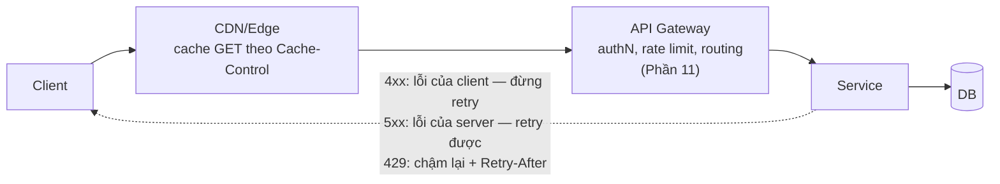

+++
title = "6.1. REST — hợp đồng chung của web"
date = "2026-07-13T09:40:00+07:00"
draft = false
tags = ["backend", "system-design"]
series = ["System Design — Tư Duy Thiết Kế Hệ Thống"]
+++

## 1. Problem Statement

Hai hệ thống của hai team (hoặc hai công ty) cần nói chuyện với nhau qua network, và hợp đồng giữa họ phải: dễ hiểu với người mới, dễ debug bằng công cụ phổ thông, tận dụng được hạ tầng web sẵn có (cache, proxy, LB, CDN), và sống sót qua nhiều năm tiến hóa mà không phá client cũ. REST không phải giao thức "tốt nhất" theo bất kỳ trục kỹ thuật đơn lẻ nào — nó là **hợp đồng có hệ sinh thái lớn nhất và chi phí gia nhập thấp nhất**, và đó chính là giá trị kiến trúc của nó.

## 2. Tại sao giải pháp này tồn tại

- **Business problem:** API là sản phẩm (công khai cho đối tác) hoặc là hợp đồng giữa các team — cần chuẩn mà *mọi người* đã biết, mọi ngôn ngữ có client, mọi công cụ hỗ trợ (curl, Postman, browser).
- **Technical problem:** RPC đời trước (SOAP, XML-RPC) coi network call như function call — che giấu bản chất phân tán, hợp đồng nặng nề. REST đảo lại: mô hình hóa theo **tài nguyên + động từ chuẩn HTTP**, phơi bày tính chất web thay vì che nó.
- **Scale problem:** vì đi trên HTTP chuẩn, REST thừa hưởng miễn phí toàn bộ hạ tầng scale của web: CDN cache GET, LB hiểu status code, proxy hiểu header.

## 3. First Principles

**REST bản chất là một tập ràng buộc, không phải một định dạng.** Ba ràng buộc mang lại giá trị kiến trúc thật, đáng hiểu sâu:

1. **Stateless:** mỗi request tự đủ (đem theo auth, context) — server không nhớ gì giữa hai request. Đây chính là điều kiện cho phép tầng app scale ngang tự do ([Phần 2](/series/system-design/02-scalability/00-tong-quan/), [12.2](/series/system-design/12-evolution/02-them-redis/)). Mọi lần "lách" stateless (session server-side gắn instance) là một lần trói scale.
2. **Uniform interface — ngữ nghĩa động từ chuẩn:** GET an toàn và idempotent (gọi N lần vô hại) → **cache được, retry được tự do**; PUT/DELETE idempotent → retry được; POST thì không → cần idempotency key. Hạ tầng trung gian (CDN, proxy, retry middleware) ra quyết định *chỉ dựa vào động từ* mà không hiểu nghiệp vụ — đó là lý do ngữ nghĩa động từ là điều **không được phá** (GET có side effect là tội nặng nhất của REST: một prefetcher/crawler sẽ thực thi nghiệp vụ của bạn hàng loạt).
3. **Resource-oriented:** URL danh từ, trạng thái chuyển bằng động từ chuẩn. Giá trị thật: ép người thiết kế mô hình hóa domain thành các thực thể có vòng đời rõ — một dạng kỷ luật thiết kế, không phải thẩm mỹ.

**Nếu bỏ REST đi thì sao?** Với API công khai: mất hệ sinh thái — mỗi đối tác tích hợp đắt hơn. Với nội bộ: có lựa chọn tốt hơn thật ([gRPC](/series/system-design/06-communication/03-grpc/)) — REST nội bộ tồn tại chủ yếu nhờ quán tính và chi phí gia nhập thấp, và điều đó *đủ tốt* cho đa số hệ vừa.

**Giả định ngầm:** JSON + HTTP/1.1 text — dễ đọc, đắt CPU (serialize/parse chiếm phần đáng kể CPU của service nhỏ); không có contract máy-kiểm-tra-được trừ khi tự thêm (OpenAPI).

## 4. Internal Architecture — anatomy của một REST API tử tế

- **Status code là một phần hợp đồng, không phải trang trí:** 4xx vs 5xx quyết định hành vi retry của *mọi* client và middleware ([13.3 — chỉ retry lỗi đáng retry](/series/system-design/13-production-failure-cases/03-messaging-failures/)). Trả 200 kèm `{"error": ...}` là phá hợp đồng với toàn bộ hạ tầng.
- **Versioning & tiến hóa:** quy tắc bền nhất — **chỉ thêm, không đổi/xóa** (additive change); client phải bao dung field lạ (tolerant reader). Đổi phá vỡ → version mới (`/v2/`) + chạy song song + deprecation có lộ trình. API công khai chết vì breaking change nhiều hơn vì chậm.
- **Pagination, filtering, sorting** chuẩn hóa từ ngày 1 (cursor-based cho dữ liệu lớn — offset sâu là [deep pagination](/series/system-design/05-data-layer/06-elasticsearch/) phiên bản DB: `OFFSET 100000` quét và vứt 100K hàng).
- **Failure flow:** timeout của client là một phần thiết kế API — endpoint chậm (export, báo cáo) không được để client chờ: trả 202 + job id, client poll hoặc nhận webhook ([12.3](/series/system-design/12-evolution/03-background-worker/) — đưa việc chậm ra khỏi đường nóng).

## 5. Trade-off

| Được | Giá |
|---|---|
| Hệ sinh thái lớn nhất: mọi ngôn ngữ, mọi công cụ, mọi dev | Không contract chặt mặc định — OpenAPI là kỷ luật tự giác |
| Cache hạ tầng miễn phí cho GET | JSON text: to và đắt CPU hơn binary 3–10× |
| Debug bằng curl — chi phí chẩn đoán thấp nhất | HTTP/1.1: head-of-line blocking, không streaming hai chiều tử tế |
| Ngữ nghĩa động từ cho retry/cache tự động | Ngữ nghĩa nghiệp vụ phức tạp gò vào CRUD đôi khi khiên cưỡng (đành thêm "action resource": `POST /orders/1/cancel` — thực dụng hơn là thuần khiết) |
| Loose coupling: client và server tiến hóa độc lập | Under-fetch/over-fetch: client cần 3 resource = 3 round-trip, hoặc nhận 50 field dùng 3 — đây chính là khe hở [GraphQL](/series/system-design/06-communication/02-graphql/) sinh ra để lấp |

## 6. Production Considerations

- **Metric theo endpoint:** RED (rate, errors, duration p50/p99) từng route; tỷ lệ 4xx theo loại (429 tăng = client nào đó bão hòa quota; 401 tăng = tích hợp hỏng credential).
- **Idempotency-Key cho POST tiền bạc** — bắt buộc, không tùy chọn ([12.1 §2](/series/system-design/12-evolution/01-monolith-postgresql/)): client gửi key, server lưu kết quả theo key, gặp lại trả kết quả cũ.
- **Rate limit trả 429 + Retry-After (có jitter)** — dạy client cư xử ([13.1 — thundering herd](/series/system-design/13-production-failure-cases/01-caching-failures/)).
- OpenAPI spec là nguồn sự thật của hợp đồng: sinh client/server stub, validate CI, diff phát hiện breaking change tự động.
- Payload lớn: nén (gzip/brotli), field filtering (`?fields=`), và đừng ngại ETag/`If-None-Match` cho GET nặng.

## 7. Best Practices

- Thiết kế URL theo thực thể domain, nông (≤ 2 tầng lồng); consistency toàn công ty quan trọng hơn đúng "chuẩn" của bất kỳ trường phái nào — một style guide nội bộ, mọi team theo.
- Error body có cấu trúc thống nhất: mã lỗi máy-đọc-được + message người-đọc-được + trace id ([Phần 10](/series/system-design/10-observability/00-tong-quan/)).
- Timestamps: ISO 8601 UTC, luôn luôn. Tiền: số nguyên đơn vị nhỏ nhất (đồng, cent) — float cho tiền là bug đang ủ.
- Webhook đi kèm API công khai: ký chữ ký (HMAC) + retry có backoff + endpoint của bạn nhận webhook phải idempotent ([13.3](/series/system-design/13-production-failure-cases/03-messaging-failures/)).

## 8. Anti-patterns

- **GET có side effect** — phá hợp đồng với cache/prefetch/crawler; nghiệp vụ chạy hàng loạt ngoài ý muốn.
- **200-cho-mọi-thứ** kèm error trong body — vô hiệu hóa retry/alert/circuit breaker của toàn hạ tầng.
- **Chatty API:** màn hình cần 8 call nối tiếp — latency cộng dồn ([1.3](/series/system-design/01-foundations/03-throughput-latency/)); gộp bằng endpoint tổng hợp/BFF trước khi nghĩ đến GraphQL.
- **Breaking change không version:** đổi tên field, đổi kiểu, bỏ field — mỗi lần là một đợt sự cố ở mọi client.
- **Expose model DB thẳng ra API** (ORM → JSON) — khóa schema DB vào hợp đồng công khai; đổi cột = breaking change. DTO là ranh giới, không phải bureaucracy.
- **Phân trang offset trên bảng triệu hàng** — chậm dần đều rồi chết.

## 9. Khi nào KHÔNG nên dùng

- **Nội bộ, tần suất cao, hai đầu đều do bạn kiểm soát:** [gRPC](/series/system-design/06-communication/03-grpc/) cho contract chặt + hiệu năng + streaming — REST ở đây chỉ còn lợi thế "quen tay".
- **Client đa dạng cần hình dữ liệu khác nhau trên cùng domain phức tạp:** cân nhắc [GraphQL](/series/system-design/06-communication/02-graphql/) — sau khi đã thử BFF.
- **Fire-and-forget, fan-out, việc làm sau:** đó là messaging ([6.4](/series/system-design/06-communication/04-rabbitmq/)–[6.6](/series/system-design/06-communication/06-event-driven/)) — REST + polling cho việc này là tự chế queue tồi.
- **Streaming hai chiều, real-time:** WebSocket/SSE/gRPC stream.

---

*Tiếp theo: [6.2. GraphQL](/series/system-design/06-communication/02-graphql/)*
