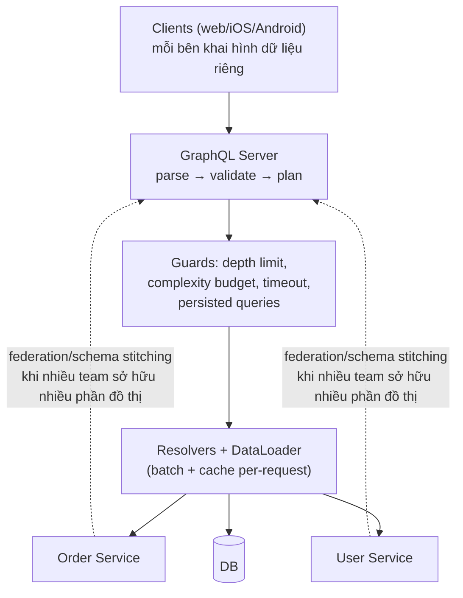

+++
title = "6.2. GraphQL — client tự khai hình dữ liệu"
date = "2026-07-13T09:50:00+07:00"
draft = false
tags = ["backend", "system-design"]
series = ["System Design — Tư Duy Thiết Kế Hệ Thống"]
+++

## 1. Problem Statement

Ứng dụng có nhiều loại client (web, iOS, Android, smart TV, đối tác) trên cùng một domain phức tạp. Với REST thuần, mỗi màn hình gặp một trong hai bệnh: **under-fetch** (cần 5 resource = 5 round-trip nối tiếp — chết vì latency trên mobile 3G) hoặc **over-fetch** (endpoint trả 60 field, màn hình dùng 4 — chết vì băng thông). Team backend bị kẹp giữa: hoặc viết endpoint riêng cho từng màn hình của từng client (bùng nổ endpoint), hoặc bắt client chịu. GraphQL đảo quyền: **schema thống nhất phía server, client tự khai chính xác hình dữ liệu nó cần, nhận về đúng hình đó trong một round-trip.**

## 2. Tại sao giải pháp này tồn tại

- **Business problem:** tốc độ ra feature của *nhiều* team client bị chặn bởi backlog của *một* team backend viết endpoint theo yêu cầu — GraphQL chuyển quyền tự phục vụ cho client.
- **Technical problem:** under/over-fetching là hệ quả cấu trúc của resource-oriented API, không phải lỗi thiết kế của ai — cần mô hình khác, không phải REST tốt hơn.
- **Scale problem (tổ chức):** sinh ra ở Facebook cho đúng bối cảnh: hàng trăm màn hình, hàng chục client version sống song song (app cũ 2 năm vẫn phải chạy), domain đồ thị dày đặc. Bối cảnh của bạn càng giống vậy, GraphQL càng đáng; càng khác, càng không.

## 3. First Principles

**GraphQL = một schema đồ thị có kiểu + một ngôn ngữ query trên đồ thị đó.** Server khai các type và quan hệ (`Order → User → Address`); client hỏi bằng cách vẽ hình cây con nó cần. Ba hệ quả cấu trúc theo sau — hai xấu một tốt:

1. **(Tốt) Hợp đồng chặt + tiến hóa mềm:** schema là contract máy-kiểm-tra-được (hơn REST mặc định); client chỉ nhận field nó khai → thêm field mới không ảnh hưởng ai; server *đo được* field nào còn ai dùng trước khi xóa — deprecation có số liệu thay vì đoán.
2. **(Xấu) Server mất quyền kiểm soát chi phí:** REST — server biết trước chi phí mỗi endpoint; GraphQL — **client viết query, tức client quyết định chi phí**. Một query lồng 6 tầng (`orders → items → product → reviews → author → orders...`) là một cú quét DB tổ hợp. Mọi kỹ thuật vận hành GraphQL (depth limit, complexity budget, persisted query) đều là đòi lại quyền kiểm soát này.
3. **(Xấu) N+1 trở thành mặc định cấu trúc:** mỗi field một resolver, resolver ngây thơ = mỗi node đồ thị một query ([13.2 — N+1](/series/system-design/13-production-failure-cases/02-database-failures/) dạng tổng quát). **DataLoader** (gom mọi lookup cùng loại trong một tick thành một batch `WHERE id IN (...)` + cache theo request) không phải tối ưu tùy chọn — nó là *điều kiện sống* của mọi GraphQL server nghiêm túc.

**Nếu bỏ đi thì sao?** Giải pháp rẻ hơn cho 80% nhu cầu: **BFF** (Backend-for-Frontend — mỗi loại client một tầng tổng hợp mỏng do team client sở hữu) hoặc REST + `?fields=`/endpoint tổng hợp. GraphQL chỉ thắng BFF khi số tổ hợp (client × màn hình) đủ lớn để "mỗi màn một endpoint" không đuổi kịp.

**Giả định ngầm cần soi:** đội đủ trưởng thành để vận hành một *query engine* (không chỉ một web server); các nguồn dữ liệu sau schema chịu được pattern truy cập mà client sáng tác ra.

## 4. Internal Architecture

- **Data flow:** một POST `/graphql` → engine phân giải cây query, gọi resolver theo tầng (song song trong tầng), DataLoader gom lookup → ghép kết quả đúng hình client khai.
- **Failure flow đặc trưng:** GraphQL trả **200 kèm mảng `errors` + data một phần** — triết lý "lấy được gì trả nấy". Hệ quả vận hành: monitoring dựa trên HTTP status **mù hoàn toàn** với lỗi GraphQL — phải đo error theo field/operation từ body ([so với hợp đồng status code của REST](/series/system-design/06-communication/01-rest/)).
- **Caching đảo ngược:** mất cache HTTP/CDN theo URL (mọi thứ là POST vào một endpoint) — thay bằng: client cache chuẩn hóa theo object (Apollo/Relay — rất mạnh, một phần lớn giá trị thực của GraphQL nằm ở đây), server cache theo field/resolver, và **persisted queries** (client đăng ký query trước, runtime chỉ gửi hash — vừa cache được vừa chặn query lạ: một mũi tên hai đích).
- **Federation:** nhiều team sở hữu nhiều phần đồ thị, gateway ghép — giải bài toán "một schema, trăm team" nhưng cộng thêm một tầng phân tán với đủ bài toán của nó ([13.4](/series/system-design/13-production-failure-cases/04-distributed-failures/)); chỉ đáng ở tổ chức lớn thật.

## 5. Trade-off

| Được | Giá |
|---|---|
| Một round-trip đúng hình dữ liệu — mobile latency cải thiện rõ | Chi phí query do client quyết — server phải xây cả bộ máy phòng thủ |
| Client tự phục vụ, backend hết viết endpoint-theo-màn-hình | N+1 mặc định; DataLoader là bắt buộc, không phải tùy chọn |
| Schema typed + introspection + đo được usage từng field | Mất cache HTTP/CDN; 200-với-errors vô hiệu monitoring chuẩn |
| Tiến hóa additive mượt, deprecate có số liệu | Một tầng hạ tầng thật sự phải nuôi (engine, guards, federation) — đắt hơn REST một bậc về vận hành |
| Client cache chuẩn hóa (Apollo/Relay) rất mạnh | Rate limit theo request vô nghĩa — phải theo complexity; authZ phải xuống từng field ([Phần 11](/series/system-design/11-security/00-tong-quan/)) |

## 6. Production Considerations

- **Metric theo operation name** (client bắt buộc đặt tên query): rate/error/duration từng operation; top operation theo complexity; field usage (cho deprecation).
- **Bộ phòng thủ bắt buộc trước khi mở cho client ngoài:** depth limit (~7–10), complexity budget (điểm theo field × hệ số danh sách), timeout per-query, persisted queries cho mobile (chặn query tự do từ app đã ship).
- **AuthZ ở tầng field/type, không ở endpoint** — mọi đường trong đồ thị dẫn đến được mọi node: "quên" một field nhạy cảm là lộ nó qua một đường vòng nào đó.
- Đừng expose thẳng schema DB — schema GraphQL là *domain model cho client*, một tầng thiết kế riêng ([cùng nguyên tắc DTO của REST](/series/system-design/06-communication/01-rest/)).
- Cẩn thận introspection ở production công khai (tắt hoặc gate) — bản đồ tấn công miễn phí.

## 7. Best Practices

- Chuẩn Relay-style cho pagination (cursor + connection) từ ngày 1 — retrofit đau.
- Mutation đặt theo nghiệp vụ (`cancelOrder`) chứ không CRUD (`updateOrder`) — giữ ngữ nghĩa và authZ rõ.
- Mọi resolver đi qua DataLoader kể cả khi "chỉ một chỗ gọi" — chỗ thứ hai sẽ xuất hiện.
- Schema review như API review: một thay đổi schema là một thay đổi hợp đồng với mọi client — CI diff schema, chặn breaking change.
- Bắt đầu bằng một schema nhỏ cho một nhóm màn hình đau nhất — đừng "GraphQL hóa toàn công ty" làm dự án năm.

## 8. Anti-patterns

- **GraphQL không DataLoader** — N+1 nhân theo độ sâu đồ thị; chết ngay khi ra khỏi demo.
- **Không giới hạn depth/complexity mở cho public** — mời DoS bằng một query.
- **Dùng làm proxy 1-1 cho REST/DB** (mỗi type = một bảng, mỗi field = một cột) — nhận mọi chi phí của GraphQL, mất lý do tồn tại của nó.
- **Alert dựa trên HTTP 5xx** cho hệ GraphQL — mù với hầu hết lỗi thật.
- **Một God-schema không ai sở hữu** — phiên bản đồ thị của [shared database](/series/system-design/12-evolution/05-modular-monolith/): mọi team sửa, không team nào chịu trách nhiệm.

## 9. Khi nào KHÔNG nên dùng

- **API công khai cho đối tác đa dạng:** REST + OpenAPI vẫn là hợp đồng phổ cập, dễ tích hợp, dễ cache, dễ rate-limit ([6.1](/series/system-design/06-communication/01-rest/)).
- **Ít loại client, ít màn hình, domain nông:** BFF hoặc endpoint tổng hợp rẻ hơn cả bậc — GraphQL ở đây là mua cả nhà máy để pha một ly cà phê.
- **Service-to-service nội bộ:** [gRPC](/series/system-design/06-communication/03-grpc/) — hai đầu đều là code bạn kiểm soát, "client tự khai hình" không có giá trị, contract chặt và hiệu năng có.
- **Team nhỏ chưa từng vận hành nó:** khởi đầu bằng REST tốt ([12.1](/series/system-design/12-evolution/01-monolith-postgresql/)); GraphQL là giải pháp cho nỗi đau tổ chức mà startup 5 người chưa có.

---

*Tiếp theo: [6.3. gRPC](/series/system-design/06-communication/03-grpc/)*
