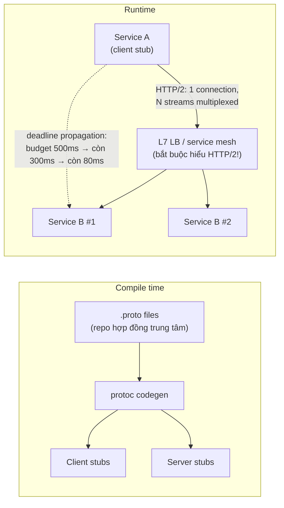

+++
title = "6.3. gRPC — RPC có kỷ luật cho nội bộ"
date = "2026-07-13T10:00:00+07:00"
draft = false
tags = ["backend", "system-design"]
series = ["System Design — Tư Duy Thiết Kế Hệ Thống"]
+++

## 1. Problem Statement

Bên trong một hệ microservices ([12.6](/series/system-design/12-evolution/06-microservices/)), các service gọi nhau hàng chục nghìn lần mỗi giây. Ở tần suất đó, những thứ vặt vãnh của REST/JSON thành hóa đơn lớn: serialize/parse JSON ngốn CPU thật (đo được hàng chục % CPU của service nhỏ), payload text phình băng thông, HTTP/1.1 mở nhiều connection và nghẽn head-of-line, và — đắt nhất — **hợp đồng lỏng lẻo**: field đổi tên, kiểu đổi, chỉ phát hiện lúc runtime bằng sự cố. Hai đầu dây đều là code của bạn; cái bạn cần không phải "phổ cập" mà là **contract chặt kiểm tra lúc compile + hiệu năng + streaming** — đó là gRPC.

## 2. Tại sao giải pháp này tồn tại

- **Technical problem:** JSON không có schema thực thi được; HTTP/1.1 không multiplexing; không chuẩn streaming hai chiều — ba khoảng trống cho giao tiếp nội bộ tần suất cao.
- **Scale problem:** nghìn service × triệu call/phút — tiết kiệm 5× CPU serialize và 3–10× băng thông là con số nhân với cả hạ tầng.
- **Reliability problem:** lỗi contract giữa các team phải bị bắt ở **CI**, không phải ở production lúc 2 giờ sáng — codegen từ proto biến lệch hợp đồng thành lỗi compile.

## 3. First Principles

**gRPC = Protobuf (hợp đồng + mã hóa nhị phân) × HTTP/2 (multiplexing + streaming).** Hiểu hai thành phần là hiểu mọi ưu nhược:

1. **Protobuf — schema-first:** viết `.proto` trước, sinh code client/server cho mọi ngôn ngữ. Field đánh **số tag** — wire format chỉ ghi số tag + giá trị nhị phân (không ghi tên field như JSON) → nhỏ và nhanh; và **quy tắc tiến hóa xoay quanh tag**: không đổi số tag, không đổi kiểu, chỉ thêm field mới với tag mới, không tái sử dụng tag đã xóa — theo đúng luật thì client cũ/server mới sống chung mượt (cùng triết lý "chỉ thêm, không đổi" của [REST](/series/system-design/06-communication/01-rest/), nhưng được *máy* thực thi).
2. **HTTP/2:** một connection, nhiều stream song song (hết head-of-line ở tầng HTTP, hết connection storm), header nén, và bốn kiểu gọi: unary, server-streaming (feed kết quả dần), client-streaming (upload/telemetry), **bidirectional streaming** (chat, sync, subscribe — thứ REST phải vá bằng WebSocket).

**Vì sao "RPC quay lại" sau khi SOAP thất bại?** SOAP chết vì nặng nề và *giả vờ network là local*. gRPC không giả vờ: deadline, status code phân tán (`UNAVAILABLE`, `DEADLINE_EXCEEDED`), retry policy là công dân hạng nhất của giao thức — nó là RPC **thừa nhận** distributed ([chương 00 — mọi call có thể fail](/series/system-design/00-tu-duy-thiet-ke/)).

**Nếu không dùng thì sao?** REST+OpenAPI+codegen mô phỏng được ~70% lợi ích contract (kém hơn về thực thi), bỏ lỡ hiệu năng nhị phân và streaming. Với hệ ít service, tần suất thấp — 70% đó là đủ và rẻ hơn về học và vận hành.

**Giả định ngầm:** hai đầu do bạn kiểm soát (browser không nói gRPC tự nhiên — cần gRPC-Web/proxy, lý do gRPC hiếm khi là API công khai); hạ tầng LB hiểu HTTP/2 đúng cách (xem §4 — cạm bẫy lớn nhất).

## 4. Internal Architecture

- **Cạm bẫy vận hành số 1 — load balancing:** gRPC giữ **connection dài, request đi trong stream**. L4 LB (TCP) chia *connection*, không chia *request* → 2 instance nhận 2 connection rồi một instance gánh 90% traffic vì client bên đó bận hơn. Cần **L7 LB hiểu HTTP/2** (Envoy, service mesh) hoặc client-side LB — phát hiện muộn điều này ở production là kinh điển ([13.2 — tải lệch kiểu hot node](/series/system-design/13-production-failure-cases/02-database-failures/)).
- **Deadline propagation — tính năng ăn tiền nhất:** client đặt deadline tổng, mỗi hop trừ dần và **truyền phần còn lại** xuống — hết budget là mọi tầng dưới hủy việc *cùng lúc*, không có chuyện tầng sâu miệt mài làm việc cho một request mà client đã bỏ đi từ 20 giây trước. Đây là phiên bản giao-thức-hóa của "timeout mọi tầng" ([13.2 — pool exhaustion](/series/system-design/13-production-failure-cases/02-database-failures/)).
- **Status code riêng** (không phải HTTP status): `UNAVAILABLE` (retry được), `INVALID_ARGUMENT`/`FAILED_PRECONDITION` (đừng retry), `DEADLINE_EXCEEDED`, `RESOURCE_EXHAUSTED` (backoff) — ánh xạ thẳng vào chính sách retry ([13.3](/series/system-design/13-production-failure-cases/03-messaging-failures/)); dùng đúng mã là dạy toàn hạ tầng phản ứng đúng.
- **Failure flow:** connection dài + node chết = mọi stream trên đó chết cùng lúc → client stub tự reconnect + retry theo policy khai báo (`service config`) — kiểm tra hành vi này bằng chaos test thay vì tin mặc định.

## 5. Trade-off

| Được | Giá |
|---|---|
| Contract chặt, lệch hợp đồng = lỗi compile ở CI | Thêm toolchain (protoc, codegen, repo proto) vào mọi pipeline |
| Payload nhị phân: 3–10× nhỏ hơn, serialize ~5× rẻ CPU hơn JSON | Không đọc được bằng mắt — debug cần grpcurl/reflection thay vì curl; chi phí chẩn đoán cao hơn |
| Streaming 4 kiểu, multiplexing, deadline propagation | Browser/đối tác ngoài cần gateway phiên dịch (gRPC-Web, gRPC-Gateway sinh REST song song) |
| Retry/deadline/LB policy khai báo trong giao thức | LB phải L7-aware — hạ tầng cũ kiểu L4 gây tải lệch âm thầm |
| Hiệu năng ổn định ở tần suất rất cao | Ở tần suất thấp, toàn bộ ưu thế hiệu năng không mua nổi chi phí phức tạp thêm |

## 6. Production Considerations

- **Repo proto trung tâm + CI kiểm tra tương thích** (buf breaking check): hợp đồng là tài sản chung, thay đổi phá vỡ bị chặn máy móc — đây là 50% giá trị của gRPC, đừng để mỗi team một bản copy proto trôi dạt.
- **Metric:** RED theo method (interceptor chuẩn export sẵn), phân bố status code, deadline-exceeded rate theo hop (chỉ điểm tầng nào đang ăn hết budget), connection churn.
- **Keepalive tuning:** NAT/LB im lặng giết connection nhàn rỗi → stream chết câm; keepalive ping đặt có ý thức (quá dày bị server phạt `GOAWAY`).
- Service mesh (Istio/Linkerd) và gRPC là cặp tự nhiên: mesh lo LB/mTLS/retry ở sidecar — nhưng đừng nhân đôi retry (mesh retry × app retry = [retry storm nội bộ](/series/system-design/13-production-failure-cases/03-messaging-failures/); chọn một tầng).
- Message to (file, ảnh): gRPC không phải kênh tải file — dùng presigned URL + object storage, gửi reference qua gRPC.

## 7. Best Practices

- Đặt deadline ở **mọi** call — client không deadline là client chờ vô hạn; mặc định trong SDK nội bộ ([README Phần 6 — bốn kỷ luật](/series/system-design/06-communication/00-tong-quan/)).
- Thiết kế method theo nghiệp vụ (`ReserveInventory`) không theo CRUD; request/response message riêng cho từng method (đừng share message — tiến hóa sẽ trói).
- `FieldMask`/optional semantics cho update một phần; wrapper types khi cần phân biệt "không gửi" và "gửi giá trị zero" — nguồn bug protobuf kinh điển nhất.
- Interceptor chuẩn cho toàn công ty: auth, tracing ([Phần 10](/series/system-design/10-observability/00-tong-quan/)), metric, panic recovery — trong service template ([12.6](/series/system-design/12-evolution/06-microservices/)).
- Bật server reflection ở môi trường nội bộ cho grpcurl — trả lại một phần "debug bằng curl" đã mất.

## 8. Anti-patterns

- **Đổi số tag / tái dùng tag cũ trong proto** — dữ liệu đọc lệch âm thầm (field này đọc thành field kia) — tệ hơn crash.
- **gRPC sau L4 LB** — tải lệch ngầm như mô tả §4.
- **Không deadline, hoặc deadline không truyền** — tầng sâu làm việc cho ma; pool bị giam ([13.2](/series/system-design/13-production-failure-cases/02-database-failures/)).
- **Retry ở cả mesh lẫn app lẫn client gọi** — tích khuếch đại không ai thiết kế ([13.3](/series/system-design/13-production-failure-cases/03-messaging-failures/)).
- **Dùng gRPC làm API công khai cho đối tác** — ép cả thế giới vào toolchain của bạn; REST/OpenAPI cho biên, gRPC cho lõi.
- **Bidirectional streaming cho thứ unary làm được** — phức tạp connection-state không cần thiết; streaming là công cụ đặc trị, không phải mặc định.

## 9. Khi nào KHÔNG nên dùng

- **API công khai / browser-first:** REST ([6.1](/series/system-design/06-communication/01-rest/)) hoặc GraphQL ([6.2](/series/system-design/06-communication/02-graphql/)) — hệ sinh thái và cache thắng.
- **Monolith hoặc 2–3 service tần suất thấp:** REST nội bộ đủ tốt; gRPC là trả trước cho quy mô chưa có ([12.5 — ở lại modular monolith](/series/system-design/12-evolution/05-modular-monolith/) thì mọi call vẫn là function call, còn tốt hơn).
- **Team chưa có nền vận hành HTTP/2/proto:** chi phí học + toolchain chỉ hoàn vốn khi tần suất call và số service đủ lớn — đúng tinh thần [12 bài học 1](/series/system-design/12-evolution/00-tong-quan/).
- **Việc vốn là async:** đừng streaming-hóa cái nên là message ([6.4](/series/system-design/06-communication/04-rabbitmq/)–[6.5](/series/system-design/06-communication/05-kafka/)) — stream gRPC không có durability, không replay, không DLQ.

---

*Tiếp theo: [6.4. RabbitMQ](/series/system-design/06-communication/04-rabbitmq/)*
