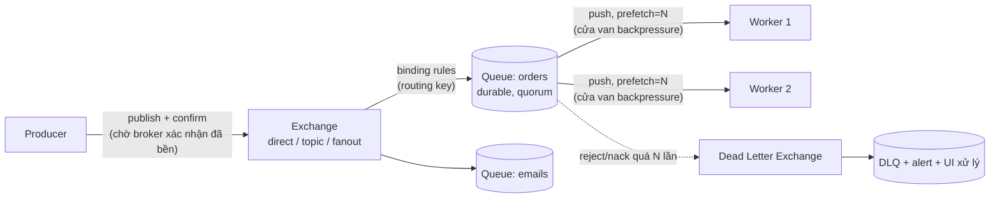

+++
title = "6.4. RabbitMQ — smart broker cho work queue"
date = "2026-07-13T10:10:00+07:00"
draft = false
tags = ["backend", "system-design"]
series = ["System Design — Tư Duy Thiết Kế Hệ Thống"]
+++

> Bối cảnh vì-sao-tồn-tại và hành trình đưa nó vào hệ thống đã kể ở [12.4](/series/system-design/12-evolution/04-message-queue/). Chương này đi sâu vào nội thất, mô hình vận hành và ranh giới của nó.

## 1. Problem Statement

Cần giao **việc** một cách tin cậy: mỗi việc đến đúng một worker, việc fail được thử lại, việc hỏng vĩnh viễn được cách ly có địa chỉ (DLQ), việc gấp vượt việc thường, spike được hấp thụ. Đây là bài toán **task distribution** — khác về bản chất với bài toán **event distribution** ([Kafka, 6.5](/series/system-design/06-communication/05-kafka/)): việc thì *tiêu thụ xong là xong*, sự kiện thì *nhiều bên cùng đọc và có thể đọc lại*.

## 2. Tại sao giải pháp này tồn tại

- **Technical problem:** producer và consumer khác tốc độ, khác lịch sống chết — cần vùng đệm bền ở giữa với ngữ nghĩa giao nhận rõ ràng (ack, redeliver, reject).
- **Reliability problem:** tự chế queue trên Redis/DB thiếu dần: durable ack, DLQ, priority, fair dispatch — vá đủ là tự viết một broker tồi ([12.4 §2](/series/system-design/12-evolution/04-message-queue/)).
- **Scale problem:** load leveling — hệ chỉ cần capacity của *trung bình*, không phải của *đỉnh*, nếu chấp nhận trễ ([12.4 §3](/series/system-design/12-evolution/04-message-queue/)).

## 3. First Principles

**"Smart broker, dumb consumer" — quyết định gốc của RabbitMQ (kế thừa AMQP).** Broker giữ *toàn bộ trí thông minh giao nhận*: định tuyến (exchange → binding → queue), theo dõi từng message đã giao cho ai, đã ack chưa, đếm redeliver, đẩy sang DLQ, xóa sau khi xong. Consumer chỉ việc: nhận → xử lý → ack.

So sánh gốc rễ với Kafka (dumb broker, smart consumer — broker chỉ là log, consumer tự nhớ đọc đến đâu):

- Trí thông minh per-message của RabbitMQ **đắt**: broker phải track trạng thái từng message → throughput trần thấp hơn Kafka 1–2 bậc, backlog to làm *chính broker* ốm ([13.3 — queue backlog](/series/system-design/13-production-failure-cases/03-messaging-failures/)).
- Đổi lại: ngữ nghĩa *việc* chuẩn ngay khỏi hộp — retry per-message, DLQ, priority, delay — những thứ trên Kafka phải *tự xây* bằng topic phụ và kỷ luật consumer.

**Message qua đời khi được ack — đây là ranh giới bản chất.** Không replay, không consumer thứ hai đọc lại quá khứ. Cần hai bên cùng đọc một sự kiện? Fan-out exchange ra 2 queue được — nhưng consumer thứ ba *đến sau* không thấy gì của quá khứ. Nhu cầu "đến sau vẫn đọc được lịch sử" là tiếng còi chuyển sang log ([12.7 §2](/series/system-design/12-evolution/07-kafka-event-driven/)).

**Giả định ngầm:** backlog là trạng thái *bất thường ngắn hạn* (broker khỏe khi queue gần rỗng); message là *lệnh làm việc* có đời sống ngắn, không phải *dữ liệu* cần giữ.

## 4. Internal Architecture

- **Exchange/binding — tầng định tuyến khai báo:** direct (khớp key chính xác), topic (wildcard `order.*.vn`), fanout (phát mọi queue gắn vào). Producer chỉ biết exchange — topology định tuyến đổi được mà không sửa producer: một phần tính mở của event-driven, ở mức nhẹ.
- **Vòng đời một message tin cậy — ba mắt xích, thiếu một là mất tin:** (1) **publisher confirm** — producer chờ broker báo "đã ghi bền" (không confirm = gửi vào hư không khi broker trục trặc); (2) **queue durable + message persistent + quorum queue** (bản sao qua Raft — [4.3](/series/system-design/04-distributed-systems/03-consensus-quorum-leader-election/)) — sống qua broker chết; (3) **manual ack sau khi xử lý xong** — consumer chết giữa chừng thì message quay lại queue (⇒ at-least-once ⇒ [duplicate là hợp đồng](/series/system-design/13-production-failure-cases/03-messaging-failures/) ⇒ idempotency).
- **Prefetch — núm backpressure quan trọng nhất phía consumer:** broker đẩy tối đa N message chưa-ack cho mỗi worker. N=1: công bằng tuyệt đối, chậm (round-trip mỗi message); N lớn: throughput cao nhưng worker chết ôm theo N message phải redeliver + phân phối lệch. Bắt đầu 10–50, đo rồi chỉnh theo thời gian xử lý.
- **Failure flow:** consumer nack/crash → redeliver (đếm `x-delivery-count` trên quorum queue) → quá ngưỡng → DLX → DLQ. **Không cấu hình DLX = poison message quay vòng vô hạn chặn cả queue** — lỗi cấu hình phổ biến nhất ([13.3](/series/system-design/13-production-failure-cases/03-messaging-failures/)).
- **Con số định hướng:** nghìn–vài chục nghìn msg/s mỗi node cho message persistent — dư dả cho task queue của đa số hệ; hàng trăm nghìn/s trở lên hoặc cần replay → nhầm công cụ, sang [6.5](/series/system-design/06-communication/05-kafka/).

## 5. Trade-off

| Được | Giá |
|---|---|
| Ngữ nghĩa việc trọn gói: ack, retry, DLQ, priority, delay | Throughput trần thấp hơn log-based 1–2 bậc |
| Định tuyến khai báo linh hoạt (topic/fanout) | Topology exchange/binding phức tạp dần thành mê cung không tài liệu |
| Backpressure tự nhiên qua prefetch | Backlog lớn đè chính broker (RAM/disk) — cần alert sớm theo *tuổi* message |
| Quorum queue: bền qua node chết | Cluster RabbitMQ vẫn là hệ stateful phải nuôi (hoặc trả tiền managed) |
| Ổn định, tài liệu dày, hệ sinh thái framework chín | Không replay, không lịch sử — nhu cầu event sourcing/analytics phải công cụ khác |

## 6. Production Considerations

- **Metric hạng nhất:** queue depth + **message age** từng queue, publish vs ack rate, redelivery rate, DLQ size (>0 ở queue tiền bạc = page ngay), consumer utilisation, connection/channel churn (app tạo channel mỗi message là bug kinh điển — channel là để dùng lại), memory/disk watermark của broker (chạm là broker **chặn publisher** — flow control: hiểu trước, đừng ngạc nhiên lúc 2h sáng).
- **Quorum queue cho mọi queue quan trọng** (classic mirrored đã lỗi thời); cụm 3 node, 3 AZ — đúng bài [4.3](/series/system-design/04-distributed-systems/03-consensus-quorum-leader-election/).
- **DLQ có quy trình con người:** dashboard, chủ sở hữu, SLA xử lý, nút requeue — DLQ không ai xem là hố đen nghiệp vụ ([13.3](/series/system-design/13-production-failure-cases/03-messaging-failures/)).
- Delay/retry-với-backoff: dùng delayed exchange plugin hoặc TTL + DLX pattern — chuẩn hóa một cách cho toàn công ty, đừng mỗi team một kiểu.
- Managed (CloudAMQP, Amazon MQ) trừ khi có lý do mạnh — vận hành cluster + upgrade không phải nơi tạo khác biệt kinh doanh.

## 7. Best Practices

- **Message = ID + ngữ cảnh tối thiểu**, worker đọc trạng thái mới nhất từ DB ([12.3 §3](/series/system-design/12-evolution/03-background-worker/)) — chống xử lý trên dữ liệu ôi.
- **Idempotency key nghiệp vụ trong mọi consumer** — điều kiện tồn tại, không phải tùy chọn ([13.3 — duplication](/series/system-design/13-production-failure-cases/03-messaging-failures/)).
- Queue riêng theo mức ưu tiên/SLA (email marketing ≠ xác nhận thanh toán) — bulkhead cho messaging ([13.2 — pool](/series/system-design/13-production-failure-cases/02-database-failures/) cùng nguyên lý).
- TTL cho job hết đát tự rơi + consumer kiểm tra "điều kiện còn hiệu lực?" trước khi làm ([13.3 — backlog: thế giới đã trôi](/series/system-design/13-production-failure-cases/03-messaging-failures/)).
- Publish **sau commit** hoặc qua outbox ([6.8](/series/system-design/06-communication/08-outbox/)) — enqueue trước commit là kể chuyện về dữ liệu chưa tồn tại ([12.3 §3](/series/system-design/12-evolution/03-background-worker/)).

## 8. Anti-patterns

- **Auto-ack** (ack lúc nhận thay vì lúc xong) — worker chết là việc biến mất không dấu vết; vô hiệu toàn bộ lý do dùng broker.
- **Không DLX** — poison message quay vòng vĩnh viễn.
- **Dùng RabbitMQ làm event store / nguồn replay** — sai mô hình gốc; đó là việc của log.
- **Một queue khổng lồ cho mọi loại việc** — việc 5 giây chặn việc 50ms, không ưu tiên được, không scale chọn lọc được.
- **Prefetch không giới hạn** — worker ôm nghìn message rồi chết; phân phối lệch nặng.
- **Coi broker là nơi lưu backlog dài hạn** — RabbitMQ khỏe khi queue gần rỗng; backlog triệu message là tình huống khẩn, không phải "kho tạm".

## 9. Khi nào KHÔNG nên dùng

- **Sự kiện nhiều consumer độc lập + replay + retention:** [Kafka](/series/system-design/06-communication/05-kafka/) — đúng ranh giới đã phân tích ([12.7 §2](/series/system-design/12-evolution/07-kafka-event-driven/)).
- **Throughput trăm nghìn msg/s trở lên:** log-based thắng về cấu trúc.
- **Hệ nhỏ, job đơn giản, đã có Redis:** Sidekiq/Celery/BullMQ trên Redis đủ ([12.3](/series/system-design/12-evolution/03-background-worker/)); thêm RabbitMQ khi cần đảm bảo mà Redis-queue không cho được ([12.4 — tín hiệu chuyển](/series/system-design/12-evolution/04-message-queue/)).
- **Cần kết quả ngay trong request:** đó là sync call — nhét request/reply qua broker cho luồng cần latency thấp là cộng thêm hai chặng bền hóa vô ích.

---

*Tiếp theo: [6.5. Kafka](/series/system-design/06-communication/05-kafka/)*
