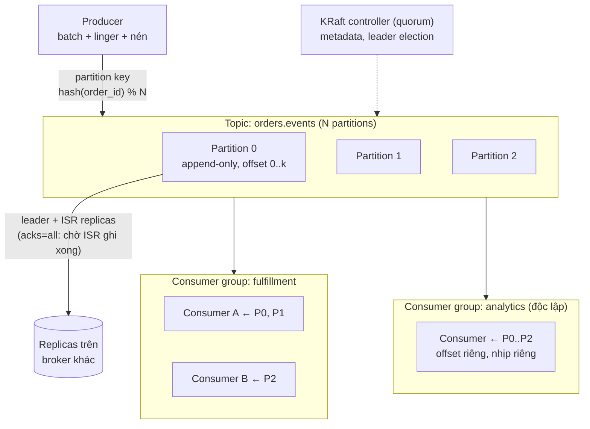

+++
title = "6.5. Kafka — distributed log cho sự kiện"
date = "2026-07-13T10:20:00+07:00"
draft = false
tags = ["backend", "system-design"]
series = ["System Design — Tư Duy Thiết Kế Hệ Thống"]
+++

> Vì-sao-tồn-tại và hành trình áp dụng đã kể ở [12.7](/series/system-design/12-evolution/07-kafka-event-driven/). Chương này mổ nội thất: vì sao log lại nhanh đến thế, các đảm bảo thật sự của Kafka nằm ở đâu, và giá vận hành của chúng.

## 1. Problem Statement

Cần một nơi công bố **sự thật đã xảy ra** (order created, payment captured, price changed) sao cho: nhiều hệ tiêu thụ độc lập theo nhịp riêng, hệ đến sau đọc lại được lịch sử, thứ tự trong phạm vi cần thiết được giữ, throughput hàng trăm nghìn–triệu event/giây, và dữ liệu không mất khi máy chết. Không mô hình queue nào thỏa đồng thời các yêu cầu này — cần một mô hình khác: **append-only log phân tán**.

## 2. Tại sao giải pháp này tồn tại

- **Business problem:** dữ liệu hành vi/sự kiện trở thành tài sản (analytics, ML, audit) — "đã tiêu thụ là biến mất" của queue truyền thống vứt tài sản đó đi.
- **Technical problem:** tích hợp N producer × M consumer điểm-nối-điểm = N×M đường ống ([12.7 §1](/series/system-design/12-evolution/07-kafka-event-driven/)); cần một trục trung tâm mà hai phía không biết nhau.
- **Scale problem:** LinkedIn sinh ra nó vì không broker per-message nào chịu nổi luồng event của họ — bài toán throughput 2 bậc trên RabbitMQ.

## 3. First Principles

**Toàn bộ Kafka đứng trên một quan sát vật lý: ghi/đọc TUẦN TỰ trên disk nhanh gần bằng RAM** (disk chỉ chậm ở *random* access; sequential write trên NVMe đạt GB/s). Vậy: đừng track từng message (random access vào trạng thái) — chỉ **append vào file và cho consumer tự đọc theo offset** (sequential). Cộng zero-copy (`sendfile` — dữ liệu đi thẳng page cache → network card, không qua user space) và batch + nén theo khối: một broker tầm thường đẩy hàng trăm MB/s. Sự "thần kỳ" của Kafka không phải thuật toán cao siêu — là *tôn trọng triệt để cấu trúc chi phí của phần cứng*.

**"Dumb broker, smart consumer" — hệ quả trực tiếp:** broker chỉ là log + index theo offset; **consumer tự giữ con trỏ đọc (offset)**. Từ đây suy ra mọi tính chất đặc trưng:

- Thêm consumer group mới = thêm một con trỏ — chi phí ~0 cho broker → *nhiều bên đọc độc lập miễn phí*.
- Replay = đặt lại con trỏ → *du hành thời gian miễn phí* (trong retention).
- Backlog = con trỏ tụt lại — broker **không hề hấn** (khác RabbitMQ nơi backlog đè broker) → lag là bệnh của consumer, đo ở consumer ([13.3 — Kafka lag](/series/system-design/13-production-failure-cases/03-messaging-failures/)).
- Nhưng: ngữ nghĩa việc (per-message retry, DLQ, priority) *không có sẵn* — phải tự xây bằng topic phụ. Kafka và RabbitMQ không phải đối thủ — chúng là hai mô hình cho hai bài toán ([6.4 §3](/series/system-design/06-communication/04-rabbitmq/)).

**Thứ tự — hợp đồng chính xác, không hơn không kém:** chỉ đảm bảo **trong một partition**. Partition key vì thế là quyết định thiết kế số 1 của mỗi topic: mọi event cùng thực thể (order_id) vào cùng partition → có thứ tự với nhau; giữa các thực thể — không, và không nên cần ([12.7 §3](/series/system-design/12-evolution/07-kafka-event-driven/)). Cần thứ tự *toàn cục*? Một partition duy nhất — và từ bỏ song song: hợp đồng rất thẳng thắn.

**Giả định ngầm:** consumer chịu được at-least-once + out-of-order giữa các key; dung lượng disk cho retention là chấp nhận được; tổ chức đủ trưởng thành nuôi (hoặc thuê) một hệ phân tán stateful nghiêm túc.

## 4. Internal Architecture

- **Đường bền của một event:** producer `acks=all` + `min.insync.replicas=2` → event nằm trên ≥2 broker mới được xác nhận — leader chết không mất ([4.2 — semi-sync](/series/system-design/04-distributed-systems/02-replication-consistency/); toàn bộ máy móc leader/ISR/controller là [4.3](/series/system-design/04-distributed-systems/03-consensus-quorum-leader-election/) bằng xương thịt). `acks=1` nhanh hơn và mất được — chọn theo loại dữ liệu, per-topic.
- **Consumer group & rebalance:** partition chia cho các consumer trong group; **số consumer hoạt động tối đa = số partition** (trần song song — chọn số partition có dư địa từ đầu, giảm không được); thành viên vào/ra → rebalance (cả group khựng — churn liên tục là bệnh, [13.3](/series/system-design/13-production-failure-cases/03-messaging-failures/)).
- **Hai loại retention:** theo thời gian/dung lượng (log cắt đuôi — 7–30 ngày cho event thường) và **compacted topic** (giữ bản ghi *mới nhất mỗi key* — thành một "bảng khóa-giá trị dạng log", nền của changelog CDC và state store Kafka Streams: đây là lúc ranh giới log/database bắt đầu nhòe một cách hữu ích).
- **Exactly-once:** trong phạm vi Kafka→Kafka (idempotent producer + transactions) là thật; **end-to-end với side effect ngoài vẫn là at-least-once + idempotency** — đừng để chữ "exactly-once" trên slide ru ngủ ([13.3 — duplication](/series/system-design/13-production-failure-cases/03-messaging-failures/)).
- **Con số định hướng:** một broker tốt: hàng trăm MB/s, hàng trăm nghìn–triệu msg/s (message nhỏ, batch tốt); latency end-to-end vài ms–vài chục ms (tăng theo `linger.ms` — [1.3 batching trade-off](/series/system-design/01-foundations/03-throughput-latency/)); cụm 3–6 broker gánh được hầu hết công ty không-phải-FAANG.

## 5. Trade-off

| Được | Giá |
|---|---|
| Throughput 1–2 bậc trên smart broker; backlog vô hại cho broker | Ngữ nghĩa việc (retry/DLQ/priority) tự xây bằng topic phụ + kỷ luật |
| Nhiều consumer độc lập + replay + retention: sự kiện thành tài sản | Disk cho retention; quản trị vòng đời topic thành công việc thật |
| Thứ tự per-key qua partition | Partition key sai = [hot partition](/series/system-design/13-production-failure-cases/02-database-failures/) + mất thứ tự nơi cần; số partition là cam kết sớm khó sửa |
| Durability cấu hình được đến mức rất mạnh (`acks=all`) | Cấu hình durability *có thể* bị vặn yếu âm thầm — phải audit (`acks=1`, `min.insync=1` là mất-được-dữ-liệu-khi-lệch-pha) |
| Nền cho cả hệ sinh thái: CDC (Debezium), stream processing, event sourcing | Một hệ phân tán stateful nghiêm túc nữa: vận hành là nghề riêng ([12.7 §5](/series/system-design/12-evolution/07-kafka-event-driven/)) |

## 6. Production Considerations

- **Metric hạng nhất:** consumer lag theo group *và partition* + đạo hàm của nó ([13.3](/series/system-design/13-production-failure-cases/03-messaging-failures/)); under-replicated partitions & ISR shrink (còi báo cụm ốm); controller/leader election rate ([13.4](/series/system-design/13-production-failure-cases/04-distributed-failures/)); disk theo topic; produce/fetch p99 theo broker.
- **Schema Registry + quy tắc tương thích là một nửa của Kafka trong tổ chức** — event là API công khai; không kỷ luật schema, hệ event chết trong 6 tháng vì "ai đó đổi field" ([12.7 §3](/series/system-design/12-evolution/07-kafka-event-driven/)).
- **Quản trị topic như tài sản:** đặt tên chuẩn, owner, retention có lý do, ACL — "ai được ghi topic này" là câu hỏi security thật ([Phần 11](/series/system-design/11-security/00-tong-quan/)).
- Retry/DLQ pattern chuẩn hóa toàn công ty: retry topic phân tầng (`orders.retry.5m`, `.1h`) + DLQ topic + dashboard — một khuôn, mọi team dùng chung.
- Managed (MSK, Confluent) trừ khi vận hành Kafka *là* năng lực cạnh tranh của bạn; và kể cả managed — bài lag, partition key, schema vẫn là của bạn.

## 7. Best Practices

- Event **mang đủ ngữ cảnh** (event-carried state) — consumer không phải gọi ngược hỏi thêm ([12.7 — anti-coupling cửa sau](/series/system-design/12-evolution/07-kafka-event-driven/)).
- Partition key theo thực thể nghiệp vụ; kiểm tra phân bố key trên dữ liệu thật *trước* khi chốt ([13.2 — hot partition §phòng](/series/system-design/13-production-failure-cases/02-database-failures/)).
- Producer: `acks=all` + idempotent producer làm mặc định cho dữ liệu nghiệp vụ; `linger.ms` 5–20ms mua throughput bằng latency có ý thức.
- Consumer: xử lý theo batch, commit offset **sau** side effect, thiết kế chịu out-of-order và duplicate ([13.3](/series/system-design/13-production-failure-cases/03-messaging-failures/)); một consumer chỉ làm một việc — đừng nhét 5 nghiệp vụ vào một consumer rồi retry cả cụm vì một cái fail.
- Nguồn phát event từ DB nghiệp vụ: **luôn qua outbox/CDC** ([6.8](/series/system-design/06-communication/08-outbox/)) — không bao giờ dual-write.

## 8. Anti-patterns

- **Dùng Kafka làm work queue thuần** cho tải nhỏ cần per-message retry/priority — mặc đồ giáp đi mua rau; RabbitMQ/Redis-queue đúng cỡ hơn ([6.4](/series/system-design/06-communication/04-rabbitmq/)).
- **Topic explosion:** mỗi loại message nhỏ một topic × mỗi môi trường × mỗi team = nghìn topic không owner — quản trị chết trước hệ thống.
- **Partition key = null/random cho topic cần thứ tự** — thứ tự biến mất âm thầm, bug chỉ hiện khi race.
- **Consumer xử lý 30s một message với `max.poll.interval` mặc định** — bị đá khỏi group → rebalance → càng chậm → vòng xoáy ([13.3](/series/system-design/13-production-failure-cases/03-messaging-failures/)).
- **Coi Kafka là database nguồn sự thật** khi chưa xây đủ móng (schema kỷ luật, compaction đúng, quy trình replay) — event sourcing là cam kết kiến trúc lớn, không phải hệ quả miễn phí của việc có Kafka ([12.8 — ghi chú ES](/series/system-design/12-evolution/08-cqrs/)).
- **Bật một cụm Kafka vì "sau này kiểu gì cũng cần"** — [12 bài học 1](/series/system-design/12-evolution/00-tong-quan/): nó là khoản nợ vận hành lớn nhất trong các lựa chọn messaging.

## 9. Khi nào KHÔNG nên dùng

- **Task queue cỡ vừa trở xuống:** Redis-queue/RabbitMQ ([12.3–12.4](/series/system-design/12-evolution/03-background-worker/)) — đầy đủ ngữ nghĩa việc, rẻ hơn nhiều lần.
- **Chưa có consumer thứ hai và không cần replay:** một queue là đủ; Kafka mua tương lai chưa chắc đến bằng chi phí hiện tại chắc chắn.
- **Request/response latency thấp:** sync call ([6.1](/series/system-design/06-communication/01-rest/)/[6.3](/series/system-design/06-communication/03-grpc/)) — log không phải kênh hỏi-đáp.
- **Message cực to (file, video):** object storage + reference trong event — log không phải chỗ chứa blob.

---

*Tiếp theo: [6.6. Event-driven Architecture](/series/system-design/06-communication/06-event-driven/)*
