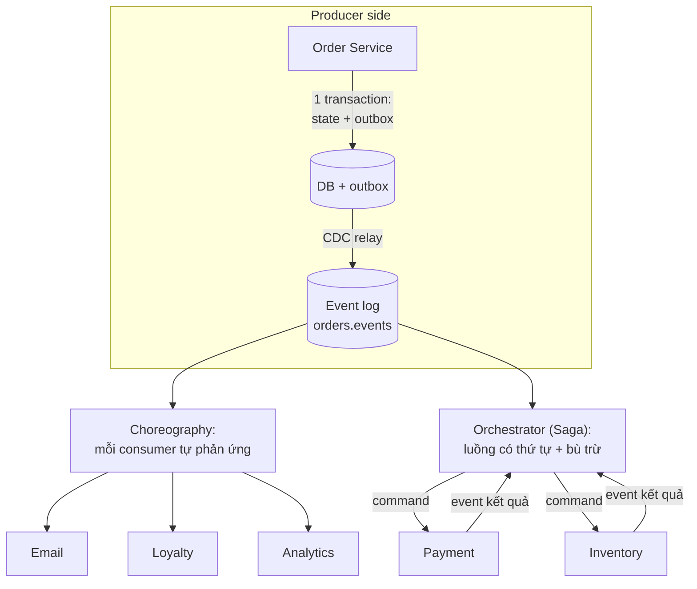

+++
title = "6.6. Event-driven Architecture — nghĩ bằng sự kiện"
date = "2026-07-13T10:30:00+07:00"
draft = false
tags = ["backend", "system-design"]
series = ["System Design — Tư Duy Thiết Kế Hệ Thống"]
+++

> Kafka ([6.5](/series/system-design/06-communication/05-kafka/)) là công cụ; event-driven là **cách nghĩ**. Chương này về cách nghĩ — phần khó hơn và ít được dạy hơn.

## 1. Problem Statement

Hệ nhiều service trưởng thành đối mặt một mâu thuẫn: nghiệp vụ đòi *phản ứng dây chuyền* (đơn tạo → trừ kho, cộng điểm, gửi mail, tính hoa hồng, cảnh báo fraud...) trong khi kiến trúc đòi *các phần không dính nhau*. Orchestration bằng lời gọi trực tiếp thỏa vế một, phá vế hai: service "đầu chuỗi" phải biết và sống chết cùng mọi service cuối chuỗi ([12.7 §1](/series/system-design/12-evolution/07-kafka-event-driven/)). Event-driven giải mâu thuẫn bằng cách đảo chủ ngữ: thay vì *A bảo B làm*, **A công bố điều đã xảy ra; B tự quyết định phản ứng.**

## 2. Tại sao giải pháp này tồn tại

- **Business problem:** tốc độ thêm nghiệp vụ phản ứng ("khi X xảy ra thì làm Y") phải độc lập với hệ đang phát ra X — mỗi ý tưởng mới không thể là một PR vào service lõi.
- **Technical problem:** đảo hướng phụ thuộc — producer không phụ thuộc consumer — là cách duy nhất làm coupling tích hợp ngừng tăng theo N×M.
- **Reliability problem:** chuỗi sync = availability nhân tích các thừa số ([1.2](/series/system-design/01-foundations/02-sla-slo-sli/)); chuỗi event = mỗi mắt xích fail độc lập, backlog chờ thay vì sập lan ([13.4](/series/system-design/13-production-failure-cases/04-distributed-failures/)).

## 3. First Principles

**Event là sự thật quá khứ, bất biến, đặt tên ở thì đã xảy ra:** `OrderPlaced`, không phải `PlaceOrder`. Phân loại đúng ba khái niệm hay bị trộn — trộn chúng là nguồn của 80% thiết kế event tồi:

| | Command | Event | Query |
|---|---|---|---|
| Ngữ nghĩa | "Hãy làm X" — yêu cầu, có thể bị từ chối | "X đã xảy ra" — sự thật, không cãi được | "Cho tôi biết X" |
| Hướng | Gửi đến *một* nơi có thẩm quyền | Công bố cho *bất kỳ ai* quan tâm | Hỏi nơi giữ dữ liệu |
| Kênh đúng | Sync call hoặc work queue ([6.1](/series/system-design/06-communication/01-rest/)/[6.3](/series/system-design/06-communication/03-grpc/)/[6.4](/series/system-design/06-communication/04-rabbitmq/)) | Log ([6.5](/series/system-design/06-communication/05-kafka/)) | Sync call / read model ([12.8](/series/system-design/12-evolution/08-cqrs/)) |
| Người quyết định hành động | Người gửi | **Người nhận** | — |

Dòng cuối là linh hồn: gửi `SendWelcomeEmail` lên Kafka cho "EmailService" tiêu thụ *không phải* event-driven — đó là command đội lốt event, coupling còn nguyên (producer vẫn quyết định việc của consumer), chỉ mất đi sự rõ ràng của lời gọi trực tiếp.

**Hai mức độ trưởng thành của event:**

1. **Notification** ("đơn 123 đổi trạng thái, tự đi mà hỏi"): mỏng, nhưng consumer phải gọi ngược → coupling cửa sau + thundering herd vào producer.
2. **Event-carried state transfer** (event mang đủ ngữ cảnh để consumer hành động không cần hỏi lại): tự trị thật sự — đánh đổi bằng payload to và "schema là API" ([6.5 §6](/series/system-design/06-communication/05-kafka/)).

Chọn mặc định mức 2; mức 1 chỉ khi payload quá lớn hoặc dữ liệu quá nhạy cảm để phát tán.

**Choreography vs Orchestration — quyết định cấu trúc trung tâm:** choreography (các service phản ứng event của nhau, không nhạc trưởng) tối đa tính mở nhưng *luồng nghiệp vụ không tồn tại ở đâu cả trong code* — nó chỉ tồn tại trong hành vi tổng hợp; orchestration (một điều phối viên gọi từng bước) nhìn được, debug được, nhưng nhạc trưởng thành điểm coupling + SPOF logic. Lời khuyên thực chiến: **luồng có ràng buộc thứ tự và bù trừ (tiền bạc) → orchestration ([Saga, 6.7](/series/system-design/06-communication/07-saga/)); phản ứng phụ độc lập (email, analytics, loyalty) → choreography.** Đa số hệ tốt dùng cả hai đúng chỗ.

**Nếu không dùng thì sao?** Hoàn toàn hợp lệ ở quy mô vừa: monolith + worker ([12.3](/series/system-design/12-evolution/03-background-worker/)) *chính là* event-driven thu nhỏ trong một process. Chỉ khi số cặp tích hợp bùng nổ mới cần trục event ([12.7 — tín hiệu](/series/system-design/12-evolution/07-kafka-event-driven/)).

## 4. Internal Architecture — các pattern lắp ghép

- **Móng bắt buộc:** outbox ([6.8](/series/system-design/06-communication/08-outbox/)) ở mọi producer; idempotency + chịu out-of-order ở mọi consumer ([13.3](/series/system-design/13-production-failure-cases/03-messaging-failures/)). Không móng — mọi tầng trên là lâu đài cát.
- **Consumer như state machine:** mỗi consumer giữ trạng thái riêng của nó về thực thể, event đến (có thể sớm, muộn, trùng) là *input chuyển trạng thái* — nghĩ như vậy tự nhiên xử lý được `OrderCancelled` đến trước `OrderCreated` (ghi nhận cancel, chờ create rồi vô hiệu) thay vì crash.
- **Failure flow đặc trưng của choreography:** một consumer chết → phản ứng *của nó* dừng, phần còn lại chạy tiếp — cô lập đẹp; nhưng "đơn đã tạo mà mãi không có email" là lỗi *vô hình* nếu không giám sát từng consumer theo lag/SLA riêng ([13.3](/series/system-design/13-production-failure-cases/03-messaging-failures/)).
- **Quan sát luồng:** trace context truyền *trong header event* ([Phần 10](/series/system-design/10-observability/00-tong-quan/)) + **event catalog** (tài liệu sống: topic nào, schema gì, ai phát, ai nghe) — câu trả lời cho "chuyện gì xảy ra sau khi đơn tạo?" phải tra được trong 1 phút, không phải khảo cổ 1 ngày ([12.7 — trade-off suy luận nhân quả](/series/system-design/12-evolution/07-kafka-event-driven/)).

## 5. Trade-off

| Được | Giá |
|---|---|
| Thêm phản ứng mới không chạm producer — tốc độ tiến hóa | Luồng nghiệp vụ tan vào N consumer — cần catalog + tracing để "nhìn thấy" hệ thống |
| Cô lập lỗi: mắt xích chết = backlog, không phải sập lan | Eventual consistency lan khắp nơi — UI/UX/CS phải thiết kế quanh trạng thái trung gian ([12.4 §4](/series/system-design/12-evolution/04-message-queue/)) |
| Sự kiện thành tài sản (replay, audit, ML) | Kỷ luật schema + versioning vĩnh viễn; sai một field là sự cố ở N consumer |
| Load leveling tự nhiên | Debug phân tán: "vì sao email không đến" đi qua 4 hệ thống |
| Phù hợp tự nhiên với domain phản-ứng (thương mại, IoT, tài chính) | Không phù hợp luồng hỏi-đáp — ép vào là vòng vèo vô nghĩa |

## 6. Production Considerations

- **SLA độ tươi per-consumer** ("email trong 2 phút, analytics trong 1 giờ") + alert theo đúng SLA đó — một con số lag chung vô nghĩa ([13.3](/series/system-design/13-production-failure-cases/03-messaging-failures/)).
- **Đối soát nghiệp vụ định kỳ** (số đơn vs số email vs số điểm cộng) làm lưới cuối bắt event rơi/ăn trùng — hệ event không đối soát là hệ tin vào may mắn.
- **Quy trình schema change chuẩn:** thêm field optional → tự do; đổi/xóa → version topic mới + chạy song song + migrate consumer ([6.5 §6](/series/system-design/06-communication/05-kafka/)).
- **Replay là quy trình có kịch bản, không phải nút bấm liều:** consumer nào an toàn replay (idempotent thuần)? consumer nào có side effect ngoài (email — replay là gửi lại nghìn mail!)? đánh dấu rõ từng consumer.
- Dead-letter cho event không xử lý được + chủ sở hữu — như mọi hệ messaging ([6.4 §6](/series/system-design/06-communication/04-rabbitmq/)).

## 7. Best Practices

- Thiết kế event từ **ngôn ngữ domain** (DDD: domain event) cùng chuyên gia nghiệp vụ — `OrderPlaced`, `PaymentCaptured` là từ vựng của business, không phải của bảng DB.
- Một event = một sự thật trọn vẹn; đừng phát `OrderUpdated` chung chung với diff — consumer không thể phản ứng có nghĩa với "cái gì đó đã đổi".
- Envelope chuẩn toàn công ty: event_id (dedupe), occurred_at, trace context, schema version, entity id + version (phát hiện out-of-order).
- Bắt đầu bằng **một** luồng nghiệp vụ event-hóa trọn vẹn (đơn hàng) làm mẫu chuẩn — thay vì event-hóa 20% của mọi luồng.
- Giữ song song cả sync: luồng cần câu trả lời ngay vẫn là call ([README — quy tắc ba công cụ](/series/system-design/06-communication/00-tong-quan/)); event-driven là *thêm một chiều*, không phải thay thế chiều cũ.

## 8. Anti-patterns

- **Command đội lốt event** (`SendEmailRequested` trên Kafka cho một consumer định sẵn) — coupling nguyên vẹn, độ rõ ràng mất đi.
- **Event từ ruột DB** (`RowUpdated` với 40 cột) — phát tán schema nội bộ ra toàn công ty; đổi cột = sự cố N nơi ([12.7 §7](/series/system-design/12-evolution/07-kafka-event-driven/)).
- **Chuỗi event dây chuyền ngầm 8 tầng** (A phát → B phản ứng phát tiếp → C...) không ai vẽ được toàn cảnh — "distributed spaghetti"; luồng dài có chủ đích phải là Saga có tên ([6.7](/series/system-design/06-communication/07-saga/)).
- **Consumer gọi ngược producer để lấy phần còn thiếu** — notification event + coupling cửa sau; nâng lên event-carried state.
- **Dual-write** (ghi DB rồi publish trực tiếp) — hệ thống nói dối khi crash giữa hai bước; outbox không phải tùy chọn ([6.8](/series/system-design/06-communication/08-outbox/)).
- **Event-driven toàn hệ thống ngày đầu** — trả chi phí nhận thức của kiến trúc phản ứng cho cả những luồng CRUD thẳng tuột.

## 9. Khi nào KHÔNG nên dùng

- **Luồng hỏi-đáp, cần kết quả để đi tiếp:** sync — chấm hết ([12.7 — câu hỏi kiểm tra](/series/system-design/12-evolution/07-kafka-event-driven/)).
- **Hệ nhỏ, một team, một codebase:** worker + queue nội bộ cho đủ 90% lợi ích với 10% chi phí ([12.3](/series/system-design/12-evolution/03-background-worker/)).
- **Domain nghèo phản ứng dây chuyền** (CRUD tool nội bộ, CMS): không có "khi X thì Y" tự nhiên — event-hóa là nghi thức rỗng.
- **Tổ chức chưa có kỷ luật schema/observability:** event-driven khuếch đại cả kỷ luật lẫn sự thiếu kỷ luật — vá móng trước, xây tháp sau.

---

*Tiếp theo: [6.7. Saga](/series/system-design/06-communication/07-saga/)*
