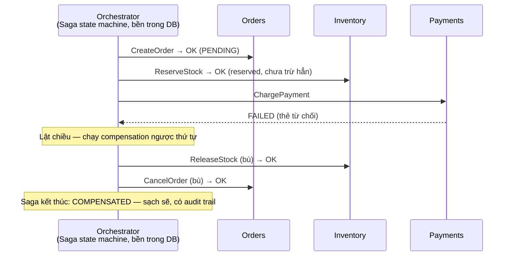

+++
title = "6.7. Saga — transaction khi không còn transaction"
date = "2026-07-13T10:40:00+07:00"
draft = false
tags = ["backend", "system-design"]
series = ["System Design — Tư Duy Thiết Kế Hệ Thống"]
+++

## 1. Problem Statement

Đặt hàng chạm ba service, ba database: Orders (tạo đơn), Inventory (trừ kho), Payments (trừ tiền). Trong monolith, đây là một transaction ACID — ba thao tác cùng thành công hoặc cùng biến mất, miễn phí ([12.1](/series/system-design/12-evolution/01-monolith-postgresql/)). Tách service xong ([12.6](/series/system-design/12-evolution/06-microservices/)), ACID xuyên ranh giới **không còn tồn tại**: kho trừ rồi, tiền fail — ai trả kho về? Hệ thống kẹt ở trạng thái nửa vời mà không cơ chế nào tự dọn.

Phản xạ đầu tiên của người mới là đi tìm "distributed transaction" (2PC/XA). Phản xạ đó cần được chặn lại bằng hiểu biết: 2PC yêu cầu mọi participant **khóa tài nguyên và chờ** coordinator qua nhiều round-trip — coordinator chết là mọi bên ôm khóa đứng hình ([blocking protocol — vi phạm bài học 13.2 pool](/series/system-design/13-production-failure-cases/02-database-failures/)); throughput sụp theo participant chậm nhất; và đa số hệ hiện đại (cùng mọi API bên thứ ba) *không tham gia XA*. 2PC hợp lệ trong hệ sinh thái đồng nhất khép kín; trên microservices heterogeneous — thực tế ngành đã bỏ phiếu bằng chân.

**Saga là câu trả lời còn lại: chuỗi transaction cục bộ + hành động bù (compensation).** Mỗi bước commit *thật* vào DB của mình; nếu bước sau fail, chạy ngược các hành động bù (hoàn kho, hoàn tiền) để đưa hệ về trạng thái *tương đương* ban đầu.

## 2. Tại sao giải pháp này tồn tại

- **Business problem:** nghiệp vụ đa bước xuyên hệ thống (đặt hàng, chuyển tiền liên ngân hàng, đặt combo vé máy bay + khách sạn) phải hoặc hoàn tất trọn vẹn hoặc để lại dấu vết sạch sẽ — "kẹt giữa chừng" là mất tiền và mất niềm tin.
- **Technical problem:** không thể có atomic commit rẻ xuyên N hệ tự trị — đó là hệ quả của tự trị, không phải thiếu sót công nghệ.
- **Reliability problem:** mọi bước *sẽ* fail vào lúc nào đó ([Phần 13](/series/system-design/13-production-failure-cases/00-tong-quan/)) — cần con đường lùi được *thiết kế trước*, không phải đối soát tay lúc 3 giờ sáng.

## 3. First Principles

**Saga đổi Isolation lấy Availability — hiểu rõ mình đã bán gì.** ACID có bốn chữ; Saga giữ A-C-D *theo từng bước* nhưng **mất chữ I toàn cục**: trạng thái trung gian (đơn tạo rồi, tiền chưa trừ) **nhìn thấy được** bởi phần còn lại của hệ thống. Hệ quả không tránh được:

- Phải định nghĩa và xử lý các trạng thái trung gian như trạng thái nghiệp vụ hạng nhất (`PENDING_PAYMENT`, `COMPENSATING`) — UI, CS, báo cáo đều thấy chúng.
- Hai saga song song đan xen được vào nhau (cùng trừ một kho) — các "biện pháp isolation nghèo" phải bù: semantic lock (đánh dấu bản ghi "đang trong saga"), reserve thay vì trừ thẳng ([4.1 §7 — thiết kế né tranh chấp](/series/system-design/04-distributed-systems/01-cap-pacelc/)).

**Compensation ≠ Rollback — khác biệt triết học có hệ quả kỹ thuật.** Rollback là *xóa quá khứ* (undo vật lý); compensation là *hành động nghiệp vụ mới đảo hiệu ứng* — `RefundPayment` chứ không phải "xóa bản ghi payment". Vì quá khứ đã bị nhìn thấy (email đã gửi, tiền đã trừ thật ở ngân hàng), chỉ có thể *bù*, không thể *chưa-từng-xảy-ra*. Hệ quả: (1) mọi bước phải có compensation **được thiết kế cùng lúc với chính nó** — nghĩ ra sau là nghĩ không ra; (2) có bước **không bù được** (gửi email, bắn hàng đã giao) → xếp các bước không-bù-được vào **cuối saga** (pivot point — qua điểm này chỉ tiến, không lùi).

**Mọi bước và mọi compensation phải idempotent + saga phải retry được** — vì hạ tầng bên dưới là at-least-once ([13.3](/series/system-design/13-production-failure-cases/03-messaging-failures/)); compensation cũng fail được và cũng cần retry. Saga không idempotent là saga tự tạo thêm rác khi dọn rác.

## 4. Internal Architecture — hai kiểu điều phối

**Orchestration:** một điều phối viên giữ state machine của saga (bền trong DB — orchestrator chết, tỉnh dậy đọc state đi tiếp), gửi command từng bước, nhận kết quả, quyết tiến hay lùi. Luồng nhìn được ở *một chỗ*, timeout/retry per-step tập trung, dễ vận hành — đổi bằng một thành phần trung tâm + coupling nhẹ về phía orchestrator ([6.6 — choreography vs orchestration](/series/system-design/06-communication/06-event-driven/)).

**Choreography:** không nhạc trưởng — Orders phát `OrderCreated`, Inventory nghe và phát `StockReserved`, Payments nghe và phát `PaymentFailed`, Inventory nghe *cái đó* mà tự release... Ít thành phần hơn, tự trị hơn — nhưng luồng và **đặc biệt là đường lùi** tan vào N consumer: thêm một bước là sửa vài service, không ai vẽ nổi sơ đồ compensation đầy đủ sau 2 năm.

**Quy tắc chọn thực chiến:** saga ≤ 3 bước, đường lùi đơn giản → choreography được; saga có tiền bạc, ≥ 3 bước, cần nhìn thấy trạng thái từng giao dịch (CS hỏi "đơn 123 kẹt ở đâu?") → **orchestration** — và đó là đa số saga nghiêm túc. Nền tảng workflow bền (Temporal, AWS Step Functions) là orchestrator công nghiệp hóa: code luồng như code thường, engine lo state/retry/timer — đáng cân nhắc mạnh trước khi tự viết state machine.

- **Kết nối với móng:** mỗi bước ghi DB cục bộ + phát kết quả **qua outbox** ([6.8](/series/system-design/06-communication/08-outbox/)) — saga đứng trên outbox; timeout mỗi bước là một loại kết quả (coi như fail → bù), không phải sự im lặng vô hạn.

## 5. Trade-off

| Được | Giá |
|---|---|
| Nghiệp vụ đa-service nhất quán *cuối cùng*, có đường lùi thiết kế sẵn | Mất isolation toàn cục — trạng thái trung gian lộ, saga đan xen phải xử lý |
| Không khóa tài nguyên xuyên hệ — throughput và availability giữ nguyên | Mỗi bước phải nghĩ compensation — chi phí thiết kế nghiệp vụ thật (câu hỏi cho product: "hoàn thế nào?") |
| Chịu lỗi từng phần: bước fail → bù, không kẹt | Nhiều trạng thái hơn, nhiều code hơn — một luồng thành state machine |
| Audit trail tự nhiên (mỗi bước một bản ghi) | Debug xuyên N service khi saga kẹt — cần tracing + saga id xuyên suốt ([Phần 10](/series/system-design/10-observability/00-tong-quan/)) |
| Orchestration: nhìn được, vận hành được | Orchestrator là logic tập trung — giữ nó *mỏng* (điều phối, không nghiệp vụ) kẻo thành God Service |

## 6. Production Considerations

- **Dashboard saga theo trạng thái:** đang chạy / hoàn tất / **đang bù / KẸT** — số saga kẹt (quá timeout ở một bước, compensation fail liên tục) là metric page-người; mỗi saga kẹt là một khách hàng đang ở trạng thái lơ lửng.
- **Saga id truyền xuyên suốt** mọi command/event/log của các bước — điều tra "đơn 123 sao rồi" là một câu query, không phải cuộc họp.
- **Alert compensation rate:** tỷ lệ saga phải bù tăng đột biến = có bước đang fail hàng loạt (thẻ từ chối tăng? kho lỗi?) — tín hiệu nghiệp vụ, không chỉ kỹ thuật.
- **Quy trình cho saga không tự lùi được:** compensation fail quá N lần → DLQ + can thiệp người ([6.4 §6](/series/system-design/06-communication/04-rabbitmq/)) + công cụ cho ops "ép" saga tiến/lùi có kiểm soát.
- Test: bộ test bắt buộc gồm fail *ở từng bước* + crash orchestrator giữa chừng + duplicate message ở từng bước — saga chỉ được tin sau khi từng đường lùi đã chạy trong test.

## 7. Best Practices

- **Thiết kế để né saga trước khi thiết kế saga:** vẽ lại ranh giới service sao cho nghiệp vụ transactional nằm gọn trong một service ([12.5 — gói nghiệp vụ vào một module](/series/system-design/12-evolution/05-modular-monolith/), [12.6 §6 — 70% feature sửa 3 service là ranh giới sai](/series/system-design/12-evolution/06-microservices/)) — saga tốt nhất là saga không phải viết.
- **Reserve/confirm thay vì mutate thẳng** ở các bước giữa: `ReserveStock` (bù = release, rẻ và an toàn) tốt hơn `DeductStock` (bù = cộng lại — race với người mua khác) — mẫu hai pha nghiệp vụ này giảm hẳn độ khó của compensation.
- Bước không-bù-được (thông báo, giao hàng, ghi sổ bên thứ ba) đặt **cuối cùng**, sau pivot point.
- Timeout mỗi bước rõ ràng và coi timeout là fail ([13.5 — 3rd party](/series/system-design/13-production-failure-cases/05-infrastructure-failures/)); tổng thời gian saga có trần — saga sống 7 ngày là backlog nghiệp vụ, không phải kiên nhẫn.
- Idempotency key = saga_id + step_id cho mọi command — chuẩn hóa trong SDK.

## 8. Anti-patterns

- **Saga không compensation** ("bước sau chắc không fail đâu") — chính là hệ thống kẹt nửa vời mà saga sinh ra để tránh, cộng thêm ảo giác an toàn.
- **Compensation nghĩ ra sau, viết sau, không test** — đường lùi chỉ chạy lần đầu trong sự cố thật = không có đường lùi.
- **2PC/XA xuyên microservices heterogeneous** — blocking + coordinator SPOF + một nửa participant không hỗ trợ; đi lại vết xe ngành đã bỏ.
- **Orchestrator phình thành God Service** chứa business rule của mọi bước — điều phối viên biết *thứ tự*, service biết *nghiệp vụ*; lẫn hai vai là quay về monolith phân tán ([12.6 §7](/series/system-design/12-evolution/06-microservices/)).
- **Saga cho thao tác một-service** — nhìn đâu cũng thấy saga là bệnh nghề nghiệp; transaction thường vẫn là công cụ đúng khi ở trong một DB.
- **Giấu trạng thái trung gian khỏi UI/CS** — user thấy "thành công" trong khi saga còn 2 bước có thể lùi → hứa trước khi chắc; hiển thị trung thực ("đang xử lý thanh toán") rẻ hơn xin lỗi.

## 9. Khi nào KHÔNG nên dùng

- **Nghiệp vụ nằm trong một database:** transaction ACID — đơn giản hơn, đúng hơn, miễn phí ([12.1](/series/system-design/12-evolution/01-monolith-postgresql/)). Saga là thuế của việc tách service; đừng nộp thuế khi chưa bị đánh.
- **Chuỗi chỉ-tiến không cần lùi** (pipeline enrich dữ liệu, fan-out thông báo): retry đến khi xong ([6.4](/series/system-design/06-communication/04-rabbitmq/)) là đủ — saga thêm bộ máy lùi cho luồng không bao giờ lùi.
- **Luồng cần isolation thật sự** (khớp lệnh tài chính, đấu giá): thiết kế lại để nghiệp vụ đó nằm trong một ranh giới ACID — có những bài toán *không nên* phân tán, và khớp lệnh là ví dụ kinh điển.
- **Team chưa vững messaging + idempotency:** saga đứng trên các móng đó ([6.8](/series/system-design/06-communication/08-outbox/), [13.3](/series/system-design/13-production-failure-cases/03-messaging-failures/)) — xây móng trước.

---

*Tiếp theo: [6.8. Outbox Pattern](/series/system-design/06-communication/08-outbox/)*
