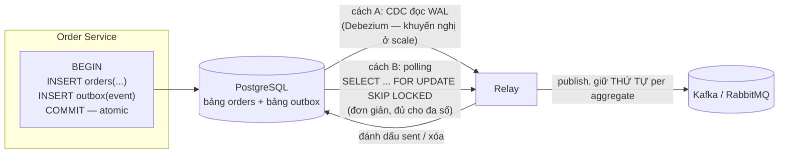

+++
title = "6.8. Outbox Pattern — móng của mọi event đáng tin"
date = "2026-07-13T10:50:00+07:00"
draft = false
tags = ["backend", "system-design"]
series = ["System Design — Tư Duy Thiết Kế Hệ Thống"]
+++

## 1. Problem Statement

Một thao tác nghiệp vụ cần làm **hai việc trên hai hệ thống**: ghi trạng thái vào database *và* thông báo ra ngoài (publish event lên Kafka, enqueue job, gọi webhook). Code ngây thơ:

```
db.commit(order)          // việc 1: thành công
kafka.publish(event)      // việc 2: ...crash ở đây thì sao?
```

Crash giữa hai dòng → **hệ thống nói dối**: đơn tồn tại trong DB nhưng thế giới không bao giờ biết — không email, không trừ kho, không analytics. Đảo thứ tự thì dối chiều ngược lại: event bay đi cho đơn chưa từng commit. Đây là **dual-write problem** — và nó không hiếm: nó xảy ra *mỗi lần* deploy restart process đúng khoảnh khắc đó, mỗi lần Kafka chập chờn đúng lúc DB đã commit. Không thể fix bằng try/catch hay retry — vấn đề là **hai hệ thống không có transaction chung**, về nguyên lý ([4.4 — không có atomic commit giữa hai hệ tự trị rẻ tiền](/series/system-design/04-distributed-systems/04-clock-partition-split-brain/)).

## 2. Tại sao giải pháp này tồn tại

- **Technical problem:** cần atomicity giữa "ghi DB" và "phát tin" mà không có 2PC ([6.7 §1 — vì sao 2PC bị loại](/series/system-design/06-communication/07-saga/)).
- **Reliability problem:** mọi kiến trúc event-driven ([6.6](/series/system-design/06-communication/06-event-driven/)), CQRS ([12.8](/series/system-design/12-evolution/08-cqrs/)), Saga ([6.7](/series/system-design/06-communication/07-saga/)) đứng trên giả định "event phản ánh trung thực trạng thái DB" — dual-write phá giả định đó ngay tầng móng, và mọi thứ bên trên thành lâu đài cát.
- **Business problem:** các ca "ghi rồi mà không thấy gì xảy ra" là loại bug bào mòn niềm tin nhất — hiếm, ngẫu nhiên, không tái hiện được, mỗi lần một khách hàng thật.

## 3. First Principles

**Ý tưởng cốt lõi: biến hai việc trên hai hệ thống thành hai việc trên MỘT hệ thống, rồi để việc thứ hai lan ra sau.** Ghi event vào một bảng `outbox` **trong cùng transaction** với dữ liệu nghiệp vụ — transaction của một DB thì atomic thật:

- Commit thành công → cả trạng thái lẫn "lá thư chưa gửi" cùng tồn tại, bền.
- Crash trước commit → cả hai cùng biến mất — không ai nói dối.

Một tiến trình **relay** đọc bảng outbox và publish ra broker, đánh dấu đã gửi. Relay crash giữa chừng? Lá thư còn trong outbox, lần sau gửi lại — hệ quả tất yếu: **at-least-once, duplicate là hợp đồng** ([13.3](/series/system-design/13-production-failure-cases/03-messaging-failures/)) — nhưng đó là hợp đồng *đã có sẵn* của mọi messaging; outbox không thêm gánh mới, chỉ loại bỏ **mất tin** (điều không chấp nhận được) bằng giá **trùng tin** (điều đã phải xử lý rồi).

**Vì sao không làm ngược — publish trước, ghi DB theo event (listen-to-yourself)?** Được, nhưng đảo nguồn sự thật sang broker — đọc-sau-ghi của chính service thành eventual, đa số hệ nghiệp vụ không chịu nổi điều đó với chính dữ liệu của mình. Outbox giữ DB là nguồn sự thật — bảo thủ đúng chỗ.

**Giả định ngầm:** mọi đường ghi trạng thái *đều đi qua* transaction có outbox — một chỗ ghi tắt (script ops sửa tay, service khác ghi thẳng DB) là một chỗ event câm lặng. Kỷ luật "một cửa ghi" là điều kiện sống của pattern.

## 4. Internal Architecture



**Hai kiểu relay — trade-off thật sự nằm ở đây:**

| | Polling | CDC (Debezium đọc WAL/binlog) |
|---|---|---|
| Cơ chế | Query bảng outbox mỗi X ms | Đọc replication log của DB — thấy INSERT outbox ngay |
| Độ trễ | ~polling interval (100ms–vài giây) | ~ms |
| Tải lên DB | Query lặp liên tục (dịu bằng index + `SKIP LOCKED`) | Gần 0 (đọc log, không query) |
| Vận hành | Vài chục dòng code trong service — ai cũng hiểu | Thêm Kafka Connect/Debezium — một hệ nữa phải nuôi, nhưng chuẩn hóa cho *mọi* service một lần |
| Chọn khi | Ít service, throughput vừa, muốn đơn giản ([12.3–12.5](/series/system-design/12-evolution/03-background-worker/)) | Nhiều service, throughput cao, đã có Kafka ([12.7+](/series/system-design/12-evolution/07-kafka-event-driven/)) |

- **Thứ tự:** relay phải publish **theo thứ tự trong outbox cho cùng aggregate** (sequence number per aggregate_id, partition key = aggregate_id — [6.5 §3](/series/system-design/06-communication/05-kafka/)); relay song song hóa thì song song *giữa* các aggregate, tuần tự *trong* một aggregate.
- **Schema bảng outbox chuẩn:** `id (uuid — làm dedupe key phía consumer), aggregate_type, aggregate_id, event_type, payload (json), created_at, published_at (null = chưa gửi)`.
- **Failure flow:** relay chết → outbox tích lại (đơn thuần là backlog — [13.3](/series/system-design/13-production-failure-cases/03-messaging-failures/)), không mất gì, hồi là bơm tiếp; broker chết → cùng kịch bản; DB chết → không có gì để gửi vì không có gì đã commit — mọi nhánh fail đều rơi về trạng thái an toàn. Đây là vẻ đẹp của pattern: *nó biến bài toán atomicity thành bài toán backlog* — bài dễ hơn hẳn.
- **Dọn dẹp:** bảng outbox là hàng đợi, không phải kho — xóa/archive bản ghi đã publish (partition theo ngày + drop là rẻ nhất — [5.1 §7](/series/system-design/05-data-layer/01-postgresql/)); outbox 50 triệu hàng không dọn là [bloat + hotspot](/series/system-design/13-production-failure-cases/02-database-failures/) tự chế.

## 5. Trade-off

| Được | Giá |
|---|---|
| Loại bỏ dual-write — event và trạng thái không bao giờ lệch nhau | Mỗi thao tác ghi thêm một INSERT (nhẹ — cùng transaction, cùng trang WAL) |
| Mọi nhánh crash rơi về an toàn; sự cố = backlog, không phải mất tin | Độ trễ event: thêm chặng relay (ms với CDC, giây với polling) |
| Audit trail tự nhiên (outbox = nhật ký mọi event đã phát) | Thêm bộ phận chuyển động (relay/Debezium) phải giám sát |
| Nền vững cho Saga/CQRS/event-driven | At-least-once → idempotency consumer bắt buộc (vốn đã bắt buộc) |
| Polling version: vài chục dòng code, không hạ tầng mới | Kỷ luật "một cửa ghi" — mọi đường ghi phải qua transaction có outbox |

## 6. Production Considerations

- **Metric hạng nhất: outbox lag** — tuổi bản ghi chưa publish cũ nhất (`now() - min(created_at) where published_at is null`) + số bản ghi tồn; alert khi tuổi vượt SLA độ tươi của consumer hạ nguồn ([6.6 §6](/series/system-design/06-communication/06-event-driven/)).
- **Relay phải HA nhưng không chạy đôi mù quáng:** hai relay cùng đọc = double publish ồ ạt (hợp đồng cho phép nhưng đừng lạm dụng) — single active qua lease/leader election ([4.3](/series/system-design/04-distributed-systems/03-consensus-quorum-leader-election/)) hoặc `SKIP LOCKED` chia việc an toàn.
- **Đối soát định kỳ:** đếm event published vs bản ghi nghiệp vụ theo cửa sổ thời gian — lưới cuối bắt "đường ghi lậu" không qua outbox.
- CDC route: giám sát connector state + replication slot của PostgreSQL (**slot bị bỏ rơi giữ WAL không cho xóa → đầy disk DB** — sự cố Debezium kinh điển nhất, đáng một dòng runbook riêng).
- Payload event: đủ ngữ cảnh ([6.6 — event-carried state](/series/system-design/06-communication/06-event-driven/)) nhưng đừng nhét blob; tham chiếu object storage cho phần nặng.

## 7. Best Practices

- Gói outbox vào **thư viện/SDK nội bộ**: `repo.save(order, events...)` — một hàm, transaction + outbox tự lo; dev nghiệp vụ không phải nhớ ([12.6 — service template](/series/system-design/12-evolution/06-microservices/)).
- `event_id` (uuid của bản ghi outbox) đi trong envelope → consumer dedupe theo nó ([6.6 §7 — envelope chuẩn](/series/system-design/06-communication/06-event-driven/)).
- Ghi event ở **thì nghiệp vụ hoàn tất** (`OrderPlaced` sau mọi validate, trong cùng transaction với INSERT đơn) — outbox không phải chỗ phát ý định.
- Bắt đầu bằng polling relay trong chính service (đơn giản nhất chạy được); nâng lên Debezium khi số service/throughput biện minh — đúng nhịp tiến hóa ([12 bài học 2](/series/system-design/12-evolution/00-tong-quan/)).
- Inbox pattern (bảng `processed_events` phía consumer, check-and-insert cùng transaction xử lý) là mảnh ghép đối xứng — outbox lo phát tin cậy, inbox lo nhận đúng một lần *về hiệu lực* ([13.3 — idempotency](/series/system-design/13-production-failure-cases/03-messaging-failures/)).

## 8. Anti-patterns

- **Dual-write "có retry là ổn mà"** — retry không cứu được crash giữa hai hệ; đây là anti-pattern mà outbox sinh ra để thay thế, và nó vẫn là cách phổ biến nhất ngoài kia.
- **Publish trong transaction** (gọi Kafka giữa BEGIN/COMMIT) — tệ đôi đường: broker chậm giam transaction ([13.2 — pool](/series/system-design/13-production-failure-cases/02-database-failures/)), commit fail sau khi publish đã bay = event ma.
- **Outbox nhưng consumer không idempotent** — chỉ lát một nửa con đường; relay retry sẽ tạo duplicate và duplicate sẽ tạo bug ([13.3](/series/system-design/13-production-failure-cases/03-messaging-failures/)).
- **Đường ghi lậu:** admin tool/script/cron sửa DB không qua outbox — trạng thái đổi, thế giới không biết; chính là bug mà pattern này tồn tại để diệt, quay lại bằng cửa sau.
- **Outbox làm event store vĩnh viễn** — nó là hàng đợi chuyển tiếp; lịch sử dài hạn thuộc về Kafka retention/compacted topic hoặc event store thật ([6.5 §4](/series/system-design/06-communication/05-kafka/)).
- **Bỏ thứ tự khi relay song song** — event `Cancelled` vượt mặt `Created` ngay tại nguồn, mọi consumer lãnh đủ.

## 9. Khi nào KHÔNG nên dùng

- **Không có "việc thứ hai":** ghi DB xong là xong, không ai cần biết — đừng dựng outbox cho tương lai tưởng tượng.
- **Thông báo mất được** (cache warm, metric đếm chơi): publish thẳng, chấp nhận rơi khi crash — outbox cho những gì *không được phép* rơi; phân loại trước, trả tiền sau ([12.4 — Redis-queue vẫn giữ cho việc phù du](/series/system-design/12-evolution/04-message-queue/)).
- **Nguồn sự thật đã là log** (event sourcing thuần — append event *là* thao tác ghi): không còn hai hệ để lệch nhau, outbox thừa.
- **Hai việc cùng một DB** (ghi bảng A + enqueue vào bảng job cùng DB): một transaction thường là đủ — outbox là lời giải cho *hai hệ thống*, đừng dùng khi chỉ có một.

---

*Hết Phần 6. Quay lại [tổng quan phần](/series/system-design/06-communication/00-tong-quan/) hoặc [mục lục chính](/series/system-design/00-muc-luc/).*
