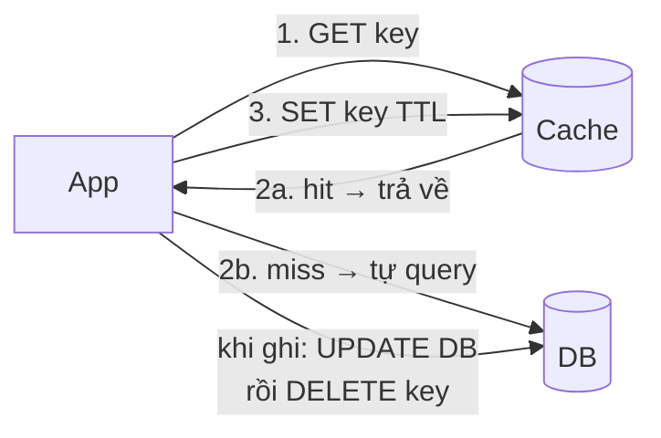

+++
title = "7.1. Bốn chiến lược cache — ai ghi, ai đọc, ai chịu trách nhiệm"
date = "2026-07-13T11:10:00+07:00"
draft = false
tags = ["backend", "system-design"]
series = ["System Design — Tư Duy Thiết Kế Hệ Thống"]
+++

## 1. Problem Statement

"Thêm cache" nghe như một quyết định — thực ra là bốn quyết định độc lập: khi **miss** thì ai đi lấy dữ liệu (app hay cache)? Khi **ghi** thì cache được cập nhật lúc nào (cùng lúc, sau, hay không bao giờ)? Ghi có chờ DB không? Và ai chịu trách nhiệm khi hai bên lệch nhau? Bốn chiến lược kinh điển là bốn tổ hợp câu trả lời — chọn sai tổ hợp cho workload là nguồn của cả bug consistency lẫn hiệu năng tồi.

## 2. Bốn chiến lược — giải phẫu từng cái

### 2.1. Cache Aside (Lazy Loading) — app cầm lái

App tự quản mọi thứ: đọc cache → miss thì đọc DB → tự đổ vào cache; ghi thì cập nhật DB rồi **xóa** key. Cache hoàn toàn thụ động — chỉ là cái tủ.

- **Vì sao là mặc định của ngành (~90% use case, [12.2](/series/system-design/12-evolution/02-them-redis/)):** không cần cache layer thông minh; cache chết app vẫn chạy (chậm); chỉ cache thứ *thật sự được đọc* (lazy — không tốn RAM cho dữ liệu nguội); kiểm soát trọn vẹn trong tay dev.
- **Giá:** logic lặp ở app (giải bằng wrapper `get_or_set`); first-miss chậm; và cửa sổ race kinh điển — chi tiết ở [7.2](/series/system-design/07-caching/02-cache-invalidation/).

### 2.2. Read Through — cache cầm lái chiều đọc

App chỉ nói chuyện với cache; miss thì **cache tự đi lấy** từ DB (qua loader đăng ký trước). Cùng ngữ nghĩa lazy như cache-aside, khác chỗ đứng của logic: nạp dữ liệu nằm *một chỗ* trong cache layer thay vì rải ở mọi call-site.

- **Khi nào hơn cache-aside:** nhiều team/nhiều service cùng đọc một loại dữ liệu — logic nạp thống nhất, single-flight chống stampede cài *một lần* trong loader ([13.1](/series/system-design/13-production-failure-cases/01-caching-failures/)); các thư viện in-process (Caffeine, Guava) làm read-through rất tự nhiên.
- **Giá:** cần cache layer lập trình được; cache thành dependency cứng của đường đọc.

### 2.3. Write Through — ghi xuyên qua cache, đồng bộ

Ghi vào cache → cache ghi DB **trong cùng thao tác** → xong mới trả về. Cache và DB không bao giờ lệch (với key đã ghi); đọc-sau-ghi luôn đúng; cache luôn ấm.

- **Giá:** mỗi ghi trả latency của cả hai hệ; ghi cả những thứ không bao giờ được đọc lại (write-heavy + read-hiếm = RAM đổ sông); và cache giờ nằm trên **đường ghi sống còn** — cache chết là không ghi được, đòi hỏi HA của cache ngang DB.
- Thường đi cặp với read-through trong cùng một layer (một hợp đồng đọc-ghi trọn vẹn qua cache).

### 2.4. Write Back (Write Behind) — ghi vào cache, DB nhận sau

Ghi vào cache → trả về **ngay** → cache flush xuống DB async (gom batch, coalesce nhiều update một key thành một lần ghi).

- **Sức mạnh:** hấp thụ write-burst tốt nhất trong bốn (counter, tracking, session touch — nghìn update/giây gom thành một UPDATE mỗi giây — đúng bài [13.2 hotspot §khắc phục](/series/system-design/13-production-failure-cases/02-database-failures/)); latency ghi = latency RAM.
- **Giá — nặng nhất trong bốn:** cache chết trước khi flush = **mất dữ liệu thật**. Đây không còn là cache nữa — nó là *primary store tạm thời* với durability của RAM. Chỉ hợp lệ cho dữ liệu mất-được-một-cửa-sổ (đã khai báo với business, [5.4 §3 — hợp đồng Redis](/series/system-design/05-data-layer/04-redis/)) hoặc khi cache layer có replication + persistence thật.

## 3. First Principles — nhìn bốn chiến lược bằng một khung

Hai trục quyết định tất cả:

| | **Đọc: ai lo miss?** | **Ghi: cache biết khi nào?** |
|---|---|---|
| Cache Aside | App | Lúc xóa key (invalidate) |
| Read Through | Cache (loader) | Không — cần invalidation riêng |
| Write Through | Cache (loader, thường kèm) | Ngay lập tức, đồng bộ |
| Write Back | Cache | Ngay — và DB mới là kẻ biết sau |

Nhìn theo trục này thấy ngay bản chất: **cache-aside/read-through đánh cược vào TTL + invalidation** (dữ liệu cache *có thể* cũ); **write-through mua consistency bằng latency ghi**; **write-back mua latency ghi bằng durability**. Không có ô nào miễn phí — chỉ có ô khớp workload.

**Nếu không chọn có ý thức thì sao?** Hệ thống vẫn sẽ "chọn" — thường là cache-aside viết vội không xóa key khi ghi (= cache vĩnh viễn cũ đến hết TTL), hoặc write-back tự phát (đệm trong app rồi "flush sau" không ai thiết kế đường crash) — hai dạng nợ âm thầm phổ biến nhất.

## 4. Trade-off tổng hợp

| Chiến lược | Consistency đọc-sau-ghi | Latency ghi | Rủi ro mất dữ liệu | Độ phức tạp | Workload khớp |
|---|---|---|---|---|---|
| Cache Aside | Cửa sổ stale (TTL/race) | Không đổi | Không | Thấp | Read-heavy tổng quát — **mặc định** |
| Read Through | Như aside | Không đổi | Không | Trung bình (cache layer) | Read-heavy, nhiều call-site, cần single-flight tập trung |
| Write Through | Đúng | ×2 hệ thống | Không | Trung bình | Đọc ngay sau ghi thường xuyên; ghi thưa |
| Write Back | Đúng (đọc từ cache) | Nhanh nhất | **Có** — cửa sổ flush | Cao (flush, retry, crash-path) | Write-burst dồn dập, dữ liệu chịu mất cửa sổ nhỏ |

## 5. Production Considerations

- Bốn chiến lược có thể **sống chung trong một hệ** — theo loại dữ liệu, không phải một lựa chọn toàn cục: catalog cache-aside, config read-through, giỏ hàng write-through vào Redis-primary, view counter write-back. Ghi rõ từng loại thuộc chiến lược nào vào ADR.
- Metric chung: hit rate **theo key-pattern** (một con số tổng che mất pattern hỏng), miss latency (chính là latency DB — theo dõi để biết "giá của miss"), với write-back thêm: flush lag + kích thước buffer chưa flush (chính là RPO thực của dữ liệu đó).
- Load test kịch bản mất cache cho mọi chiến lược trừ write-through-HA ([13.1 — avalanche](/series/system-design/13-production-failure-cases/01-caching-failures/)); với write-back: kill -9 node cache và đếm dữ liệu mất — con số đó phải nằm trong hợp đồng đã ký với business.

## 6. Anti-patterns

- **Cache Everything:** cache cả dữ liệu ghi-nhiều-đọc-ít, cả query một-lần — RAM tốn, hit rate loãng, invalidation phình; cache theo bằng chứng truy cập ([12.2 — 20 query nóng](/series/system-design/12-evolution/02-them-redis/)), không theo phản xạ.
- **Update key thay vì delete khi ghi (cache-aside)** — mở cửa race ghi-đè-bằng-dữ-liệu-cũ ([7.2 §3](/series/system-design/07-caching/02-cache-invalidation/)).
- **Write-back tự phát không thiết kế crash-path** — buffer trong app + "flush định kỳ" + không ai hỏi "crash giữa chừng thì sao".
- **Write-through cho log/tracking** — trả ×2 latency cho dữ liệu không ai đọc lại từng bản ghi.
- **Trộn chiến lược trên cùng một key** (chỗ này aside, chỗ kia write-through cho cùng `product:1`) — hai hợp đồng consistency đánh nhau, bug xuất hiện theo thứ tự thao tác.

## 7. Khi nào KHÔNG cần cache

Workload không có locality (quét đều toàn bộ dữ liệu — analytics: việc của [ClickHouse](/series/system-design/05-data-layer/05-clickhouse/), không phải của cache); dữ liệu đổi nhanh hơn được đọc (hit rate sẽ ~0); và hệ chưa có bằng chứng nghẽn đọc — cache thêm vào "cho chắc" là thêm một tầng invalidation phải nuôi cho vấn đề chưa tồn tại ([12.2 — tín hiệu vào](/series/system-design/12-evolution/02-them-redis/): chuyển vì biểu đồ CPU nói vậy, không vì "ai cũng có Redis").

---

*Tiếp theo: [7.2. Cache Invalidation](/series/system-design/07-caching/02-cache-invalidation/)*
