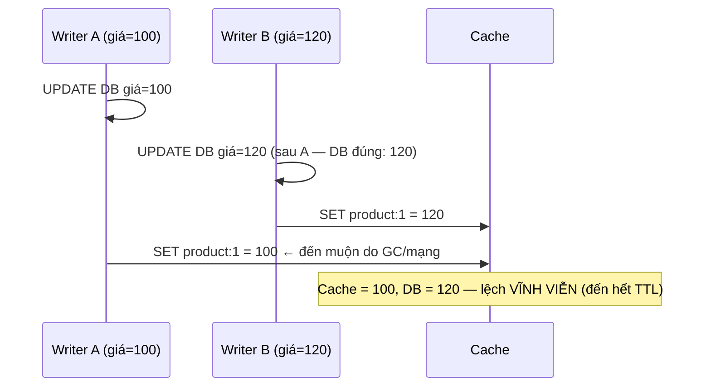

+++
title = "7.2. Cache Invalidation — bài toán khó thứ nhất của khoa học máy tính"
date = "2026-07-13T11:20:00+07:00"
draft = false
tags = ["backend", "system-design"]
series = ["System Design — Tư Duy Thiết Kế Hệ Thống"]
+++

> "There are only two hard things in Computer Science: cache invalidation and naming things." — câu đùa sống lâu vì nó đúng. Chương này giải thích *vì sao* nó khó về nguyên lý, và bộ công cụ thực dụng để sống chung.

## 1. Problem Statement

Nguồn sự thật thay đổi; bản sao trong cache thành nói dối. Câu hỏi: làm bản sao hết nói dối **đúng lúc** (đủ tươi cho nghiệp vụ) với **chi phí chịu được** (không biến mỗi thao tác ghi thành chiến dịch truy quét N tầng cache). Hai đầu của phổ đều dễ: không bao giờ invalidate (cache tĩnh vĩnh viễn) và invalidate mọi thứ mỗi lần ghi (tương đương không có cache). Mọi hệ thật nằm giữa — và khoảng giữa là nơi ở của race condition.

## 2. Vì sao khó về nguyên lý — không phải vì dev lười

Invalidation khó vì nó là **bài toán consistency giữa hai hệ không có transaction chung** ([6.8 — dual-write](/series/system-design/06-communication/08-outbox/), [4.2](/series/system-design/04-distributed-systems/02-replication-consistency/)) cộng thêm ba nhân tố riêng:

1. **Người ghi không biết ai đang cache.** Key `product:1` có thể nằm ở: Redis, local cache của 40 instance, CDN, browser — người UPDATE bảng products không nhìn thấy danh sách đó, và danh sách đó đổi theo giờ.
2. **Suy diễn ngược từ dữ liệu ra key là bài toán phụ thuộc:** đổi giá `product:1` phải giết cả `homepage`, `category:5`, `search:ao-khoac`, `cart-preview` của nghìn user — **dependency graph giữa dữ liệu và mọi chỗ nó xuất hiện**, thứ không ai vẽ đầy đủ và luôn mọc thêm cạnh.
3. **Race condition trong mọi khe hở thời gian** — xem §3, kẻ giết người thầm lặng nhất.

## 3. Giải phẫu các race kinh điển — hiểu một lần, nhận ra mãi mãi

### Race 1 — vì sao DELETE chứ không phải SET khi ghi

Hai writer SET đua nhau, kẻ *chậm* thắng — cache giữ giá trị cũ vô hạn định. **DELETE không có bài này**: xóa là xóa, thứ tự không quan trọng, reader sau tự nạp bản mới. Đây là lý do quy tắc "update DB → delete key" thắng "update DB → set key" dù nghe kém tối ưu hơn.

### Race 2 — cache-aside vẫn còn khe hở (hẹp nhưng có thật)

Reader miss → đọc DB (giá cũ 100) → *ngay lúc đó* writer update DB=120 + delete key (không có gì để xóa) → reader SET key=100. Cache lại cũ đến hết TTL. Khe hở hẹp (đọc-DB-rồi-SET của reader phải vắt qua toàn bộ update của writer) nên xác suất thấp — nhưng nhân với tỷ request/tháng là chuyện *sẽ* xảy ra.

Vá theo mức nghiêm trọng: **TTL ngắn làm lưới an toàn** (sai tối đa X giây — đủ cho 90% dữ liệu); **delayed double delete** (xóa lần hai sau 500ms–1s, quét sạch bản cũ mà reader chậm vừa đặt); hoặc **CAS/version** (SET kèm version của bản ghi, cache từ chối version cũ — đúng tuyệt đối, đắt nhất). Chọn theo giá của sai: giá sản phẩm hiển thị → TTL; số dư hiển thị → version.

### Race 3 — invalidate trước hay sau khi commit DB?

Xóa key **trước** commit: reader chen giữa nạp lại bản *chưa commit rồi bị rollback* — cache chứa dữ liệu chưa từng tồn tại. Xóa key **sau** commit: crash giữa hai bước → DB mới, cache cũ đến hết TTL (chấp nhận được nhờ TTL) — **sau-commit + TTL là lựa chọn đúng**; muốn chặt hơn nữa: đẩy invalidation qua outbox/CDC (§4) để "sau commit" được đảm bảo bởi máy móc thay vì may mắn.

## 4. Hộp công cụ — xếp theo thứ tự nên với tới

**Tầng 1 — TTL + jitter: lưới an toàn phổ quát, không bao giờ bỏ.** Mọi key có TTL ([13.1](/series/system-design/13-production-failure-cases/01-caching-failures/), [5.4 §7](/series/system-design/05-data-layer/04-redis/)); mọi cơ chế tầng trên *có thể* sót — TTL đảm bảo sai số bị chặn trên. Chọn TTL = trả lời câu nghiệp vụ "dữ liệu này được phép cũ tối đa bao lâu?" — 30 giây cho giá, 5 phút cho mô tả, 24h cho ảnh. Không trả lời được câu đó nghĩa là chưa hiểu yêu cầu ([1.1 — NFR đo được](/series/system-design/01-foundations/01-requirements/)).

**Tầng 2 — Delete-on-write:** xóa key trực tiếp liên quan ngay sau commit (race đã mổ ở §3). Rẻ, hiệu quả, phủ "key suy ra thẳng từ bản ghi".

**Tầng 3 — Event-driven invalidation (outbox/CDC → consumer xóa key):** cho dependency graph phức tạp — consumer nghe `ProductPriceChanged` và biết giết `homepage`, `category:*` ([6.8](/series/system-design/06-communication/08-outbox/), [12.7](/series/system-design/12-evolution/07-kafka-event-driven/)). Được: người ghi khỏi biết ai cache (đảo phụ thuộc — đúng tinh thần [6.6](/series/system-design/06-communication/06-event-driven/)); tách logic invalidation khỏi đường ghi. Giá: độ trễ event = cửa sổ stale; thêm consumer phải nuôi.

**Tầng 4 — Versioned key / key mới thay vì xóa key cũ:** dữ liệu đổi → ghi key mới (`product:1:v42`, con trỏ version trong bản ghi/cache riêng) — không bao giờ *sửa* cache, chỉ *trỏ* sang bản mới; bản cũ chết theo TTL. Đây là "immutability hóa" invalidation — loại bỏ race bằng cấu trúc (không ai ghi đè ai) với giá là double-lookup hoặc phình RAM tạm. CDN dùng nguyên lý này ở dạng cache-busting URL (`app.js?v=abc123`) — lý do asset tĩnh nên đặt TTL vô hạn + đổi tên file mỗi build.

**Tầng 5 — Tag-based invalidation:** gắn key với tags (`product:1`, `category:5`); ghi thì xóa theo tag — dependency graph được vật chất hóa thành metadata. Mạnh cho trang tổng hợp (một trang phụ thuộc 30 thực thể); giá là bộ máy tag phải nuôi và tag set phình.

## 5. Trade-off

| Công cụ | Cửa sổ stale | Chi phí | Rủi ro chính |
|---|---|---|---|
| TTL + jitter | = TTL | ~0 | Chọn TTL theo cảm tính thay vì theo nghiệp vụ |
| Delete-on-write | ~0 (trừ race §3) | Thấp | Sót key phụ thuộc gián tiếp |
| Event-driven | = độ trễ event (ms–giây) | Trung bình | Consumer chết = stale tích lũy — cần giám sát lag ([13.3](/series/system-design/13-production-failure-cases/03-messaging-failures/)) |
| Versioned key | ~0 | Trung bình | Phình RAM tạm; double-lookup |
| Tag-based | ~0 | Cao | Bộ máy tag thành hệ thống con thật sự |

Và một trade-off tổng: **invalidation càng chính xác, coupling giữa tầng ghi và cấu trúc cache càng chặt.** TTL không biết gì về ai cache gì (coupling = 0); tag-based biết tất cả (coupling = max). Hệ tiến hóa nhanh nên nghiêng về phía coupling thấp + chấp nhận stale ngắn.

## 6. Production Considerations

- **Đo staleness thật:** sampling so giá trị cache vs DB (một job nền so N key ngẫu nhiên/phút, báo % lệch) — "chúng ta stale bao nhiêu" phải là con số, không phải niềm tin; nó chính là SLI của hệ invalidation ([1.2](/series/system-design/01-foundations/02-sla-slo-sli/)).
- Với event-driven: lag của invalidation consumer là **SLO staleness trực tiếp** — alert theo đó.
- Công cụ vận hành bắt buộc: xóa key theo pattern có kiểm soát (SCAN + delete, không `KEYS`), nút "flush loại dữ liệu X" cho sự cố dữ liệu sai hàng loạt — flush *có địa chỉ*, không flush toàn bộ ([13.1 — avalanche tự gây](/series/system-design/13-production-failure-cases/01-caching-failures/)).
- Sau sự cố "dữ liệu cũ": truy theo chuỗi — key nào, TTL bao nhiêu, đường invalidation nào phải giết nó, đường đó đứt ở đâu — và vá *đường*, không chỉ vá key.

## 7. Anti-patterns

- **Key không TTL "vì đã có invalidation chủ động"** — mọi cơ chế chủ động có ngày sót; không lưới an toàn là stale vĩnh viễn chờ ngày lên báo.
- **SET-on-write** thay vì delete (race §3.1) — trừ khi có version/CAS.
- **Flush toàn bộ cache như thao tác thường ngày** (mỗi deploy!) — tự tạo avalanche theo lịch ([13.1](/series/system-design/13-production-failure-cases/01-caching-failures/)).
- **Invalidation bằng comment trong code** ("nhớ xóa key X khi sửa bảng Y") — dependency graph trong trí nhớ tập thể là graph đã đứt.
- **TTL giống nhau cho mọi loại dữ liệu** — một con số vừa quá dài cho giá vừa quá ngắn cho ảnh; TTL là quyết định *per-loại-dữ-liệu*.
- **Đuổi theo consistency tuyệt đối cho cache hiển thị** — nếu cần đúng tuyệt đối thì đọc nguồn sự thật ([README phần này](/series/system-design/07-caching/00-tong-quan/)); cache tồn tại *vì* chấp nhận xấp xỉ.

## 8. Khi nào KHÔNG cần đầu tư

Dữ liệu bất biến theo thiết kế (ảnh theo content-hash, bản ghi append-only, event đã phát): **không có invalidation vì không có mutation** — TTL dài vô tư. Đây cũng là gợi ý thiết kế ngược: khi bài invalidation quá đau, hỏi "có biến dữ liệu này thành bất biến được không?" (versioned key chính là câu trả lời đó) — đổi bài toán khó nhất lấy bài toán dọn rác, gần như luôn là món hời.

---

*Tiếp theo: [7.3. Distributed Cache](/series/system-design/07-caching/03-distributed-cache/)*
