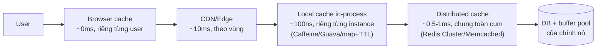

+++
title = "7.3. Distributed Cache — cache khi một node không đủ"
date = "2026-07-13T11:30:00+07:00"
draft = false
tags = ["backend", "system-design"]
series = ["System Design — Tư Duy Thiết Kế Hệ Thống"]
+++

## 1. Problem Statement

Một node Redis phục vụ ~100K ops/s và chứa được RAM của một máy ([5.4](/series/system-design/05-data-layer/04-redis/)). Hệ lớn vượt cả hai trần: cần triệu ops/s, cần cache working set hàng trăm GB, và cần cache **sống sót khi node chết** (vì mất cache = avalanche, [13.1](/series/system-design/13-production-failure-cases/01-caching-failures/) — với hệ hit-rate 95%, cache không còn là "tùy chọn hiệu năng" mà là thành phần sống còn). Distributed cache = chia key ra nhiều node + nhân bản — và ngay lập tức thừa hưởng mọi bài toán của [Phần 4](/series/system-design/04-distributed-systems/01-cap-pacelc/) và [Phần 8](/series/system-design/08-data-partitioning/00-tong-quan/): partition, hot key, rebalance, consistency giữa các tầng.

## 2. Kiến trúc nhiều tầng — bức tranh đầy đủ trước khi đi sâu

Cache production thực tế không phải một hộp — là một **chuỗi tầng**, mỗi tầng một tốc độ, một phạm vi, một bài invalidation:

Nguyên lý xếp tầng: **tầng càng gần user càng nhanh, càng khó invalidate, và càng nên chứa thứ càng bất biến.** Asset tĩnh content-hash → browser/CDN (TTL vô hạn, [7.2 §4 — versioned key](/series/system-design/07-caching/02-cache-invalidation/)); key cực nóng đọc mỗi request (config, feature flag, sản phẩm viral) → local cache TTL vài giây; phần thân working set → distributed cache; đuôi nguội → DB tự lo bằng buffer pool.

Local cache trước distributed cache là cặp đôi bị bỏ quên nhiều nhất: vài giây TTL in-process cắt 80–99% lượt gọi Redis cho key nóng — vừa giảm latency (100ns vs 1ms) vừa là **thuốc đặc trị hot key** (§4). Giá: thêm một tầng staleness (chồng lên nhau: stale tổng = TTL local + cửa sổ distributed) và N instance × bản sao — nhưng cho dữ liệu đọc-nhiều-đổi-chậm, món hời gần như luôn nghiêng về có local cache.

## 3. Chia key ra nhiều node — hai trường phái

**Client-side sharding / Memcached-style:** cache node "câm", không biết nhau; client (hoặc proxy như Twemproxy, mcrouter) hash key → chọn node, dùng **consistent hashing** để thêm/bớt node chỉ xáo ~1/N key ([8.2 — chi tiết thuật toán](/series/system-design/08-data-partitioning/02-consistent-hashing/)). Triết lý Memcached: đơn giản tối đa, node chết thì key của nó thành miss — *cache mà, nạp lại là xong* — đúng cho cache thuần túy chịu được miss-burst.

**Server-side sharding / Redis Cluster:** 16384 hash slot chia cho các master, node biết topology, client cluster-aware được redirect (`MOVED`) đến đúng node; mỗi master có replica + tự failover ([5.4 §4](/series/system-design/05-data-layer/04-redis/)). Triết lý ngược: cache đủ quan trọng để có HA riêng — đúng khi mất cache = sự cố ([13.1 — avalanche](/series/system-design/13-production-failure-cases/01-caching-failures/)) hoặc khi cache kiêm vai dữ liệu phù du có giá trị (session, giỏ hàng tạm).

Chọn giữa hai trường phái = trả lời một câu: **miss-burst khi một node chết có làm sập tầng dưới không?** Không → đơn giản thắng (Memcached-style); có → trả tiền cho replica + failover (Redis Cluster). Câu trả lời đến từ load test kịch bản mất node, không từ sở thích.

## 4. Hot key — bài toán riêng và dai dẳng nhất của distributed cache

Sharding đứng trên giả định tải chia đều theo key — và luật lũy thừa phá giả định đó mỗi ngày ([13.2 — hot partition](/series/system-design/13-production-failure-cases/02-database-failures/)): một sản phẩm lên tiếp thị liên kết, một config toàn cục đọc mỗi request — **một key = một node gánh**, thêm node không giúp (key vẫn ở một chỗ), node đó nghẽn CPU single-thread hoặc băng thông NIC trước khi cụm "hết công suất" trên giấy.

Thang thuốc theo độ nóng:

1. **Local cache TTL ngắn** (giải pháp đầu tiên, rẻ nhất — biến N triệu request thành N instance request mỗi TTL).
2. **Nhân bản key** (`hotkey:1..k`, đọc random một bản, ghi cả k bản) — tản ra k node; giá là ghi ×k và k bản lệch nhau trong cửa sổ.
3. **Phát hiện tự động:** đếm tần suất phía client/proxy (LFU sampling), key vượt ngưỡng tự thăng cấp vào local cache — cách các hệ lớn làm, vì hot key *xuất hiện đột ngột* (viral) chứ không báo trước.

## 5. Trade-off

| Được | Giá |
|---|---|
| Vượt trần RAM/ops một node; chết một node mất 1/N thay vì 100% | Thừa hưởng trọn bài toán phân tán: rebalance, hot key, topology client phải hiểu |
| Nhiều tầng: latency và tải giảm theo cấp số | Staleness cộng dồn qua tầng; invalidation phải nghĩ *theo chuỗi* ([7.2](/series/system-design/07-caching/02-cache-invalidation/)) |
| Redis Cluster: HA riêng cho cache | Failover async — mất ghi cửa sổ ([5.4 §4](/series/system-design/05-data-layer/04-redis/)); multi-key bó buộc hash tag |
| Memcached-style: vận hành tối giản | Node chết = miss burst thẳng vào DB — phải chắc DB chịu được |
| Local cache: nhanh nhất, chống hot key | N bản sao × N instance — bài đồng bộ nếu dữ liệu cần tươi (pub/sub invalidate là vá phổ biến) |

## 6. Production Considerations

- **Metric theo node, không chỉ theo cụm:** ops/s, CPU, băng thông NIC *từng node* — hot key hiện ra là một node đỏ giữa cụm xanh ([13.2 — heat map](/series/system-design/13-production-failure-cases/02-database-failures/)); thêm hit-rate theo tầng (local vs distributed vs DB) để biết tầng nào đang gánh.
- **Kịch bản mất node phải được load test** như nghi thức hàng quý ([13.1](/series/system-design/13-production-failure-cases/01-caching-failures/)): mất 1/N node → miss burst bao nhiêu → DB chịu nổi không → nếu không: thêm replica tầng cache hay circuit breaker + degraded mode tầng app?
- **Rebalance có kế hoạch:** thêm node = di chuyển slot/key = cache miss tạm + băng thông nội cụm — làm giờ thấp điểm, theo dõi hit-rate trong lúc chạy; consistent hashing giảm đau chứ không xóa đau ([8.2](/series/system-design/08-data-partitioning/02-consistent-hashing/)).
- Connection: N instance app × M node cache — pool và multiplexing cấu hình có ý thức kẻo tự tạo connection storm khi reconnect đồng loạt ([13.1 — thundering herd](/series/system-design/13-production-failure-cases/01-caching-failures/)).
- Đừng quên tầng 0: **CDN là distributed cache lớn nhất và rẻ nhất** cho mọi thứ cache-được-theo-URL — đẩy được ra CDN thì mọi tầng sau nhẹ đi tương ứng ([12.9 — bậc 1 edge](/series/system-design/12-evolution/09-multi-region/)).

## 7. Anti-patterns

- **Coi distributed cache là một Redis to** — bỏ qua topology: multi-key command chéo node, transaction chéo slot, `SCAN` cả cụm — những thứ hoạt động trên một node và vỡ trên cluster.
- **Thêm node để chữa hot key** — tiền mất, key vẫn một chỗ; thuốc là §4, không phải scale-out.
- **Local cache không TTL "vì có pub/sub invalidate"** — instance lỡ mất message giữ bản cũ vĩnh viễn; pub/sub là tăng tốc, TTL vẫn là lưới ([7.2 §4 tầng 1](/series/system-design/07-caching/02-cache-invalidation/)).
- **Cache tầng chồng tầng không ai vẽ sơ đồ** — 4 tầng × mỗi tầng một TTL tự phát = "dữ liệu cũ ở đâu ra?" trở thành cuộc điều tra khảo cổ; sơ đồ tầng + TTL từng tầng là một trang tài liệu bắt buộc.
- **Session/giỏ hàng trên Memcached-style không replica** — dữ liệu-phù-du-có-giá-trị trên hạ tầng thiết-kế-để-mất ([5.4 §3 — phân loại hai loại dữ liệu](/series/system-design/05-data-layer/04-redis/)).

## 8. Khi nào KHÔNG nên dùng

Một node Redis (+ replica cho HA) phủ được xa hơn đa số hệ nghĩ — 100K ops/s, chục GB — **đa số hệ Việt Nam chưa bao giờ cần cluster thật sự**; local cache + một node tốt là kiến trúc đúng cho đến khi số đo nói khác ([12 bài học 1](/series/system-design/12-evolution/00-tong-quan/)). Cụm cache đa tầng đa node là câu trả lời cho bài toán đã đo được bằng ops/s và GB — không phải trang phục của "hệ thống nghiêm túc".

---

*Hết Phần 7. Tiếp theo: [Phần 8 — Data Partitioning](/series/system-design/08-data-partitioning/00-tong-quan/) — nơi các ý tưởng sharding ở đây được tổng quát hóa cho tầng dữ liệu bền.*
