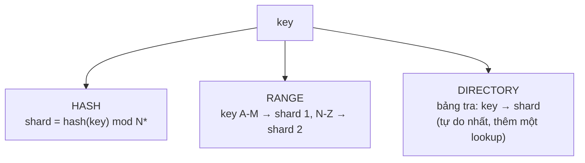

+++
title = "8.1. Partitioning & Sharding — chia dữ liệu và cái giá của shard key"
date = "2026-07-13T11:50:00+07:00"
draft = false
tags = ["backend", "system-design"]
series = ["System Design — Tư Duy Thiết Kế Hệ Thống"]
+++

## 1. Problem Statement

Bảng `orders` của VietShop sau 4 năm: 3TB, 5 tỷ hàng. Ba loại đau cùng lúc: **quản trị** (backup 6 giờ, tạo index 2 ngày, xóa dữ liệu cũ bằng DELETE là bão bloat — [5.1](/series/system-design/05-data-layer/01-postgresql/)); **hiệu năng** (index sâu hơn, working set vượt RAM, vacuum lê lết); và cuối cùng — **trần vật lý** (một máy hết cỡ để scale-up, ghi vượt năng lực single-writer — [4.2](/series/system-design/04-distributed-systems/02-replication-consistency/)). Ba loại đau, hai lời giải khác cấp độ: partitioning trong node cho hai loại đầu, sharding ra nhiều node cho loại thứ ba. Nhầm cấp độ — sharding khi chỉ cần partition — là mua độ phức tạp lớn nhất trong nghề để chữa bệnh có thuốc rẻ.

## 2. Partitioning trong node — thuốc rẻ, uống trước

Chia bảng lớn thành các bảng con theo range (tháng), list (region) hoặc hash — engine tự route. Ba lợi ích tức thời:

- **Partition pruning:** query có điều kiện thời gian chỉ quét partition liên quan — bảng 3TB, query tháng này chạm 60GB.
- **Quản trị theo khối:** `DROP PARTITION` tháng cũ = mili-giây, thay cho DELETE triệu hàng + vacuum + bloat; backup/index từng phần.
- **Index nông hơn, locality tốt hơn** cho dữ liệu nóng (thường là mới nhất).

Giá: chọn partition key trói vào access pattern (query không có điều kiện thời gian sẽ quét *mọi* partition); và giới hạn nhỏ khó chịu tùy engine (unique constraint phải chứa partition key...). Nhưng so với sharding, giá này gần như tròn số 0 — **mọi bảng time-series/log/event nên partition từ ngày dữ liệu dự kiến vượt trăm GB** ([1.4 — ước lượng biết trước điều này](/series/system-design/01-foundations/04-scale-estimation-capacity-planning/)).

## 3. Sharding — khi buộc phải bước qua ranh giới một máy

### 3.1. First principles: sharding thực chất là gì

Sharding = **biến một database thành N database nhỏ độc lập + một tầng routing biết hàng nào ở đâu.** Mọi hệ quả tốt xấu suy ra từ định nghĩa đó:

- Ghi/đọc *trong* một shard: nhanh, ACID nguyên vẹn, trần tổng = N × trần một node — điều ta mua.
- Bất kỳ thứ gì *xuyên* shard: transaction (mất ACID → [Saga](/series/system-design/06-communication/07-saga/) hoặc tránh), join (thành N query + ghép ở app), unique constraint toàn cục (phải tự chế bằng dịch vụ cấp phát), thứ tự toàn cục (không còn) — điều ta trả.
- Suy ra **mệnh lệnh thiết kế trung tâm:** chọn shard key sao cho ≥95% thao tác nằm gọn trong một shard. Sharding tốt là sharding mà ngày thường không ai nhớ nó tồn tại.

### 3.2. Chọn shard key — quyết định một lần, sống chung một thập kỷ

Ba tiêu chí, theo thứ tự ([đã nêu ở README](/series/system-design/08-data-partitioning/00-tong-quan/), giờ đi sâu):

1. **Khớp access pattern:** key xuất hiện trong hầu hết query. E-commerce: `user_id` cho dữ liệu user (mọi màn hình là "của tôi"), `tenant_id` cho SaaS, `order_id` kém hơn hẳn (đơn của một user rải khắp N shard → màn "đơn hàng của tôi" thành scatter-gather).
2. **Cardinality cao + phân bố chấp nhận được:** triệu user tốt; 4 giá trị `region` là thảm họa (4 shard, hết đường chia tiếp). Phân bố *sẽ* lệch (luật lũy thừa) — câu hỏi không phải "có lệch không" mà "lệch thì làm gì" ([13.2 — hot partition, thang thuốc salting/VIP](/series/system-design/13-production-failure-cases/02-database-failures/)).
3. **Khớp ranh giới nghiệp vụ và pháp lý:** shard theo "chủ sở hữu tự nhiên" giữ transaction trong shard *và* thẳng hàng với multi-region/data residency sau này ([12.9 — home region là sharding địa lý](/series/system-design/12-evolution/09-multi-region/)).

### 3.3. Ba chiến lược ánh xạ key → shard

| | Hash | Range | Directory |
|---|---|---|---|
| Phân bố | Đều tự nhiên | Lệch theo dữ liệu (key mới nhất dồn shard cuối — [hot partition có lịch](/series/system-design/13-production-failure-cases/02-database-failures/)) | Tùy ý — tự quyết |
| Range query theo key | Mất (key liền kề tản khắp nơi) | Giữ được — điểm mạnh duy nhất nhưng lớn | Tùy cách xếp |
| Thêm node | Đau nếu mod N thô → cần [consistent hashing](/series/system-design/08-data-partitioning/02-consistent-hashing/) | Chẻ range | Sửa bảng tra — dễ nhất |
| Xử lý tenant khổng lồ | Khó (hash không biết tenant to) | Khó | **Dễ: cho VIP một shard riêng** |
| Vận hành | Đơn giản nhất | Trung bình | Thêm một hệ metadata phải HA (bảng tra chết = mù toàn cụm) |

Thực chiến: **hash cho phân bố + directory cho quyền kiểm soát** là combo phổ biến ở hệ trưởng thành (hash vào "bucket ảo", bảng tra bucket → node — chính là mô hình slot của Redis Cluster và chunk của MongoDB, [7.3](/series/system-design/07-caching/03-distributed-cache/), [5.3](/series/system-design/05-data-layer/03-mongodb/)); range cho dữ liệu mà range-scan là nghiệp vụ chính (time-series, bảng xếp theo thứ tự).

## 4. Trade-off tổng

| Được | Giá |
|---|---|
| Trần ghi/dung lượng × N; blast radius 1/N | Mất ACID/join/unique xuyên shard — nghiệp vụ phải thiết kế lại quanh ranh giới |
| Ghi song song thật sự (N writer — vượt giới hạn [4.2](/series/system-design/04-distributed-systems/02-replication-consistency/)) | Shard key là cam kết dài hạn — đổi = [resharding](/series/system-design/08-data-partitioning/03-resharding-van-hanh/), dự án nhiều quý |
| Thẳng đường cho multi-region/residency | Tầng routing + metadata phải nuôi và phải HA |
| Cô lập noisy tenant (shard riêng cho VIP) | Mọi công cụ quen (backup, migration, analytics) phải học lại phiên bản × N |
| — | Hot shard: tổng công suất trên giấy ≠ công suất thật ([13.2](/series/system-design/13-production-failure-cases/02-database-failures/)) |

## 5. Production Considerations

- **Dùng tầng sharding có sẵn trước khi tự chế:** Citus (PostgreSQL), Vitess (MySQL), MongoDB native — routing, rebalance, cross-shard query cơ bản đã có người trả giá hộ; tự chế ở app layer là chấp nhận tự vận hành mọi bài của [8.3](/series/system-design/08-data-partitioning/03-resharding-van-hanh/) bằng code nhà.
- **Metric theo shard là bắt buộc từ ngày 0:** QPS/dung lượng/latency *từng shard* + độ lệch max/median ([13.2 — heat map](/series/system-design/13-production-failure-cases/02-database-failures/)) — hệ shard không có per-shard metric là hệ mù.
- **Backup/restore theo shard** + kịch bản "một shard chết": user của shard đó chịu gì, phần còn lại có tiếp tục không? (Đây là phần thưởng blast-radius — nhưng chỉ có thật nếu app xử lý được "một phần user lỗi" thay vì sập theo — [13.4](/series/system-design/13-production-failure-cases/04-distributed-failures/).)
- ID toàn cục: cấp phát không đụng nhau giữa shard (Snowflake-style: timestamp + shard id + sequence; hoặc UUIDv7) — quyết định từ trước khi shard, vì auto-increment per-shard va nhau khi merge dữ liệu.

## 6. Anti-patterns

- **Shard vì "sắp cần":** 200GB trên máy chịu được 4TB — chi phí phức tạp trả ngay, lợi ích không bao giờ đến ([1.4 — thiết kế cho quy mô tưởng tượng](/series/system-design/01-foundations/04-scale-estimation-capacity-planning/)).
- **Shard key = auto-increment/timestamp với range sharding** — mọi ghi dồn shard cuối, tuần tự hóa chính thứ định song song hóa.
- **Cross-shard query làm đường nóng:** màn hình chính scatter-gather N shard — latency = shard chậm nhất ([1.3 — tail](/series/system-design/01-foundations/03-throughput-latency/)); nếu 30% query xuyên shard, key đã chọn sai — đổi key hoặc thêm bảng dư chuẩn theo chiều kia (denormalize hai chiều: dữ liệu ghi hai nơi theo hai key — chấp nhận double-write có kiểm soát qua [outbox](/series/system-design/06-communication/08-outbox/)).
- **Quên "shard thứ N+1" — dữ liệu toàn cục:** bảng config, danh mục, khuyến mãi không shard được — cần chỗ ở riêng (global DB nhỏ + replicate/cache ra mọi nơi); nhét bừa vào shard 0 là biến shard 0 thành hotspot và SPOF.
- **Transaction xuyên shard bằng 2PC tự chế** — [6.7 §1](/series/system-design/06-communication/07-saga/) đã xử vụ này.

## 7. Khi nào KHÔNG nên dùng

Checklist trước khi shard — phải trả lời "rồi" cho tất cả: index và query đã tối ưu ([1.5](/series/system-design/01-foundations/05-bottleneck-analysis/))? cache đã gánh phần đọc ([Phần 7](/series/system-design/07-caching/00-tong-quan/))? replica đã gánh phần đọc còn lại? scale-up đã hết cỡ *thật* (máy 128 vCPU/4TB RAM là có thật)? partitioning trong node đã làm? dữ liệu nguội đã archive? workload ghi-nặng đã tách sang engine phù hợp ([ClickHouse cho event](/series/system-design/05-data-layer/05-clickhouse/))? — Mỗi câu "chưa" là một quý hoãn được sharding, và hoãn sharding là chiến thắng kiến trúc thầm lặng ([12 bài học 1](/series/system-design/12-evolution/00-tong-quan/)).

---

*Tiếp theo: [8.2. Consistent Hashing](/series/system-design/08-data-partitioning/02-consistent-hashing/)*
