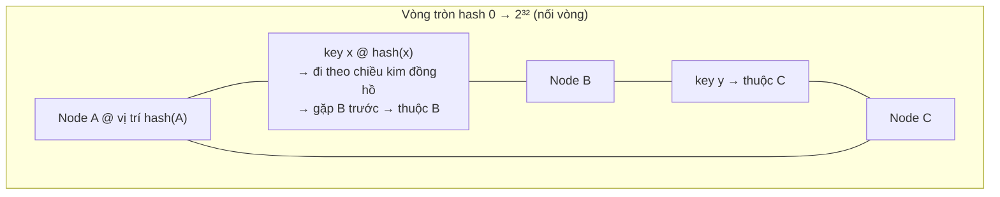

+++
title = "8.2. Consistent Hashing — thêm bớt node mà không xáo cả thế giới"
date = "2026-07-13T12:00:00+07:00"
draft = false
tags = ["backend", "system-design"]
series = ["System Design — Tư Duy Thiết Kế Hệ Thống"]
+++

## 1. Problem Statement

Hash sharding ngây thơ: `node = hash(key) mod N`. Đẹp cho đến ngày N đổi. Thêm node thứ 5 vào cụm 4 node: `mod 4` → `mod 5` — **~80% key đổi chỗ**. Với cache: 80% miss đồng loạt = tự gây avalanche ([13.1](/series/system-design/13-production-failure-cases/01-caching-failures/)); với storage: di chuyển 80% dữ liệu qua mạng chỉ để thêm *một* máy. Mà thêm/bớt node là chuyện thường kỳ: scale theo tải, node chết, bảo trì. Cần một cách ánh xạ key → node sao cho **N đổi thì chỉ ~1/N key phải dời chỗ** — mức tối thiểu lý thuyết (dữ liệu *phải* sang node mới thì mới có ích).

## 2. First Principles — thuật toán trong một hình vẽ

**Ý tưởng: đừng hash key vào node — hash cả key lẫn node vào cùng một không gian, rồi định nghĩa quan hệ "thuộc về" bằng vị trí tương đối.**

- Node đặt trên vòng tại `hash(node_id)`; key thuộc về **node đầu tiên theo chiều kim đồng hồ** từ `hash(key)`.
- **Thêm node D** (rơi giữa B và C): chỉ các key trong cung (B → D) đổi chủ từ C sang D — phần còn lại của vòng **không hề biết** có chuyện gì xảy ra. Bớt node: key của nó trôi sang node kế tiếp — cũng cục bộ như vậy.
- Vì sao được thế? `mod N` mã hóa *tổng số node* vào công thức của **mọi** key — N đổi là mọi phép tính đổi. Vòng tròn mã hóa *vị trí tương đối* — thay đổi chỉ lan đến hàng xóm. Đây là nguyên lý sâu hơn thuật toán: **thiết kế sao cho thay đổi có tính cục bộ** — cùng họ với ranh giới module ([12.5](/series/system-design/12-evolution/05-modular-monolith/)) và blast radius ([12.6](/series/system-design/12-evolution/06-microservices/)), hiện thân ở tầng dữ liệu.

## 3. Virtual nodes — bản vá bắt buộc, không phải tùy chọn

Vòng thô có hai bệnh: node ít thì vị trí ngẫu nhiên chia cung **rất lệch** (node xui nhận cung gấp 3 node may); node chết thì *toàn bộ* tải của nó đổ lên đúng một hàng xóm — chết dây chuyền kiểu domino ([13.4 — dồn tải sang hàng xóm](/series/system-design/13-production-failure-cases/04-distributed-failures/)).

**Virtual nodes (vnodes):** mỗi node vật lý xuất hiện trên vòng ở ~100–500 điểm (`hash(node_id#1..k)`). Hệ quả:

- Cung của mỗi node = tổng nhiều mảnh nhỏ rải khắp vòng → phân bố đều theo luật số lớn.
- Node chết → tải của nó chia **đều cho mọi node còn lại** (mỗi mảnh trôi sang một hàng xóm khác nhau) — thay vì đổ lên một nạn nhân.
- Node mạnh yếu khác nhau → cấp số vnode tỷ lệ công suất — cân tải theo trọng số miễn phí.

Giá: bảng tra vị trí to hơn (k × N entry — vẫn tí hon), và phần thưởng ngọt: **rebalance mịn hơn** — thêm node mới là nhận k mảnh nhỏ từ k node cũ, băng thông di chuyển rải đều thay vì hút từ một nguồn.

## 4. Các biến thể trong đời thực — cùng ý tưởng, khác hình hài

| Hệ | Hình hài | Ghi chú |
|---|---|---|
| Cassandra / DynamoDB-style | Vòng + vnodes nguyên bản | Kèm replication: key thuộc node chính + W−1 node *tiếp theo* trên vòng ([4.2 — quorum](/series/system-design/04-distributed-systems/02-replication-consistency/)) — vòng tròn cho cả sharding lẫn replica placement |
| Redis Cluster | **16384 slot cố định**: key → slot (CRC16 mod 16384), slot → node qua bảng tra | "Consistent hashing rời rạc hóa" — cung chia sẵn thành slot đều nhau, di chuyển theo đơn vị slot: dễ quan sát, dễ điều khiển ([7.3](/series/system-design/07-caching/03-distributed-cache/)) |
| MongoDB | Chunk (dải key) + balancer di chuyển chunk | Cùng triết lý qua directory ([8.1 §3.3 — combo hash+directory](/series/system-design/08-data-partitioning/01-partitioning-sharding/)) |
| Memcached client (Ketama) | Vòng + vnodes phía client | Không server nào biết gì — toàn bộ trí tuệ ở client ([7.3 §3](/series/system-design/07-caching/03-distributed-cache/)) |
| LB / sticky routing | Consistent hash theo user-id/session | Cùng bài: node đổi mà session ít bị xáo nhất ([Phần 2](/series/system-design/02-scalability/00-tong-quan/)) |

Mẫu "slot/bucket cố định + bảng tra" (Redis, Mongo, Vitess) đáng chú ý riêng: nó tách **hash không đổi** (key → bucket, vĩnh viễn) khỏi **placement thay đổi** (bucket → node, sửa bảng tra là xong) — chính là cách làm [resharding](/series/system-design/08-data-partitioning/03-resharding-van-hanh/) trở thành thao tác vận hành thay vì dự án.

## 5. Trade-off

| Được | Giá |
|---|---|
| Thêm/bớt node xáo ~1/N key — mức tối thiểu | Mất range query theo key (hash phá thứ tự) — cần range thì sang range-sharding và chấp nhận bài của nó ([8.1](/series/system-design/08-data-partitioning/01-partitioning-sharding/)) |
| Node chết: tải chia đều (với vnodes) | Mọi client/router phải đồng thuận về topology vòng — lệch topology = key "biến mất" tạm thời (đọc node cũ, ghi node mới) |
| Nền cho decentralized (không cần metadata server — Cassandra) | Debug "key này ở đâu?" cần công cụ (không nhẩm được như mod N) |
| Cân tải theo trọng số qua số vnode | **Không chữa hot key** — một key vẫn ở một chỗ; đó là bài khác ([13.2](/series/system-design/13-production-failure-cases/02-database-failures/), [7.3 §4](/series/system-design/07-caching/03-distributed-cache/)) |

## 6. Production Considerations

- **Topology là dữ liệu phân tán của chính nó:** ai giữ bảng vòng/slot, lan truyền thế nào (gossip? config service? — [4.3](/series/system-design/04-distributed-systems/03-consensus-quorum-leader-election/)), client cũ cache topology cũ bao lâu — sự cố "một nhóm client nhìn vòng cũ" cho triệu chứng y hệt mất dữ liệu; metric `MOVED`/redirect rate (Redis) là nhiệt kế của lệch topology.
- Hash function: nhanh + phân bố tốt là đủ (murmur3, xxHash) — **không đổi được nữa** sau khi có dữ liệu (đổi hash = đổi chỗ mọi key = chính cái thảm họa đang tránh); chọn một lần, ghi vào ADR.
- Số vnode: mặc định của hệ (Cassandra 256, Redis 16384 slot) đã được trả giá hộ — chỉnh khi có lý do đo được.
- Drill "node chết" và "thêm node" ở staging với dữ liệu cỡ thật: đo % key di chuyển, thời gian, ảnh hưởng hit-rate/latency — con số thật cho runbook, đúng tinh thần [12.10](/series/system-design/12-evolution/10-disaster-recovery/).

## 7. Anti-patterns

- **`mod N` cho bất kỳ thứ gì sẽ đổi N** — món nợ trả bằng avalanche vào ngày scale đầu tiên.
- **Vòng không vnodes** — phân bố lệch + domino khi node chết; nếu thư viện không hỗ trợ vnodes, đổi thư viện.
- **Mỗi client tự chế vòng riêng** (thư viện khác nhau, hash khác nhau, vị trí node khác nhau) giữa các service cùng đọc một cụm cache — hai service nhìn hai bản đồ, cache hit tụt và ghi lạc chỗ âm thầm; vòng phải là **một** thư viện chung có version.
- **Tin rằng consistent hashing = cân bằng tải** — nó cân *key*, không cân *tải*; phân bố tải theo key vẫn là luật lũy thừa và hot key vẫn là việc của bạn.

## 8. Khi nào KHÔNG cần

Số node cố định và nhỏ (2–4, không kế hoạch đổi): mod N + kế hoạch chuyển đổi thủ công hiếm hoi là đủ, đừng nhập khẩu khái niệm. Sharding qua tầng có sẵn (Citus/Vitess/Mongo/Redis Cluster): consistent hashing đã ở *bên trong* — việc của bạn là hiểu nó để vận hành (đọc §4, §6), không phải cài lại. Tự cài đặt vòng chỉ còn chính đáng khi xây tầng infra riêng (cache client tự route, LB tự chế) — và khi đó, dùng thư viện đã kiểm chứng (ketama, ring của SDK lớn), không viết từ giấy trắng.

---

*Tiếp theo: [8.3. Resharding & vận hành hệ đã shard](/series/system-design/08-data-partitioning/03-resharding-van-hanh/)*
