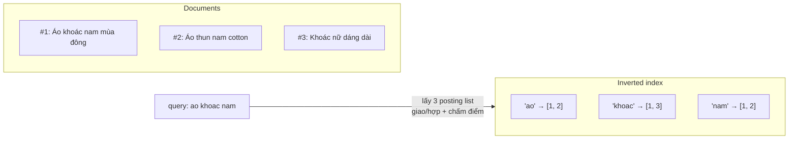

+++
title = "9.1. Full-text Search — nguyên lý: inverted index, analyzer, relevance"
date = "2026-07-13T12:30:00+07:00"
draft = false
tags = ["backend", "system-design"]
series = ["System Design — Tư Duy Thiết Kế Hệ Thống"]
+++

## 1. Problem Statement

User gõ `ao khoac nam gia re`; kho có 2 triệu sản phẩm. Yêu cầu: kết quả *liên quan* trả trong < 100ms, khớp được dù thiếu dấu, sai chính tả nhẹ, đảo trật tự từ; và "liên quan" phải gần với "thứ user muốn mua" chứ không chỉ "chuỗi giống nhau". `LIKE '%áo khoác%'` thất bại toàn tập: quét toàn bảng (không index nào giúp wildcard hai đầu), yêu cầu khớp *chuỗi liên tục* (đảo từ là mất), không hiểu dấu, và không có khái niệm xếp hạng. Cần một cấu trúc dữ liệu và một bộ máy ngôn ngữ sinh ra cho đúng bài này.

## 2. Inverted Index — cấu trúc làm mọi thứ khả thi

Đảo quan hệ lưu trữ: thay vì `document → nội dung`, lưu `term → posting list` (danh sách document chứa term, kèm vị trí và tần suất):

Tìm kiếm = lấy K posting list (K = số term trong query, thường 2–5) → giao/hợp các danh sách *đã sort* (rất nhanh, kể cả list triệu phần tử) → chấm điểm → trả top-N. Chi phí tỷ lệ với *số document khớp*, không với *tổng kho* — đó là phép màu so với LIKE. Posting list còn nén được rất sâu (delta encoding — cùng họ ý tưởng với [ClickHouse 5.5 §3](/series/system-design/05-data-layer/05-clickhouse/)) và giữ **vị trí** term để hỗ trợ phrase query ("áo khoác" đứng liền nhau) và proximity scoring.

Cái giá cấu trúc: index này **bất biến hiệu quả** — thêm/sửa document là ghi segment mới rồi merge nền ([5.6 §3 — near-real-time và hệ quả](/series/system-design/05-data-layer/06-elasticsearch/)); và nó chỉ tra được **term đã chuẩn hóa** — dẫn thẳng đến phần quan trọng nhất:

## 3. Analyzer — nơi 80% chất lượng search được quyết định

Từ văn bản thô đến term trong index là một pipeline: **character filter → tokenizer → token filter**. Query đi qua *cùng* pipeline — hai bên gặp nhau ở term chuẩn hóa. Mọi ca "sao gõ X không ra Y" truy về pipeline này, không phải về engine.

Với **tiếng Việt**, pipeline chuẩn tối thiểu:

1. **Chuẩn hóa Unicode (NFC):** cùng một chữ "ế" có hai cách mã hóa (dựng sẵn vs ký tự ghép) — không chuẩn hóa thì "tivi Sony" của seller A và của seller B là hai term khác nhau. Bug âm thầm và phổ biến nhất của search tiếng Việt.
2. **Lowercase + asciifolding (bỏ dấu):** index cả bản có dấu lẫn không dấu (multi-field) — user gõ `ao khoac` khớp "áo khoác", gõ `áo khoác` cũng khớp; và bản có dấu nên được *boost cao hơn* (khớp chính xác đáng giá hơn).
3. **Tách từ:** tiếng Việt viết rời âm tiết nhưng *từ* là ghép ("áo khoác", "máy giặt") — tokenizer theo khoảng trắng + phrase/proximity scoring đi rất xa; word-segmentation thật (VnCoreNLP, coccoc-tokenizer plugin) tăng chất lượng thêm một nấc với giá vận hành thêm một plugin. Bắt đầu bằng cách rẻ, nâng cấp khi số liệu CTR đòi hỏi.
4. **Synonym theo domain:** "áo khoác" ↔ "jacket", "tivi" ↔ "tv" ↔ "television" — file synonym là tài sản nghiệp vụ, nuôi từ chính search log (những query 0 kết quả là mỏ vàng).
5. **Sai chính tả:** fuzzy query (edit distance 1–2) hoặc suggest ("có phải bạn muốn tìm...") — dùng có kiểm soát: fuzzy trên term ngắn tiếng Việt dễ nhiễu ("bàn" ~ "bán" ~ "bạn" đều cách nhau 1 dấu).

## 4. Relevance — từ khớp đến đáng-bấm

**BM25** (chuẩn hiện đại, kế nhiệm TF-IDF) chấm điểm mỗi document theo ba trực giác: term xuất hiện nhiều trong doc → điểm cao (bão hòa dần — lần thứ 20 không đáng giá bằng lần thứ 2); term *hiếm* trong toàn kho → đáng giá hơn term phổ biến ("khoác" phân biệt tốt hơn "áo"); doc ngắn chứa term → đậm đặc hơn doc dài. BM25 miễn phí và tốt — nhưng nó chỉ đo **độ khớp văn bản**.

"Đáng bấm" với e-commerce là hàm của nhiều tín hiệu hơn: `điểm cuối = f(BM25, doanh số, tỷ lệ đánh giá, tồn kho, mới, margin, cá nhân hóa)` — trộn bằng function score/rank features ([5.6 §7](/series/system-design/05-data-layer/06-elasticsearch/)). Đây là quyết định *sản phẩm* đội lốt kỹ thuật: cân bằng giữa "đúng ý user" và "tốt cho business" cần A/B test, không cần tranh luận. Mức trưởng thành cao hơn — learning-to-rank, semantic/vector search (khớp *nghĩa* thay vì *chữ*: "đồ giữ ấm" ra áo khoác) — đứng **trên** nền này, không thay thế nó: hệ lai (BM25 lọc + vector re-rank) là mẫu phổ biến vì vector thuần yếu với mã sản phẩm, tên riêng, filter chính xác.

## 5. Trade-off

| Quyết định | Được | Giá |
|---|---|---|
| Analyzer mạnh tay (folding, synonym, fuzzy) | Recall cao — ít ca "không tìm thấy" | Precision giảm — nhiễu tăng; mỗi tầng nới là một tầng nhiễu, đo bằng CTR chứ đừng đoán |
| Index đa field (có dấu + không dấu + ngram) | Khớp linh hoạt, boost tinh tế | Index phình ×2–3; ngram phình dữ dội — dùng cho autocomplete field riêng, đừng ngram mọi thứ |
| Word segmentation thật | Chất lượng tiếng Việt tốt nhất | Plugin phải nuôi; reindex khi đổi tokenizer ([5.6 §6 — mapping đổi = reindex](/series/system-design/05-data-layer/06-elasticsearch/)) |
| Trộn tín hiệu business vào ranking | Search thành cỗ máy doanh thu | Phức tạp + cần A/B infrastructure; boost quá tay làm mất niềm tin user |

## 6. Production Considerations

- **Search log là dữ liệu quý nhất của hệ search:** top query, query 0 kết quả, CTR theo vị trí, tỷ lệ refine (gõ lại) — nuôi synonym, sửa analyzer, đo mọi thay đổi relevance. Không có search analytics = tune mù.
- **Bộ test relevance cố định** (golden queries): 100–500 cặp query→kết quả kỳ vọng, chạy trong CI — đổi analyzer/boost mà không có regression test là đổi hành vi sản phẩm không kiểm soát.
- Đổi analyzer = reindex: dùng alias + build song song ([5.6 §6](/series/system-design/05-data-layer/06-elasticsearch/)) — thiết kế quy trình này *trước khi* cần lần đầu.
- Đo latency theo *loại* query (term thuần vs fuzzy vs phrase vs facet nặng) — fuzzy và wildcard là các query đắt gấp bậc, cần guard riêng.

## 7. Anti-patterns

- **`LIKE '%x%'` + thêm máy** — sai cấu trúc dữ liệu, không lượng phần cứng nào chữa được.
- **Một analyzer mặc định cho tiếng Việt** (standard tokenizer, không folding, không NFC) — hệ search "chạy" nhưng trải nghiệm tệ âm thầm; đây là khoảng cách phổ biến nhất giữa search demo và search tốt.
- **Tune relevance theo cảm nhận của sếp** thay vì theo golden set + A/B — mỗi lần tune là một lần phá ngẫu nhiên.
- **Fuzzy mọi query mọi term** — nhiễu tăng, latency tăng; fuzzy là fallback khi khớp chặt ra ít kết quả, không phải mặc định.
- **Nhồi cả bộ máy ranking vào một query DSL khổng lồ không ai đọc nổi** — tách tầng: khớp (recall) → chấm điểm (precision) → re-rank (business), mỗi tầng đo được riêng.

## 8. Khi nào KHÔNG cần cỗ máy này

Tra cứu theo mã/SKU/username: đó là exact match — B-tree làm tốt hơn ([5.1](/series/system-design/05-data-layer/01-postgresql/)). Danh mục vài nghìn bản ghi: PostgreSQL FTS hoặc thậm chí filter phía client là đủ ([9.3](/series/system-design/09-search/03-lua-chon-cong-nghe/)). Và nếu search không phải đường doanh thu (admin tool tìm nội bộ): mức "chạy được" là mức đúng — dành đầu tư analyzer/relevance cho nơi user trả tiền qua ô tìm kiếm.

---

*Tiếp theo: [9.2. Kiến trúc hệ search hoàn chỉnh](/series/system-design/09-search/02-search-architecture/)*
