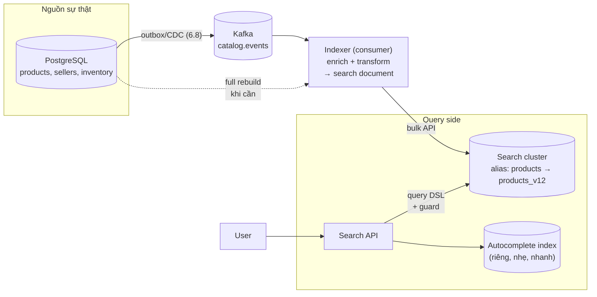

+++
title = "9.2. Kiến trúc hệ search hoàn chỉnh — indexing pipeline, query side, vận hành"
date = "2026-07-13T12:40:00+07:00"
draft = false
tags = ["backend", "system-design"]
series = ["System Design — Tư Duy Thiết Kế Hệ Thống"]
+++

## 1. Problem Statement

Engine tốt + analyzer tốt ([9.1](/series/system-design/09-search/01-full-text-search/)) chưa thành hệ search: còn phải trả lời — dữ liệu từ nguồn sự thật *đến* index bằng đường nào, trễ bao nhiêu, sót thì sao? Autocomplete, facet, filter — mỗi thứ cần cấu trúc gì? Reindex 50 triệu document giữa production như thế nào? Đây là phần "hệ thống" của search — nơi các bài học outbox, projection, backlog của toàn tài liệu hội tụ vào một use case.

## 2. Kiến trúc tổng — search là một CQRS read model chuyên dụng

Nhìn quen thuộc — vì nó *chính là* [CQRS 12.8](/series/system-design/12-evolution/08-cqrs/) với projection là search index: mọi nguyên tắc kế thừa nguyên vẹn — nguồn sự thật một nơi, index rebuild được, lag đo được, và **cấm quyết định ghi dựa trên dữ liệu đọc từ index** (check tồn kho từ ES rồi bán là bug kinh điển — [12.8 §7](/series/system-design/12-evolution/08-cqrs/)).

## 3. Indexing pipeline — nơi mọi bài học async hội tụ

- **Đường đồng bộ: outbox/CDC, không dual-write** ([6.8](/series/system-design/06-communication/08-outbox/)) — ghi DB xong gọi thẳng ES là công thức cho index lệch nguồn không dấu vết.
- **Indexer là một consumer chuẩn** với đủ nghĩa vụ của [13.3](/series/system-design/13-production-failure-cases/03-messaging-failures/): idempotent (index theo `_id` = upsert tự nhiên — may mắn của search), chịu out-of-order (so version/timestamp trước khi ghi đè — event cũ đến muộn không được đè bản mới), lag được giám sát theo SLA riêng.
- **Enrichment tại indexer:** search document ≠ hàng DB — nó denormalize mọi thứ cần cho khớp/lọc/xếp hạng (tên + mô tả + tên danh mục + thuộc tính + tín hiệu ranking như doanh số 30 ngày). Câu hỏi thiết kế: enrich lúc index (mọi lần đổi doanh số phải re-index — nhưng query nhanh) hay lúc query (index gọn — nhưng query phải join tay)? Nguyên tắc: **field dùng để khớp/lọc/sort phải nằm trong index; tín hiệu đổi quá dày** (giá flash sale từng giây, tồn kho) **để ngoài** — lấy từ cache/DB lúc render, chấp nhận hiển thị lệch nhẹ với thứ tự.
- **Độ trễ index là hợp đồng sản phẩm:** seller sửa giá — bao lâu thấy trên search? Ghi rõ SLA (ví dụ p99 < 30 giây), đo bằng end-to-end probe (ghi bản ghi test → đo lúc search thấy), alert theo đó — không phải theo "consumer lag có vẻ ổn".
- **Full rebuild là quy trình hạng nhất** ([5.6 §6 — alias switch](/series/system-design/05-data-layer/06-elasticsearch/)): đổi analyzer, đổi mapping, hỏng index, nghi drift — build index mới từ nguồn (scan bảng + replay event gần nhất) song song với index cũ đang phục vụ → verify (đếm + golden queries [9.1 §6](/series/system-design/09-search/01-full-text-search/)) → đảo alias → giữ index cũ vài ngày làm đường lùi. Đo thời gian rebuild định kỳ — nó là RTO của search ([3.2 §3 — tinh thần restore drill](/series/system-design/03-availability-reliability/02-backup-recovery/)).

## 4. Query side — các cấu trúc chuyên dụng

- **Autocomplete/suggest:** yêu cầu khác hẳn search chính (prefix match, < 30ms, gọi mỗi phím gõ — traffic ×10 search thật) → **index riêng, nhẹ** (edge-ngram hoặc completion suggester, chỉ tên + độ phổ biến), đừng bắt index chính gánh. Nguồn suggest tốt nhất: chính search log (query phổ biến đã chuẩn hóa) — vòng lặp dữ liệu tự nuôi.
- **Facet/filter (đếm theo danh mục, khoảng giá...):** aggregation trên field keyword/numeric — đắt hơn khớp văn bản đáng kể; guard bằng giới hạn số facet + cache kết quả facet cho query phổ biến (TTL ngắn — [Phần 7](/series/system-design/07-caching/00-tong-quan/)).
- **Phân trang:** `search_after` thay `from+size` sâu ([5.6 §8 — deep pagination](/series/system-design/05-data-layer/06-elasticsearch/)); UX "infinite scroll" thân thiện với cursor hơn là "trang 847".
- **Query guard tại Search API** (không tin client): độ dài query, số term, cấm wildcard đầu chuỗi, timeout per-query, circuit breaker sang degraded mode — search chết thì trang danh mục (browse) phải vẫn sống: **search là enhancement của browse, không phải điều kiện tồn tại** ([13.4 — degraded mode](/series/system-design/13-production-failure-cases/04-distributed-failures/)).

## 5. Trade-off

| Quyết định | Được | Giá |
|---|---|---|
| Denormalize đậm vào document | Query một phát, nhanh | Mỗi thay đổi thực thể liên quan (đổi tên danh mục!) = re-index hàng loạt document — cần đường xử lý bulk-update riêng |
| Index riêng cho autocomplete | Nhanh, cách ly tải ×10 | Thêm một index + một đường đồng bộ phải nuôi |
| Tín hiệu ranking trong index, cập nhật theo batch (giờ/ngày) | Ranking giàu, index không bị ghi dày | Thứ hạng trễ so với thực tế — chấp nhận được cho doanh số, không cho tồn kho |
| Search cluster riêng khỏi log cluster | SLO search không bị đợt log bùng nổ đè | ×2 cluster ([5.6 §5 — noisy neighbor](/series/system-design/05-data-layer/06-elasticsearch/)) |

## 6. Production Considerations

- **Bốn nhóm metric của hệ search:** hạ tầng ([5.6 §6](/series/system-design/05-data-layer/06-elasticsearch/) — cluster health, heap, rejected); pipeline (indexing lag end-to-end, consumer lag, lỗi transform — DLQ cho event không index được); chất lượng (CTR, zero-result rate, refine rate — [9.1 §6](/series/system-design/09-search/01-full-text-search/)); và **đối soát drift** (đếm document index vs nguồn theo phân vùng, chạy đêm — index lệch nguồn âm thầm là bệnh mạn tính của mọi hệ dẫn xuất, [12.8 §7](/series/system-design/12-evolution/08-cqrs/)).
- Search API là chỗ đứng đúng của cache kết quả: query phổ biến lặp rất nhiều (phân bố lũy thừa quen thuộc) — cache TTL 30–60 giây cắt đáng kể tải cluster ([7.1 — cache-aside](/series/system-design/07-caching/01-cache-strategies/)); nhớ key có cả filter + trang + biến thể analyzer.
- Load test bằng **phân bố query thật** (lấy từ log, gồm cả đuôi dài và query quái) — benchmark bằng 10 query đẹp cho kết quả đẹp và vô nghĩa.

## 7. Anti-patterns

- **Dual-write app → DB + app → ES** — drift không dấu vết; outbox không phải tùy chọn ([6.8 §8](/series/system-design/06-communication/08-outbox/)).
- **Search index làm nguồn cho quyết định ghi** — tồn kho/giá lấy từ ES để bán: sai tầng, sai hợp đồng.
- **Một index gánh cả search + autocomplete + analytics** — ba SLO khác nhau trên một tài nguyên = không SLO nào giữ được.
- **Re-index đồng bộ trong request ghi** (seller bấm lưu → chờ ES xong mới trả về) — trói latency ghi vào hệ dẫn xuất; đường async tồn tại để dùng ([12.3](/series/system-design/12-evolution/03-background-worker/)).
- **Không có golden queries + không đo CTR** — mọi thay đổi relevance là canh bạc không có bàn thắng.
- **Rebuild chưa từng chạy thử** — ngày cần (mapping hỏng, drift nặng) mới viết script giữa sự cố.

## 8. Khi nào KHÔNG cần kiến trúc đầy đủ

Catalog < ~100K bản ghi, đổi thưa: index thẳng từ DB bằng cron 5 phút (thay cả outbox lẫn Kafka) là kiến trúc *đúng* cho cỡ đó — pipeline event-driven đầy đủ kích hoạt khi độ tươi giây và khối lượng đòi hỏi ([12 bài học 1](/series/system-design/12-evolution/00-tong-quan/)). Và nếu nguồn đã là PostgreSQL với nhu cầu vừa: FTS ngay trong DB xóa luôn *toàn bộ* bài đồng bộ — index và dữ liệu chung một transaction, drift bằng không theo định nghĩa — lợi thế kiến trúc bị đánh giá thấp nhất của lựa chọn "khiêm tốn" này ([9.3](/series/system-design/09-search/03-lua-chon-cong-nghe/)).

---

*Tiếp theo: [9.3. Lựa chọn công nghệ search](/series/system-design/09-search/03-lua-chon-cong-nghe/)*
