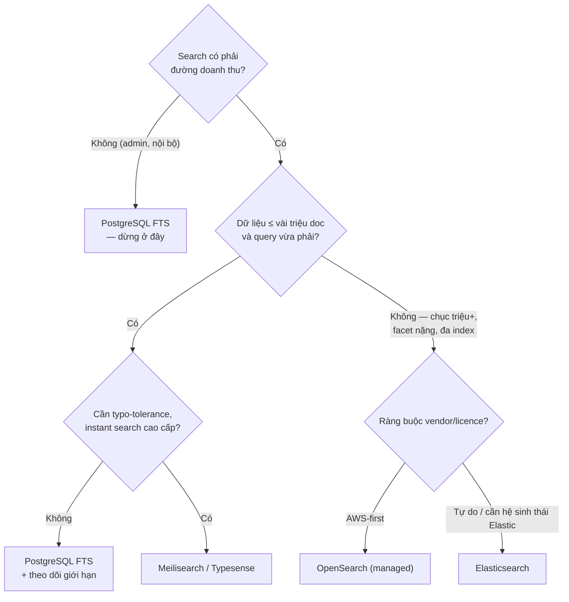

+++
title = "9.3. Lựa chọn công nghệ search — khung quyết định"
date = "2026-07-13T12:50:00+07:00"
draft = false
tags = ["backend", "system-design"]
series = ["System Design — Tư Duy Thiết Kế Hệ Thống"]
+++

## 1. Problem Statement

"Cần search" không tự động nghĩa là "cần Elasticsearch". Phổ lựa chọn trải từ một câu `tsvector` trong DB đang có, đến cụm phân tán nhiều node với nghề vận hành riêng — chênh nhau hai bậc độ lớn về chi phí trọn đời. Chọn theo thói quen ("ai cũng dùng ES") hoặc theo sợ hãi ("PG sao làm search được") đều bỏ qua câu hỏi đúng: **workload này cần gì, và mức khiêm tốn nhất đáp ứng được là gì** ([5.7 §2 — cửa kiểm tra câu 3](/series/system-design/05-data-layer/07-so-sanh-lua-chon/)).

## 2. Bản đồ lựa chọn

| | PostgreSQL FTS | Meilisearch / Typesense | Elasticsearch | OpenSearch |
|---|---|---|---|---|
| Bản chất | FTS trong RDBMS (`tsvector`+GIN, `pg_trgm`) | Engine gọn, một binary, tối ưu search-as-you-type | Nền tảng search/analytics phân tán đầy đủ | Fork của ES (từ 7.10) do AWS dẫn dắt |
| Điểm ngọt | ≤ vài triệu bản ghi, query vừa | Search sản phẩm/nội dung ≤ chục triệu doc, cần DX nhanh, typo-tolerance mặc định tốt | Chục triệu → tỷ doc, facet nặng, DSL sâu, hệ sinh thái lớn nhất | Như ES; ưu tiên giấy phép mở thật sự / đã ở trong AWS |
| Đồng bộ dữ liệu | **Không cần — cùng transaction với nguồn** | Cần pipeline ([9.2](/series/system-design/09-search/02-search-architecture/)) | Cần pipeline | Cần pipeline |
| Tiếng Việt | unaccent + tsvector 'simple' — đủ dùng; thiếu scoring hiện đại | Chuẩn hóa + typo tốt sẵn; tách từ hạn chế | Đầy đủ nhất (analyzer tùy biến, plugin — [9.1 §3](/series/system-design/09-search/01-full-text-search/)) | Tương đương ES |
| Vận hành | ~0 (đã nuôi PG) | Thấp (một tiến trình + snapshot) | Cao — cluster JVM là nghề ([5.6](/series/system-design/05-data-layer/06-elasticsearch/)) | Như ES; managed trên AWS giảm gánh |
| Chi phí trọn đời | Gần 0 | Thấp | Cao nhất | Cao (trừ managed) |

**Về ES vs OpenSearch:** chia đôi năm 2021 quanh chuyện giấy phép (Elastic đổi licence, AWS fork từ 7.10; Elastic sau này bổ sung lại lựa chọn AGPL — chi tiết pháp lý nên kiểm tra tại thời điểm quyết định). Về kỹ thuật, hai bên tương đương cho use case phổ thông và **API lõi giống nhau đủ để kiến trúc của bạn không đổi** ([9.1](/series/system-design/09-search/01-full-text-search/), [9.2](/series/system-design/09-search/02-search-architecture/) áp nguyên cho cả hai); khác biệt tích lũy ở tính năng mới (vector/semantic, tooling) và mô hình thương mại. Tiêu chí chọn thực dụng: đã dùng AWS đậm → OpenSearch managed; cần tính năng mới nhất của hệ sinh thái Elastic hoặc đã có kỹ năng ES → ES. Đây là quyết định *vendor*, không phải quyết định *kiến trúc*.

## 3. Khung quyết định — đi từ khiêm tốn lên

Điểm đáng nhấn của nhánh trên cùng: **PostgreSQL FTS có một lợi thế kiến trúc mà không engine ngoài nào mua được — index cập nhật trong cùng transaction với dữ liệu.** Không pipeline, không lag, không drift, không rebuild, không cluster thứ hai ([9.2 §8](/series/system-design/09-search/02-search-architecture/)). Với hệ vừa, lợi thế này thường *nặng ký hơn* mọi tính năng search cao cấp — vì chi phí thật của search nằm ở đồng bộ và vận hành, không nằm ở query DSL.

Giới hạn thật của PG FTS (biết để canh, không để sợ sớm): scoring cơ bản (ts_rank, không BM25 chuẩn), facet phải tự làm bằng GROUP BY (chậm dần theo cỡ), index GIN lớn làm ghi chậm dần, và không có tách từ tiếng Việt — khi CTR/latency/khối lượng chạm các trần này *có số đo*, đó là tín hiệu nâng cấp lành mạnh, và kiến trúc [9.2](/series/system-design/09-search/02-search-architecture/) là đích đến.

## 4. Trade-off tổng khi nâng cấp từ trong-DB ra engine ngoài

| Được | Mất |
|---|---|
| BM25 + analyzer + facet + scale riêng cho search | **Tính nhất quán transactional** — từ nay có lag, drift, rebuild ([9.2](/series/system-design/09-search/02-search-architecture/)) |
| Tải search rời khỏi DB nghiệp vụ | Một hệ stateful nữa: giám sát, nâng cấp, on-call ([12 bài học 1](/series/system-design/12-evolution/00-tong-quan/)) |
| Tính năng sản phẩm mới (suggest, semantic sau này) | Pipeline đồng bộ = một consumer + mọi nghĩa vụ của nó ([13.3](/series/system-design/13-production-failure-cases/03-messaging-failures/)) |

## 5. Production Considerations

- Dù chọn gì: **golden queries + search analytics từ ngày 1** ([9.1 §6](/series/system-design/09-search/01-full-text-search/)) — công nghệ đổi được, dữ liệu chất lượng search thì phải tích lũy.
- Chọn managed trước self-host cho ES/OpenSearch trừ khi có lý do mạnh — cluster search là nơi "tự vận hành cho rẻ" trả giá bằng đêm mất ngủ nhiều nhất sau Kafka ([5.6 §6](/series/system-design/05-data-layer/06-elasticsearch/)).
- Nếu bắt đầu bằng PG FTS: gói phần search sau một interface trong code (module `search/` — [12.5](/series/system-design/12-evolution/05-modular-monolith/)) để ngày nâng cấp là thay adapter, không phải mổ codebase.
- Vector/semantic search: cả bốn lựa chọn đều đã có đường (pgvector, ES/OS dense vector, Meilisearch hybrid) — đừng chọn engine *chỉ vì* AI roadmap; nền text search tốt vẫn là điều kiện cần ([9.1 §4](/series/system-design/09-search/01-full-text-search/)).

## 6. Anti-patterns

- **ES cho 50K bản ghi** — cụm ba node JVM canh một lượng dữ liệu vừa một bảng PG: chi phí ×20 cho tính năng không dùng đến.
- **Chọn engine trước khi viết ra yêu cầu search** (loại query, khối lượng, độ tươi, ngôn ngữ) — mọi engine đều "tốt" khi chưa có tiêu chí.
- **Đổi engine để chữa relevance tồi** — analyzer và tín hiệu nghiệp vụ mới là thủ phạm ([9.1 §3–4](/series/system-design/09-search/01-full-text-search/)); chuyển nhà không sửa được nội thất.
- **Tự host cluster vì "managed đắt"** mà chưa tính lương giờ engineer vận hành + chi phí sự cố — bài build-vs-buy kinh điển ([chương 00 §4](/series/system-design/00-tu-duy-thiet-ke/)).

## 7. Khi nào KHÔNG cần search engine nào cả

Exact lookup (mã đơn, SĐT, email): B-tree. Danh sách ngắn lọc theo thuộc tính: WHERE + index thường. Autocomplete trên tập nhỏ cố định (tỉnh/thành, danh mục): load hết về client, filter tại chỗ — nhanh hơn mọi engine. "Search" trong đề bài không phải lúc nào cũng là full-text search trong lời giải — phân loại trước, chọn công cụ sau.

---

*Hết Phần 9. Quay lại [mục lục chính](/series/system-design/00-muc-luc/).*
