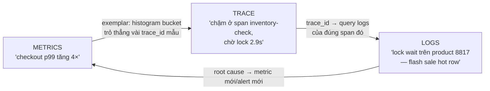

+++
title = "10.1. Ba trụ — Logging, Metrics, Tracing"
date = "2026-07-13T13:10:00+07:00"
draft = false
tags = ["backend", "system-design"]
series = ["System Design — Tư Duy Thiết Kế Hệ Thống"]
+++

## 1. Problem Statement

2h37 sáng, alert: "checkout error budget đang cháy". Người trực cần trả lời ba câu theo thứ tự: **có chuyện gì / ở đâu** (metrics — 30 giây), **chặng nào trong chuỗi 8 service** (trace — 2 phút), **chính xác chuyện gì đã xảy ra ở chặng đó** (logs — 5 phút). Thiếu trụ nào, thời gian ở bước đó nhân 10 — MTTR là hàm trực tiếp của chất lượng ba trụ ([3.1 §5 — MTTR quan trọng hơn MTBF](/series/system-design/03-availability-reliability/01-ha-failover/)). Chương này mổ cấu trúc từng trụ và cách chúng **nối vào nhau** — vì ba trụ rời rạc chỉ là ba đống dữ liệu.

## 2. Metrics — con số tổng hợp, rẻ, giữ lâu

**Bản chất:** chuỗi thời gian của các con số đã tổng hợp (counter, gauge, histogram) — mất chi tiết từng sự kiện, đổi lấy chi phí gần như không đổi theo traffic (đo 10 RPS hay 100K RPS, một histogram vẫn chừng đó bytes). Vì rẻ và ổn định, metrics là trụ **luôn bật, giữ dài hạn, và là nền của mọi alert** ([1.2](/series/system-design/01-foundations/02-sla-slo-sli/)).

- **Hai khung phổ quát:** RED cho service (Rate, Errors, Duration — theo endpoint/method) và USE cho tài nguyên (Utilization, Saturation, Errors — [1.5 §2.3](/series/system-design/01-foundations/05-bottleneck-analysis/)). Một service chuẩn phát đủ RED + pool/queue saturation là đã trả lời được 80% câu "có chuyện gì".
- **Histogram, không phải average** ([1.3 §3.2](/series/system-design/01-foundations/03-throughput-latency/)): percentile chỉ tính đúng từ histogram; trung bình của các average là con số vô nghĩa.
- **Cardinality là chi phí thật sự:** mỗi tổ hợp label là một chuỗi thời gian riêng — label `user_id` trên hệ triệu user = triệu series = hóa đơn nổ và query sập. Quy tắc: label chỉ nhận giá trị **đếm được trên đầu ngón tay nghìn** (endpoint, status, region); định danh cá thể (user, order, request) thuộc về logs/traces. Đây là lỗi thiết kế metric phổ biến và đắt nhất.

## 3. Logs — sự kiện rời rạc, giàu ngữ cảnh, đắt

**Bản chất:** bản ghi từng sự kiện — chi tiết tối đa, chi phí tỷ lệ thuận traffic (chính là dòng 11TB/năm của [1.4](/series/system-design/01-foundations/04-scale-estimation-capacity-planning/)). Ba kỷ luật biến log từ đống chữ thành công cụ:

1. **Structured (JSON), không phải chuỗi tự do:** `{"event": "payment_failed", "order_id": "...", "reason": "card_declined"}` query được, đếm được, alert được; `"Payment failed for order..."` chỉ grep được. Chuẩn hóa tên field toàn công ty (một bảng từ điển: `trace_id`, `user_id`, `duration_ms`...) — mỗi team một kiểu đặt tên là mỗi cuộc điều tra một lần dịch thuật.
2. **Mọi dòng log mang `trace_id`** — sợi chỉ nối ba trụ (§5); log không trace_id trong hệ phân tán là mảnh giấy rơi không biết của hồ sơ nào.
3. **Level có nghĩa vận hành:** ERROR = cần người xem (alert được), WARN = bất thường tự xử được, INFO = mốc nghiệp vụ, DEBUG = tắt ở production (bật có chủ đích khi điều tra). Hệ log toàn ERROR-không-ai-đọc là hệ đã mất trụ này mà chưa biết.

Cạm bẫy nghiêm trọng nhất của logs không phải kỹ thuật mà là **pháp lý**: log rò dữ liệu nhạy cảm (token, mật khẩu, số thẻ, thông tin cá nhân theo Nghị định 13/PCI-DSS — [Phần 11](/series/system-design/11-security/00-tong-quan/)) — masking phải nằm ở thư viện logging chung, không trông vào trí nhớ từng dev.

## 4. Traces — theo dấu một request xuyên hệ thống

**Bản chất:** mỗi request nhận một `trace_id` tại cửa vào; mỗi chặng xử lý (service, query, call) là một **span** có cha-con và thời lượng — ghép lại thành cây waterfall: nhìn một phát biết 3.2 giây của request này nằm ở đâu ([1.5 §3 — tracing trả lời "chặng nào" trong vài phút](/series/system-design/01-foundations/05-bottleneck-analysis/)). Đây là trụ *sinh ra cùng* microservices — monolith đọc một stack trace là xong, hệ 20 service thì tracing là bản đồ duy nhất.

- **Context propagation là điều kiện sống:** trace_id phải truyền qua *mọi* ranh giới — HTTP header (chuẩn W3C `traceparent`), message header của Kafka/RabbitMQ ([6.6 §4](/series/system-design/06-communication/06-event-driven/)), job payload ([12.3](/series/system-design/12-evolution/03-background-worker/)). Đứt ở đâu, cây cụt ở đó — và chỗ đứt phổ biến nhất chính là các đường async.
- **Sampling là bắt buộc ở scale** (trace đắt: mỗi request hàng chục span): giữ 100% lỗi + chậm bất thường, sample 1–10% phần còn lại — **tail-based sampling** (quyết định giữ/bỏ *sau khi* request xong, khi đã biết nó lỗi hay chậm) là mức trưởng thành đáng đầu tư vì đúng những request cần xem nhất luôn được giữ.

## 5. Sức mạnh nằm ở khớp nối — ba trụ như một hệ

Vòng điều tra chuẩn: **metric báo → exemplar dẫn sang trace → trace khoanh chặng → trace_id lọc log → root cause** — mỗi mũi tên là một liên kết phải *xây* (exemplar bật trong thư viện metric, trace_id trong mọi log, tool nhảy được giữa ba hệ). Ba trụ xịn mà thiếu ba mũi tên = người trực vẫn mò bằng tay giữa ba tab.

## 6. Trade-off

| | Metrics | Logs | Traces |
|---|---|---|---|
| Chi phí theo traffic | ~Hằng số (cẩn thận cardinality) | Tuyến tính — đắt nhất | Tuyến tính × độ sâu; sampling cứu |
| Độ chi tiết | Tổng hợp — mất cá thể | Từng sự kiện — đầy đủ nhất | Từng request — cấu trúc nhân quả |
| Trả lời tốt | Xu hướng, alert, capacity | "Chuyện gì đã xảy ra", audit | "Chậm/hỏng ở chặng nào" |
| Giữ được | Năm (downsample dần) | Ngày–tuần nóng, lạnh hóa phần còn lại | Ngày–tuần |
| Bẫy chi phí | Cardinality explosion | Log bừa + giữ nóng mãi | 100% sampling |

## 7. Production Considerations

- **Ba trụ vào service template** ([12.6 §3](/series/system-design/12-evolution/06-microservices/)): RED metrics, structured logger có masking + trace_id, auto-instrument tracing — dev viết service mới nhận đủ ba trụ miễn phí; trông vào tự giác từng team là nhận hệ tín hiệu thủng lỗ chỗ.
- **Observability nằm ngoài blast radius của thứ nó canh** ([13.5 — region outage](/series/system-design/13-production-failure-cases/05-infrastructure-failures/)): cụm monitoring chết cùng production là mù đúng lúc cần mắt; và tự giám sát pipeline tín hiệu (mất log/metric đột ngột phải alert — im lặng ≠ khỏe).
- Chi phí: quản trị **retention theo tầng** (nóng/ấm/lạnh — log 7 ngày query nhanh, 90 ngày object storage, hơn nữa theo compliance) và rà cardinality/log-volume theo service mỗi quý — observability bill là bill tăng âm thầm nhanh nhất sau data transfer.

## 8. Anti-patterns

- **Log làm metric** (đếm dòng ERROR thay vì counter) — đắt, trễ, gãy khi đổi format; và **metric làm log** (label user_id) — nổ cardinality: dùng sai trụ là trả giá của cả hai.
- **Trace chỉ trong HTTP, đứt ở queue** — đúng chỗ khó debug nhất (async) thì mất dấu ([6.6 §6](/series/system-design/06-communication/06-event-driven/)).
- **Log không kỷ luật rồi chữa bằng "tăng ngân sách ELK"** — vấn đề là *phát* bừa, không phải *chứa* thiếu.
- **DEBUG bật ở production "cho tiện"** — chi phí ×10 và nhấn chìm tín hiệu thật.
- **Ba hệ ba vendor không nối nhau** — có đủ ba trụ, không có vòng điều tra §5.

## 9. Khi nào đơn giản là đủ

Monolith một service: structured log + error tracker (Sentry) + RED metrics + uptime check là trọn bộ ([12.1](/series/system-design/12-evolution/01-monolith-postgresql/)) — tracing phân tán chưa có ranh giới nào để xuyên (một stack trace vẫn đủ). Trụ tracing kích hoạt cùng lúc với ranh giới service/async đầu tiên ([12.3 — job dashboard là hình thái đầu của nó](/series/system-design/12-evolution/03-background-worker/), [12.6 — bắt buộc trước service thứ hai](/series/system-design/12-evolution/06-microservices/)).

---

*Tiếp theo: [10.2. OpenTelemetry & pipeline tín hiệu](/series/system-design/10-observability/02-opentelemetry-pipeline/)*
