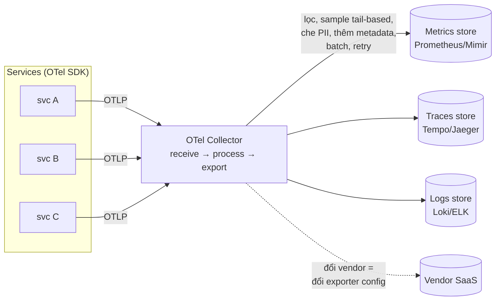

+++
title = "10.2. OpenTelemetry & pipeline tín hiệu — thu, xử lý, lưu, trả tiền"
date = "2026-07-13T13:20:00+07:00"
draft = false
tags = ["backend", "system-design"]
series = ["System Design — Tư Duy Thiết Kế Hệ Thống"]
+++

## 1. Problem Statement

Ba trụ ([10.1](/series/system-design/10-observability/01-ba-tru/)) sinh ra một dòng dữ liệu khổng lồ chảy liên tục từ mọi process — và ba câu hỏi hạ tầng: **thu bằng chuẩn nào** (để không viết lại instrumentation khi đổi backend), **vận chuyển và xử lý ở đâu** (lọc, sample, làm giàu, che nhạy cảm — trước khi trả tiền lưu), **lưu vào đâu với chi phí nào**. Trả lời tùy hứng ba câu này là cách các công ty tỉnh dậy với hóa đơn observability ngang hóa đơn compute và một mớ agent chồng chéo không ai dám tắt.

## 2. OpenTelemetry — chuẩn hóa lớp phát tín hiệu

**Vấn đề nó giải:** trước OTel, mỗi vendor một SDK — instrument bằng SDK của vendor X là *cưới* vendor X; đổi backend = mổ lại toàn bộ codebase. OTel tách đôi: **API/SDK chuẩn + semantic conventions** (tên field thống nhất: `http.request.method`, `db.system`...) ở phía code — **exporter** cắm được vào bất kỳ backend nào (Prometheus, Jaeger, Tempo, Datadog, vendor bất kỳ) ở phía ra. Code instrument một lần; quyết định backend thành quyết định *cấu hình*.

- **Auto-instrumentation** phủ sẵn framework phổ biến (HTTP server/client, DB driver, Kafka client...) — 80% giá trị với gần 0 công sức, và là thứ nên nằm trong service template ([10.1 §7](/series/system-design/10-observability/01-ba-tru/)). Manual span chỉ thêm cho nghiệp vụ quan trọng (span "reserve-inventory" quanh đoạn logic then chốt).
- **Context propagation chuẩn W3C** đi kèm — chính là sợi trace_id xuyên HTTP/queue của [10.1 §4](/series/system-design/10-observability/01-ba-tru/), nay là chuẩn chung mọi ngôn ngữ.
- Trạng thái trưởng thành (nên kiểm chứng tại thời điểm dùng): traces và metrics ổn định lâu; logs đến sau nhưng đã dùng được rộng — chiến lược thực dụng: **traces + metrics qua OTel ngay; logs qua structured logger hiện có gắn trace_id, hợp nhất dần**.

## 3. Collector — trạm trung chuyển đáng giá nhất của pipeline

Vì sao chen một tầng giữa app và backend — bốn việc chỉ làm tốt được ở đây:

1. **Tách app khỏi backend:** app chỉ biết OTLP → collector; mọi chuyện routing/đổi vendor/gửi song song hai nơi (lúc migrate) là config collector — app không deploy lại.
2. **Xử lý tập trung:** tail-based sampling ([10.1 §4](/series/system-design/10-observability/01-ba-tru/) — cần thấy *cả* trace mới quyết giữ/bỏ → phải làm ở collector, không làm được trong từng app), che PII lớp thứ hai ([10.1 §3](/series/system-design/10-observability/01-ba-tru/)), lọc bỏ tín hiệu rác *trước khi* trả tiền lưu, gắn metadata hạ tầng (region, cluster, version).
3. **Đệm và backpressure:** backend chết/chậm — collector buffer + retry, app không bị nghẽn theo ([13.4 — cô lập](/series/system-design/13-production-failure-cases/04-distributed-failures/)); telemetry phải là **fire-and-forget** với app: không bao giờ để việc *ghi nhận* sự cố gây thêm sự cố.
4. **Một điểm giám sát dòng tín hiệu:** đo được bao nhiêu GB log/service/ngày — dữ liệu cho quản trị chi phí (§4).

Triển khai điển hình: agent per-node (DaemonSet) thu local + gateway cluster xử lý nặng (tail sampling cần gom đủ span một trace về một chỗ).

## 4. Bài toán chi phí — thiết kế tín hiệu như thiết kế dữ liệu

Ba đòn bẩy lớn theo thứ tự hiệu quả:

1. **Phát ít đi (tốt nhất):** rà log INFO lải nhải trong vòng lặp, span cho mọi hàm getter, metric cardinality thừa — [10.1 §6](/series/system-design/10-observability/01-ba-tru/); ngân sách tín hiệu per-service (GB/ngày) công khai như ngân sách compute.
2. **Sample và lọc ở collector:** tail-based cho trace; với log — giữ 100% WARN+, sample INFO lặp lại (log dedup); drop tín hiệu của health check/probe (một nguồn rác kinh điển chiếm 10–30% volume).
3. **Lưu theo tầng:** nóng (query nhanh, 7–14 ngày) → lạnh (object storage, rẻ ×10, chậm chấp nhận được) → xóa theo chính sách ([3.2 §4 — kỳ giữ có chủ đích](/series/system-design/03-availability-reliability/02-backup-recovery/)); các stack thế hệ object-storage (Loki, Tempo, Mimir) sinh ra quanh đúng ý tưởng này.

## 5. Trade-off

| Quyết định | Được | Giá |
|---|---|---|
| Chuẩn OTel thay vì SDK vendor | Không khóa vendor; một ngôn ngữ tín hiệu toàn công ty | Lớp trừu tượng thêm; tính năng độc quyền vendor có thể phải chờ |
| Collector ở giữa | Bốn giá trị §3 | Một tầng phải vận hành + chính nó phải HA (nó chết là mù) |
| Tail-based sampling | Giữ đúng trace đáng xem, chi phí giảm bậc | Collector stateful hơn (gom trace), phức tạp hơn head-based |
| Self-host stack (Prometheus/Loki/Tempo/Grafana) | Rẻ ở scale lớn, chủ quyền dữ liệu | Một *hệ thống phân tán nữa* để nuôi — người mới đông thì SaaS trước ([chương 00 — build vs buy](/series/system-design/00-tu-duy-thiet-ke/)) |
| SaaS vendor | Nhanh, đủ đồ, khỏi vận hành | Bill theo volume — tăng âm thầm; egress + lock-in mềm |

## 6. Production Considerations

- **Giám sát pipeline tín hiệu bằng chính nó:** collector queue depth, export failure, drop rate; và "meta-alert" — service đang sống mà *im bặt* tín hiệu là alert, không phải bình yên ([10.1 §7](/series/system-design/10-observability/01-ba-tru/)).
- Collector HA: nhiều replica sau LB cho gateway; agent per-node tự phục hồi; đừng để trạm trung chuyển thành SPOF của khả năng nhìn.
- **Che PII ở hai lớp** (logger trong app + processor ở collector) — lớp hai bắt những gì lớp một sót; compliance log ([Phần 11](/series/system-design/11-security/00-tong-quan/)) audit ở đây.
- Chuẩn semantic conventions nội bộ *mở rộng* OTel (field nghiệp vụ: `order.id`, `tenant.id`) thành văn bản một trang — chuẩn đặt tên là hạ tầng rẻ nhất mà giá trị lâu nhất.
- Rà chi phí mỗi quý theo service (collector cho số liệu): tăng trưởng volume tín hiệu > tăng trưởng traffic là mùi thiết kế xấu đang lan.

## 7. Anti-patterns

- **Instrument thẳng bằng SDK vendor khắp codebase** — chi phí thoát tăng theo từng dòng code; OTel tồn tại để tránh đúng điều này.
- **App gửi thẳng backend không qua collector** ở hệ nhiều service — mất cả bốn giá trị §3, và ngày backend chậm là ngày app nghẽn theo.
- **Giữ mọi thứ mãi mãi ở tầng nóng** — hóa đơn quan sát vượt hóa đơn được-quan-sát.
- **Hai ba agent chồng nhau trên một node** (di sản nhiều đời vendor) — CPU/RAM hao, tín hiệu trùng, không ai dám tắt cái nào: hợp nhất về một đường OTel là dự án trả nợ đáng làm.
- **Bỏ qua semantic conventions** — mỗi service một kiểu tên field: có chuẩn mà không dùng thì như không có chuẩn.

## 8. Khi nào đơn giản là đủ

Monolith + ít service: SDK Prometheus + structured log + Sentry, chưa cần collector — pipeline riêng kích hoạt khi (a) số service đủ đông để chuẩn hóa thành vấn đề, (b) chi phí tín hiệu thành dòng đáng kể trong bill, hoặc (c) cần tail sampling/lọc tập trung. Như mọi tầng hạ tầng khác trong tài liệu này: thêm khi có bằng chứng, và OTel-từ-ngày-1 chỉ đáng ở một điểm — **dùng chuẩn đặt tên và API của nó ngay từ đầu**, vì đó là phần miễn phí mà sửa sau đắt nhất.

---

*Tiếp theo: [10.3. Dashboard, Alerting & On-call](/series/system-design/10-observability/03-dashboard-alerting-oncall/)*
