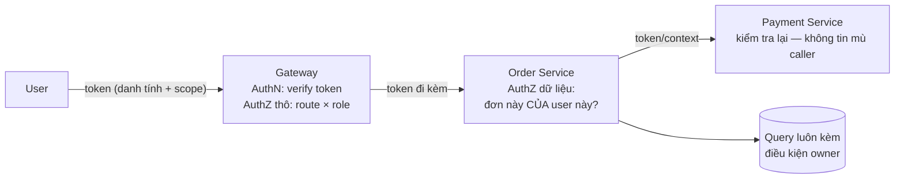

+++
title = "11.1. Authentication & Authorization — bạn là ai, bạn được làm gì"
date = "2026-07-13T13:50:00+07:00"
draft = false
tags = ["backend", "system-design"]
series = ["System Design — Tư Duy Thiết Kế Hệ Thống"]
+++

## 1. Problem Statement

Mọi request chạm hệ thống phải được trả lời hai câu **khác nhau về bản chất**: *bạn là ai* (Authentication — xác thực danh tính) và *bạn được làm gì* (Authorization — kiểm tra quyền). Trộn hai câu này — hoặc trả lời câu hai bằng niềm tin "đã qua cửa là được tất" — là gốc của lớp lỗ hổng phổ biến và tàn phá nhất trong thực tế: **broken access control** (nhiều năm liền đứng đầu OWASP Top 10), mà điển hình là IDOR — user A đổi `order_id` trên URL và đọc được đơn của user B, vì hệ chỉ hỏi "đã đăng nhập chưa" mà quên hỏi "đơn này *của* ai".

## 2. Authentication — tập trung hóa và các quyết định nền

**AuthN nên tập trung một nơi** (identity service / IdP — tự xây trên chuẩn hoặc dùng Keycloak/Auth0/Cognito): một chỗ lưu credential, một chỗ làm MFA, một chỗ audit đăng nhập, một chỗ vá khi có chuyện. N service tự làm login là N bản sao của những lỗi giống nhau.

Các quyết định nền phải đúng từ đầu (vì sửa sau là migration đau):

- **Mật khẩu:** hash bằng thuật toán *chậm có chủ đích* (bcrypt/scrypt/argon2 — không bao giờ MD5/SHA thuần: hash nhanh là hash brute-force được); không giới hạn độ dài kỳ quặc; khuyến khích passphrase + MFA thay vì luật ký-tự-đặc-biệt lỗi thời.
- **Chống credential stuffing:** rate limit theo tài khoản *và* theo IP ([11.3](/series/system-design/11-security/03-gateway-ratelimit-waf/)), khóa lũy tiến, thông báo đăng nhập lạ — vì phần lớn "hack tài khoản" là thử lại mật khẩu rò từ nơi khác.
- **Session lifecycle là một phần của AuthN:** đăng nhập tạo phiên — nhưng *thu hồi* phiên (logout, đổi mật khẩu, phát hiện xâm nhập) mới là phần phân biệt thiết kế tốt và tồi — chi tiết ở [11.2 §3 — session vs JWT](/series/system-design/11-security/02-oauth2-jwt/).
- **Service-to-service cũng là AuthN:** service gọi nhau phải có danh tính máy (mTLS/service account + token ngắn hạn — [6.3 §6](/series/system-design/06-communication/03-grpc/)) — mạng nội bộ "tin nhau vì cùng VPC" là mô hình đã chết cùng thời perimeter security.

## 3. Authorization — phần khó hơn, và vì sao không được tập trung hết

AuthZ có hai tầng, và tách được hai tầng này là hiểu được bài toán:

1. **Quyền thô (coarse-grained):** "role này gọi được API này không" — tập trung được ở gateway/middleware ([11.3](/series/system-design/11-security/03-gateway-ratelimit-waf/)): RBAC (quyền theo vai — đủ cho 80% hệ), ABAC (theo thuộc tính — khi vai bùng nổ tổ hợp).
2. **Quyền theo dữ liệu (fine-grained):** "user này đọc được *đơn hàng này* không" — **bắt buộc nằm tại service sở hữu dữ liệu**, vì chỉ nó biết đơn thuộc về ai. Đây chính là chỗ IDOR sống: gateway đã check "user hợp lệ, endpoint được phép" nhưng không thể biết `order_id=8817` của ai. Quy tắc sắt: **mọi query đọc/ghi dữ liệu theo id phải kèm điều kiện chủ sở hữu** (`WHERE id = ? AND user_id = ?` — hoặc tương đương ở tầng repository, làm một lần trong base class thay vì trông vào trí nhớ mỗi dev).

**Trong hệ phân tán, AuthZ context phải chảy theo request:** service B nhận call từ service A đang làm việc *thay mặt user nào, với quyền gì*? Truyền token gốc (hoặc token đã đổi phạm vi — token exchange) xuống chuỗi call, **không** để service B tin mù service A ([12.6 — service tự trị cả về trust](/series/system-design/12-evolution/06-microservices/)); và các consumer async cũng vậy — event mang theo ngữ cảnh chủ quyền để consumer kiểm tra lại được ([6.6 §7 — envelope](/series/system-design/06-communication/06-event-driven/)).

## 4. Trade-off

| Quyết định | Được | Giá |
|---|---|---|
| IdP tập trung | Một chỗ đúng, MFA/audit/vá một nơi | SPOF danh tính — IdP chết là không ai đăng nhập được: HA của IdP là hạng nhất ([3.1](/series/system-design/03-availability-reliability/01-ha-failover/)); và IdP bị chiếm là thảm họa cấp cao nhất |
| RBAC | Đơn giản, dễ audit, dễ giải thích | Bùng nổ role khi tổ chức phức tạp ("role explosion") |
| ABAC/policy engine (OPA...) | Biểu đạt giàu, policy tách khỏi code | Một hệ nữa để nuôi; policy khó debug — "vì sao bị từ chối" thành cuộc điều tra |
| AuthZ dữ liệu tại service | Đúng nơi có tri thức chủ quyền | Không audit tập trung được hết — bù bằng chuẩn code + review + test |
| Mua IdP (Auth0/Cognito) vs tự host (Keycloak) | Mua: nhanh, vá hộ; tự host: chủ quyền, rẻ ở scale | Mua: bill theo MAU + lock-in; tự host: bạn là người vá lỗ hổng lúc nửa đêm |

## 5. Production Considerations

- **Audit log cho mọi sự kiện danh tính & quyền** (đăng nhập, cấp/thu quyền, truy cập dữ liệu nhạy) — bất biến, giữ theo compliance ([1.1 §3.2](/series/system-design/01-foundations/01-requirements/)), và *được xem* (alert mẫu bất thường: một tài khoản đọc tuần tự 10K hồ sơ — [10.3](/series/system-design/10-observability/03-dashboard-alerting-oncall/)).
- **Quy trình thu hồi khẩn** đã tập dượt: nhân viên nghỉ, token rò, laptop mất — trong bao nhiêu phút mọi phiên/khóa liên quan chết? Đây là RTO của security ([12.10 tinh thần drill](/series/system-design/12-evolution/10-disaster-recovery/)).
- Test AuthZ như test nghiệp vụ: mỗi endpoint có test "user khác gọi → 403/404" — IDOR bị chặn bằng test rẻ hơn bằng pentest, và rẻ hơn nữa so với bằng báo chí.
- Break-glass: đường truy cập khẩn khi IdP chết (tài khoản cục bộ niêm phong, quy trình hai người) — có, niêm phong, và audit mỗi lần mở.

## 6. Anti-patterns

- **"Đã đăng nhập = được phép"** — thiếu hẳn tầng AuthZ dữ liệu: IDOR mở toang.
- **AuthZ chỉ ở frontend** (ẩn nút Delete) — kẻ tấn công không dùng frontend của bạn.
- **Service nội bộ tin nhau vô điều kiện** — một service bị chiếm là cả mạng nội bộ thành sân nhà kẻ tấn công (lateral movement).
- **Check quyền rải rác tùy hứng trong code** — mỗi endpoint một kiểu, sót là thủng; chuẩn hóa vào middleware + repository base.
- **Trả 403 lộ thông tin** ("bạn không có quyền xem đơn này" xác nhận đơn *tồn tại*) — với tài nguyên nhạy cảm, 404 cho cả không-tồn-tại lẫn không-có-quyền.
- **Tự viết lớp crypto/hash/so sánh token** — dùng thư viện chuẩn; kể cả phép so sánh chuỗi cũng phải constant-time để tránh timing attack.

## 7. Khi nào đơn giản là đủ

App nội bộ ít người: SSO với Google Workspace/AD của công ty (một buổi chiều cấu hình) + RBAC hai vai — đừng tự xây user store khi tổ chức đã có sẵn danh tính. Điều **không bao giờ** được đơn giản hóa dù ở MVP: hash mật khẩu đúng thuật toán, AuthZ dữ liệu kèm owner, và không log secret — ba thứ này miễn phí ở ngày 1 và không mua lại được sau sự cố ([12.1 — những thứ phải đúng từ đầu](/series/system-design/12-evolution/01-monolith-postgresql/)).

---

*Tiếp theo: [11.2. OAuth2, OIDC & JWT](/series/system-design/11-security/02-oauth2-jwt/)*
