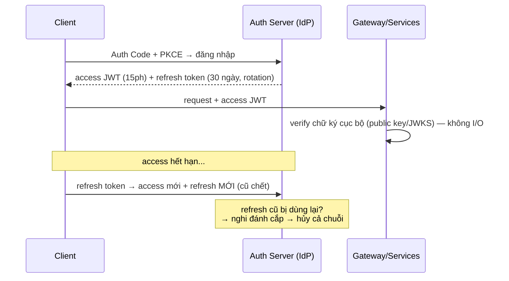

+++
title = "11.2. OAuth2, OIDC & JWT — ủy quyền và token trong hệ phân tán"
date = "2026-07-13T14:00:00+07:00"
draft = false
tags = ["backend", "system-design"]
series = ["System Design — Tư Duy Thiết Kế Hệ Thống"]
+++

## 1. Problem Statement

Ba bài toán token của mọi hệ hiện đại: app bên thứ ba cần truy cập dữ liệu user *mà không cầm mật khẩu của user* (ủy quyền — OAuth2); nhiều ứng dụng cần *cùng một* đăng nhập (SSO — OIDC); và N service cần xác minh danh tính người gọi *mà không gọi về trung tâm mỗi request* (token tự xác minh — JWT). Ba bài, một họ chuẩn — và một bãi mìn thuật ngữ nơi "dùng JWT" và "dùng OAuth" bị nói như thể là quyết định một chữ, trong khi mỗi lựa chọn con bên trong (flow nào, token sống bao lâu, thu hồi thế nào) mới là nơi an toàn được quyết định.

## 2. OAuth2 & OIDC — phân vai chuẩn xác

**OAuth2 là giao thức ỦY QUYỀN** (authorization): user (resource owner) cho phép app (client) truy cập tài nguyên của mình ở một dịch vụ (resource server), thông qua trọng tài (authorization server) — kết quả là **access token có phạm vi (scope) và hạn dùng**, không phải mật khẩu. **OIDC là lớp mỏng trên OAuth2 biến nó thành giao thức XÁC THỰC**: thêm `id_token` (một JWT mô tả *user là ai*) — nền của "Login with Google" và SSO doanh nghiệp. Nhớ ngắn: OAuth2 trả lời *được làm gì*, OIDC trả lời *là ai* — dùng OAuth2 thuần làm đăng nhập là dùng sai lớp (lỗ hổng kinh điển thời tiền-OIDC).

**Chọn flow — quyết định số một, đơn giản hơn vẻ ngoài của nó:**

| Tình huống | Flow đúng | Ghi chú |
|---|---|---|
| Web app, SPA, mobile — mọi thứ có user đăng nhập | **Authorization Code + PKCE** | Mặc định duy nhất nên nhớ; PKCE chặn đánh cắp code, giờ khuyến nghị cho *mọi* client |
| Service gọi service (không có user) | **Client Credentials** | Danh tính máy; đi cùng mTLS càng tốt ([11.1 §2](/series/system-design/11-security/01-authn-authz/)) |
| Thiết bị không bàn phím (TV, CLI) | Device Code | Nhập mã trên máy khác |
| ~~Implicit / Resource Owner Password~~ | **Không dùng** | Di sản đã bị khai tử trong khuyến nghị hiện hành — gặp trong hệ cũ là gặp việc phải trả nợ |

## 3. Session vs JWT — trade-off trung tâm của token

Sau khi xác thực, "phiên" của user sống ở đâu?

- **Session server-side:** cookie chứa id ngẫu nhiên → tra Redis/DB mỗi request. Thu hồi **tức thời** (xóa bản ghi là phiên chết); nhược: mỗi request một lượt tra ([5.4 — đúng việc của Redis](/series/system-design/05-data-layer/04-redis/)), và hệ phân tán nhiều service thì mọi service phải với tới session store.
- **JWT stateless:** token *tự chứa* claims (user, scope, hạn) + chữ ký của IdP → service nào cũng **tự xác minh bằng public key, không I/O** — quà tặng cho microservices ([12.6](/series/system-design/12-evolution/06-microservices/)): gateway và mọi service verify cục bộ, không gọi về trung tâm. Cái giá đối xứng: **không thu hồi được trước hạn** — token đã ký là đã ký, "logout" phía server không làm nó hết hiệu lực.

**Lời giải chín của ngành — lai hai mô hình:** access token JWT **ngắn hạn** (5–15 phút — cửa sổ rủi ro khi rò bị chặn trần) + **refresh token dài hạn, stateful, thu hồi được** (lưu server-side; kèm *rotation*: mỗi lần dùng cấp cái mới, cái cũ chết — refresh token bị dùng lại là tín hiệu đánh cắp, thu hồi cả chuỗi). Được cả hai: verify không I/O trên đường nóng, thu hồi thật ở điểm làm mới; "logout mọi thiết bị" = hủy refresh tokens + chờ access token tự hết trong ≤15 phút — cửa sổ mà đa số nghiệp vụ chấp nhận, và nghiệp vụ *không* chấp nhận (đổi mật khẩu sau nghi ngờ xâm nhập, khóa tài khoản gian lận) thì thêm **denylist theo `jti` cho đúng các sự kiện đó** — nhỏ, hiếm khi tra, không phải quay lại session-per-request.

## 4. JWT — các quy tắc sống còn khi triển khai

- **Verify đủ bộ, bằng thư viện chuẩn:** chữ ký (thuật toán *pin cứng* — chấp nhận đúng RS256/ES256 mong đợi; họ lỗ hổng `alg: none`/đổi thuật toán đều khai thác verifier dễ dãi), `exp`, `iss`, `aud` (token cấp cho service A không được service B chấp nhận — thiếu check `aud` là token dùng chéo được khắp nơi).
- **Claims tối thiểu:** JWT đi trong header của *mọi* request và **chỉ được mã hóa base64 — đọc được bởi bất kỳ ai cầm nó**: không nhét PII/quyền chi tiết/dữ liệu nhạy; sub + scope + tenant là đủ, phần còn lại tra khi cần.
- **Khóa ký là secret hạng nhất của cả công ty:** ký bất đối xứng (private ở IdP, public phát qua JWKS endpoint), **rotation định kỳ** qua `kid` — hai khóa sống song song lúc chuyển giao; quy trình rotation phải có *trước* khi cần khẩn cấp ([12.10 — quyết trước lúc bình tĩnh](/series/system-design/12-evolution/10-disaster-recovery/)).
- **Clock skew:** verify `exp/nbf` có leeway nhỏ (~1–2 phút) — đồng hồ giữa các máy lệch là chuyện đã học ([4.4 §7 — JWT hỏng âm thầm khi đồng hồ lệch](/series/system-design/04-distributed-systems/04-clock-partition-split-brain/)).
- Lưu token phía browser: ưu tiên cookie `HttpOnly + Secure + SameSite` (miễn nhiễm XSS đọc trộm, cần chống CSRF) hơn localStorage (XSS đọc được sạch).

## 5. Trade-off

| Quyết định | Được | Giá |
|---|---|---|
| JWT ngắn + refresh rotation | Verify không I/O + thu hồi thật | Phức tạp hơn session thuần; client phải xử lý refresh mượt |
| Access token sống dài (nhiều giờ) | Ít lượt refresh | Cửa sổ rủi ro rò dài tương ứng — đừng, trừ token máy-máy scope hẹp |
| Session thuần (không JWT) | Đơn giản nhất, thu hồi tức thời | Mỗi request một I/O; nhiều service = session store chung thành coupling ([app một cụm thì đây vẫn là lựa chọn tốt](/series/system-design/11-security/01-authn-authz/)) |
| OIDC qua IdP có sẵn vs tự làm login | Chuẩn, MFA/SSO/audit có sẵn | Phụ thuộc + bill; nhưng "tự làm cho chủ động" hiếm khi thắng ở tổng chi phí ([README §3 — không tự chế](/series/system-design/11-security/00-tong-quan/)) |

## 6. Production Considerations

- **JWKS endpoint là hạ tầng sống còn:** service cache public key (có TTL + refresh nền) — IdP chết thì verify *vẫn chạy* nhờ cache, nhưng key rotation cần lan kịp: TTL cache là trade-off giữa hai điều đó.
- Giám sát: tỷ lệ token hết hạn/không hợp lệ theo service (tăng đột biến = clock lệch, key rotation hỏng, hoặc đang bị dò), tuổi refresh token, số lần refresh-reuse bị bắt ([10.1 — metric có nghĩa vận hành](/series/system-design/10-observability/01-ba-tru/)).
- Token cho async: job/event xử lý *sau nhiều phút* thì access token 15 phút đã chết — đừng nhét token user vào message; consumer dùng danh tính máy + ngữ cảnh chủ quyền trong payload ([11.1 §3](/series/system-design/11-security/01-authn-authz/), [6.6 §7](/series/system-design/06-communication/06-event-driven/)).
- Rà quyền scope định kỳ: scope là least-privilege của token ([README §2](/series/system-design/11-security/00-tong-quan/)) — token "toàn quyền cho tiện" là chìa khóa vạn năng đang chờ rơi.

## 7. Anti-patterns

- **JWT sống 24h không refresh, không denylist** — rò một token là 24h tự do của kẻ cầm; "stateless" không phải cớ cho "không thu hồi được".
- **Nhét cả hồ sơ user + bảng quyền vào claims** — token phình (đi kèm *mọi* request), lộ dữ liệu, và quyền *đóng băng* đến hết hạn token dù DB đã đổi.
- **Verify thiếu `aud`/`iss`** — token của app này dùng được ở app kia.
- **Refresh token không rotation, sống vĩnh viễn trong localStorage** — mục tiêu ngọt nhất cho XSS.
- **Tự phát minh định dạng token/chữ ký** — [README §3](/series/system-design/11-security/00-tong-quan/); kể cả "chỉ HMAC cái id thôi mà".
- **Coi OAuth2 scope là AuthZ đầy đủ** — scope là quyền *thô* của client; quyền theo dữ liệu vẫn ở service ([11.1 §3](/series/system-design/11-security/01-authn-authz/) — IDOR không quan tâm bạn dùng chuẩn gì).

## 8. Khi nào đơn giản là đủ

App web một khối, một domain, không API cho bên thứ ba: **session cookie truyền thống + SSO OIDC với IdP có sẵn** là kiến trúc đúng — JWT tự quản không mua thêm gì ngoài độ phức tạp ([5.4 — session trong Redis](/series/system-design/05-data-layer/04-redis/)). Bộ máy đầy đủ của chương (JWT + refresh rotation + JWKS) kích hoạt cùng những ranh giới quen thuộc: nhiều service verify độc lập, mobile app, API mở cho đối tác — đúng nhịp [12.6](/series/system-design/12-evolution/06-microservices/).

---

*Tiếp theo: [11.3. Biên phòng thủ — API Gateway, Rate Limiting, WAF](/series/system-design/11-security/03-gateway-ratelimit-waf/)*
