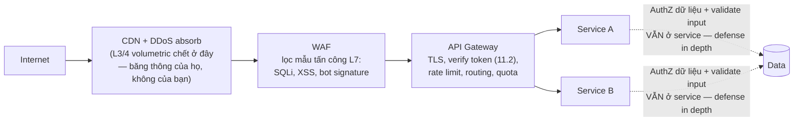

+++
title = "11.3. Biên phòng thủ — API Gateway, Rate Limiting, WAF"
date = "2026-07-13T14:10:00+07:00"
draft = false
tags = ["backend", "system-design"]
series = ["System Design — Tư Duy Thiết Kế Hệ Thống"]
+++

## 1. Problem Statement

Internet là môi trường thù địch mặc định: bot chiếm phần lớn traffic của nhiều site, credential stuffing chạy 24/7, scraper hút catalog, và thi thoảng một chiến dịch DDoS thật sự. Nếu mỗi service tự xử lý các mối lo này, ta có N bản cài đặt lệch nhau của cùng các phòng thủ ([11.1 §2 — cùng lý do tập trung AuthN](/series/system-design/11-security/01-authn-authz/)). Biên (edge) tồn tại để **gom các mối quan tâm cắt ngang về một tuyến phòng thủ có tầng** — để service phía sau tập trung vào nghiệp vụ, và để "một chỗ vá" khi có chuyện.

## 2. Kiến trúc biên — các tầng và phân vai

Nguyên tắc phân vai: **biên lọc cái *chung* (mẫu tấn công, danh tính, tần suất); service giữ cái *riêng* (chủ quyền dữ liệu, logic nghiệp vụ)**. Biên là lớp *giảm tải*, không phải lớp *thay thế* — mọi service vẫn phải validate input và check owner như thể không có biên ([README §1 — defense in depth](/series/system-design/11-security/00-tong-quan/)): WAF bị bypass (luôn có cách), gateway cấu hình sót một route — lớp trong phải tự đứng được.

**API Gateway** gom: TLS termination, verify JWT ([11.2 §6 — cache JWKS](/series/system-design/11-security/02-oauth2-jwt/)), AuthZ thô theo route ([11.1 §3](/series/system-design/11-security/01-authn-authz/)), rate limit/quota, request validation theo schema, và routing ([12.6 — nơi nó xuất hiện trong tiến hóa](/series/system-design/12-evolution/06-microservices/)). Ranh giới đạo đức của gateway: **điều phối, không nghiệp vụ** — gateway bắt đầu chứa if-else theo domain là bắt đầu thành God Service kiêm SPOF logic ([6.7 §8 — cùng bệnh với orchestrator phình](/series/system-design/06-communication/07-saga/)).

**WAF** lọc mẫu tấn công đã biết ở L7 (SQLi, XSS, path traversal, bot signature). Sự thật thực dụng: WAF là **lưới giảm nhiễu và câu giờ** (chặn khai thác hàng loạt lỗ hổng vừa công bố trong lúc bạn vá — giá trị thật và đo được), không phải bằng chứng an toàn — app tự vá lỗi injection bằng parameterized query/escape đúng ở tầng code, WAF chỉ là lớp ngoài của defense in depth. Chế độ triển khai: bắt đầu *detect-only*, xem false positive trên traffic thật (một rule quá tay chặn nhầm form hợp lệ = mất đơn hàng thật), rồi mới *block* dần theo rule.

## 3. Rate Limiting — thuật toán, khóa, và phản hồi

Rate limiting phục vụ **cả security lẫn reliability** ([13.1 — thundering herd](/series/system-design/13-production-failure-cases/01-caching-failures/), [13.3 — retry storm](/series/system-design/13-production-failure-cases/03-messaging-failures/)) — cùng một cơ chế, hai người hưởng.

- **Thuật toán:** token bucket là mặc định đúng — cho *burst có trần* (bucket đầy) + *tốc độ dài hạn* (tốc độ nạp token): khớp hành vi thật của client tốt hơn fixed window (bùng đôi ở ranh giới cửa sổ) và mượt hơn sliding window log (đắt bộ nhớ). Cài đặt phân tán: Redis + Lua script atomic ([5.4 §7 — đúng việc của nó](/series/system-design/05-data-layer/04-redis/)); chấp nhận *xấp xỉ* khi cần rẻ (đếm per-node × hệ số) — rate limit là công cụ chặn lạm dụng, không phải sổ kế toán.
- **Khóa theo gì — quyết định quan trọng hơn thuật toán:** theo IP (thô — NAT/CGNAT gom nghìn user một IP, [2.2 §6 — cùng bẫy với sticky IP](/series/system-design/02-scalability/02-load-balancer/)), theo user/API key (đúng nhất khi đã AuthN), theo tenant (SaaS — chống noisy neighbor, [Phần 14 — SaaS case](/series/system-design/14-case-studies/00-tong-quan/)), và **xếp tầng**: chưa đăng nhập → IP chặt; đã đăng nhập → theo user rộng hơn; endpoint nhạy (login, OTP, đặt hàng) → thêm giới hạn riêng chặt hơn nữa ([11.1 §2 — chống credential stuffing](/series/system-design/11-security/01-authn-authz/)).
- **Phản hồi tử tế:** 429 + `Retry-After` (có jitter — dạy client cư xử, [13.1 §case 3](/series/system-design/13-production-failure-cases/01-caching-failures/)) + header quota còn lại — client tốt tự điều tiết, đỡ cho cả hai bên; và **phân biệt limit (chặn lạm dụng) với quota (gói thương mại)** — cùng cơ chế, khác chính sách và khác thông điệp lỗi.

## 4. Trade-off

| Quyết định | Được | Giá |
|---|---|---|
| Gateway tập trung | Một chỗ đúng cho mối quan tâm chung; service gọn | Thêm một hop (+ms); SPOF tiềm năng — gateway phải HA và *mỏng*; nguy cơ phình thành God Service |
| WAF managed (CDN-tích-hợp) | Rule cập nhật hộ, DDoS absorb kèm | Bill + false positive phải tự tune; ảo giác "có WAF là an toàn" |
| Rate limit chính xác (Redis tập trung) | Đúng từng request | Mọi request thêm một lượt Redis — chính nó thành bottleneck/SPOF; cần local cache + fail-open có chủ đích |
| Fail-open vs fail-closed khi tầng biên lỗi | Open: user không bị chặn oan; Closed: an toàn tuyệt đối | Open: cửa sổ không phòng thủ; Closed: sự cố biên = sập toàn bộ. Chọn theo endpoint: login/OTP fail-closed, browse fail-open — quyết định *trước*, thành config ([12.10 — quyết lúc bình tĩnh](/series/system-design/12-evolution/10-disaster-recovery/)) |

## 5. Production Considerations

- **Biên là điểm quan sát an ninh số một:** tỷ lệ 429/403/401 theo endpoint và theo nguồn, top IP/user bị chặn, mẫu WAF khớp — dashboard riêng, alert theo *đột biến* (credential stuffing hiện hình là 401 tăng vọt ở login — [10.3 §2](/series/system-design/10-observability/03-dashboard-alerting-oncall/)).
- **Đừng để rate limit làm mù chính mình:** health check, probe của monitoring phải được miễn/khóa riêng — kịch bản "monitoring bị chính rate limit chặn đúng lúc sự cố" có thật và cay đắng.
- Gateway HA như LB ([2.2 §6 — LB tự dựng một node](/series/system-design/02-scalability/02-load-balancer/)): nhiều replica, và config gateway là code (version, review, rollback — một dòng route sai ở đây có bán kính bằng cả hệ thống).
- Diễn tập tầng biên: giả lập chiến dịch bot ở staging (kịch bản credential stuffing, scraping) — xem tầng nào bắt được ở đâu, con số nào nhảy trên dashboard; phòng thủ chưa từng thấy tấn công là phòng thủ trên giấy ([12.10 tinh thần drill](/series/system-design/12-evolution/10-disaster-recovery/)).
- DDoS thật sự lớn: việc của CDN/provider (băng thông của họ tính bằng Tbps) — kế hoạch của bạn là *bật chế độ under-attack và liên hệ họ*, không phải tự đỡ; ghi số hotline vào runbook.

## 6. Anti-patterns

- **Nghiệp vụ trong gateway** (kiểm tra tồn kho, tính giá ở "middleware chung") — God Service tái sinh ở biên: mọi thay đổi nghiệp vụ đi qua đội gateway, và gateway deploy là cả công ty nín thở.
- **Chỉ có biên, ruột rỗng:** qua được gateway là service tin tuyệt đối — một SSRF/misconfig nội bộ là toàn mạng thất thủ; defense in depth không phải khẩu hiệu ([11.1 §6 — service tin nhau mù](/series/system-design/11-security/01-authn-authz/)).
- **Rate limit một con số toàn cục** ("1000 req/phút cho mọi API") — quá chặt cho browse, quá lỏng cho login; limit là chính sách *per-endpoint-class*.
- **WAF bật full-block ngày đầu trên traffic thật** — false positive chặn khách thật, và bài học được rút bằng doanh thu.
- **Miễn trừ nội bộ vĩnh viễn** ("IP văn phòng bỏ qua mọi limit") — VPN văn phòng bị chiếm là mọi phòng thủ thành trang trí; miễn trừ cũng có vòng đời và audit.
- **Chặn im lặng (drop) thay vì 429 có Retry-After** với client hợp pháp — client không biết gì, retry dày hơn, hai bên cùng thiệt ([13.3](/series/system-design/13-production-failure-cases/03-messaging-failures/)).

## 7. Khi nào đơn giản là đủ

App nhỏ một service: CDN phổ thông (đã kèm DDoS cơ bản + WAF rule sẵn) + rate limit bằng middleware trong app (thư viện có sẵn của framework) + reverse proxy làm TLS — ba việc một buổi chiều, phủ 80% rủi ro biên ([12.1](/series/system-design/12-evolution/01-monolith-postgresql/)). API Gateway đúng nghĩa kích hoạt cùng microservices ([12.6](/series/system-design/12-evolution/06-microservices/)); WAF tune sâu và bot management kích hoạt khi có thứ đáng cào (catalog, giá) hoặc compliance yêu cầu. Như toàn bộ tài liệu này: **biên mọc theo giá trị tài sản phía sau nó** — và lớp không bao giờ được bỏ qua vẫn là lớp trong cùng: query có owner, input được validate, secret không nằm trong code.

---

*Hết Phần 11. Quay lại [mục lục chính](/series/system-design/00-muc-luc/).*
