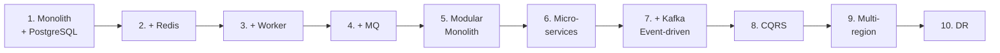

+++
title = "Phần 12 — System Design Evolution"
date = "2026-07-13T14:20:00+07:00"
draft = false
tags = ["backend", "system-design"]
series = ["System Design — Tư Duy Thiết Kế Hệ Thống"]
+++

> Chương quan trọng nhất của tài liệu. Mọi khái niệm ở các phần trước được đặt vào một câu chuyện duy nhất, kể từ đầu đến cuối.

## Hệ thống xuyên suốt: sàn E-commerce "VietShop"

Chúng ta theo chân một sàn thương mại điện tử Việt Nam từ ngày đầu tiên đến khi phục vụ hàng chục triệu người dùng. Chọn e-commerce vì nó chứa đủ các bài toán kinh điển: read-heavy (duyệt sản phẩm), tranh chấp ghi (tồn kho), tiền bạc (không được sai), spike cực đoan (flash sale), tác vụ nền (email, ảnh), tìm kiếm, và báo cáo.

**Nguyên tắc kể chuyện:** không giai đoạn nào được nhảy cóc. Mỗi giai đoạn chỉ bắt đầu khi giai đoạn trước **thực sự gãy** — có triệu chứng đo được, có bottleneck xác định được. Kiến trúc không tiến hóa vì công nghệ mới ra mắt; nó tiến hóa vì kiến trúc cũ chạm giới hạn.

## Bản đồ hành trình

| GĐ | Kiến trúc | Quy mô kích hoạt | Bottleneck gãy ở giai đoạn trước |
|---|---|---|---|
| [1](/series/system-design/12-evolution/01-monolith-postgresql/) | Monolith + PostgreSQL | 0 → 10K user | — (điểm khởi đầu đúng) |
| [2](/series/system-design/12-evolution/02-them-redis/) | + Redis cache | ~50K user | DB CPU cháy vì đọc lặp lại |
| [3](/series/system-design/12-evolution/03-background-worker/) | + Background Worker | ~100K user | Request giữ user chờ email/ảnh/PDF |
| [4](/series/system-design/12-evolution/04-message-queue/) | + Message Queue | ~200K user | Worker mất job khi crash; cần retry, giãn spike |
| [5](/series/system-design/12-evolution/05-modular-monolith/) | Modular Monolith | team 15–30 dev | Codebase rối; deploy giẫm chân; build chậm |
| [6](/series/system-design/12-evolution/06-microservices/) | Tách Microservices | nhiều team, ~1M+ user | Module vẫn chung deploy, chung DB scale, chung sự cố |
| [7](/series/system-design/12-evolution/07-kafka-event-driven/) | + Kafka, Event-driven | tích hợp N×M | Service gọi nhau chằng chịt; 1 consumer mới = sửa N producer |
| [8](/series/system-design/12-evolution/08-cqrs/) | + CQRS | đọc/ghi lệch 100:1 | Model ghi chuẩn hóa không phục vụ nổi query đọc phức tạp |
| [9](/series/system-design/12-evolution/09-multi-region/) | Multi-region | user đa quốc gia / yêu cầu pháp lý | Latency xuyên biển + rủi ro 1 region |
| [10](/series/system-design/12-evolution/10-disaster-recovery/) | Disaster Recovery | doanh thu đủ lớn để thảm họa = tồn vong | Chưa có câu trả lời cho "mất cả region thì sao" |

## Ba bài học nên mang theo suốt hành trình

**1. Mỗi mũi tên trong sơ đồ trên là một khoản nợ vận hành mới.** Redis phải được giám sát. Queue phải được giám sát. Kafka là cả một nghề. Trước mỗi bước, câu hỏi bắt buộc: *lợi ích có lớn hơn chi phí vận hành trọn đời không?*

**2. Thứ tự này không phải quy luật tự nhiên — nó là thứ tự của chi phí.** Cache rẻ hơn worker; worker rẻ hơn queue; queue rẻ hơn tách service. Đi từ rẻ đến đắt, và rất nhiều hệ thống *nên dừng lại vĩnh viễn* ở giai đoạn 4–5. Đến giai đoạn 6+ mà không có bài toán tổ chức (nhiều team) hoặc bài toán scale thật là tự sát bằng độ phức tạp.

**3. Giai đoạn sau không thay thế giai đoạn trước — nó xếp chồng lên.** Ở giai đoạn 10, hệ thống vẫn có monolith được module hóa ở lõi, vẫn có cache, vẫn có queue. Kiến trúc trưởng thành là các lớp trầm tích, không phải bản rewrite.

## Cấu trúc mỗi giai đoạn

Mỗi file trả lời đúng 7 câu hỏi, theo đúng thứ tự:

1. **Vấn đề gì xuất hiện?** (triệu chứng đo được)
2. **Vì sao kiến trúc cũ không còn phù hợp?** (root cause, không phải cảm giác)
3. **Giải pháp mới giải quyết điều gì?** (và cụ thể *không* giải quyết điều gì)
4. **Trade-off?**
5. **Chi phí vận hành?**
6. **Chi phí phát triển?**
7. **Rủi ro?**

---

*Bắt đầu: [Giai đoạn 1 — Monolith + PostgreSQL](/series/system-design/12-evolution/01-monolith-postgresql/)*
