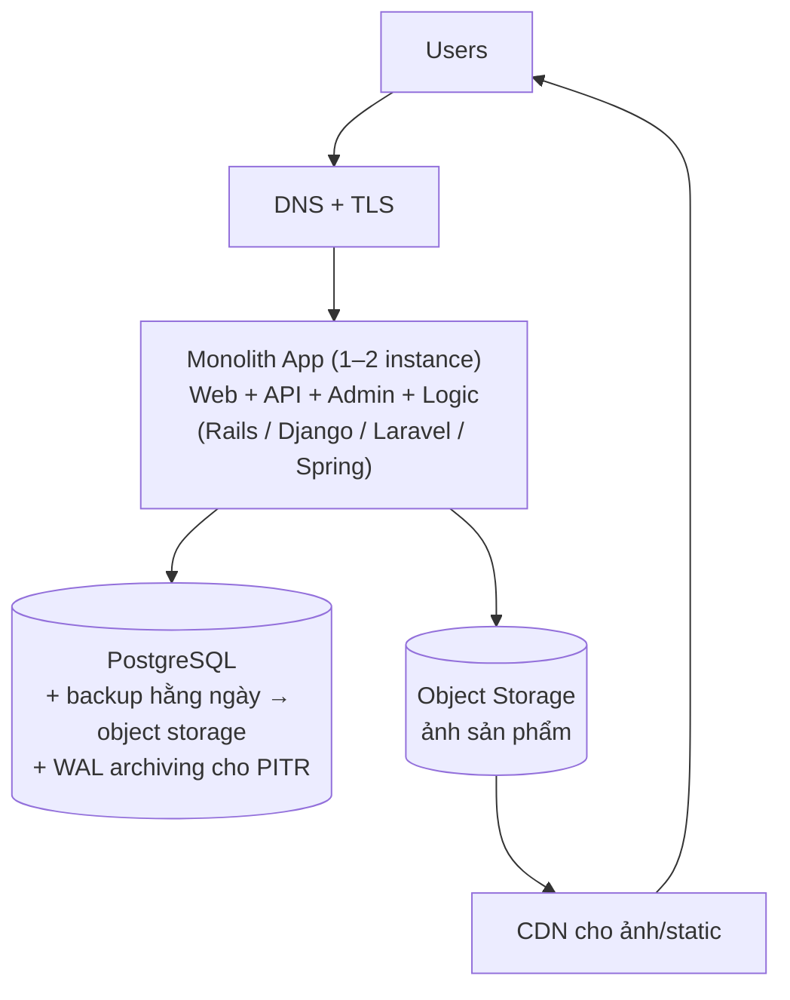

+++
title = "Giai đoạn 1 — Monolith + PostgreSQL"
date = "2026-07-13T14:30:00+07:00"
draft = false
tags = ["backend", "system-design"]
series = ["System Design — Tư Duy Thiết Kế Hệ Thống"]
+++

## Bối cảnh

VietShop ngày 0: 3 founder (2 dev), vốn đủ sống 12 tháng, mục tiêu ra thị trường trong 2 tháng. FR: đăng ký/đăng nhập, danh mục sản phẩm, giỏ hàng, đặt hàng COD, quản trị đơn giản. NFR thật sự chỉ có hai: **ra tính năng nhanh** và **không mất dữ liệu đơn hàng**.

## 1. Vấn đề cần giải

Không phải scale — là **tồn tại**. Xác suất sản phẩm chết vì không có user cao gấp trăm lần chết vì quá nhiều user. Kiến trúc phù hợp là kiến trúc tối đa hóa tốc độ học từ thị trường trên mỗi đồng vốn.

## 2. Kiến trúc

Toàn bộ logic trong một codebase, một tiến trình, một DB. Transaction ACID của PostgreSQL lo phần khó nhất (đơn hàng + trừ kho + thanh toán trong một transaction — thứ mà ở giai đoạn 6+ phải trả bằng Saga đau đớn, ở đây miễn phí).

**Vì sao PostgreSQL (chứ không phải NoSQL)?** Dữ liệu e-commerce quan hệ đậm đặc (user–order–item–product), cần transaction, cần query linh hoạt khi chưa biết access pattern (mà startup thì chưa biết). RDBMS giữ được mọi cánh cửa mở. NoSQL đòi biết trước access pattern để model — thứ startup không có. Và trần của một PostgreSQL tốt (hàng chục nghìn read QPS, hàng nghìn write TPS — [chương 1.4](/series/system-design/01-foundations/04-scale-estimation-capacity-planning/)) cao hơn nhu cầu 2 năm tới ít nhất 10 lần.

**Vì sao monolith?** Với 2 dev, chi phí giao tiếp trong code = 0 (mọi call là function call), một pipeline deploy, debug bằng một stack trace. Microservices ở quy mô này là trả chi phí phối hợp của tổ chức 50 người bằng ngân sách của tổ chức 2 người.

Những thứ **vẫn phải làm đúng từ ngày 1** (vì sửa sau rất đắt hoặc không sửa được):

- **Backup tự động + đã test restore.** Lỗi durability không refactor lại được.
- **Migration có công cụ** (Flyway/Alembic/ActiveRecord) — schema thay đổi hàng tuần.
- **Structured logging + error tracking (Sentry) + uptime check.** Mù ở production là mù hoàn toàn.
- **Idempotency key cho endpoint đặt hàng/thanh toán.** User bấm đúp là chuyện ngày một.
- **Ranh giới module lỏng trong code** (thư mục theo domain: `orders/`, `catalog/`, `users/`) — hạt giống miễn phí cho giai đoạn 5.

## 3. Giải pháp này giải quyết gì — và không giải quyết gì

Giải quyết: toàn bộ FR, time-to-market tối thiểu, chi phí ~vài triệu đồng/tháng, đúng đắn dữ liệu nhờ ACID.

Không giải quyết (và chưa cần): HA tự động (node chết → restore từ backup, downtime giờ — chấp nhận ở quy mô này), scale đọc lớn, tách team.

## 4. Trade-off

| Được | Mất |
|---|---|
| Tốc độ phát triển tối đa; mọi thay đổi là 1 PR, 1 deploy | SPOF: 1 app, 1 DB — sự cố là sự cố toàn phần |
| ACID miễn phí cho bài toán tiền/kho | Trần scale = trần 1 máy (nhưng trần đó rất xa) |
| Vận hành 1 người part-time | Kỷ luật module lỏng dễ xói mòn thành big ball of mud nếu không ai canh |
| Không có bài toán phân tán nào cả | Deploy = restart toàn bộ (vài giây downtime nếu không làm graceful) |

## 5. Chi phí vận hành

1–2 VPS/instance nhỏ + managed PostgreSQL (khuyến nghị mạnh — backup/patch/failover cơ bản được lo hộ) + CDN: **$50–200/tháng**. Nhân sự vận hành: ~0.1 engineer.

## 6. Chi phí phát triển

Thấp nhất trong mọi giai đoạn. Framework full-stack cho sẵn 80% (auth, ORM, admin). 2 dev × 2 tháng cho MVP là thực tế.

## 7. Rủi ro

- **Rủi ro lớn nhất: kỷ luật, không phải kỹ thuật.** Bỏ qua backup-test, bỏ qua idempotency, viết code không ranh giới module — các khoản nợ này đáo hạn ở giai đoạn 3–5 với lãi suất cao.
- Rủi ro bị chê "không chuyên nghiệp" khi gọi vốn/tuyển người — thật ra kiến trúc này *là* chuyên nghiệp cho quy mô này; hãy tự tin bảo vệ nó bằng số liệu.

## Tín hiệu chuyển giai đoạn

Chuyển sang [giai đoạn 2](/series/system-design/12-evolution/02-them-redis/) khi: DB CPU thường trực > 60–70% mà phần lớn là **các query đọc lặp đi lặp lại** (trang chủ, danh mục, chi tiết sản phẩm hot); p99 API đọc tăng theo traffic. Đừng chuyển vì "nghe nói ai cũng cần Redis" — chuyển vì slow query log và biểu đồ CPU nói vậy.
