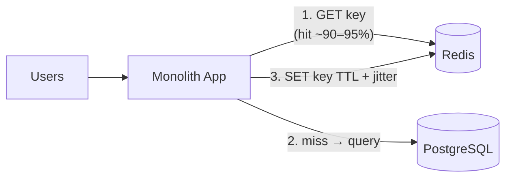

+++
title = "Giai đoạn 2 — Thêm Redis"
date = "2026-07-13T14:40:00+07:00"
draft = false
tags = ["backend", "system-design"]
series = ["System Design — Tư Duy Thiết Kế Hệ Thống"]
+++

## 1. Vấn đề gì xuất hiện?

VietShop đạt ~50K user, chạy quảng cáo tối. Triệu chứng đo được:

- DB CPU 85% vào 20–22h; p99 trang chủ từ 200ms lên 2.5s đúng khung giờ đó.
- `pg_stat_statements` chỉ mặt: 70% thời gian DB dành cho **~20 query đọc lặp lại** — trang chủ, danh mục, top sản phẩm — kết quả gần như không đổi giữa hai lần chạy liên tiếp.
- Tỷ lệ đọc:ghi đo được ~60:1.

## 2. Vì sao kiến trúc cũ không còn phù hợp?

DB đang **tính lại hàng nghìn lần mỗi phút một kết quả không đổi**. Vấn đề không phải PostgreSQL yếu — vấn đề là dùng công cụ đắt (query engine + disk) cho việc rẻ (nhớ lại một kết quả đã biết). Scale-up DB mua thêm thời gian nhưng đốt tiền vào đúng sự lãng phí đó; thêm read replica cũng vậy (nhân bản sự lãng phí ra N máy). First principles: dữ liệu đọc nhiều-ghi ít-chịu được trễ vài giây thuộc về **RAM**, nơi truy cập rẻ hơn disk 3 bậc độ lớn.

## 3. Giải pháp mới giải quyết điều gì?

**Cache-aside** (app tự quản cache) cho: trang chủ, danh mục, chi tiết sản phẩm, cấu hình, session. TTL ngắn (30s–5phút) + **jitter** (±20% ngẫu nhiên, chống avalanche) + invalidation chủ động khi admin sửa sản phẩm (delete key, không update key).

Những gì **cố tình không cache**: tồn kho lúc checkout, số dư, trạng thái đơn — mọi giá trị tham gia quyết định ghi phải đọc từ nguồn sự thật ([chương 4.2](/series/system-design/04-distributed-systems/02-replication-consistency/)).

Kết quả điển hình: hit rate 90%+ → tải đọc DB giảm ~10 lần → DB CPU về 20–30%, p99 giờ peak về ~200ms. Một node Redis nhỏ (vài GB RAM) phục vụ hàng chục nghìn GET/s — trần rất xa.

Đồng thời ở giai đoạn này: app scale ngang (2–4 instance sau một load balancer) — điều kiện là app **stateless**, session chuyển vào Redis thay vì memory.

## 4. Trade-off

| Được | Mất |
|---|---|
| Tải đọc DB giảm ~10×; latency đọc ổn định | **Hai nguồn sự thật** — bài toán invalidation bắt đầu tồn tại và không bao giờ biến mất |
| Đệm hấp thụ spike đọc | Dữ liệu stale trong cửa sổ TTL — phải được business chấp nhận từng loại dữ liệu |
| Rẻ (1 node Redis nhỏ) | Thêm một hệ thống để vận hành, giám sát, nâng cấp |
| Session tập trung → app stateless → scale ngang | Redis chết = "cold start": toàn bộ traffic dồn về DB — phải có kịch bản (xem rủi ro) |

## 5. Chi phí vận hành

+$20–100/tháng (managed Redis nhỏ). Metric mới bắt buộc: hit rate, memory used vs maxmemory, evicted keys, p99 latency Redis. Chọn `maxmemory-policy` có ý thức (`allkeys-lru` cho cache thuần). Nhân sự: vẫn ~0.1–0.2 engineer, nhưng giờ cần hiểu Redis.

## 6. Chi phí phát triển

Thấp. Wrapper `get_or_set(key, ttl, fn)` + gọi ở ~20 điểm nóng + invalidation hook ở admin: 1–2 tuần cả test. Cạm bẫy phát triển thật sự: quyết định **key schema** tử tế ngay từ đầu (`v1:product:{id}`, có version để đổi format không cần flush).

## 7. Rủi ro

- **Cache stampede:** key hot hết hạn → 500 request cùng miss → 500 query giống nhau đập DB. Phòng: single-flight lock hoặc stale-while-revalidate ([Phần 13.1](/series/system-design/13-production-failure-cases/01-caching-failures/)).
- **Avalanche:** deploy xong flush cache / Redis restart → toàn bộ miss cùng lúc. Phòng: jitter TTL, warm-up script, và **load test kịch bản Redis chết**: DB phải sống được (dù chậm) qua cold start, hoặc app phải có degraded mode.
- **Rủi ro âm thầm nhất:** cache che nợ — query tệ + thiếu index được cache giấu đi, đến khi miss storm thì lộ ra cùng lúc. Kỷ luật: slow query vẫn phải fix *trước*, cache là tầng tối ưu *sau*.
- Nhét nhầm dữ liệu giao dịch vào cache → bug tiền bạc. Quy ước rõ trong code review: danh sách được-cache / cấm-cache.

## Tín hiệu chuyển giai đoạn

Sang [giai đoạn 3](/series/system-design/12-evolution/03-background-worker/) khi p99 của các endpoint **ghi** xấu đi vì làm việc thừa trong request: gửi email, resize ảnh, gọi API bên thứ ba, xuất PDF — những việc user không cần chờ.
