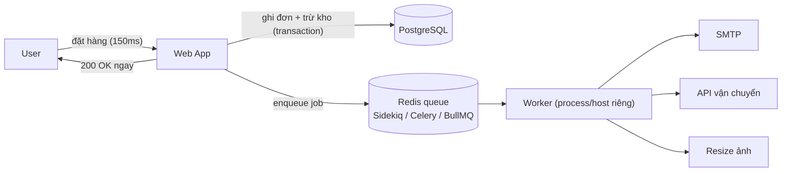

+++
title = "Giai đoạn 3 — Tách Background Worker"
date = "2026-07-13T14:50:00+07:00"
draft = false
tags = ["backend", "system-design"]
series = ["System Design — Tư Duy Thiết Kế Hệ Thống"]
+++

## 1. Vấn đề gì xuất hiện?

~100K user. Triệu chứng:

- Endpoint đặt hàng p99 = 4 giây. Tracing bóc ra: logic đơn hàng 150ms, **gửi email xác nhận 800ms, gọi API đối tác vận chuyển 1.2s, bắn thông báo 500ms** — 2.5s là việc user không cần chờ.
- Upload ảnh sản phẩm của seller treo 8–15 giây (resize 5 kích cỡ trong request).
- Khi SMTP provider chậm (chuyện của họ, không phải của ta), **toàn bộ** endpoint đặt hàng chậm theo — độ khả dụng của ta bị xích vào bên thứ ba.
- Thread/worker pool của web app cạn vào giờ peak vì bị chiếm bởi các request "treo chờ bên ngoài" → cả những endpoint nhanh cũng chờ ([Little's Law, chương 1.3](/series/system-design/01-foundations/03-throughput-latency/)).

## 2. Vì sao kiến trúc cũ không còn phù hợp?

Kiến trúc cũ trộn hai loại công việc có bản chất khác nhau vào một đường xử lý:

- **Việc user phải chờ** (validate, ghi đơn, trừ kho): cần latency thấp, cần kết quả trong response.
- **Việc user không cần chờ** (email, ảnh, đối tác, thống kê): chỉ cần *rồi sẽ xong*, và thường phụ thuộc hệ ngoài — chậm và hỏng theo lịch của người khác.

Trộn chúng nghĩa là: latency của response = tổng của cả hai; availability của response = tích của mọi dependency. First principles: **đường nóng (hot path) chỉ được chứa những gì bắt buộc phải có trong response.** Mọi thứ khác là ứng viên async.

## 3. Giải pháp mới giải quyết điều gì?

- Đặt hàng: transaction ghi đơn xong → enqueue `SendConfirmationEmail`, `CreateShipmentJob` → trả 200. p99 từ 4s về ~200ms.
- Worker chạy **process riêng, host riêng** → tách tài nguyên: resize ảnh ngốn CPU không tranh CPU với web; đối tác treo chỉ giam thread của worker.
- Retry có backoff cho job fail — email fail lúc 20h tự gửi lại lúc 20h05, thay vì user thấy lỗi đặt hàng.

Dùng queue chạy trên Redis sẵn có (Sidekiq/Celery/BullMQ/Bee) — chưa cần RabbitMQ/Kafka; đó là chuyện [giai đoạn 4](/series/system-design/12-evolution/04-message-queue/).

**Ba kỷ luật bắt buộc từ ngày đầu có worker:**

1. **Idempotent job.** Job có thể chạy ≥1 lần (retry, crash giữa chừng). `SendEmail` phải check "đã gửi chưa"; `CreateShipment` phải dùng idempotency key với đối tác.
2. **Enqueue sau commit** (hoặc trong transaction qua bảng jobs — mầm của Outbox pattern, [giai đoạn 7](/series/system-design/12-evolution/07-kafka-event-driven/)). Enqueue trước commit → job chạy trên dữ liệu chưa tồn tại; commit fail còn email thì đã gửi.
3. **Job nhỏ, tham số là ID** (không phải object to đùng) — worker tự đọc trạng thái mới nhất từ DB.

## 4. Trade-off

| Được | Mất |
|---|---|
| p99 đường nóng giảm ~20× | **Eventual consistency với chính nghiệp vụ của mình:** "đặt hàng xong" không còn nghĩa "email đã gửi" — CS phải biết điều này |
| Cô lập lỗi bên thứ ba khỏi trải nghiệm đặt hàng | Debug 2 bước: request OK nhưng job fail — cần dashboard job riêng |
| Retry tự động, chịu lỗi tốt hơn | Trạng thái trung gian lộ ra (đơn "đang xử lý vận chuyển") — UI/UX phải xử lý |
| Scale worker độc lập với web | Thêm một loại tiến trình để deploy, giám sát |

## 5. Chi phí vận hành

+1–2 host worker ($20–80/tháng). Metric mới bắt buộc: **queue depth** (tăng đơn điệu = consumer không kịp), job latency (enqueue→done), failure rate, retry count, **dead jobs**. Alert: queue depth vượt ngưỡng X phút; dead jobs > 0 với job tiền bạc. Dashboard job (Sidekiq Web UI, Flower) là công cụ CS/dev nhìn hằng ngày.

## 6. Chi phí phát triển

Trung bình. Framework queue trưởng thành gánh phần nặng. Chi phí thật nằm ở **tư duy**: dev phải bắt đầu nghĩ "cái gì trong transaction, cái gì sau commit, job này chạy 2 lần thì sao" — đây là bước đầu tiên của tư duy distributed, và là khoản đầu tư sinh lãi ở mọi giai đoạn sau.

## 7. Rủi ro

- **Job mất khi Redis crash** (Redis persistence mặc định không tuyệt đối): chấp nhận được với email, không chấp nhận được với job tiền bạc → job quan trọng phải có bảng trạng thái trong PostgreSQL để đối soát (reconciliation) — hoặc chờ giai đoạn 4.
- **Backlog xoáy:** worker chậm → queue dài → job cũ chạy trên dữ liệu đã đổi. Phòng: TTL cho job, capacity worker có đệm, alert sớm theo *tốc độ tăng* của queue.
- **Retry không idempotent = nhân bản hành động:** 3 email, 2 vận đơn, tệ nhất là 2 lần trừ tiền. Idempotency không phải "nice to have" — nó là điều kiện để retry được phép tồn tại.
- Worker và web **chung codebase, chung deploy** (vẫn là monolith!) — đừng tách repo vội; tách repo là nợ phối hợp chưa cần gánh.

## Tín hiệu chuyển giai đoạn

Sang [giai đoạn 4](/series/system-design/12-evolution/04-message-queue/) khi queue-trên-Redis chạm giới hạn *về đảm bảo*: cần không-mất-job kể cả khi broker crash (tiền bạc), cần routing/priority/DLQ tử tế, cần giãn spike lớn (flash sale), hoặc nhiều hệ thống khác nhau cần tiêu thụ cùng sự kiện.
