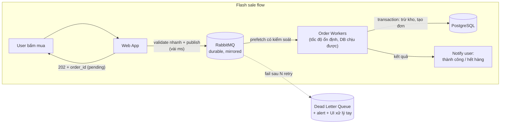

+++
title = "Giai đoạn 4 — Thêm Message Queue"
date = "2026-07-13T15:00:00+07:00"
draft = false
tags = ["backend", "system-design"]
series = ["System Design — Tư Duy Thiết Kế Hệ Thống"]
+++

## 1. Vấn đề gì xuất hiện?

~200K user, GMV bắt đầu có ý nghĩa, flash sale đầu tiên sắp chạy. Ba vấn đề với queue-trên-Redis hiện tại:

- **Đảm bảo mỏng manh:** một sự cố Redis đã làm mất ~2000 job trong 30 giây, trong đó có job cập nhật trạng thái thanh toán — team mất 2 ngày đối soát tay với cổng thanh toán.
- **Thiếu công cụ xử lý lỗi trưởng thành:** job fail 5 lần thì đi đâu? Ai xem? Retry với backoff + dead letter + đánh chỉ mục lỗi phải tự chế.
- **Flash sale sắp tới:** ước 10× peak vào endpoint đặt hàng trong 5 phút. Web + DB không nên (và không cần) được scale cho đỉnh 5 phút đó — cần một tầng **hấp thụ** spike và cho phép xử lý với tốc độ của hệ thống.

## 2. Vì sao kiến trúc cũ không còn phù hợp?

Redis-queue là cache được nhờ vả làm broker. Nó thiếu các thuộc tính mà bài toán mới đòi: **durability có cam kết** (ghi disk, replicate trước khi ack), **acknowledgement chuẩn** (consumer chết giữa chừng → message quay lại queue), **dead letter queue**, routing, priority, và backpressure rõ ràng. Vá từng thiếu hụt bằng code tự chế = tự viết một message broker tồi.

## 3. Giải pháp mới giải quyết điều gì?

Đưa **RabbitMQ** (hoặc managed tương đương: Amazon SQS, CloudAMQP) làm broker cho job quan trọng; giữ Redis-queue cho job phù du (cache warm, thống kê vặt).

Ba việc nó giải quyết:

1. **Durability:** message ghi bền + ack sau khi xử lý xong → broker crash hay consumer crash đều không mất job. Đối soát tay chấm dứt.
2. **Load leveling (giãn spike):** flash sale 10.000 lượt mua/phút → queue nhận hết trong vài giây (broker nuốt hàng chục nghìn msg/s dễ dàng), worker rút ra xử lý ở **300 đơn/phút — tốc độ DB thoải mái**. User nhận trạng thái "đang xử lý" rồi được báo kết quả. Hệ thống không cần capacity của đỉnh — chỉ cần capacity của *trung bình cộng với kiên nhẫn của user*.
3. **Quy trình lỗi trưởng thành:** retry với exponential backoff → quá N lần → DLQ → alert → công cụ cho ops xem, sửa, requeue.

Lưu ý thiết kế flash sale đi kèm: đếm tồn kho nhanh bằng Redis (`DECR` atomic — chặn 95% lượt mua thừa *trước khi* vào queue), nguồn sự thật cuối vẫn là transaction PostgreSQL trong worker. Ba tầng: Redis lọc thô → queue giãn → DB quyết định.

## 4. Trade-off

| Được | Mất |
|---|---|
| Không mất message theo thiết kế | **At-least-once ⇒ duplicate là tất yếu** — idempotency từ "kỷ luật tốt" thành "bắt buộc tuyệt đối" |
| Chịu spike gấp 10–50× mà không scale DB | Latency nghiệp vụ tăng: đơn xử lý trong giây/phút thay vì ms — UX phải thiết kế quanh trạng thái pending |
| Cô lập lỗi + quy trình DLQ chuẩn | Một hệ thống stateful nghiêm túc nữa phải vận hành (cluster, mirror queue, upgrade) |
| Backpressure hiện hình, đo được | Thứ tự xử lý không đảm bảo tuyệt đối giữa các consumer song song |

## 5. Chi phí vận hành

Managed broker $50–300/tháng hoặc self-host 3 node. Metric bắt buộc: queue depth từng queue, publish/deliver rate, **consumer utilisation**, message age, DLQ size (>0 với queue tiền bạc = alert ngay), memory/disk của broker. Học một khái niệm vận hành mới: broker **flow control** khi đầy — hiểu trước khi nó xảy ra.

## 6. Chi phí phát triển

Trung bình. Publish/consume đơn giản; chi phí thật ở ba chỗ: (1) audit **mọi** consumer về idempotency; (2) thiết kế lại UX cho async (pending → notify); (3) contract message versioning — message giờ là API giữa các phần hệ thống, đổi schema phải backward-compatible.

## 7. Rủi ro

- **Queue backlog** trở thành mode sự cố mới: consumer bug/chậm → hàng triệu message dồn ứ ([Phần 13.3](/series/system-design/13-production-failure-cases/03-messaging-failures/)). Alert theo *tuổi message cũ nhất*, không chỉ theo depth.
- **Poison message:** message lỗi làm consumer crash lặp → chặn cả queue nếu không có DLQ đúng.
- **Ảo tưởng exactly-once:** không tồn tại end-to-end. Chỉ có at-least-once + idempotent consumer. Team nào tin vào exactly-once sẽ có bug đếm tiền.
- Over-engineering ngược: đẩy *mọi thứ* qua queue, kể cả luồng cần kết quả đồng bộ → độ phức tạp không cần thiết. Queue cho việc *không cần chờ*; việc cần chờ vẫn là request/response.

## Tín hiệu chuyển giai đoạn

Sang [giai đoạn 5](/series/system-design/12-evolution/05-modular-monolith/) khi bottleneck đổi bản chất: không còn là máy móc mà là **con người** — team đã 15–30 dev, build 20 phút, deploy phải xếp lịch, PR conflict liên miên, một thay đổi ở module A làm gãy module B không ai ngờ.
