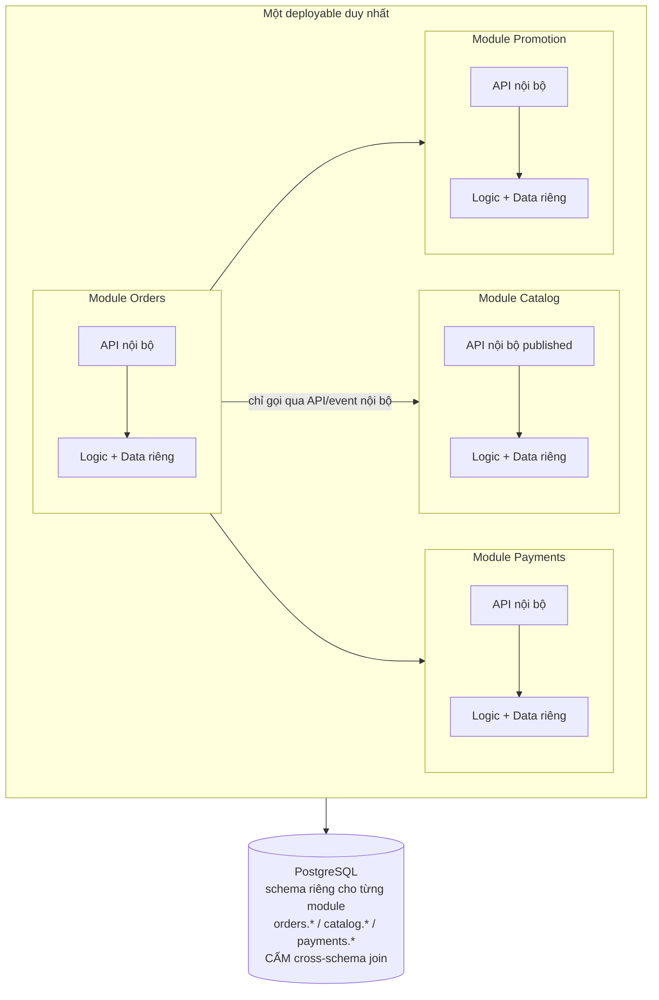

+++
title = "Giai đoạn 5 — Modular Monolith"
date = "2026-07-13T15:10:00+07:00"
draft = false
tags = ["backend", "system-design"]
series = ["System Design — Tư Duy Thiết Kế Hệ Thống"]
+++

## 1. Vấn đề gì xuất hiện?

Công ty 25 dev, 4 nhóm tính năng. Hệ thống *chạy* ổn — vấn đề nằm ở việc *phát triển* nó:

- Build + test 25 phút; deploy 2 lần/tuần theo "chuyến tàu", ai lỡ thì chờ.
- Thay đổi module khuyến mãi làm gãy checkout — vì code checkout `import` thẳng vào class nội bộ của khuyến mãi từ 2 năm trước.
- Không ai dám nói "tôi hiểu toàn bộ hệ thống". Onboarding dev mới: 2 tháng.
- Ranh giới thư mục từ giai đoạn 1 đã xói mòn: 400 điểm import chéo giữa các "module", 60 bảng DB mà module nào cũng đọc của nhau.

Bottleneck bây giờ là **coupling** — đo bằng tốc độ ra feature và tỷ lệ regression liên-module, không phải bằng CPU.

## 2. Vì sao kiến trúc cũ không còn phù hợp?

Big ball of mud không có *ranh giới thay đổi*: mọi thay đổi có thể chạm mọi nơi, nên mọi thay đổi phải test mọi nơi, nên mọi thay đổi chậm dần theo kích thước codebase — độ phức tạp giao tiếp giữa N phần liên kết chằng chịt tăng theo N², đúng như số kênh giao tiếp của N người.

Phản xạ phổ biến ở điểm này là "tách microservices". Đây thường là **sai lầm đắt nhất trong đời một CTO**: nếu ranh giới domain còn sai trong một codebase (nơi refactor là rename + move, IDE làm trong một buổi chiều), thì tách qua network chỉ **đông cứng ranh giới sai** lại sau các API — nơi sửa ranh giới là dự án nhiều quý. Chưa kể toàn bộ chi phí distributed (network fail, Saga, tracing, N pipeline) ập vào cùng lúc.

First principles: cái ta cần là **ranh giới rõ + phụ thuộc một chiều + dữ liệu riêng theo module**. Không điều nào trong đó đòi hỏi network ở giữa. Network là chi tiết triển khai của ranh giới — không phải bản thân ranh giới.

## 3. Giải pháp mới giải quyết điều gì?

Modular Monolith: một deployable, nhưng bên trong là các module có kỷ luật như thể là service:

Bốn luật, thiếu một là không phải modular monolith:

1. **Module chỉ nói chuyện qua API published** (interface/facade) hoặc event nội bộ (in-process bus). Import vào ruột module khác bị **CI chặn tự động** (ArchUnit, deptrac, eslint-boundaries, Go internal packages) — kỷ luật bằng công cụ, không bằng văn bản.
2. **Dữ liệu riêng:** mỗi module một schema, cấm join chéo schema. Cần dữ liệu của nhau → gọi API của nhau. (Đau và chậm hơn join? Đúng. Đó chính là chi phí thật của ranh giới — trả bây giờ trong một process, hoặc trả sau qua network với lãi.)
3. **Phụ thuộc một chiều, có tầng:** ai được gọi ai vẽ ra giấy, cấm vòng tròn.
4. **Ranh giới theo domain** (DDD bounded context): Catalog, Orders, Payments, Fulfillment, Promotion, Users — không theo tầng kỹ thuật (controllers/services/models).

Việc tách schema đi kèm một lợi ích chiến lược: nó là **cuộc tổng duyệt cho giai đoạn 6**. Module nào ranh giới sai sẽ lộ ngay (hai module cãi nhau về một bảng) — và sửa bây giờ rẻ hơn 100 lần sửa sau khi đã tách service.

## 4. Trade-off

| Được | Mất |
|---|---|
| Ranh giới rõ, regression liên-module giảm mạnh | Mất join tùy tiện + transaction xuyên module (nên gói nghiệp vụ transactional vào **một** module) |
| Vẫn 1 deploy, 1 stack trace, 0 chi phí distributed | Vẫn 1 deployable: chưa scale/deploy độc lập từng phần, chưa đa ngôn ngữ |
| Refactor ranh giới = rename trong IDE | Cần kỷ luật kiến trúc liên tục — có người canh (architect/tech lead luân phiên) |
| Đường lùi và đường tiến đều mở | Chi phí trả trước: nhiều tháng trả nợ để dựng ranh giới trên codebase cũ |

## 5. Chi phí vận hành

**Gần như không tăng** — vẫn là một app + DB + Redis + MQ. Đây chính là điểm bán hàng lớn nhất so với microservices: mua được 70% lợi ích tổ chức với ~0% chi phí vận hành thêm. Build/test nhanh lên nhờ chạy test theo module bị ảnh hưởng.

## 6. Chi phí phát triển

Cao ở giai đoạn chuyển đổi: 2–4 quý "vừa bay vừa sửa máy bay" — strangler từng module: dựng API nội bộ → chuyển caller → di dời bảng về schema riêng → bật CI chặn. Ưu tiên tách trước các module: thay đổi thường xuyên nhất, và ranh giới nghiệp vụ rõ nhất (Payments thường là ứng viên số 1).

## 7. Rủi ro

- **Kỷ luật xói mòn:** một deadline gấp + một `import` "tạm thời" + không ai chặn = 18 tháng sau quay về ball of mud. Công cụ CI chặn ranh giới là *bắt buộc*, không phải khuyến nghị.
- **Ranh giới sai:** cắt module theo cơ cấu team hiện tại thay vì theo domain → team đổi cơ cấu là ranh giới vô nghĩa. Cắt theo nghiệp vụ.
- **Hoàn hảo chủ nghĩa:** cố tách 100% trước khi ship gì đó — chuyển đổi phải chạy song song với roadmap, mỗi quý một vài module.
- Nhiều hệ thống **nên dừng vĩnh viễn ở đây.** Shopify — một trong những hệ thống thương mại lớn nhất thế giới — chạy modular monolith Rails có chủ đích. Dừng ở giai đoạn 5 không phải thất bại; đó có thể là quyết định kiến trúc đúng nhất công ty từng đưa ra.

## Tín hiệu chuyển giai đoạn

Sang [giai đoạn 6](/series/system-design/12-evolution/06-microservices/) chỉ khi xuất hiện áp lực mà *một deployable* không giải được: một module cần scale/công nghệ khác hẳn (search, pricing ML); một module cần nhịp deploy nhiều lần/ngày trong khi phần còn lại cần ổn định (và compliance ngăn deploy chung); tổ chức vượt ~50 dev với các team cần tự chủ vận hành thật sự. **Nếu không có áp lực nào trong số đó — ở lại giai đoạn 5.**
