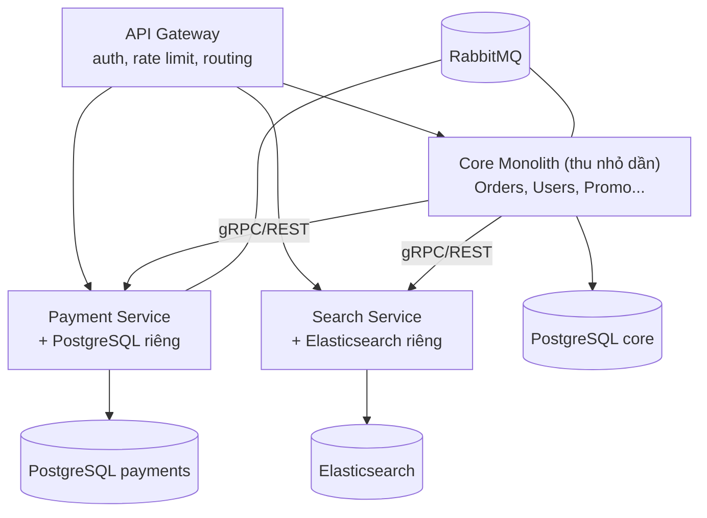

+++
title = "Giai đoạn 6 — Tách Microservices"
date = "2026-07-13T15:20:00+07:00"
draft = false
tags = ["backend", "system-design"]
series = ["System Design — Tư Duy Thiết Kế Hệ Thống"]
+++

## 1. Vấn đề gì xuất hiện?

VietShop: 1M+ user, 60 dev / 8 team, modular monolith kỷ luật tốt. Ba áp lực mới mà "một deployable" không giải được:

- **Nhịp deploy xung đột:** team Search muốn deploy 5 lần/ngày để tune ranking; team Payments bị ràng buộc quy trình kiểm soát thay đổi nghiêm ngặt. Chung một deployable = Search bị Payments ghìm, Payments bị Search làm rủi ro.
- **Nhu cầu tài nguyên xung đột:** Search cần máy RAM lớn + Elasticsearch; xử lý ảnh cần CPU; API thường cần nhiều instance nhỏ. Một deployable = mọi instance mang mọi thứ.
- **Bán kính sự cố chung:** memory leak ở module khuyến mãi làm OOM cả app — gồm cả checkout. Một bug của team này đánh sập doanh thu của mọi team.

## 2. Vì sao kiến trúc cũ không còn phù hợp?

Modular monolith đã giải bài toán *ranh giới code* nhưng ba tài nguyên vẫn dùng chung không tách được: **tiến trình runtime** (crash chung, GC chung, leak chung), **pipeline deploy** (nhịp chung, rollback chung), **cụm hạ tầng** (shape máy chung). Khi các module cần khác nhau *về runtime, nhịp deploy, hình dạng hạ tầng* — chỉ tách tiến trình mới giải được. Đó chính xác là (và chỉ là) điều microservices mang lại: **ranh giới deploy độc lập**.

Lưu ý điều nó *không* mang lại: code sạch hơn (đã có từ giai đoạn 5), nhanh hơn (network làm chậm đi), rẻ hơn (đắt hơn nhiều).

## 3. Giải pháp mới giải quyết điều gì?

Tách **dần**, theo pattern strangler, ưu tiên module có áp lực cao nhất — không "big bang rewrite":

Mỗi service tách ra theo checklist: **database riêng** (không có ngoại lệ — chung DB là distributed monolith, anti-pattern số 1), API contract có version, team owner rõ, on-call rõ, dashboard + alert riêng, deploy pipeline riêng.

Hạ tầng tối thiểu phải có **trước khi** tách service thứ hai (không phải sau):

- **Container + orchestration** (Kubernetes hoặc ECS) — quản 10 service bằng tay là không thể.
- **CI/CD chuẩn hóa** một khuôn cho mọi service.
- **Observability ba trụ:** centralized logging, metrics, **distributed tracing** (không có tracing, debug xuyên 5 service là khảo cổ học — [Phần 10](/series/system-design/10-observability/00-tong-quan/)).
- **Chuẩn giao tiếp:** timeout, retry có budget, **circuit breaker** — mặc định trong template service, không phải tùy mỗi team nhớ.
- Service discovery + config tập trung.

Bài toán mới xuất hiện ngay lập tức — **transaction xuyên service**: đặt hàng chạm Orders + Payments + Inventory, giờ là 3 DB. Không còn ACID chung. Lời giải: **Saga** — chuỗi transaction cục bộ + hành động bù (compensation) khi bước sau fail (hoàn tiền, hoàn kho). Kèm Outbox pattern để publish event tin cậy ([giai đoạn 7](/series/system-design/12-evolution/07-kafka-event-driven/)). Đây là khoản chi phí trí tuệ lớn nhất của giai đoạn này: nghiệp vụ phải được nghĩ lại thành các bước *có thể đảo ngược*.

## 4. Trade-off

| Được | Mất |
|---|---|
| Deploy độc lập — team tự chủ nhịp riêng | Mọi call giữa module: 50ns function call → 1–10ms network call **có thể fail** |
| Scale/chọn công nghệ theo từng service | Mất ACID xuyên ranh giới → Saga, eventual consistency, dual-write hazard |
| Cô lập sự cố (leak ở Promo không giết Checkout) | Cô lập chỉ *có thật* nếu có timeout/CB đúng — không thì thành **cascading failure** ([13.4](/series/system-design/13-production-failure-cases/04-distributed-failures/)) |
| Bán kính thay đổi nhỏ, rollback nhỏ | Chi phí vận hành nhảy bậc: từ "một app" thành "một nền tảng" |

## 5. Chi phí vận hành

Nhảy bậc lớn nhất toàn hành trình. K8s + observability stack + on-call theo team: hạ tầng dễ dàng +$2–10K/tháng, và cần **platform team** (2–4 engineer) làm sản phẩm nội bộ là "nền tảng để các team khác chạy service". Quy tắc kiểm tra trước khi bước vào: nếu tổ chức không sẵn sàng trả một platform team, tổ chức chưa sẵn sàng cho microservices.

## 6. Chi phí phát triển

Cao ở đầu (dựng platform + tách 2–3 service đầu: 2–4 quý). Sau đó *tăng tốc* cho thay đổi trong một service, nhưng **chậm đi** cho thay đổi xuyên service (phối hợp contract, deploy theo thứ tự, backward compatibility). Bài học thiết kế: cắt ranh giới sao cho thay đổi thường gặp nằm gọn trong một service — nếu 70% feature đòi sửa 3 service, ranh giới đã cắt sai.

## 7. Rủi ro

- **Distributed monolith** — rủi ro số 1: tách tiến trình nhưng service gọi nhau đồng bộ chằng chịt + chung DB + deploy phải theo thứ tự = chi phí microservices, lợi ích monolith, độ tin cậy tệ hơn cả hai.
- **Tách quá nhỏ, quá sớm:** 60 dev không cần 40 service. Bắt đầu 3–8 service to (theo bounded context), tách tiếp khi có bằng chứng.
- **Latency cộng dồn:** trang chủ gọi 12 service nối tiếp = tổng latency + tail amplification ([chương 1.3](/series/system-design/01-foundations/03-throughput-latency/)). Thiết kế: gọi song song, BFF/aggregator, cache ở gateway.
- **Chi phí con người:** on-call từng team, hiểu biết toàn cục giảm — bù bằng tài liệu contract, tracing tốt, và ít service hơn con số ego muốn.

## Tín hiệu chuyển giai đoạn

Sang [giai đoạn 7](/series/system-design/12-evolution/07-kafka-event-driven/) khi tích hợp điểm-nối-điểm bùng nổ: sự kiện "đơn hàng đã tạo" cần đến 6 nơi (email, kho, analytics, loyalty, fraud, recommendation) và mỗi consumer mới đòi sửa code producer — dấu hiệu cần chuyển từ "gọi nhau" sang "phát sự kiện".
