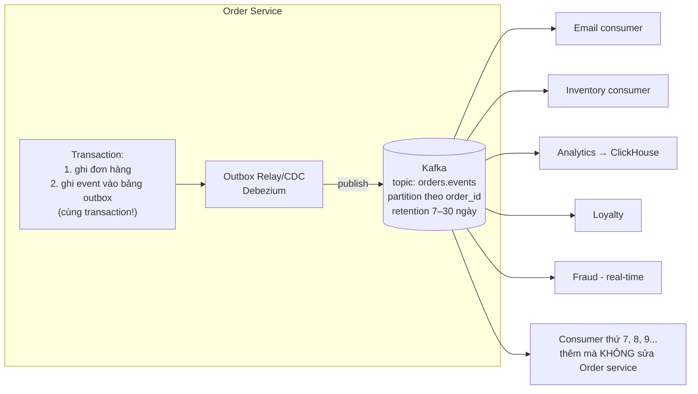

+++
title = "Giai đoạn 7 — Kafka & Event-driven Architecture"
date = "2026-07-13T15:30:00+07:00"
draft = false
tags = ["backend", "system-design"]
series = ["System Design — Tư Duy Thiết Kế Hệ Thống"]
+++

## 1. Vấn đề gì xuất hiện?

Sau 1 năm microservices, một dạng coupling mới mọc lên — **coupling tích hợp**:

- Khi đơn hàng được tạo, Order service phải *biết và gọi*: Email, Inventory, Analytics, Loyalty, Fraud, Recommendation. Thêm consumer thứ 7 = sửa code + deploy Order service. Producer lệ thuộc vào danh sách người nghe — ngược đời.
- Availability của "tạo đơn" = tích availability của 6 downstream (hoặc code retry/degrade cho từng cái, ×6).
- Team Analytics muốn *đi lại lịch sử* đơn hàng để tính lại metric — không thể: các lời gọi HTTP đã bay hơi, dữ liệu chỉ còn trạng thái cuối trong DB.
- RabbitMQ hiện tại: message tiêu thụ xong là biến mất — không phục vụ được nhu cầu "nhiều consumer độc lập, mỗi bên đọc theo nhịp riêng, replay được".

## 2. Vì sao kiến trúc cũ không còn phù hợp?

Mô hình "A gọi B" (dù sync HTTP hay qua work queue) mã hóa cứng **ai cần biết điều gì** vào producer. Số tuyến tích hợp tăng như N×M. First principles: sự kiện nghiệp vụ ("đơn #123 đã tạo") là một **sự thật** — sự thật nên được *công bố một lần* và ai quan tâm thì *tự đến đọc*, thay vì được *giao tận tay* từng người. Đảo ngược hướng phụ thuộc: producer không biết consumer tồn tại.

RabbitMQ là **smart broker** cho job delivery (đưa việc cho đúng một worker, xong thì xóa). Nhu cầu mới là **log**: chuỗi sự kiện bền, có thứ tự, đọc lại được, nhiều nhóm đọc độc lập. Đó là Kafka — không phải "MQ nhanh hơn" mà là một mô hình dữ liệu khác: **distributed append-only log** với retention theo thời gian, consumer tự giữ offset.

## 3. Giải pháp mới giải quyết điều gì?

- **Outbox pattern** — mảnh ghép sống còn: ghi event vào bảng `outbox` **trong cùng transaction** với dữ liệu nghiệp vụ; relay (Debezium CDC hoặc poller) đọc bảng và publish. Loại bỏ dual-write hazard (ghi DB xong, publish fail → hệ thống dối trá). Không có outbox, event-driven đứng trên cát.
- **Partition theo `order_id`:** mọi event của một đơn nằm cùng partition → có thứ tự với nhau (Kafka chỉ đảm bảo thứ tự *trong* partition — chọn partition key là quyết định thiết kế quan trọng nhất với mỗi topic).
- **Consumer group:** mỗi team một group, tự scale, tự giữ offset, chậm không ảnh hưởng ai. Analytics replay 30 ngày lịch sử: chỉ việc reset offset.
- **Schema Registry** (Avro/Protobuf) + quy tắc tương thích: event là **API công khai** — không có kỷ luật schema, event-driven sụp trong 6 tháng vì "ai đó đổi field".
- Phân định rõ hai loại đường đi còn lại: **command** cần kết quả ngay (checkout gọi Payment) → vẫn sync gRPC/REST; **fact** thông báo chuyện đã xảy ra → Kafka. RabbitMQ vẫn giữ cho task queue thuần túy. Ba công cụ, ba việc.

## 4. Trade-off

| Được | Mất |
|---|---|
| Thêm consumer = 0 thay đổi producer; hệ sinh thái dữ liệu mở | **Suy luận nhân quả khó:** "chuyện gì xảy ra sau khi đơn tạo?" không đọc được từ code một chỗ nào nữa — cần tracing + tài liệu event flow |
| Replay lịch sử — nền cho analytics, ML, sửa lỗi dữ liệu | Eventual consistency lan rộng: mỗi consumer một nhịp, dữ liệu các view lệch nhau vài giây–phút |
| Producer sống độc lập với consumer chết/chậm | Kafka là hệ phân tán nặng ký phải vận hành (hoặc trả tiền managed) |
| Buffer khổng lồ: consumer chết 2 giờ, không mất gì | At-least-once + duplicate: idempotency ở **mọi** consumer, vĩnh viễn |

## 5. Chi phí vận hành

Managed Kafka (MSK/Confluent) $500–vài nghìn/tháng ở quy mô này; self-host cần ≥3 broker + kỹ năng chuyên. Metric bắt buộc: **consumer lag theo group** (metric quan trọng nhất — [13.3](/series/system-design/13-production-failure-cases/03-messaging-failures/)), broker disk, under-replicated partitions, ISR shrink. Cộng: vận hành Schema Registry, chính sách retention, quy trình reset offset an toàn.

## 6. Chi phí phát triển

Cao ở tư duy nhiều hơn ở code: thiết kế **event schema** tốt (fact, đủ ngữ cảnh, không phải "RowUpdated"), outbox ở mọi producer, idempotency ở mọi consumer, event catalog cho toàn công ty. Team quen request/response cần 1–2 quý để "nghĩ bằng sự kiện".

## 7. Rủi ro

- **Kafka lag âm thầm:** consumer chậm hơn producer 5% thôi, lag tăng vô hạn — alert theo *lag tăng đơn điệu*, không chỉ giá trị tuyệt đối.
- **Event như database call:** consumer nhận event rồi gọi ngược producer hỏi thêm dữ liệu → coupling quay lại bằng cửa sau. Event phải đủ ngữ cảnh (event-carried state transfer).
- **Bỏ qua thứ tự:** xử lý `OrderCancelled` trước `OrderCreated` (khác partition, hoặc retry đảo hàng) → consumer phải chịu được out-of-order (state machine chấp nhận sự kiện đến sớm/muộn).
- **Nghiện event:** đẩy cả luồng cần phản hồi ngay vào Kafka → UX vòng vèo, debug địa ngục. Câu hỏi kiểm tra: "người gọi có cần kết quả để đi tiếp không?" — có thì sync.
- Chi phí ẩn lớn nhất: **văn hóa dữ liệu** — không có event catalog + ownership rõ, sau 2 năm không ai biết topic nào còn ai dùng.

## Tín hiệu chuyển giai đoạn

Sang [giai đoạn 8](/series/system-design/12-evolution/08-cqrs/) khi model *ghi* (chuẩn hóa, transactional) không phục vụ nổi nhu cầu *đọc* đã phình to: trang seller dashboard join 9 bảng mất 3 giây; search + filter + sort đa chiều đập chết OLTP; báo cáo real-time cào thẳng DB giao dịch làm checkout chậm.
