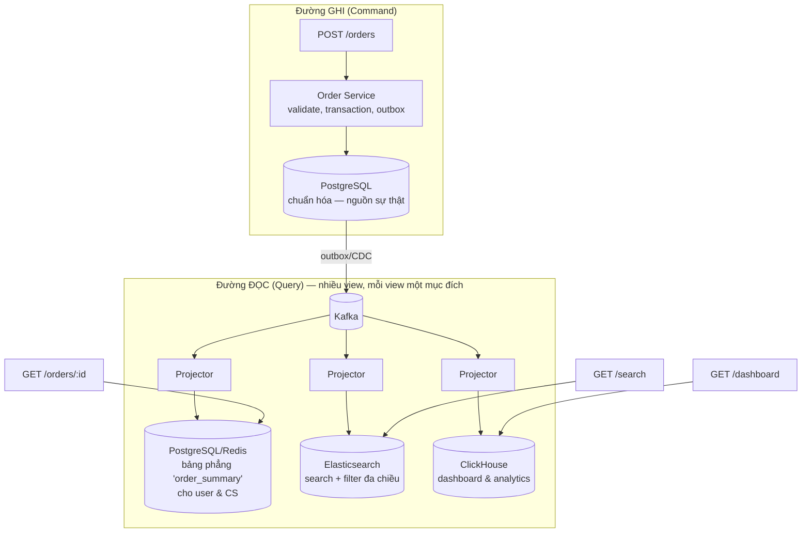

+++
title = "Giai đoạn 8 — CQRS"
date = "2026-07-13T15:40:00+07:00"
draft = false
tags = ["backend", "system-design"]
series = ["System Design — Tư Duy Thiết Kế Hệ Thống"]
+++

## 1. Vấn đề gì xuất hiện?

- Seller dashboard ("doanh thu hôm nay, top sản phẩm, đơn chờ xử lý") join 9 bảng, chạy 3 giây, và **chạy trên cùng DB đang phục vụ checkout** — mỗi lần seller F5, khách mua hàng chậm đi.
- Search + filter đa chiều (giá, đánh giá, khoảng cách, khuyến mãi) là loại query mà B-tree index của OLTP không bao giờ phục vụ tốt.
- Cùng một dữ liệu đơn hàng, giờ có 4 "hình dạng đọc" khác nhau: chi tiết đơn cho user, dashboard cho seller, phân tích cho ops, feature cho ML. Một schema chuẩn hóa không thể tối ưu cho cả 4 — chuẩn hóa vốn được thiết kế để tối ưu cho **ghi đúng**, không phải cho **đọc nhanh**.
- Tỷ lệ đọc:ghi đo được trên các luồng này: > 100:1.

## 2. Vì sao kiến trúc cũ không còn phù hợp?

Một model duy nhất phục vụ hai ông chủ có yêu cầu ngược nhau: bên ghi cần chuẩn hóa, constraint, transaction, ít index (index làm chậm ghi); bên đọc cần denormalize, nhiều index, cấu trúc theo đúng hình dạng màn hình. Tối ưu cho bên này là làm hại bên kia — trên cùng một schema, cuộc giằng co này không có lời giải, chỉ có thỏa hiệp ngày càng tệ ở cả hai phía.

## 3. Giải pháp mới giải quyết điều gì?

**CQRS — Command Query Responsibility Segregation:** tách hẳn đường ghi và đường đọc, mỗi đường một model, đồng bộ qua event (đã có sẵn từ giai đoạn 7 — đây là lý do CQRS đứng sau Kafka trong hành trình: hạ tầng event làm CQRS gần như "miễn phí" về cơ chế).

- **Command side:** giữ nguyên PostgreSQL chuẩn hóa — nguồn sự thật duy nhất, nơi duy nhất có constraint và transaction.
- **Read side:** các **projection** — bảng/index được denormalize sẵn theo đúng hình dạng từng màn hình, dựng bằng projector tiêu thụ event. Dashboard 3 giây thành lookup 5ms vì *kết quả đã được tính sẵn tại thời điểm ghi* — chuyển chi phí từ lúc đọc (×100) sang lúc ghi (×1).
- Chọn store theo hình dạng đọc: search → Elasticsearch; aggregate → ClickHouse; lookup → Redis/PostgreSQL phẳng ([Phần 5](/series/system-design/05-data-layer/00-tong-quan/)).
- Projection **rebuild được** từ replay Kafka (hoặc từ nguồn sự thật) — projection hỏng/cần schema mới: dựng lại từ đầu thay vì migrate. Đây là siêu năng lực vận hành ít được nhắc của CQRS.

**Áp dụng có chọn lọc — nguyên tắc quan trọng nhất của giai đoạn này:** CQRS cho *các luồng có vấn đề* (dashboard, search, analytics). Luồng CRUD đơn giản (profile, địa chỉ) giữ nguyên một model. CQRS toàn hệ thống là over-engineering kinh điển.

**Ghi chú về Event Sourcing:** CQRS ≠ Event Sourcing. ES (lưu chuỗi event *làm* nguồn sự thật, state là suy diễn) là bước xa hơn nhiều, chỉ đáng cho domain cần audit trail tuyệt đối (ledger, thanh toán). VietShop: outbox + state-based là đủ; đừng nhầm hai thứ.

## 4. Trade-off

| Được | Mất |
|---|---|
| Đọc nhanh 100–1000× cho query phức tạp; OLTP được yên | **Staleness hiện diện vĩnh viễn:** projection trễ nguồn sự thật ms–giây; UI/nghiệp vụ phải chấp nhận từng chỗ |
| Scale đọc/ghi độc lập; mỗi view chọn store tối ưu | Mỗi projection là code + hạ tầng + giám sát phải nuôi |
| Model ghi gọn lại (bỏ index/denorm phục vụ đọc) | **Read-your-writes gãy mặc định** (user sửa xong chưa thấy) — phải vá chủ động: đọc write-side sau khi ghi, hoặc chờ version |
| Rebuild thay vì migrate | Suy luận toàn cục khó hơn: một sự thật, N hình chiếu, mỗi cái một độ trễ |

## 5. Chi phí vận hành

Mỗi projection thêm: một consumer + một store. Metric bắt buộc mới: **projection lag** (giây trễ so với write-side) cho *từng* projection + alert; quy trình rebuild đã tập dượt (đo thời gian rebuild — nó là RTO của view đó). Chi phí hạ tầng tăng theo số store (ES + ClickHouse không rẻ), nhưng thường *giảm* chi phí DB chính vì OLTP nhỏ lại.

## 6. Chi phí phát triển

Mỗi màn hình phức tạp giờ có: schema projection + projector idempotent (Kafka at-least-once!) + xử lý out-of-order + chiến lược rebuild. Dev phải trả lời "màn này chịu stale bao nhiêu?" cho từng feature — câu hỏi tốt nhưng tốn thời gian. Khoảng +20–40% effort cho feature dùng CQRS, đổi lấy hiệu năng đọc không mua được bằng cách khác.

## 7. Rủi ro

- **Projection lag thành sự cố nghiệp vụ:** dashboard seller trễ 30 phút trong ngày sale → seller quyết định sai. Lag phải có SLO riêng và hiển thị "dữ liệu tính đến 10:32" trên UI.
- **Projector bug = dữ liệu đọc sai hàng loạt** trong khi nguồn sự thật đúng — cần đối soát định kỳ (count/sum giữa write-side và projection) để phát hiện drift.
- **Nghiệp vụ đọc từ projection để quyết định ghi** (check tồn kho từ ES rồi trừ kho) — phá vỡ nguyên tắc: mọi quyết định ghi phải đọc từ write-side. Đây là bug CQRS nguy hiểm nhất.
- Phình projection: mỗi PM một dashboard, mỗi dashboard một projection, 2 năm sau 40 projection không ai nhớ — cần ownership và vòng đời (deprecate) như API.

## Tín hiệu chuyển giai đoạn

Sang [giai đoạn 9](/series/system-design/12-evolution/09-multi-region/) khi có áp lực *địa lý*: mở thị trường nước ngoài (latency 150ms+ giết conversion), yêu cầu pháp lý về nơi lưu dữ liệu, hoặc business không chấp nhận nổi rủi ro "một region sập là sập hết".
