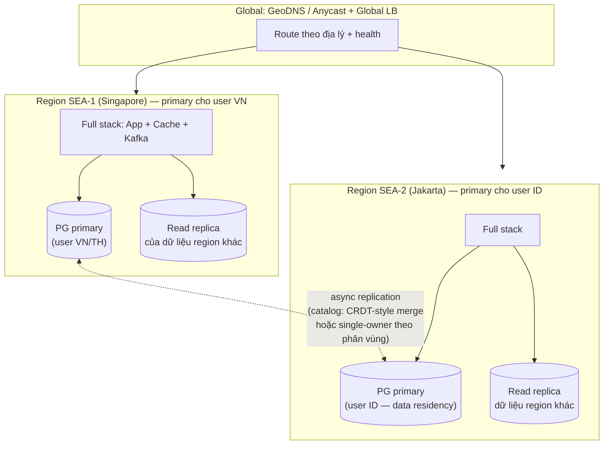

+++
title = "Giai đoạn 9 — Multi-region"
date = "2026-07-13T15:50:00+07:00"
draft = false
tags = ["backend", "system-design"]
series = ["System Design — Tư Duy Thiết Kế Hệ Thống"]
+++

## 1. Vấn đề gì xuất hiện?

VietShop mở thị trường Indonesia và Thái Lan; đồng thời ký hợp đồng enterprise có cam kết availability cao. Ba áp lực:

- **Vật lý:** user Jakarta gọi API đặt tại VN/Singapore: mỗi round-trip +30–70ms; một trang cần 5 round-trip là +350ms — conversion giảm đo được theo từng 100ms.
- **Pháp lý:** một số loại dữ liệu người dùng Indonesia phải lưu tại Indonesia. Không phải bài toán hiệu năng — bài toán *ranh giới dữ liệu*.
- **Rủi ro tập trung:** sự cố lớn của một cloud region (đã từng xảy ra với mọi cloud lớn) = 100% hệ thống chết. Board hỏi câu không né được: "nếu region Singapore sập một ngày thì sao?"

## 2. Vì sao kiến trúc cũ không còn phù hợp?

Kiến trúc một region đứng trên giả định "mọi thành phần gần nhau, round-trip ~0.5ms" — giả định thấm vào mọi thiết kế: sync replication rẻ, gọi chéo service thoải mái, một nguồn sự thật cho mọi dữ liệu. Bước ra đa region, tốc độ ánh sáng đập vỡ giả định đó: **không thể có đồng thời (1) ghi latency thấp ở mọi region, (2) strong consistency toàn cầu, (3) sống sót khi mất một region** — đây là PACELC ([chương 4.1](/series/system-design/04-distributed-systems/01-cap-pacelc/)) hiện hình bằng tiền và mili-giây. Multi-region không phải "nhân đôi hạ tầng" — nó là **chọn lại vị trí trên tam giác đó cho từng loại dữ liệu**.

## 3. Giải pháp mới giải quyết điều gì?

Đi theo bậc thang, không nhảy thẳng lên active-active toàn phần:

**Bậc 1 — Edge trước tiên (rẻ nhất, ăn 60–80% lợi ích latency):** CDN cho static/ảnh; edge POP cho TLS termination + HTTP caching; API tĩnh hóa được thì cache ở edge. Chưa đụng vào dữ liệu.

**Bậc 2 — Read-local, write-global:** đọc phục vụ tại region gần user, ghi vẫn về một region chính.

**Bậc 3 — Active-active có chọn lọc theo loại dữ liệu** (đích của VietShop):

Chiến lược theo **từng loại dữ liệu** — đây là toàn bộ nghệ thuật của multi-region:

| Dữ liệu | Chiến lược | Lý do |
|---|---|---|
| User, đơn hàng, ví | **Home region theo user** (user VN ghi ở SEA-1, user ID ghi ở SEA-2) | Mỗi bản ghi một chủ → *không có xung đột ghi*; ghi local nhanh; đúng data residency |
| Catalog sản phẩm | Ghi ở region của seller, replicate async đi khắp nơi, đọc local | Chịu stale vài giây thoải mái |
| Tồn kho flash sale | **Không phân tán** — kho vật lý ở đâu, quyết định tồn kho ở region đó | Tranh chấp cần strong consistency; may mắn: tồn kho vốn *có* vị trí địa lý tự nhiên |
| Session, cache | Hoàn toàn local mỗi region | Không cần đồng bộ |
| Config, feature flag | Một nguồn toàn cục, push đi các region | Ít ghi, cần nhất quán |

Chìa khóa nằm ở dòng 1: **partition theo "chủ sở hữu tự nhiên" của dữ liệu để né xung đột ghi toàn cục** thay vì giải nó. Đơn hàng thuộc về một user; user thuộc về một region. 95% bài toán multi-region "biến mất" nếu tìm được trục chủ sở hữu — và hầu hết nghiệp vụ có trục đó (user, kho, cửa hàng, tài khoản).

## 4. Trade-off

| Được | Mất |
|---|---|
| Latency local cho đa số thao tác ở mọi thị trường | Độ phức tạp nhảy bậc lớn nhất từ giai đoạn 6: mọi thiết kế mới phải trả lời "dữ liệu này sống ở đâu?" |
| Đáp ứng data residency | Luồng *xuyên region* (user VN mua của seller ID) chậm và phức tạp — phải chấp nhận hoặc thiết kế riêng |
| Nền tảng cho DR thật (giai đoạn 10) | Chi phí hạ tầng ~×1.8–2.5; băng thông liên region là hóa đơn riêng đáng kể |
| Deploy theo region = canary tự nhiên | Failover giữa region kéo theo bài toán dữ liệu chưa kịp replicate (RPO > 0 với async) |

## 5. Chi phí vận hành

Nhân đôi stack + tầng global (GeoDNS, global LB, VPN/backbone liên region) + **giám sát chéo region** (đo từ region A nhìn region B, synthetic probe từ nhiều nước) + on-call hiểu topology toàn cục. Deploy pipeline thành sóng theo region (region nhỏ trước — canary địa lý). Chi phí kỹ năng: ít nhất một nhóm phải thật sự hiểu replication topology, nếu không mỗi sự cố liên region là một lần đoán mò.

## 6. Chi phí phát triển

Mọi service chạm dữ liệu user phải nhận thức **home region** (routing theo user → đúng region). Middleware/SDK nội bộ gánh phần này tập trung — đừng để từng team tự xử. Luồng xuyên region (thanh toán chéo biên) thiết kế như tích hợp giữa hai hệ thống độc lập (qua event, Saga) — vì về bản chất, nó đúng là như vậy.

## 7. Rủi ro

- **Split brain cấp region:** đứt cáp liên region (không hiếm ở Đông Nam Á), hai region đều sống nhưng không thấy nhau. Nhờ home-region ownership: mỗi region tiếp tục phục vụ user *của mình* — đây là phần thưởng lớn nhất của thiết kế theo chủ sở hữu. Luồng chéo tạm degrade có kiểm soát.
- **Ảo tưởng active-active:** hệ thống "active-active" nhưng chưa từng chạy thật 100% một mình một region → khi failover thật mới lộ dependency ngầm về region kia. Kiểm chứng bằng drill ([giai đoạn 10](/series/system-design/12-evolution/10-disaster-recovery/)).
- **Xung đột ghi lọt lưới:** dữ liệu tưởng single-owner hóa ra ghi được từ hai nơi (admin tool!) → phân kỳ âm thầm. Audit mọi đường ghi.
- Chi phí bị đánh giá thấp ~2×: băng thông liên region, nhân bản observability stack, thời gian engineer tăng cho mọi feature.

## Tín hiệu chuyển giai đoạn

[Giai đoạn 10](/series/system-design/12-evolution/10-disaster-recovery/) không chờ tín hiệu — nó là nghĩa vụ song hành từ khi doanh thu đủ lớn: multi-region mới là *năng lực hạ tầng*; DR là *năng lực tổ chức* biến hạ tầng đó thành sự sống sót đã được diễn tập.
