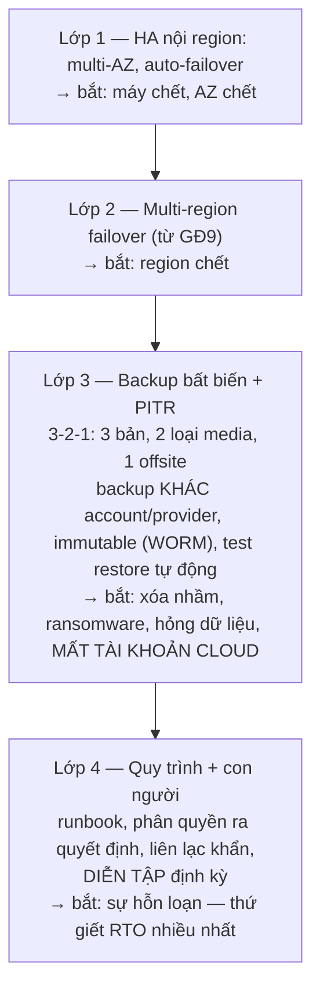

+++
title = "Giai đoạn 10 — Disaster Recovery"
date = "2026-07-13T16:00:00+07:00"
draft = false
tags = ["backend", "system-design"]
series = ["System Design — Tư Duy Thiết Kế Hệ Thống"]
+++

## 1. Vấn đề gì xuất hiện?

VietShop giờ xử lý GMV mà mỗi giờ downtime = tiền tỷ + tổn hại thương hiệu + điều khoản phạt hợp đồng enterprise. Câu hỏi chuyển từ "làm sao để không sập" (không thể đảm bảo tuyệt đối) sang: **"khi thảm họa xảy ra, chúng ta quay lại trong bao lâu, mất bao nhiêu dữ liệu, và ai làm gì?"**

Thảm họa ở đây không chỉ là region cloud sập. Thống kê ngành nhiều năm cho thấy các nguyên nhân *thường gặp hơn*: kỹ sư chạy nhầm lệnh xóa trên production, migration hỏng dữ liệu âm thầm suốt 3 ngày, ransomware, tài khoản cloud bị khóa/xâm nhập, bug ứng dụng ghi rác lan qua replication. Lưu ý điểm chung: **replication không cứu được bất kỳ ca nào trong số đó** — nó trung thành nhân bản cả thảm họa.

## 2. Vì sao kiến trúc cũ không còn phù hợp?

Multi-region (giai đoạn 9) giải quyết *hạ tầng chết* — nó không giải quyết *dữ liệu hỏng* và *tổ chức không biết phải làm gì*. DR là một năng lực khác về bản chất: nó nằm ở **quy trình + con người + diễn tập**, với hạ tầng chỉ là điều kiện cần. Một công ty có 3 region nhưng chưa từng diễn tập failover có DR trên slide, không có DR thật.

## 3. Giải pháp mới giải quyết điều gì?

### 3.1. Bắt đầu bằng hai con số, ký bởi business

- **RPO (Recovery Point Objective):** mất tối đa bao nhiêu dữ liệu? (thời gian)
- **RTO (Recovery Time Objective):** khôi phục trong bao lâu?

Hai con số này là **quyết định kinh doanh** (mỗi bậc nhỏ hơn là một bậc chi phí lớn hơn), phải được CEO/CFO ký, và **khác nhau theo từng hệ thống con**:

| Hệ thống | RPO | RTO | Cơ chế tương ứng |
|---|---|---|---|
| Đơn hàng, thanh toán, ví | ~0 (không mất giao dịch đã xác nhận) | < 15 phút | Sync/semi-sync replication + failover tự động + PITR |
| Catalog, nội dung | < 1 giờ | < 1 giờ | Async replication + backup thường xuyên |
| Analytics, log | < 24 giờ | < 24 giờ | Backup ngày; rebuild từ Kafka/nguồn |
| Cache, session | ∞ (mất được) | rebuild tự nhiên | Không cần DR — khai báo rõ để không tốn tiền oan |

### 3.2. Phòng thủ theo lớp — mỗi lớp bắt một loại thảm họa

Lớp 3 đáng nhấn mạnh nhất vì hay bị xem nhẹ khi "đã có multi-region": backup phải **bất biến** (không API nào — kể cả của admin bị chiếm quyền — xóa/sửa được trong kỳ giữ), nằm **ngoài blast radius** của account chính, và **PITR** cho phép quay về "1 phút trước khi migration hỏng chạy" — thứ duy nhất cứu được ca dữ-liệu-hỏng-đã-replicate.

### 3.3. Diễn tập — phần biến giấy thành năng lực

- **Game day định kỳ (tối thiểu mỗi quý):** tắt thật một AZ/region ở staging; mức trưởng thành cao hơn: failover production có kiểm soát vào giờ thấp điểm. Đo RTO/RPO **thực tế**, so với mục tiêu, sửa khoảng cách.
- **Restore test tự động, liên tục:** pipeline tự restore backup mới nhất vào môi trường tạm + chạy kiểm tra tính đúng → backup được *chứng minh* dùng được mỗi ngày, không phải *hy vọng*.
- **Diễn tập không báo trước cho quy trình con người:** ai tuyên bố thảm họa? Kênh liên lạc khi chat nội bộ cũng chết? Ai được quyền chấp nhận mất X phút dữ liệu để failover ngay? Quy tắc: **quyết định đau đớn phải được quyết trước, lúc bình tĩnh, thành văn** — 3 giờ sáng chỉ thực thi, không tranh luận.
- Sau mỗi drill và sự cố thật: **postmortem không đổ lỗi** → action item có deadline → drill sau kiểm tra lại.

## 4. Trade-off

| Được | Mất |
|---|---|
| Sống sót qua các thảm họa từng giết công ty khác | Chi phí thường trực cho thứ *hy vọng không bao giờ dùng* — đây là bảo hiểm, phải chấp nhận bản chất đó |
| RTO/RPO thành cam kết đo được thay vì hy vọng | Diễn tập tốn thời gian kỹ sư định kỳ + rủi ro nhỏ tự gây sự cố khi drill |
| Bán được cho enterprise/ngân hàng (DR là điều kiện thầu) | Kỷ luật tổ chức liên tục — DR mục nát trong im lặng nếu ngừng diễn tập 1 năm |
| Phản xạ sự cố của team tăng vọt nhờ drill | Backup bất biến đa vùng + băng thông + môi trường test restore: hóa đơn riêng không nhỏ |

## 5. Chi phí vận hành

Backup bất biến đa vùng (chi phí lưu trữ + egress), pipeline test restore, warm standby nếu RTO đòi (đắt gấp nhiều lần cold backup), thời gian drill (~vài ngày kỹ sư/quý), tài liệu runbook được cập nhật như code (review, version). Khoảng 5–15% ngân sách hạ tầng cho hệ thống nghiêm túc — so với chi phí của một thảm họa không có DR: rẻ.

## 6. Chi phí phát triển

Chủ yếu là chi phí *thiết kế cho khả năng phục hồi*: mọi hệ thống mới phải khai báo RPO/RTO class ngay trong design review; ứng dụng phải chịu được "degraded mode" (chạy thiếu một số dependency); script hạ tầng phải dựng lại được mọi thứ từ code (IaC — không có IaC thì RTO tính bằng tuần).

## 7. Rủi ro

- **DR trên giấy:** có tài liệu, không có drill → khi thảm họa thật, phát hiện backup thiếu một DB, runbook lỗi thời 2 năm, người nắm quy trình đã nghỉ việc. Drill là thứ duy nhất phân biệt DR thật và DR trang trí.
- **Failover được nhưng failback không:** chạy tạm ở region phụ 3 ngày, dữ liệu mới sinh ra ở đó — kéo về region chính thế nào? Failback phải nằm trong drill.
- **DR đồng bộ với thảm họa:** backup cùng account cloud bị chiếm, runbook nằm trong wiki cũng sập theo region. Kiểm tra "blast radius" của chính bộ máy DR.
- **Ảo giác an toàn sau vài drill thành công:** hệ thống đổi mỗi tuần, DR của quý trước không tự động đúng cho quý này — vì vậy drill là *định kỳ mãi mãi*, không phải dự án có ngày kết thúc.

## Kết của hành trình — và ba vòng lặp còn lại mãi

Đến đây VietShop có: monolith được module hóa ở lõi, các service quanh nó, cache/queue/Kafka/CQRS đúng chỗ đau, hai region với ownership dữ liệu rõ, và một tổ chức biết chính xác phải làm gì khi cháy nhà. Không có "kiến trúc cuối cùng" — chỉ có ba vòng lặp chạy mãi:

1. **Đo → tìm bottleneck → giải → bottleneck di chuyển** ([chương 1.5](/series/system-design/01-foundations/05-bottleneck-analysis/)).
2. **Feature mới → ranh giới cũ mòn → trả nợ ranh giới** (giai đoạn 5–6 lặp lại ở mức nhỏ, liên tục).
3. **Drill → lộ khoảng trống → vá → drill** (giai đoạn 10, vĩnh viễn).

Kiến trúc sư giỏi không phải người xây xong hệ thống đẹp — mà là người giữ cho ba vòng lặp này quay đều với chi phí thấp nhất.

---

*Xem các sự cố mà hành trình này phải sống sót qua: [Phần 13 — Production Failure Cases](/series/system-design/13-production-failure-cases/00-tong-quan/)*
