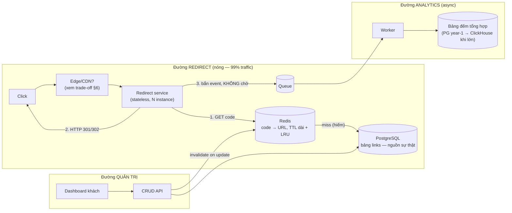

+++
title = "14.1. URL Shortener — bài tập khởi động hoàn hảo"
date = "2026-07-13T17:20:00+07:00"
draft = false
tags = ["backend", "system-design"]
series = ["System Design — Tư Duy Thiết Kế Hệ Thống"]
+++

> Bài "nhỏ mà thâm": đủ đơn giản để đi trọn chuỗi tư duy trong một chương, đủ sâu để lộ ra các quyết định thật. Đọc chương này như một bài tập mẫu về **cách áp dụng [chương 00](/series/system-design/00-tu-duy-thiet-ke/)** — giá trị nằm ở trình tự ra quyết định, không ở sơ đồ cuối.

## 1. Business Requirement & Constraint

Công ty martech Việt Nam cần rút gọn link cho các chiến dịch SMS/social của khách hàng doanh nghiệp: link ngắn tiết kiệm ký tự SMS, đo được lượt bấm, gắn được nhãn chiến dịch. Ràng buộc: team 2 dev, ra mắt trong 6 tuần, chi phí hạ tầng < $200/tháng năm đầu. Doanh thu đến từ gói SaaS theo số link + analytics — nghĩa là **đếm click là tính năng ăn tiền, không phải phụ kiện**.

## 2. Functional Requirements

- Tạo link ngắn từ URL dài (tự sinh mã hoặc tùy chọn mã đẹp — vanity).
- Redirect từ mã ngắn về URL gốc.
- Đếm lượt click theo link, theo thời gian, nguồn (referrer, UA thô).
- Link có hạn dùng tùy chọn; khách hàng quản lý link theo tài khoản.

## 3. Non-functional Requirements — nơi bài toán lộ hình

- **Redirect là đường sống còn:** p99 < 50ms (đứng giữa mọi cú bấm của end-user và trang đích của khách hàng); availability 99.95% — *link chết = chiến dịch của khách chết*.
- Tạo link: p99 < 500ms, 99.9% — đường quản trị, lỏng hơn hẳn.
- Đếm click: **chấp nhận eventual + sai số nhỏ** (analytics, không phải kế toán — [4.1 §5](/series/system-design/04-distributed-systems/01-cap-pacelc/)).
- Link không được "đổi chủ": mã đã cấp trỏ đúng URL đó vĩnh viễn (trừ khi chủ sửa).

Nhận xét: ba luồng có ba NFR khác hẳn nhau — thiết kế tốt sẽ **tách ba đường đi** thay vì một kiến trúc chung ([1.1 §3.3](/series/system-design/01-foundations/01-requirements/)).

## 4. Scale Estimation

Giả định năm 1: 500 khách doanh nghiệp × 200 link/tháng = 100K link mới/tháng ≈ **1.2M link/năm** — bé. Click: mỗi link trung bình 500 lượt bấm trong đời (chiến dịch SMS 10K–100K tin) → ~50M click/năm ≈ **1.6 click/giây trung bình**; nhưng click theo chiến dịch dồn cục: một đợt SMS 100K tin bắn lúc 9h sáng → **spike hàng nghìn click/phút trong 30 phút** — peak/avg cực lệch, chữ ký của thundering herd có lịch hẹn ([13.1 §case 3](/series/system-design/13-production-failure-cases/01-caching-failures/)).

Tỷ lệ đọc:ghi = 50M click / 1.2M tạo ≈ **40:1, và đọc gần như bất biến** (link tạo xong hiếm khi sửa) — kết luận lập tức: **cache là trung tâm của thiết kế** ([Phần 7](/series/system-design/07-caching/00-tong-quan/)). Dữ liệu: 1.2M link × ~500 byte ≈ 600MB/năm — DB tí hon; click event 50M × 200 byte ≈ 10GB/năm — analytics mới là dữ liệu lớn ([1.4 §2.2 — quy luật quen thuộc](/series/system-design/01-foundations/04-scale-estimation-capacity-planning/)).

## 5. Các quyết định thiết kế — theo thứ tự quan trọng

### 5.1. Sinh mã ngắn — bài toán trung tâm về đúng đắn

Yêu cầu: mã ngắn (6–7 ký tự base62 — 62⁶ ≈ 57 tỷ, thừa cho mọi tương lai), **không trùng**, không đoán được hàng loạt (khách không muốn đối thủ duyệt tuần tự mã để cào chiến dịch).

- ~~Hash URL (MD5 cắt ngắn)~~: trùng khi hai người rút gọn cùng URL với nhãn khác nhau — hành vi sai với nghiệp vụ multi-tenant; xử lý collision phức tạp dần.
- ~~Auto-increment + base62~~: không trùng, nhưng **đoán được tuần tự** — lộ tổng số link (thông tin kinh doanh) và cào được.
- **Chọn: counter + base62 + xáo trộn** (bijective — ví dụ phép nhân modulo/khối mã hóa nhẹ trên counter) hoặc **random 7 ký tự + check trùng** (xác suất trùng ~0 ở quy mô này, unique index làm lưới — [5.1 §7](/series/system-design/05-data-layer/01-postgresql/)). Với team 2 người: random + unique constraint + retry một lần là lựa chọn *đơn giản nhất đủ đúng*.

Vanity code: bảng riêng namespace theo tenant, first-come-first-served — quyết định sản phẩm hơn là kỹ thuật.

### 5.2. Kiến trúc ba đường

Ba quyết định gắn với ba NFR ở §3:

1. **Redirect đọc cache trước, DB sau** (cache-aside — [7.1](/series/system-design/07-caching/01-cache-strategies/)); dataset link *nhỏ đến mức toàn bộ working set nằm gọn trong RAM* — hit rate thực tế ≈ 99%+, DB gần như chỉ phục vụ miss lạnh và ghi.
2. **Đếm click tuyệt đối không nằm trên đường redirect:** bắn event vào queue rồi trả redirect ngay ([12.3 — đường nóng chỉ chứa thứ bắt buộc](/series/system-design/12-evolution/03-background-worker/)); worker gom batch ghi bộ đếm ([13.2 — hotspot: không UPDATE một hàng đếm nghìn lần/giây](/series/system-design/13-production-failure-cases/02-database-failures/)). Mất vài click khi crash? — NFR §3 đã cho phép.
3. **301 hay 302?** 301 (permanent) được browser cache → nhanh hơn và *rẻ hơn cho ta*, nhưng **click sau đó không về server = không đếm được**. Vì analytics là tính năng ăn tiền → **302/307**, chấp nhận mọi click đều chạm hệ thống. Một quyết định HTTP-status-code mang cả mô hình kinh doanh — ví dụ đẹp về "kỹ thuật phục vụ business".

### 5.3. Chống ngày xấu

- Spike chiến dịch: redirect stateless scale ngang + Redis chịu trăm nghìn GET/s ([5.4 §4](/series/system-design/05-data-layer/04-redis/)) — spike nghìn/phút không đáng kể; đệm thật nằm ở **queue analytics** (hấp thụ burst ghi — [12.4 §3](/series/system-design/12-evolution/04-message-queue/)).
- Link độc hại (phishing dùng domain của ta): check URL khi tạo (blacklist, Safe Browsing API — qua queue, không chặn UX) + nút khóa link + rate limit tạo link theo tenant ([11.3 §3](/series/system-design/11-security/03-gateway-ratelimit-waf/)). Đây là rủi ro *thương hiệu* lớn nhất của mọi shortener — bỏ qua là domain bị các trình duyệt/bộ lọc chặn, chết cả dịch vụ.
- Redis chết: dataset bé → DB gánh được cold start ở quy mô này (đã load test — [13.1 §case 2](/series/system-design/13-production-failure-cases/01-caching-failures/)); đây là món quà của bài toán nhỏ, *ghi rõ vào runbook* vì nó hết đúng khi quy mô tăng.

## 6. Trade-off trung tâm

| Quyết định | Chọn | Giá chấp nhận |
|---|---|---|
| 302 thay vì 301 | Đếm được mọi click | Mỗi click một round-trip đến ta — chi phí hạ tầng là chi phí của tính năng ăn tiền |
| Random code + unique index | Đơn giản nhất đủ đúng | Về lý thuyết có retry khi trùng (thực tế ~0) |
| Đếm async qua queue | Redirect 50ms bất khả xâm phạm | Số liệu trễ giây–phút; mất vài event khi sự cố — đã khai với product |
| PG cho cả link lẫn đếm năm đầu | Một hệ, một backup, 2 dev nuôi được | Biết trước điểm gãy: bảng click ~vài chục GB là tín hiệu sang ClickHouse ([5.5 §9](/series/system-design/05-data-layer/05-clickhouse/)) |
| Chưa dùng CDN redirect ở edge | Đỡ một tầng phức tạp; 50ms đạt được từ 1 region | User ngoài VN chậm hơn — chấp nhận vì khách hàng năm 1 là chiến dịch VN |

## 7. Evolution — khi nào thiết kế này gãy

- **×10 traffic (spike trăm nghìn/phút):** vẫn ổn — scale redirect instance + Redis; kiến trúc không đổi. Đây là dấu hiệu thiết kế đúng: *tăng tải 10× chỉ đòi thêm máy* ([1.1 — định nghĩa scalability](/series/system-design/01-foundations/01-requirements/)).
- **Analytics thành sản phẩm (funnel, geo, device):** click event sang Kafka + ClickHouse ([12.7](/series/system-design/12-evolution/07-kafka-event-driven/), [5.5](/series/system-design/05-data-layer/05-clickhouse/)) — đường async đã tách sẵn nên phẫu thuật này không chạm đường redirect.
- **Khách toàn cầu:** redirect ra edge (workers/lambda@edge đọc KV replicate) — dataset bé + bất biến là ứng viên đẹp nhất cho edge computing; nguồn sự thật vẫn một region ([12.9 — bậc 1–2](/series/system-design/12-evolution/09-multi-region/)).
- **Điều KHÔNG bao giờ cần:** sharding (57 tỷ mã, 600MB/năm — [8.1 §7: mỗi câu "chưa" là một quý hoãn](/series/system-design/08-data-partitioning/01-partitioning-sharding/)), microservices (một team 2 người — [12.5 §7](/series/system-design/12-evolution/05-modular-monolith/)).

## 8. Bài học rút ra

1. **Tách luồng theo NFR trước khi vẽ hộp:** ba luồng ba yêu cầu → ba đường đi — quyết định kiến trúc quan trọng nhất của bài này nằm ở §3, trước khi có bất kỳ công nghệ nào.
2. **Ước lượng giết tranh luận:** 600MB/năm chấm dứt mọi thảo luận NoSQL/sharding trong 5 phút ([1.4 §2.3](/series/system-design/01-foundations/04-scale-estimation-capacity-planning/)).
3. **Một status code có thể là quyết định kinh doanh** — và ngược lại: mô hình kinh doanh (bán analytics) quyết định kỹ thuật (302, queue, không mất đường đếm).
4. Bài nhỏ nhất cũng có rủi ro riêng của domain (abuse/phishing) mà không framework chung nào nhắc — **mỗi domain một bottleneck và một rủi ro đặc trưng**, đó là lý do phần case study tồn tại.

---

*Tiếp theo: [14.2. Social Network — fan-out và celebrity problem](/series/system-design/14-case-studies/02-social-network/)*
