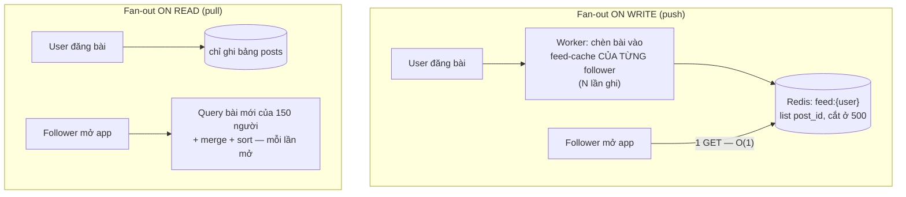
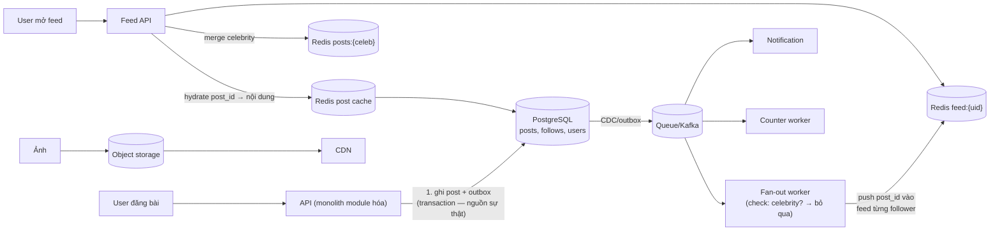

+++
title = "14.2. Social Network — fan-out và celebrity problem"
date = "2026-07-13T17:30:00+07:00"
draft = false
tags = ["backend", "system-design"]
series = ["System Design — Tư Duy Thiết Kế Hệ Thống"]
+++

> Bài toán định hình: **một hành động của một người phải đến với N người theo dõi** — và N trải từ 3 đến 10 triệu trên cùng một hệ thống. Không có phân bố nào lệch hơn thế trong toàn bộ tài liệu này.

## 1. Business Requirement & Constraint

Mạng xã hội theo sở thích (cộng đồng thể thao/ẩm thực) tại Việt Nam: user đăng bài, theo dõi nhau, xem **feed** — dòng nội dung từ những người mình theo. Doanh thu: quảng cáo trong feed → **feed là sản phẩm**; nghẽn feed = nghẽn doanh thu. Team 8 dev, đã có 200K user sau viral, đang tăng 30%/tháng — bài toán không phải "thiết kế từ zero" mà là "monolith hiện tại bắt đầu oằn ở đâu".

## 2. FR & NFR

FR lõi: đăng bài (text/ảnh), follow/unfollow, feed theo thời gian (năm 1 — chưa ranking ML), like/comment, thông báo, profile.

NFR đo được:

- Feed load p99 < 300ms — màn hình mở app, mọi giây chậm đo được bằng retention.
- Đăng bài p99 < 500ms; **bài hiển thị trong feed follower ≤ 30 giây** — chú ý: không ai cần "ngay lập tức"; con số 30 giây này là *chìa khóa mở toàn bộ không gian thiết kế async*.
- Like/counter: eventual, sai số nhỏ chấp nhận được. Mất bài đã đăng: không chấp nhận.

## 3. Scale Estimation — phân bố lệch là nhân vật chính

1M user kỳ vọng cuối năm; 200K DAU. Mỗi DAU: xem feed 8 lần/ngày, đăng 0.2 bài/ngày → **40K bài/ngày** (~0.5 ghi/giây — bé!) nhưng **1.6M lượt load feed/ngày**, mỗi lượt cần tổng hợp bài từ trung bình 150 follow → nếu tính lúc đọc: 1.6M × N query... Đọc:ghi > 1000:1 tính theo *công việc*, không chỉ theo request.

Phân bố follow theo luật lũy thừa ([13.2 — hot partition](/series/system-design/13-production-failure-cases/02-database-failures/)): median 150 follower, nhưng top 0.1% (KOL ẩm thực, cầu thủ) có 100K–1M follower. **Mọi quyết định của bài này xoay quanh việc hai nhóm này không thể đi chung một đường.**

## 4. Quyết định trung tâm: fan-out on write vs on read

Feed của user U = merge các bài mới nhất từ mọi người U theo dõi. Hai chiến lược gốc:

| | On write (push) | On read (pull) |
|---|---|---|
| Đọc feed | O(1) — một GET Redis: **nhanh, rẻ, đúng NFR 300ms** | O(số follow) query + merge — đắt mỗi lần mở |
| Đăng bài | O(số follower) ghi — user thường: 150 ghi, ổn | O(1) |
| Celebrity 1M follower | **1M ghi cho một bài** — bão ghi, trễ hàng phút, nghẽn queue | Không vấn đề |
| User ngủ đông (mở app 1 lần/tháng) | Ghi feed cho người không đọc — lãng phí | Không lãng phí |

Không chiến lược nào thắng toàn cục — vì phân bố lệch. **Lời giải chín của ngành là lai (hybrid):**

- **User thường (99.9%):** fan-out on write — feed đọc O(1), NFR 300ms đạt bằng cấu trúc chứ không bằng tối ưu.
- **Celebrity (ngưỡng ~50–100K follower — con số tune được):** KHÔNG fan-out. Bài của họ nằm trong cache riêng theo tác giả (`posts:{celebrity}` — chỉ vài nghìn key nóng); lúc user mở feed: lấy feed đã push + **merge tại chỗ** với bài mới của các celebrity mà user theo dõi (mỗi user theo dõi ít celebrity — merge 2–5 nguồn là rẻ).
- User ngủ đông: TTL feed cache; quay lại sau lâu → rebuild bằng pull một lần — chấp nhận lần mở đầu chậm hơn.

Đây là bài học **thiết kế theo phân bố** đã gặp ở [13.2 — VIP lane](/series/system-design/13-production-failure-cases/02-database-failures/) và [7.3 — hot key](/series/system-design/07-caching/03-distributed-cache/), nay ở cấp kiến trúc sản phẩm: *chấp nhận rằng 0.1% thực thể xứng đáng một đường đi riêng*.

## 5. Kiến trúc tổng và các đường đi

Các quyết định đáng chú thích:

- **Feed cache chỉ chứa `post_id`** (không chứa nội dung): bài sửa/xóa không phải quét N feed — hydrate qua post cache lúc đọc ([7.2 — versioned/normalize để né invalidation N chỗ](/series/system-design/07-caching/02-cache-invalidation/)); feed 500 id × 8 byte = vài KB/user — 1M user ≈ vài GB Redis, đếm được trên một bàn tay.
- **Outbox giữa post và fan-out** ([6.8](/series/system-design/06-communication/08-outbox/)): đăng bài mà fan-out rơi = bài "tàng hình" — loại bug làm user nghi ngờ cả nền tảng.
- **Follow/unfollow đổi feed thế nào?** Follow mới: không backfill (chỉ thấy bài từ giờ) — hành vi chấp nhận được, rẻ vô cùng so với backfill. Unfollow: lọc lúc đọc (lazy) thay vì quét xóa feed.
- Counter (like/comment): Redis INCR + flush batch ([13.2 — hotspot §khắc phục](/series/system-design/13-production-failure-cases/02-database-failures/)); hiển thị "1.2K" thay vì "1.203" — *sản phẩm* giúp *kỹ thuật* một cách hợp pháp.
- Notification: consumer riêng trên cùng dòng event ([14.4](/series/system-design/14-case-studies/04-notification-system/)).

## 6. Trade-off trung tâm

| Quyết định | Chọn | Giá |
|---|---|---|
| Hybrid fan-out | Đường riêng cho celebrity | Hai code path phải test, ngưỡng celebrity phải quản trị; user "đang lên" phải chuyển đường (migration nhỏ nhưng phải có) |
| Feed = danh sách id trong Redis | Đọc O(1), invalidation rẻ | Redis thành stateful quan trọng: cần replica + đã tập kịch bản rebuild ([5.4 §6](/series/system-design/05-data-layer/04-redis/)); mất feed cache = rebuild bằng pull, chậm nhưng không mất dữ liệu |
| Bài hiển thị ≤ 30s (async) | Toàn bộ fan-out qua queue | Trải nghiệm "đăng xong thấy ngay" cho *chính mình* phải làm riêng (chèn bài mình vào feed mình synchronous — chi tiết nhỏ, khiếu nại lớn nếu quên) |
| Chưa ranking ML | Feed thời gian thuần | Khi có ranking: feed cache thành "ứng viên" + tầng score lúc đọc — kiến trúc này mở đường sẵn, không phải đập |

## 7. Production & Evolution

- **Metric đặc thù:** fan-out lag (đăng → xuất hiện ở follower cuối — chính là SLA 30s), kích thước fan-out p99 (theo dõi phân bố follower — ngưỡng celebrity có còn đúng?), feed hit rate, queue depth của fan-out worker ([13.3](/series/system-design/13-production-failure-cases/03-messaging-failures/)).
- **Ngày xấu đặc thù:** một bài viral làm counter + comment của *một post* thành hot key ([7.3 §4 — thang thuốc](/series/system-design/07-caching/03-distributed-cache/)); một celebrity mới nổi vượt ngưỡng giữa chiến dịch — cần cơ chế "thăng cấp" tự động theo follower count.
- **Evolution:** 10M user — bảng follows và posts là ứng viên shard đầu tiên (theo user_id — [8.1 §3.2](/series/system-design/08-data-partitioning/01-partitioning-sharding/)); feed ranking ML = thêm tầng score, giữ nguyên khung; ảnh/video lớn dần = bài toán chuyển dần sang [14.6 — Video Streaming](/series/system-design/14-case-studies/00-tong-quan/).

## 8. Bài học rút ra

1. **Phân bố lệch quyết định kiến trúc nhiều hơn con số trung bình** — median follower 150 và max 1M là hai bài toán khác nhau trong một hệ thống; thiết kế cho trung bình là thiết kế cho không ai cả.
2. **NFR "≤ 30 giây" là món quà:** người viết yêu cầu cho phép async là người mở khóa toàn bộ thiết kế — kỹ năng đàm phán NFR ([1.1 §3.3](/series/system-design/01-foundations/01-requirements/)) đáng giá bằng kỹ năng kiến trúc.
3. **Công việc dịch chuyển được theo trục thời gian:** fan-out on write chuyển chi phí từ *lúc đọc* (nghìn lần) sang *lúc ghi* (một lần) — cùng nguyên lý với [12.8 — CQRS](/series/system-design/12-evolution/08-cqrs/) và materialized view ([5.5](/series/system-design/05-data-layer/05-clickhouse/)); nhận ra "trục dịch chuyển chi phí" là nhận ra một nửa các pattern trong nghề.

---

*Tiếp theo: [14.3. Chat Application — triệu kết nối sống](/series/system-design/14-case-studies/03-chat-application/)*
