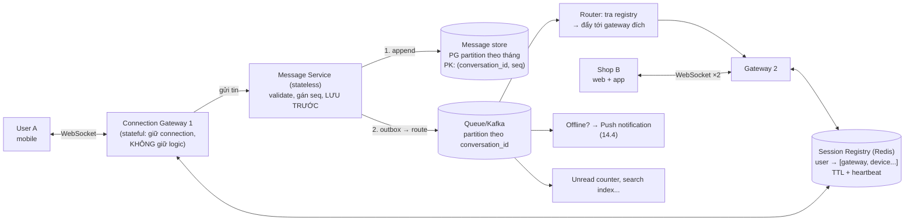

+++
title = "14.3. Chat Application — triệu kết nối sống"
date = "2026-07-13T17:40:00+07:00"
draft = false
tags = ["backend", "system-design"]
series = ["System Design — Tư Duy Thiết Kế Hệ Thống"]
+++

> Bài toán định hình: **connection dài là state không dọn đi được** — chat là nơi nguyên tắc "stateless hóa tầng app" ([2.1](/series/system-design/02-scalability/01-vertical-horizontal-scaling/)) gặp giới hạn của nó, và phải thiết kế *có* state một cách kỷ luật.

## 1. Business Requirement & Constraint

Nền tảng chat cho thương mại (người mua ↔ shop, như chat của sàn TMĐT): hỏi hàng, trả giá, chăm sóc sau bán. Chat tốt = chốt đơn — độ trễ và độ tin của tin nhắn ảnh hưởng trực tiếp GMV. 2M user, 100K shop; team 6 dev. Ràng buộc đặc thù: shop dùng **nhiều thiết bị đồng thời** (app + web + nhân viên chung tài khoản), lịch sử chat là hồ sơ giao dịch — **không được mất**.

## 2. FR & NFR

FR: chat 1-1 và nhóm nhỏ (user–shop có thể nhiều nhân viên), gửi text/ảnh/link sản phẩm, trạng thái đã gửi/đã nhận/đã đọc, presence (online/offline), lịch sử đồng bộ đa thiết bị, thông báo đẩy khi offline.

NFR — xếp theo độ cứng:

- **Không mất tin nhắn đã xác nhận "đã gửi"** — durability tuyệt đối ([1.1 — yêu cầu ngầm phải viết ra](/series/system-design/01-foundations/01-requirements/)).
- **Thứ tự trong một cuộc hội thoại** phải đúng (giữa các hội thoại — không cần: [6.5 §3 — hợp đồng thứ tự per-key](/series/system-design/06-communication/05-kafka/) xuất hiện tự nhiên).
- Latency gửi→nhận (cả hai online): p95 < 1s. Presence: xấp xỉ được (trễ 30s chấp nhận — độ chính xác của presence là *cảm giác*, không phải giao dịch).
- 200K connection đồng thời giờ peak (10% của 2M user online).

## 3. Scale Estimation

20M tin nhắn/ngày (~230/giây avg, peak ×4 ≈ 1K/giây) — throughput ghi *nhỏ* so với mọi hệ đã học. Dữ liệu: 20M × 300 byte ≈ 6GB/ngày ≈ 2TB/năm — lịch sử chat là dữ liệu **lớn dần và bất biến** → partition theo thời gian từ ngày 1 ([8.1 §2](/series/system-design/08-data-partitioning/01-partitioning-sharding/)).

Con số thật sự đáng gờm: **200K connection TCP sống đồng thời**. Đây không phải bài throughput — là bài *giữ* state: mỗi connection chiếm memory + file descriptor, và gateway giữ nó **không thể bị thay thế tùy tiện** như instance stateless. Bài toán chat = bài toán quản lý connection + bài toán durability tin nhắn, ghép lại.

## 4. Kiến trúc — tách tầng theo bản chất state

**Nguyên tắc phân vai — trái tim của thiết kế:**

1. **Gateway thật mỏng:** chỉ giữ connection + forward — *không* logic nghiệp vụ. Vì gateway là stateful (connection không dọn đi được — [2.1 §3](/series/system-design/02-scalability/01-vertical-horizontal-scaling/)), ta *tối thiểu hóa những gì phải stateful*: logic nằm ở Message Service stateless phía sau, scale và deploy tự do.
2. **Lưu trước, đẩy sau (store-then-forward):** tin nhắn ghi bền vào message store **trước khi** báo "đã gửi" và trước khi đẩy đi ([4.2 — durability là lời hứa fsync, không phải lời hứa RAM](/series/system-design/04-distributed-systems/02-replication-consistency/)). Đẩy realtime chỉ là *tối ưu tốc độ giao* — nguồn sự thật là store; thiết bị nào lỡ tin thì đồng bộ lại từ store (§5).
3. **Thứ tự bằng sequence per-conversation:** Message Service gán `seq` tăng đơn điệu *trong* mỗi hội thoại (counter Redis/DB per-conversation — throughput 1K/s toàn hệ thì counter này không là gì); client sắp theo seq, phát hiện lỗ hổng (nhận 5,7 → thiếu 6 → kéo bù từ store). Không dựa timestamp — [4.4 §2 — đồng hồ không đáng tin](/series/system-design/04-distributed-systems/04-clock-partition-split-brain/).

## 5. Đồng bộ đa thiết bị — bài toán bị đánh giá thấp nhất

Shop có 3 thiết bị: tin nhắn đến phải tới **cả ba**; đã đọc ở thiết bị này phải tắt badge ở thiết bị kia. Mô hình đúng: **mỗi thiết bị một con trỏ đồng bộ** (`device → last_synced_seq` per conversation) — chính là mô hình *consumer offset của Kafka* ([6.5 §3](/series/system-design/06-communication/05-kafka/)) áp vào tầng ứng dụng: message store là log, mỗi thiết bị là một consumer tự nhớ đọc đến đâu. Thiết bị offline 3 ngày quay lại = kéo từ con trỏ — không cần "gửi lại", không mất gì, không cần push đủ 100%.

Hệ quả đẹp: **push notification chỉ cần best-effort** (mất một push không mất tin nhắn — mở app là đồng bộ đủ), tách hẳn độ tin của *thông báo* khỏi độ tin của *dữ liệu* — hai NFR khác nhau, hai cơ chế khác nhau.

Trạng thái "đã đọc": cũng là sự kiện qua cùng đường (append `read_marker` vào log hội thoại) — mọi thiết bị nhận và cập nhật. Presence: hoàn toàn phù du — Redis TTL + heartbeat ([5.4 §3 — loại dữ liệu mất được](/series/system-design/05-data-layer/04-redis/)), *không* ghi DB, *không* fan-out rộng (chỉ tính cho hội thoại đang mở — presence toàn hệ là chi phí khổng lồ cho giá trị nhỏ).

## 6. Ngày xấu của hệ chat — connection là failure domain riêng

- **Gateway chết → 20K connection rơi cùng lúc → 20K client reconnect đồng loạt** — thundering herd tự gây ([13.1 §case 3](/series/system-design/13-production-failure-cases/01-caching-failures/)): client bắt buộc reconnect với **jitter + backoff**; gateway mới nhận dồn phải chịu được burst handshake (TLS đắt CPU); registry phải dọn entry chết bằng TTL chứ không tin "disconnect event" (gateway chết đâu kịp gửi gì — [4.4 — chết và chậm không phân biệt được](/series/system-design/04-distributed-systems/04-clock-partition-split-brain/)).
- **Deploy gateway = cưỡng bức di cư connection:** drain từ từ (ngừng nhận mới, đẩy client cũ reconnect dần bằng lệnh `reconnect` rải jitter) — rolling deploy của tầng stateful là *quy trình*, không phải nút bấm ([2.2 §3.3 — draining, phiên bản khó hơn](/series/system-design/02-scalability/02-load-balancer/)).
- **LB cho WebSocket:** L7 hiểu upgrade + **không** cần sticky sau khi thiết kế đúng (client kết nối gateway nào cũng được — registry lo phần tìm nhau; sticky chỉ cần *trong đời một connection*, thứ TCP tự có).

## 7. Trade-off trung tâm

| Quyết định | Chọn | Giá |
|---|---|---|
| Store-then-forward | Durability tuyệt đối, đa thiết bị sạch | +1 lượt ghi trước khi giao — p95 1s vẫn thừa đạt; "realtime thuần túy" nhanh hơn vài chục ms nhưng mất nền durability |
| Gateway mỏng + registry | Tối thiểu hóa vùng stateful | Thêm một hop nội bộ mỗi tin; registry là dependency nóng (Redis HA — [5.4 §6](/series/system-design/05-data-layer/04-redis/)) |
| Seq per-conversation | Thứ tự đúng nơi cần, rẻ | Counter per-conversation là state nhỏ phải quản; hội thoại nhóm cực lớn (chưa có trong FR) sẽ cần xem lại |
| Con trỏ per-device | Đồng bộ đúng mọi kịch bản offline | Bảng con trỏ (device × conversation) — lớn nhưng thưa; dọn thiết bị chết theo TTL |
| PG partition cho message store | Một hệ quen thuộc, đủ cho 2TB/năm | Biết điểm gãy: khi ghi vượt xa hoặc lưu nhiều năm → Cassandra-class là ứng viên kế (append-heavy, partition tự nhiên theo conversation — [5.7](/series/system-design/05-data-layer/07-so-sanh-lua-chon/)) |

## 8. Production & Evolution

- **Metric đặc thù:** connection count theo gateway (lệch = LB/reconnect có vấn đề), reconnect rate (spike = gateway vừa chết hoặc mạng user tệ), message delivery lag p95 (gửi→giao online), sync backlog (thiết bị lệch con trỏ bao xa), và **đối soát**: tin đã lưu vs tin đã giao ít nhất một thiết bị ([13.README — đối soát là lưới cuối](/series/system-design/13-production-failure-cases/00-tong-quan/)).
- **Evolution:** nhóm lớn (1000 người — chuyển từ "đẩy từng người" sang "kéo theo con trỏ" hoàn toàn); search lịch sử chat (index riêng qua CDC — [9.2](/series/system-design/09-search/02-search-architecture/)); E2E encryption (đổi cả mô hình lưu trữ — quyết định sản phẩm nặng, nên biết sớm); multi-region (chat là ứng viên home-region đẹp: hội thoại có "chủ" địa lý tự nhiên — [12.9](/series/system-design/12-evolution/09-multi-region/)).

## 9. Bài học rút ra

1. **Khi state không dọn đi được, hãy thu nhỏ vùng chứa nó** — gateway mỏng là chiến lược tổng quát cho mọi hệ có connection dài (game, IoT, live streaming đều cùng bài).
2. **Tách "độ tin của dữ liệu" khỏi "độ tin của giao nhận":** store là sự thật, đẩy realtime là tối ưu, push là best-effort — ba tầng ba hợp đồng, gỡ được là gỡ được cả bài chat.
3. **Mô hình log + consumer offset tái xuất ở tầng ứng dụng** — con trỏ per-device chính là bài học Kafka dùng lại; các mô hình lớn trong tài liệu này (log, quorum, cache, backpressure) lặp lại ở mọi tầng — nhận ra sự lặp lại đó chính là "tư duy hệ thống" mà tài liệu này nhắm tới.

---

*Tiếp theo: [14.4. Notification System — fan-out đa kênh qua những bên không tin được](/series/system-design/14-case-studies/04-notification-system/)*
