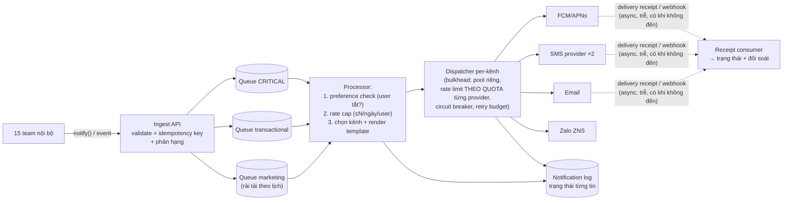

+++
title = "14.4. Notification System — fan-out đa kênh qua những bên không tin được"
date = "2026-07-13T17:50:00+07:00"
draft = false
tags = ["backend", "system-design"]
series = ["System Design — Tư Duy Thiết Kế Hệ Thống"]
+++

> Bài toán định hình: hệ thống **không sở hữu chặng cuối** — mọi kênh giao (APNs/FCM, SMS, email, Zalo ZNS) đều là bên thứ ba với rate limit, sự cố và hóa đơn của họ. Notification system là bài tổng hợp đẹp nhất của [Phần 6](/series/system-design/06-communication/00-tong-quan/) và [13.3/13.5](/series/system-design/13-production-failure-cases/03-messaging-failures/).

## 1. Business Requirement & Constraint

VietShop ([Phần 12](/series/system-design/12-evolution/00-tong-quan/)) đến lúc cần một **nền tảng thông báo dùng chung**: trước giờ mỗi team tự gửi (order gửi email kiểu này, marketing bắn push kiểu kia) — kết quả là user nhận 14 thông báo/ngày, không tắt được thứ mình ghét, và một chiến dịch marketing từng làm nghẽn luôn đường OTP. Bài toán thật: **gom mọi thông báo về một cửa, có luật** — ưu tiên, tần suất, sở thích user — và gửi tin cậy qua các kênh không tin được. Team 5 dev, phục vụ 15 team nội bộ như khách hàng.

## 2. FR & NFR — phân hạng là linh hồn

FR: API `notify(user, template, data, priority)` cho mọi team; chọn kênh theo loại + sở thích user; template đa ngôn ngữ; user preference (tắt/bật theo loại); lịch sử đã gửi; đo delivered/opened.

**NFR khác nhau theo hạng — một con số chung là sai đề bài** ([1.1 §3.3](/series/system-design/01-foundations/01-requirements/)):

| Hạng | Ví dụ | Latency | Độ tin | Được phép gộp/nén? |
|---|---|---|---|---|
| **Transactional-critical** | OTP, xác nhận thanh toán | < 10s | Cao nhất, có fallback kênh | Không bao giờ |
| **Transactional** | Đơn đã giao, tin nhắn mới | < 1 phút | Cao | Không |
| **Marketing/digest** | Flash sale, gợi ý | Giờ (theo lịch, rải tải) | Best-effort | Có — và *nên* |

## 3. Scale Estimation

2M user; transactional ~1.5M/ngày (~17/giây, peak ×5); marketing: chiến dịch 2M push **theo đợt** — nếu bắn thẳng: 2M request/phút vào FCM và một [thundering herd](/series/system-design/13-production-failure-cases/01-caching-failures/) tự chế vào chính app mình (user bấm vào cùng lúc!). Suy ra hai kết luận cấu trúc: (1) **marketing phải rải** (2M tin trong 30–60 phút — [13.1 §case 3 — rải theo thời gian là thuốc](/series/system-design/13-production-failure-cases/01-caching-failures/)); (2) **hai hạng không được đi chung ống** — chiến dịch 2M không được xếp trước một cái OTP.

## 4. Kiến trúc — pipeline có luật

Các quyết định xương sống:

1. **Queue riêng theo hạng** — bulkhead từ cửa ([6.4 §7](/series/system-design/06-communication/04-rabbitmq/)): OTP không bao giờ xếp sau marketing; ba queue ba SLA ba alert ([13.3 — alert theo tuổi message](/series/system-design/13-production-failure-cases/03-messaging-failures/)).
2. **Idempotency hai đầu** ([13.3 — duplication](/series/system-design/13-production-failure-cases/03-messaging-failures/)): đầu vào — key theo nghiệp vụ (`order_shipped:{order_id}`) chặn team gọi trùng; đầu ra — trạng thái `sending` ghi *trước khi* gọi provider + key idempotency với provider hỗ trợ. Gửi trùng OTP là phiền; gửi trùng "đơn hủy" là hoảng loạn.
3. **Dispatcher per-kênh là công dân [13.5 — Third-party API Down](/series/system-design/13-production-failure-cases/05-infrastructure-failures/) mẫu mực:** rate limit *theo quota của provider* (không phải theo sức mình), CB + retry budget, và **fallback phân bậc cho hạng critical**: OTP qua SMS provider A fail → provider B → voice call — thứ tự fallback là *chính sách* cấu hình được, vì chi phí mỗi kênh khác nhau (SMS đắt gấp push hàng chục lần — router có thể tối ưu tiền một cách hợp pháp: push trước, 90 giây không mở thì mới SMS).
4. **Preference + rate cap ở giữa pipeline, một chỗ:** "user đã tắt marketing" và "tối đa 3 thông báo/ngày trừ critical" — luật sống ở nền tảng, 15 team không phải (và không được) tự xử.
5. **Receipt là dòng dữ liệu riêng:** provider báo delivered/failed **async, trễ, và thiếu** — consumer receipt cập nhật trạng thái + **đối soát định kỳ** (gửi 2M, receipt về 1.7M — 300K kia sao rồi? — [13.README — đối soát là lưới cuối](/series/system-design/13-production-failure-cases/00-tong-quan/)); "đã gửi cho provider" ≠ "user đã nhận", nhầm hai khái niệm này là mù về chất lượng thật.

## 5. Trade-off trung tâm

| Quyết định | Chọn | Giá |
|---|---|---|
| Nền tảng chung thay vì mỗi team tự gửi | Luật một chỗ, quota một chỗ, UX nhất quán | Nền tảng thành dependency của 15 team — phải có SLA nội bộ, on-call, versioned API như sản phẩm thật ([12.6 — platform team](/series/system-design/12-evolution/06-microservices/)) |
| Ba queue theo hạng | Cách ly tuyệt đối OTP khỏi marketing | Ba đường vận hành; phân hạng sai từ team gọi = sai SLA (validate + duyệt hạng khi onboard) |
| Fallback kênh cho critical | OTP đến được cả khi một provider chết | Chi phí ×N khi kích hoạt; phải chống *double-send* khi provider A chỉ chậm chứ không chết (timeout → fallback → cả hai cùng đến — chấp nhận với OTP, kiểm soát bằng timeout hợp lý) |
| Push best-effort, không đảm bảo 100% | Rẻ, đúng bản chất kênh | Dữ liệu quan trọng phải có đường kéo (in-app inbox đọc từ notification log — [14.3 §5 — cùng triết lý store-then-forward](/series/system-design/14-case-studies/03-chat-application/)) |
| Rải marketing theo lịch | Không tự DDoS mình và provider | Chiến dịch "ngay lập tức" thành "trong 30 phút" — đàm phán với marketing một lần, bằng số liệu sự cố cũ |

## 6. Production & Evolution

- **Metric đặc thù:** delivery rate theo kênh × provider (rơi = provider ốm — chuyển router), latency ingest→delivered theo hạng (SLA thật), queue age ba hạng, receipt lag, opt-out rate theo loại (tăng = đang spam — tín hiệu *sản phẩm* từ hệ *kỹ thuật*), chi phí theo kênh theo ngày (SMS bill là bill dễ nổ nhất).
- **Ngày xấu đặc thù:** provider trả lỗi chậm 30s thay vì fail nhanh → giam worker → cả pipeline nghẽn ([13.2 — pool exhaustion](/series/system-design/13-production-failure-cases/02-database-failures/); timeout ngắn + CB là thuốc); chiến dịch marketing cấu hình nhầm hạng critical → chèn trước OTP (validate hạng theo template, không cho team tự khai); token push chết hàng loạt sau khi user gỡ app (dọn token theo feedback của FCM/APNs — không dọn là delivery rate ảo).
- **Evolution:** thêm kênh mới (Zalo, WhatsApp) = thêm dispatcher, khung giữ nguyên — dấu hiệu ranh giới đúng; smart routing theo chi phí + tỷ lệ mở (ML chọn kênh/giờ gửi); digest engine (gom 5 thông báo thành 1 — chống mệt mỏi thông báo, tăng opt-in dài hạn).

## 7. Bài học rút ra

1. **Khi không sở hữu chặng cuối, thiết kế xoay quanh sự không tin được:** quota của họ, sự cố của họ, receipt trễ của họ — bulkhead, CB, fallback, đối soát không phải "hardening thêm" mà là *chính kiến trúc*.
2. **Phân hạng lưu lượng là quyết định số một của mọi hệ fan-out:** OTP và marketing chung ống là lỗi thiết kế phổ biến nhất và đắt nhất của notification — bulkhead theo *giá trị nghiệp vụ*, không theo công nghệ.
3. **Hệ kỹ thuật tốt tạo ra đòn bẩy sản phẩm:** preference, rate cap, digest — chống spam không phải tính năng phụ; nó là lý do user còn bật thông báo, tức là lý do kênh này còn giá trị.

---

*Tiếp theo: [14.5. Banking & FinTech — khi sai một đồng là sai tất cả](/series/system-design/14-case-studies/05-banking-fintech/)*
