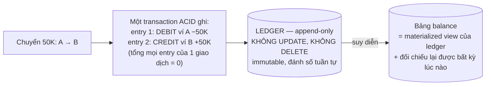

+++
title = "14.5. Banking & FinTech — khi sai một đồng là sai tất cả"
date = "2026-07-13T18:00:00+07:00"
draft = false
tags = ["backend", "system-design"]
series = ["System Design — Tư Duy Thiết Kế Hệ Thống"]
+++

> Bài toán định hình: **đúng tuyệt đối, chứng minh được, và kiểm toán được** — trong khi throughput lại *thấp một cách đáng ngạc nhiên*. Banking đảo ngược trực giác của mọi case trước: đây là bài mà scale là chuyện phụ, còn từng đồng là chuyện chính.

## 1. Business Requirement & Constraint

Ví điện tử Việt Nam: nạp/rút qua ngân hàng, chuyển tiền P2P, thanh toán QR tại quầy. Ràng buộc đặc thù không case nào trước có: **pháp lý là kiến trúc sư trưởng vô hình** — giấy phép trung gian thanh toán của NHNN, đối soát bắt buộc với ngân hàng đối tác, audit trail nhiều năm, dữ liệu tại Việt Nam ([1.1 §3.2](/series/system-design/01-foundations/01-requirements/)). Sai lệch tiền không phải bug — là sự kiện phải báo cáo. Team 20 dev, trong đó có compliance officer ngồi *trong* các design review — một vị trí nói lên tất cả.

## 2. FR & NFR — đảo ngược thứ tự ưu tiên quen thuộc

FR: tài khoản ví, nạp/rút, chuyển P2P, thanh toán QR, lịch sử giao dịch, đối soát, hạn mức theo KYC level.

NFR — chú ý thứ tự:

1. **Correctness tuyệt đối:** không mất tiền, không tạo tiền, không âm ví (trừ khi sản phẩm cho phép), mọi giao dịch truy vết được. Đây là NFR số 1, 2 và 3.
2. **Consistency > Availability, tường minh:** khi nghi ngờ — **từ chối giao dịch** ([4.1 §5 — hàng "trừ tiền" trong bảng CAP-theo-nghiệp-vụ](/series/system-design/04-distributed-systems/01-cap-pacelc/)); user chấp nhận "giao dịch thất bại, thử lại" chứ không chấp nhận "tiền biến mất".
3. Latency: p99 < 2s cho thanh toán — *rộng rãi* so với mọi case trước; không ai bỏ ví vì thanh toán mất 1.5s, nhưng bỏ ngay nếu mất 50K đồng.
4. Throughput: 5M giao dịch/ngày mục tiêu ≈ 60 TPS avg, peak lễ Tết ×20 ≈ 1200 TPS — **một PostgreSQL tốt gánh được** ([1.4 §3.3](/series/system-design/01-foundations/04-scale-estimation-capacity-planning/)). Chấm dứt mọi ảo tưởng "banking cần NoSQL scale khủng" ngay tại bước ước lượng.

## 3. Quyết định trung tâm: ledger append-only, không phải cột balance

Thiết kế ngây thơ: bảng `wallets(user_id, balance)` + UPDATE khi giao dịch. Ba lỗi cấu trúc: (1) UPDATE mất lịch sử — "vì sao số dư ra thế này" không trả lời được = chết với kiểm toán; (2) hàng ví nóng bị UPDATE cạnh tranh ([13.2 — hotspot + deadlock](/series/system-design/13-production-failure-cases/02-database-failures/)); (3) bug ghi đè là *mất thông tin không khôi phục được*.

**Ledger kép (double-entry) append-only** — nghề kế toán đã giải bài này 500 năm trước:

- **Ledger là nguồn sự thật; balance là dẫn xuất** — quen thuộc chưa? Đây chính là [event sourcing](/series/system-design/12-evolution/08-cqrs/) trong hình hài nguyên bản nhất của nó, và là lý do [13.2 §case 4](/series/system-design/13-production-failure-cases/02-database-failures/) nói "ngành tài chính dùng ledger có lý do": INSERT không tranh lock như UPDATE, lịch sử là chính dữ liệu, và mọi số dư *chứng minh được* bằng tổng các bút toán.
- **Chống âm ví** trong cùng transaction: `UPDATE balance SET amount = amount - 50 WHERE user_id = ? AND amount >= 50` — số hàng ảnh hưởng = 0 nghĩa là không đủ tiền, rollback cả ledger entry ([13.2 §case 6 — update có điều kiện một câu](/series/system-design/13-production-failure-cases/02-database-failures/)). ACID của một PostgreSQL làm việc này *miễn phí* — lý do mạnh nhất để **core ledger là một service, một database, không tách** ([6.7 §9 — có những bài không nên phân tán](/series/system-design/06-communication/07-saga/)).
- **Idempotency là điều kiện tồn tại:** mọi giao dịch mang key duy nhất từ client (`transfer:{uuid}`); bảng `transactions` unique theo key — retry bao nhiêu lần cũng đúng một lần ghi sổ ([13.3 §case 11](/series/system-design/13-production-failure-cases/03-messaging-failures/)). User bấm đúp nút "chuyển tiền" trong thang máy sóng yếu là kịch bản *hằng ngày*, không phải edge case.

## 4. Tiền đi ra ngoài — Saga với thế giới không tin được

Nạp/rút chạm ngân hàng đối tác: hệ *ngoài*, chậm, timeout, và có trạng thái "không biết" ([13.5 §case 21](/series/system-design/13-production-failure-cases/05-infrastructure-failures/)). Đây là đất diễn của [Saga orchestration](/series/system-design/06-communication/07-saga/) với một nguyên tắc thép: **tiền bị giữ (pending) cho đến khi chắc chắn** — rút tiền: (1) transaction nội bộ chuyển 50K sang trạng thái `held` (ledger entry — vẫn ACID); (2) gọi API ngân hàng với idempotency key; (3a) thành công → `held` thành `settled`; (3b) thất bại rõ ràng → hoàn `held` về ví (compensation); (3c) **timeout — không biết** → *không làm gì cả*, giữ nguyên `held`, để **job đối soát truy vấn trạng thái** (query API/chờ file đối soát) rồi mới quyết. Ba nhánh, nhánh thứ ba là nơi tay mơ mất tiền: coi timeout là thất bại và hoàn tiền, trong khi lệnh đã thành công phía ngân hàng = user rút được hai lần.

**Đối soát (reconciliation) là hệ thống hạng nhất, không phải script cuối tháng:** mỗi ngày đối chiếu từng giao dịch với file/API của từng đối tác + đối chiếu nội bộ (tổng ledger = 0? balance khớp tổng bút toán?) — chạy tự động, lệch một đồng là alert + quy trình điều tra ([13.README — đối soát là lưới cuối, ở đây là lưới *chính*](/series/system-design/13-production-failure-cases/00-tong-quan/)).

## 5. Trade-off trung tâm

| Quyết định | Chọn | Giá |
|---|---|---|
| Core ledger = 1 service + 1 PostgreSQL ACID | Đúng tuyệt đối miễn phí; 1200 TPS peak trong tầm | Trần scale = 1 node — *biết trước*: partition theo user khi cần ([8.1](/series/system-design/08-data-partitioning/01-partitioning-sharding/)), nhưng ước lượng nói còn xa |
| Append-only ledger | Audit trail = dữ liệu; không hotspot UPDATE | Dung lượng tăng mãi (partition theo tháng + archive — [5.1 §7](/series/system-design/05-data-layer/01-postgresql/)); mọi "sửa sai" là bút toán đảo, không phải edit — đúng nghiệp vụ kế toán |
| Từ chối khi nghi ngờ (CP) | Không bao giờ tự tạo sai lệch | Availability thấp hơn trong sự cố — degraded mode là "xem số dư, không giao dịch" ([3.1 §5](/series/system-design/03-availability-reliability/01-ha-failover/)) |
| Sync replication + PITR + backup bất biến | RPO ~0 cho tiền ([12.10 §3.1 — hàng đầu bảng](/series/system-design/12-evolution/10-disaster-recovery/)) | Chi phí hạ tầng và latency ghi — đúng chỗ đáng trả nhất |
| Fraud check trong đường nóng (rule nhanh) + async (ML sâu) | Chặn được giao dịch xấu trước khi tiền đi | Thêm ~100–200ms cho rule sync; ML async có thể chỉ kịp *treo* giao dịch đáng ngờ thay vì chặn |

## 6. Production & Evolution

- **Metric đặc thù:** sai lệch đối soát (con số phải là **0** — mọi giá trị khác là sự cố), giao dịch kẹt ở `held`/pending quá ngưỡng ([6.7 §6 — saga kẹt](/series/system-design/06-communication/07-saga/)), tỷ lệ từ chối theo lý do, độ trễ settle theo đối tác.
- **Audit log bất biến cho mọi thao tác admin** ([11.1 §5](/series/system-design/11-security/01-authn-authz/)) — kẻ thù nguy hiểm nhất của hệ tài chính là insider; least privilege + four-eyes cho thao tác tiền ([README Phần 11](/series/system-design/11-security/00-tong-quan/)).
- **Evolution:** thêm sản phẩm (trả góp, tiết kiệm) = thêm loại tài khoản và bút toán trong *cùng* ledger model — dấu hiệu mô hình đúng; scale = partition ledger theo user_id khi TPS thật đòi (chưa phải năm 1–3); điều **không bao giờ** làm: tách "service trừ tiền" và "service cộng tiền" ra hai DB rồi nối bằng Saga — tự biến bài ACID miễn phí thành bài phân tán khó nhất.

## 7. Bài học rút ra

1. **Đúng trước, nhanh sau, scale cuối** — banking đảo thứ tự ưu tiên của mọi case trước, và ước lượng chứng minh sự đảo đó *hợp lý*: 1200 TPS peak không phải bài toán scale.
2. **Ledger append-only là event sourcing 500 tuổi** — khi domain đòi audit tuyệt đối, immutability không phải kỹ thuật hay ho mà là *yêu cầu nghiệp vụ*.
3. **Trạng thái "không biết" là trạng thái hạng nhất** khi làm việc với tiền và bên thứ ba — thiết kế cho nó (held + đối soát) thay vì ép nó thành thành công/thất bại là ranh giới giữa FinTech nghiêm túc và FinTech sắp lên báo.

---

*Tiếp theo: [14.6. Video Streaming — băng thông là kiến trúc](/series/system-design/14-case-studies/06-video-streaming/)*
