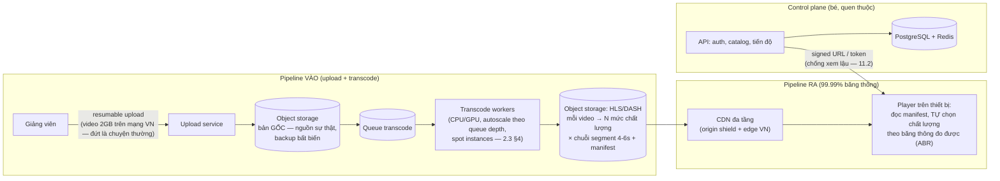

+++
title = "14.6. Video Streaming — băng thông là kiến trúc"
date = "2026-07-13T18:10:00+07:00"
draft = false
tags = ["backend", "system-design"]
series = ["System Design — Tư Duy Thiết Kế Hệ Thống"]
+++

> Bài toán định hình: video là dữ liệu nặng hơn mọi thứ khác **ba bậc độ lớn** — một giờ video 1080p ≈ 2–4GB, bằng vài triệu bản ghi DB. Khi dữ liệu nặng đến thế, **chi phí băng thông và vị trí đặt byte quyết định kiến trúc** nhiều hơn mọi lựa chọn framework.

## 1. Business Requirement & Constraint

Nền tảng video học tập Việt Nam (khóa học quay sẵn + livestream lớp học): giảng viên upload bài giảng, học viên xem theo gói đăng ký. 500K học viên, mục tiêu 2M. Doanh thu theo subscription → **trải nghiệm xem (không giật, tua nhanh) là sản phẩm**; và chi phí băng thông là dòng chi phí lớn nhất của công ty — tối ưu nó không phải tối ưu kỹ thuật mà là tối ưu biên lợi nhuận.

## 2. FR & NFR

FR: upload video (giảng viên), xem VOD với chọn chất lượng tự động, tua/seek tức thời, livestream + xem lại, chống tải lậu (DRM nhẹ/signed URL), theo dõi tiến độ học.

NFR:

- **Time-to-first-frame < 2s; rebuffering < 0.5%** thời lượng xem — hai chỉ số vàng của streaming, đo trực tiếp churn.
- Upload→sẵn sàng xem: < 30 phút (VOD — có thể đợi); livestream latency: 5–15s chấp nhận được (lớp học, không phải đấu giá — *đàm phán NFR này mua được cả một tầng đơn giản*: HLS chuẩn thay vì WebRTC phức tạp).
- Video gốc **không được mất** (tài sản của giảng viên và công ty).

## 3. Scale Estimation — con số nào thống trị

200K DAU × 45 phút xem/ngày × ~3GB/giờ (trung bình các mức chất lượng) ≈ **450TB/ngày băng thông ra** ≈ 40–45Gbps trung bình, peak tối ×2.5 ≈ **>100Gbps**. So sánh: *mọi* dữ liệu phi-video của hệ (user, tiến độ, thanh toán) ≈ vài GB/ngày. Tỷ lệ 100.000:1 — kết luận không cần tranh luận: **kiến trúc này là kiến trúc phân phối byte; phần "web app" chỉ là vệ tinh.** Upload: 500 video mới/ngày × 2GB = 1TB/ngày vào — bé so với chiều ra, nhưng transcode là bài CPU nặng nhất hệ thống.

Tự phục vụ 100Gbps từ server thuê? Chi phí và độ phức tạp phi thực tế → **CDN không phải "tối ưu" mà là điều kiện tồn tại** ([12.9 — bậc 1 edge, đẩy đến cực đại](/series/system-design/12-evolution/09-multi-region/)).

## 4. Kiến trúc — hai pipeline quanh một kho byte

Bốn quyết định xương sống:

1. **Adaptive Bitrate (ABR) qua HLS/DASH:** video cắt thành **segment 4–6 giây** ở N mức chất lượng (240p→1080p); player *tự* đo băng thông và đổi mức theo từng segment. Ba hệ quả đẹp: mạng 3G yếu vẫn xem được (đổi xuống 360p thay vì đứng hình); seek = nhảy đến segment tương ứng (không tải phần trước); và **mọi segment là file tĩnh bất biến → CDN cache hoàn hảo, TTL vô hạn** ([7.2 §8 — dữ liệu bất biến xóa bài invalidation](/series/system-design/07-caching/02-cache-invalidation/)). Toàn bộ độ thông minh nằm ở *client* — server chỉ phục vụ file tĩnh: đảo ngược đẹp nhất của bài này.
2. **Transcode là batch pipeline chuẩn:** queue + worker autoscale theo queue depth ([2.3 §3 — chuẩn vàng](/series/system-design/02-scalability/03-auto-scaling/)) + spot instances (job chịu được thu hồi — retry idempotent theo segment, [12.4](/series/system-design/12-evolution/04-message-queue/)); ưu tiên hai hàng: bài mới của khóa hot trước, backfill sau ([14.4 §4 — phân hạng, bài quen](/series/system-design/14-case-studies/04-notification-system/)).
3. **Livestream = cùng khung, khác nhịp:** ingest RTMP → transcode real-time → đẩy segment HLS lên CDN *liên tục* — latency 10–15s đến từ chuỗi segment-buffer, đúng mức NFR đã đàm phán; "xem lại" = chính chuỗi segment đó, miễn phí.
4. **Origin shield giữa CDN và storage:** trăm edge node cùng miss một segment mới → không được đổ thẳng vào origin ([13.1 — thundering herd, phiên bản CDN](/series/system-design/13-production-failure-cases/01-caching-failures/)) — một tầng cache trung gian gom miss về một điểm.

## 5. Trade-off trung tâm

| Quyết định | Chọn | Giá |
|---|---|---|
| HLS segment tĩnh + CDN | Scale ra vô hạn bằng tiền CDN, không bằng kỹ sư | Latency livestream ~10s (chấp nhận theo NFR); DRM thật sự (Widevine/FairPlay) phức tạp hơn signed URL — chỉ làm khi nạn tải lậu đo được |
| Transcode đủ N mức chất lượng | Trải nghiệm mọi mạng | CPU + storage ×N (storage ~×2.5 bản gốc) — tối ưu: mức cao chỉ transcode khi video có lượt xem (lazy) |
| Client thông minh, server tĩnh | Đơn giản hóa server triệt để | Chất lượng player quyết định trải nghiệm — dùng player mã nguồn mở chín (hls.js, Shaka), đừng tự viết |
| Spot instances cho transcode | Chi phí CPU giảm 60–80% | Pipeline phải chịu job chết giữa chừng — vốn đã phải thế |
| CDN thương mại (multi-CDN khi lớn) | Khỏi xây mạng phân phối | Chi phí theo TB là dòng chi lớn nhất — đàm phán giá CDN là việc của CTO, nghĩa đen |

## 6. Production & Evolution

- **Metric đặc thù — đo từ player, không từ server** ([1.2 §5 — RUM](/series/system-design/01-foundations/02-sla-slo-sli/)): time-to-first-frame, rebuffering ratio, mức chất lượng trung bình đã phát, lỗi phát theo thiết bị/nhà mạng — server xanh mà player đỏ là chuyện thường (lỗi nằm ở CDN region, nhà mạng, codec thiết bị cũ).
- **CDN offload ratio** (byte từ CDN / tổng byte): mỗi % rơi từ 99% xuống 98% là *gấp đôi* tải origin — theo dõi như chỉ số tiền tươi; cache key sạch (không query string thừa) là việc rẻ mà lãi lớn.
- **Ngày xấu đặc thù:** khóa học hot mở bán — vạn học viên cùng mở bài 1 (segment nóng — CDN lo được, chính catalog API mới nghẽn: cache nó — [13.2 hot key](/series/system-design/13-production-failure-cases/02-database-failures/)); CDN vendor sự cố region ([13.5](/series/system-design/13-production-failure-cases/05-infrastructure-failures/)) → multi-CDN với failover ở player (player thử URL dự phòng — lại là client thông minh).
- **Evolution:** 2M user chủ yếu là *nhân hệ số CDN* — kiến trúc không đổi (dấu hiệu thiết kế đúng, [14.1 §7](/series/system-design/14-case-studies/01-url-shortener/)); thêm: DRM thật khi bán khóa giá cao, recommendation (bài [14.2](/series/system-design/14-case-studies/02-social-network/) + [5.5 analytics](/series/system-design/05-data-layer/05-clickhouse/)), multi-region storage khi mở thị trường ngoài ([12.9](/series/system-design/12-evolution/09-multi-region/)).

## 7. Bài học rút ra

1. **Khi một loại dữ liệu nặng hơn phần còn lại 3+ bậc, kiến trúc xoay quanh nó** — ước lượng ([1.4](/series/system-design/01-foundations/04-scale-estimation-capacity-planning/)) không chỉ chọn công nghệ mà chọn *trọng tâm thiết kế*.
2. **Bất biến hóa dữ liệu là siêu năng lực phân phối:** segment tĩnh + TTL vô hạn biến bài scale khó nhất thành bài mua CDN — cùng nguyên lý versioned key ([7.2](/series/system-design/07-caching/02-cache-invalidation/)), ở quy mô Gbps.
3. **Đẩy trí thông minh ra client khi client đông và server đắt** — ABR là ví dụ giáo khoa về việc *ai* nên quyết định trong hệ phân tán: kẻ có thông tin tốt nhất (player biết băng thông của chính nó) và đông nhất.

---

*Tiếp theo: [14.7. Ride Hailing — geo real-time và dữ liệu phù du](/series/system-design/14-case-studies/07-ride-hailing/)*
