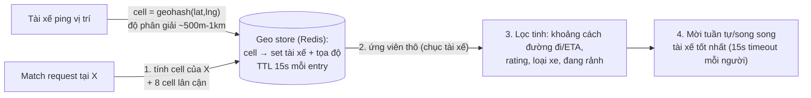

+++
title = "14.7. Ride Hailing — geo real-time và dữ liệu phù du"
date = "2026-07-13T18:20:00+07:00"
draft = false
tags = ["backend", "system-design"]
series = ["System Design — Tư Duy Thiết Kế Hệ Thống"]
+++

> Bài toán định hình: dữ liệu trung tâm (vị trí tài xế) **mất giá trị sau vài giây** — lần đầu trong tài liệu này, ta gặp dữ liệu mà *không lưu* mới là thiết kế đúng. Cộng với matching thời gian thực theo không gian — bài toán mà index truyền thống bó tay.

## 1. Business Requirement & Constraint

App gọi xe khu vực (xe máy + ô tô, 3 thành phố lớn VN): khách đặt xe, hệ tìm tài xế gần, khớp lệnh, theo dõi chuyến, tính cước, surge giờ cao điểm. 50K tài xế hoạt động, 500K khách; team 15 dev. Ràng buộc nghiệp vụ khắc nghiệt: **matching chậm 5 giây = khách mở app đối thủ** — thị trường hai chiều, cả hai phía đều có lựa chọn khác trong túi.

## 2. FR & NFR

FR: tài xế phát vị trí liên tục; khách thấy xe quanh mình + ETA; đặt xe → match tài xế phù hợp (gần + rating + loại xe); tài xế nhận/từ chối trong 15s; theo dõi chuyến real-time; tính cước (quãng đường + thời gian + surge); lịch sử chuyến.

NFR — phân đôi rõ rệt theo loại dữ liệu:

- **Vị trí tài xế:** cập nhật mỗi 3–5s; đọc bởi matching + khách xem bản đồ; **stale 10s là vô dụng** → độ tươi là tất cả, durability là số không: mất toàn bộ vị trí khi restart? — 5 giây sau có lại đủ ([5.4 §3 — đúng định nghĩa dữ liệu loại (a)](/series/system-design/05-data-layer/04-redis/)).
- **Chuyến đi & tiền:** trạng thái chuyến, cước, đối soát với tài xế — **không được mất, không được sai** — đây là nhánh [14.5 Banking](/series/system-design/14-case-studies/05-banking-fintech/) thu nhỏ (ví tài xế, hoa hồng — ledger, idempotency, đối soát: nguyên bộ).
- Match: p95 < 3s từ lúc đặt đến lúc có tài xế được mời.

Hai NFR đối nghịch trên hai loại dữ liệu trong *một* hệ thống — bài học [14.1 §3 (tách luồng theo NFR)](/series/system-design/14-case-studies/01-url-shortener/) ở dạng cực đoan nhất.

## 3. Scale Estimation

50K tài xế × 1 ping/4s ≈ **12.5K writes/giây đều đặn** — dòng ghi lớn nhất hệ thống, và *không cần bền*. Đặt xe: 200K chuyến/ngày, peak giờ cao điểm ~15 chuyến/giây — mỗi chuyến một chuỗi giao dịch trạng thái. Đọc bản đồ: 100K khách mở app giờ peak × poll/push vị trí 5s — fan-out đọc lớn nhưng theo *khu vực* (khách chỉ cần xe quanh mình 2km).

Kết luận cấu trúc: **hai hệ dữ liệu tách hẳn** — geo layer trong RAM (ghi 12.5K/s, TTL ngắn) và trip layer bền (ACID, 15 TPS — bé). Trộn chúng vào một DB là ép hai NFR đối nghịch chung một engine ([5.7 — không engine nào tối ưu cả hai trục](/series/system-design/05-data-layer/07-so-sanh-lua-chon/)).

## 4. Geo-index — tìm "gần đây" trong O(log n)

"Tài xế nào trong bán kính 2km quanh điểm X?" — B-tree trên (lat, lng) vô dụng: hai chiều độc lập, range trên cả hai là quét hình chữ nhật lớn. Lời giải chuẩn: **chia không gian thành ô có mã tuyến tính** — geohash/S2/H3: điểm gần nhau → mã gần nhau (phần lớn trường hợp) → "quanh X" = tra vài ô lân cận:

- **TTL 15s trên mỗi entry vị trí** = cơ chế dọn tự nhiên: tài xế tắt app/mất sóng *tự biến mất* khỏi index — không cần "sự kiện offline" đáng tin (mà không bao giờ đáng tin — [4.4 — chết và mất sóng không phân biệt được](/series/system-design/04-distributed-systems/04-clock-partition-split-brain/)).
- **Hot cell là hot partition tự nhiên** ([13.2 §case 9](/series/system-design/13-production-failure-cases/02-database-failures/)): sân bay giờ vàng — nghìn tài xế một ô. Thuốc đúng bài: độ phân giải cell thích ứng (ô đông chia nhỏ hơn — H3 hỗ trợ đa cấp tự nhiên) hoặc shard theo thành phố *trước*, cell *sau* — thành phố là ranh giới ownership tự nhiên tuyệt đối (không ai gọi xe xuyên tỉnh trong một chuyến matching — [12.9 home-region](/series/system-design/12-evolution/09-multi-region/), [8.1 §3.2](/series/system-design/08-data-partitioning/01-partitioning-sharding/) đúng nguyên văn).

## 5. Matching & trạng thái chuyến — chỗ ACID quay lại ngai vàng

Match là **tranh chấp phân tán kinh điển:** hai khách cùng lúc match một tài xế rảnh — ai được? Lời giải: trạng thái tài xế (`rảnh/đang được mời/bận`) là bản ghi có thẩm quyền trong DB bền (không phải geo store!) + chuyển trạng thái bằng update có điều kiện atomic (`UPDATE driver SET status='invited' WHERE id=? AND status='free'` — hàng ảnh hưởng 0 = thua cuộc, mời người kế — [13.2 §case 6](/series/system-design/13-production-failure-cases/02-database-failures/), một lần nữa). Geo store chỉ *gợi ý ứng viên*; **quyết định khóa tài xế thuộc về ACID** — đúng nguyên tắc vàng: [không quyết định ghi trên dữ liệu dẫn xuất](/series/system-design/07-caching/00-tong-quan/).

Chuyến đi là **state machine bền**: `requested → matched → arriving → in_trip → completed → paid` — mỗi chuyển tiếp một sự kiện (outbox — [6.8](/series/system-design/06-communication/08-outbox/)) nuôi: notification ([14.4](/series/system-design/14-case-studies/04-notification-system/)), tracking cho khách (đường WebSocket — [14.3 gateway mỏng](/series/system-design/14-case-studies/03-chat-application/), nguyên bài), tính cước, analytics. Surge pricing: đếm cung/cầu theo cell (đã có sẵn từ geo layer) → hệ số giá theo khu vực, cập nhật mỗi phút — eventual thoải mái, nhưng **chốt hệ số tại thời điểm đặt** vào bản ghi chuyến (khách không chấp nhận giá đổi giữa chừng — snapshot giá là quyết định *công bằng*, không phải kỹ thuật).

## 6. Trade-off trung tâm

| Quyết định | Chọn | Giá |
|---|---|---|
| Geo layer RAM + TTL, không lưu lịch sử vị trí nóng | Ghi 12.5K/s thành chuyện nhỏ; tự dọn | Mất bản đồ nóng khi Redis chết — degraded: match theo cell thô hơn trong ~10s tự hồi; lịch sử vị trí (cho cước/an toàn) ghi *riêng* theo chuyến, sample thưa hơn, vào store bền |
| Geo gợi ý, ACID quyết | Không double-match | Hai hệ phải nhất quán *đủ* — tài xế trong geo mà bận trong DB: lọc ở bước 3, chấp nhận vài vòng mời hụt |
| Mời tuần tự từng tài xế (15s) | Công bằng, tài xế có quyền từ chối | Chuỗi mời dài khi từ chối nhiều → p95 match 3s căng giờ thấp cung: mời song song 2–3 người kèm khóa-người-nhận-đầu (đánh đổi: tài xế bị "hụt" lệnh — chai kinh nghiệm của mọi app xe) |
| Shard theo thành phố từ ngày 1 | Ranh giới tự nhiên, hot cell cô lập, mở thành phố mới = nhân bản stack | Chuyến xuyên ranh (sân bay tỉnh giáp) cần xử lý biên — hiếm, chấp nhận đường chậm |
| Snapshot giá surge vào chuyến | Công bằng, khiếu nại giảm | Mất "tối ưu doanh thu theo giây" — đánh đổi đúng hướng niềm tin |

## 7. Production & Evolution

- **Metric đặc thù:** match rate (% đặt xe có tài xế — chỉ số sức khỏe *thị trường*, không chỉ hệ thống), time-to-match p95 theo thành phố/giờ, ping loss rate của tài xế (mạng 4G thực địa), độ tươi geo store (tuổi entry già nhất còn được match), và cung/cầu theo cell — dashboard vận hành *kinh doanh* và *kỹ thuật* là một ở domain này.
- **Ngày xấu đặc thù:** mưa lớn Sài Gòn — cầu ×3, cung ÷2, ping ×lỗi mạng: hệ chịu tải cao nhất đúng lúc hạ tầng di động tệ nhất → mọi đường tài xế phải chịu mạng chập chờn (reconnect jitter — [14.3 §6](/series/system-design/14-case-studies/03-chat-application/), ping gộp, degrade độ phân giải).
- **Evolution:** ETA/pricing bằng ML (feature từ dòng event sẵn có — [12.7](/series/system-design/12-evolution/07-kafka-event-driven/)); mở thành phố mới = deploy stack theo city-shard (đã là đơn vị nhân bản); giao đồ ăn/hàng = *cùng* geo + matching + trip core, khác domain layer — phần thưởng của ranh giới đúng.

## 8. Bài học rút ra

1. **Không phải dữ liệu nào cũng đáng lưu** — vị trí nóng có vòng đời 15 giây; thiết kế cho sự phù du (RAM + TTL) đơn giản và *đúng* hơn mọi nỗ lực bền hóa. Câu hỏi "dữ liệu này sống bao lâu?" xứng đáng đứng cạnh "dữ liệu này mất được không?" trong mọi design review.
2. **Dẫn xuất gợi ý, ACID quyết định** — geo index là read model; khóa tài xế là transaction: cặp đôi này là [CQRS](/series/system-design/12-evolution/08-cqrs/) + [nguyên tắc cache](/series/system-design/07-caching/00-tong-quan/) hợp nhất trong một luồng nghiệp vụ 3 giây.
3. **Ranh giới địa lý tự nhiên là món quà kiến trúc** — thành phố vừa là shard key, vừa là đơn vị scale, vừa là đơn vị kinh doanh: khi domain *có* ranh giới tự nhiên, nghe theo nó thắng mọi sự thông minh nhân tạo ([8.1 §3.2](/series/system-design/08-data-partitioning/01-partitioning-sharding/)).

---

*Tiếp theo: [14.8. SaaS Platform — multi-tenancy và noisy neighbor](/series/system-design/14-case-studies/08-saas-platform/)*
