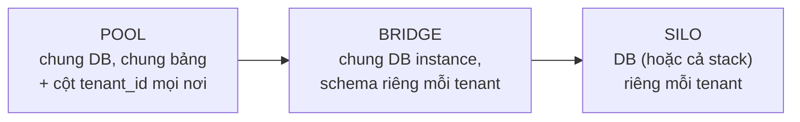

+++
title = "14.8. SaaS Platform — multi-tenancy và noisy neighbor"
date = "2026-07-13T18:30:00+07:00"
draft = false
tags = ["backend", "system-design"]
series = ["System Design — Tư Duy Thiết Kế Hệ Thống"]
+++

> Bài toán định hình: **một hạ tầng, nghìn khách hàng, và hai lời hứa mâu thuẫn** — "dữ liệu của bạn cách ly tuyệt đối" và "giá rẻ nhờ dùng chung". Multi-tenancy là nghệ thuật giữ cả hai lời hứa cùng lúc — và tenant lớn nhất luôn lớn hơn tenant nhỏ nhất *bốn bậc độ lớn* ([13.2 — luật lũy thừa, lần thứ n](/series/system-design/13-production-failure-cases/02-database-failures/)).

## 1. Business Requirement & Constraint

SaaS quản lý bán hàng đa kênh cho SME Việt Nam (đơn hàng, kho, khách hàng, báo cáo — kết nối sàn TMĐT): 5.000 tenant từ shop 2 người đến chuỗi bán lẻ 200 cửa hàng. Doanh thu theo gói (freemium → enterprise). Team 12 dev. Ràng buộc sống còn của mô hình SaaS: **chi phí phục vụ mỗi tenant phải giảm theo quy mô** — nếu mỗi khách mới cần thêm người vận hành, đó là công ty outsourcing đội lốt SaaS.

## 2. FR & NFR — NFR có thêm một chiều mới: "của ai"

FR: CRUD nghiệp vụ (đơn, kho, khách), đồng bộ sàn TMĐT (webhook + poll), báo cáo, phân quyền trong tenant, API mở cho tenant enterprise.

NFR — điểm đặc thù là mọi NFR đều phải gắn hậu tố *per-tenant*:

- **Cách ly dữ liệu tuyệt đối:** tenant A *không bao giờ* thấy dữ liệu tenant B — lỗi cách ly là lỗi tồn vong, không phải bug thường ([11.1 — IDOR phiên bản doanh nghiệp](/series/system-design/11-security/01-authn-authz/)).
- **Cách ly hiệu năng:** tenant chuỗi bán lẻ chạy báo cáo cuối tháng không được làm shop 2 người chậm — noisy neighbor là khiếu nại số một của mọi SaaS dùng chung.
- Availability 99.9% chung; enterprise ký SLA riêng cao hơn ([1.2 §2 — SLA lỏng hơn SLO](/series/system-design/01-foundations/02-sla-slo-sli/)).
- Chi phí hạ tầng per-tenant phải *đo được* — để định giá gói đúng.

## 3. Quyết định trung tâm: mô hình tenancy — phổ, không phải nhị phân

| | Pool (chung bảng) | Bridge (schema riêng) | Silo (DB riêng) |
|---|---|---|---|
| Chi phí per-tenant | Thấp nhất — mục tiêu SaaS | Trung bình | Cao — chỉ enterprise gánh nổi |
| Cách ly dữ liệu | Bằng **kỷ luật code** (mọi query có tenant_id) | Bằng namespace DB | Bằng vật lý — mạnh nhất |
| Noisy neighbor | Nặng nhất — chung mọi tài nguyên | Chung instance, đỡ hơn chút | Gần như không |
| Vận hành 5.000 tenant | Một schema, một migration | **5.000 lần migration** — ác mộng có thật | 5.000 DB — chỉ khả thi khi tự động hóa tuyệt đối |
| Backup/restore một tenant | Khó (lọc từ bảng chung — [3.2 §3 restore từng phần](/series/system-design/03-availability-reliability/02-backup-recovery/)) | Dễ | Dễ nhất |

**Chọn: pool làm mặc định + silo cho enterprise trả tiền** — mô hình lai theo *giá trị khách hàng*, cùng triết lý VIP lane đã gặp ở [13.2](/series/system-design/13-production-failure-cases/02-database-failures/) và [14.2 celebrity](/series/system-design/14-case-studies/02-social-network/): 95% tenant ở pool (rẻ, một đường vận hành), top enterprise được silo (cách ly + SLA + backup riêng — và *tính tiền* cho điều đó). Bridge (schema-per-tenant) nghe hấp dẫn nhưng chết ở migration ×5.000 — cái bẫy phổ biến nhất của SaaS non trẻ.

**Cách ly dữ liệu ở pool — ba lớp, vì kỷ luật code là không đủ:**

1. `tenant_id` trong **mọi** bảng + mọi query — ép bằng tầng repository (base class tự tiêm điều kiện — [11.1 §3, đúng bài chống IDOR](/series/system-design/11-security/01-authn-authz/)).
2. **Row-Level Security của PostgreSQL** ([5.1](/series/system-design/05-data-layer/01-postgresql/)): policy `tenant_id = current_setting(...)` — DB tự chặn cả khi code sót; lớp lưới cho lớp kỷ luật.
3. Test cách ly tự động cho mọi endpoint (user tenant A gọi id của tenant B → 404) — trong CI, không phải trong niềm tin.

## 4. Cách ly hiệu năng — chống noisy neighbor theo tầng

- **Tầng API:** rate limit + quota **theo tenant** ([11.3 §3 — khóa theo tenant](/series/system-design/11-security/03-gateway-ratelimit-waf/)), ngưỡng theo gói — hàng rào đầu tiên và rẻ nhất.
- **Tầng tác vụ nặng:** báo cáo, export, đồng bộ sàn — **tất cả qua queue với fair scheduling** (round-robin theo tenant, không FIFO thuần: FIFO nghĩa là tenant to xếp 10.000 job thì tenant nhỏ chờ sau — [14.4 §4, bài phân hạng quen thuộc](/series/system-design/14-case-studies/04-notification-system/) nay theo chiều tenant) + giới hạn concurrent job per-tenant.
- **Tầng DB:** query timeout per-request; báo cáo đọc từ **replica/read model** ([12.8 CQRS](/series/system-design/12-evolution/08-cqrs/)) — OLTP của mọi tenant không gánh analytics của tenant nào; statement timeout chặn query cào của API mở.
- **Tầng đo:** cost attribution — gắn tenant_id vào mọi metric/log ([10.1 — nhưng cẩn thận cardinality: tenant là label *chấp nhận được* ở 5K, phải sample/gộp ở 500K](/series/system-design/10-observability/01-ba-tru/)) → biết tenant nào ăn bao nhiêu → định giá và ra quyết định "mời lên silo" bằng số liệu.

## 5. Trade-off trung tâm

| Quyết định | Chọn | Giá |
|---|---|---|
| Pool + silo lai | Rẻ cho số đông, cách ly cho VIP | Hai đường vận hành; di cư tenant pool→silo phải là quy trình đã tập ([8.3 — dual-write/cutover, phiên bản tenant](/series/system-design/08-data-partitioning/03-resharding-van-hanh/)) |
| RLS + repository + test | Cách ly ba lớp | RLS thêm ~vài % overhead query; đáng từng đồng |
| Fair queue thay FIFO | Tenant nhỏ không bao giờ đói | Scheduler tự viết phức tạp hơn — hoặc dùng queue-per-tenant-class (3 hạng gói = 3 queue, đủ tốt và đơn giản hơn nhiều) |
| Một schema chung, feature flag theo gói | Một codebase, một migration | Bảng phải chứa mọi tính năng mọi gói — kỷ luật nullable/module ([12.5](/series/system-design/12-evolution/05-modular-monolith/)); tùy biến sâu per-tenant là *lời từ chối có giá trị* (SaaS chết vì gật đầu mọi yêu cầu enterprise) |
| Tenant_id là shard key tương lai | Đường scale sạch sẽ đã mở sẵn | Không có gì — đây là quyết định miễn phí hôm nay, vô giá năm sau ([8.1 §3.2 — tenant là "chủ sở hữu tự nhiên" mẫu mực](/series/system-design/08-data-partitioning/01-partitioning-sharding/)) |

## 6. Production & Evolution

- **Metric đặc thù:** mọi SLI *cắt theo tenant* (một tenant đau đớn chìm nghỉm trong trung bình toàn hệ — [1.2 §7](/series/system-design/01-foundations/02-sla-slo-sli/)); phân bố tài nguyên theo tenant (top 10 tenant ăn bao nhiêu %?); queue wait theo hạng gói; và **onboarding time** (tenant mới tự vận hành được sau bao lâu — chỉ số sản phẩm quyết định tăng trưởng SaaS).
- **Ngày xấu đặc thù:** một tenant bị chiếm API key → cào/bơm dữ liệu điên cuồng (rate limit per-key cứu cả pool — [11.3](/series/system-design/11-security/03-gateway-ratelimit-waf/)); webhook từ sàn TMĐT dồn cục (Lazada/Shopee bắn lại sau sự cố của *họ* — [13.5 3rd-party](/series/system-design/13-production-failure-cases/05-infrastructure-failures/) + [13.3 backlog](/series/system-design/13-production-failure-cases/03-messaging-failures/): queue + idempotency, nguyên bộ); migration schema trên bảng pool 500GB ([5.2 §6 online migration](/series/system-design/05-data-layer/02-mysql/)).
- **Evolution:** 50K tenant → shard pool theo tenant_id (đường đã mở); enterprise đòi region riêng ([12.9 — data residency per-tenant](/series/system-design/12-evolution/09-multi-region/)); API mở lớn dần thành platform (webhook ra, app marketplace — chính mình thành "sàn" mà tenant tích hợp: vòng lặp đẹp của SaaS trưởng thành).

## 7. Bài học rút ra

1. **Tenancy là quyết định phổ, chọn theo giá trị khách hàng** — pool cho số đông, silo bán như tính năng; và tránh cái bẫy ở giữa (schema-per-tenant) trông cân bằng nhưng gánh nhược của cả hai đầu.
2. **Cách ly phải nhiều lớp vì con người sót** — repository + RLS + test là cùng một nguyên lý defense-in-depth của [Phần 11](/series/system-design/11-security/00-tong-quan/), áp vào ranh giới quan trọng nhất của SaaS.
3. **Tenant_id là trục của mọi thứ** — cách ly, đo lường, định giá, rate limit, sharding, residency: một cột dữ liệu mang cả mô hình kinh doanh. Thiết kế SaaS = thiết kế mọi tầng đều *ý thức về tenant*.

---

*Tiếp theo: [14.9. AI Platform — GPU đắt và hai chế độ phục vụ](/series/system-design/14-case-studies/09-ai-platform/)*
