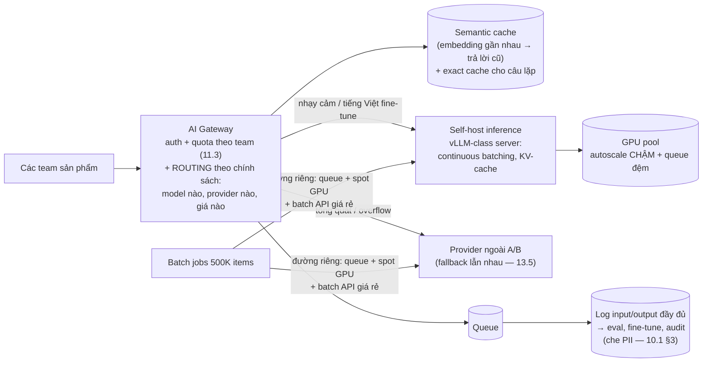

+++
title = "14.9. AI Platform — GPU đắt và hai chế độ phục vụ"
date = "2026-07-13T18:40:00+07:00"
draft = false
tags = ["backend", "system-design"]
series = ["System Design — Tư Duy Thiết Kế Hệ Thống"]
+++

> Bài toán định hình: tài nguyên tính toán đắt nhất từng xuất hiện trong tài liệu này (GPU inference đắt hơn CPU serving 10–100×), thời gian xử lý một request dài nhất (giây, không phải mili-giây), và output **không tất định**. Ba đặc điểm đó bẻ cong nhiều phản xạ đã học — nhưng phần lớn bộ công cụ cũ vẫn đúng, chỉ cần vặn lại hệ số.

## 1. Business Requirement & Constraint

Nền tảng AI nội bộ cho một tập đoàn bán lẻ: các team sản phẩm gọi chung một cửa để dùng LLM (chatbot CSKH, tóm tắt đánh giá, sinh mô tả sản phẩm) và các model nội bộ (phân loại ảnh, dự báo). Kết hợp **API bên ngoài** (OpenAI/Claude-class) và **model tự host trên GPU** (model tiếng Việt fine-tune, dữ liệu nhạy cảm không được rời hạ tầng). Team 8 dev/ML. Ràng buộc thống trị: **ngân sách GPU + API bill** — đây là hệ thống đầu tiên trong tài liệu mà *chi phí biến đổi theo từng request* đủ lớn để thành NFR số một.

## 2. FR & NFR — hai chế độ phục vụ, hai thế giới

FR: một API thống nhất (`/v1/generate`, `/v1/classify`) trước nhiều model/provider; quản lý prompt/version; quota theo team; log đầy đủ input/output phục vụ đánh giá; đường batch cho xử lý khối lượng lớn (sinh mô tả cho 500K sản phẩm).

NFR tách đôi rõ rệt — **quen thuộc từ [14.1 §3](/series/system-design/14-case-studies/01-url-shortener/) nhưng cực đoan hơn:**

| | Online (chatbot, interactive) | Batch (500K mô tả sản phẩm) |
|---|---|---|
| Latency | Time-to-first-token < 2s, **streaming** từng token (UX chờ được nếu thấy chữ chạy) | Không quan tâm — deadline theo *ngày* |
| Throughput | Vừa | Tối đa hóa — GPU utilization là tất cả |
| Chi phí | Chấp nhận đắt hơn per-token | Rẻ nhất có thể: batch API giá rẻ của provider, spot GPU, chạy đêm |
| Độ tin | Retry + fallback provider ngay | Retry thoải mái, resume theo checkpoint |

Cộng một NFR mới toanh: **chất lượng output** — không đo được bằng status code; cần bộ eval (golden set — [9.1 §6, họ hàng của golden queries](/series/system-design/09-search/01-full-text-search/)) chạy khi đổi model/prompt: "nâng cấp model" mà không có eval là đổi hành vi sản phẩm không kiểm soát.

## 3. Scale & chi phí estimation — tiền là đơn vị đo chính

Chatbot: 50K phiên/ngày × 8 lượt × ~1.500 token/lượt ≈ 600M token/ngày. Với giá API-class ~$0.5–5/1M token (dao động lớn theo model — kiểm tra giá tại thời điểm đọc): **$300–3.000/ngày** — con số làm mọi quyết định routing/caching thành quyết định tiền tươi. Model tự host: 1 GPU serving ~vài trăm–nghìn token/s tùy model/quantization → đội GPU cần cho peak vs chi phí thuê ($1–4/giờ/GPU) — bài toán build-vs-buy ([chương 00 §4](/series/system-design/00-tu-duy-thiet-ke/)) có thêm chiều mới: *mua theo giờ hay theo token*.

## 4. Kiến trúc — gateway thông minh trước hai loại backend

Các quyết định xương sống:

1. **Gateway là trung tâm giá trị** — không phải proxy mỏng: routing theo chính sách (bài toán này cần model đắt hay rẻ đủ? dữ liệu được phép ra ngoài không?), quota theo team bằng *token/tiền* chứ không phải request ([11.3 §3 — quota là chính sách thương mại](/series/system-design/11-security/03-gateway-ratelimit-waf/)), fallback đa provider ([13.5 §case 21 — nguyên bài third-party](/series/system-design/13-production-failure-cases/05-infrastructure-failures/), thêm gia vị: fallback sang model *khác* có thể đổi chất lượng — phải khai với team dùng), và **streaming pass-through** (SSE từ backend ra client — [14.3 — lại connection dài](/series/system-design/14-case-studies/03-chat-application/)).
2. **GPU serving khác CPU serving ở một chữ: batching.** GPU hiệu quả khi xử *nhiều request cùng lúc trong một batch* — inference server hiện đại (vLLM-class) làm **continuous batching**: request đến giữa chừng được ghép vào batch đang chạy. Hệ quả vận hành: (a) latency và throughput giằng nhau qua kích thước batch ([1.3 §4 — trade-off nguyên thủy](/series/system-design/01-foundations/03-throughput-latency/), nay ở dạng thuần khiết nhất); (b) **utilization GPU là metric số một** — GPU idle là tiền cháy theo giờ; (c) autoscale GPU *chậm* (kéo model chục GB vào VRAM: nhiều phút — [2.3 §2: trễ thực thi khổng lồ](/series/system-design/02-scalability/03-auto-scaling/)) → **queue đệm trước GPU là bắt buộc**, và pre-scale theo lịch cho giờ cao điểm đã biết.
3. **Cache có tầng mới — semantic cache:** câu hỏi lặp *về nghĩa* ("phí ship bao nhiêu" ↔ "ship tốn bao nhiêu tiền") → embedding + tìm lân cận → trả câu trả lời đã có. Hit rate 20–40% cho CSKH là tiền thật; giá của nó là một loại *stale mới* — trả lời cũ cho ngữ cảnh đã đổi (chính sách ship vừa thay!) → TTL + invalidate theo nguồn tri thức ([7.2 — bài invalidation, biến thể mới](/series/system-design/07-caching/02-cache-invalidation/)).
4. **RAG cho tri thức nghiệp vụ:** chatbot trả lời từ tài liệu công ty = retrieval (vector + keyword lai — [9.1 §4](/series/system-design/09-search/01-full-text-search/)) + đưa vào prompt. Kiến trúc: pipeline index tài liệu (chunk → embed → vector store) là **một search indexing pipeline** đúng nghĩa ([9.2](/series/system-design/09-search/02-search-architecture/) áp nguyên: nguồn sự thật, CDC, rebuild, lag) — nhận ra điều này tiết kiệm cả quý phát minh lại.

## 5. Trade-off trung tâm

| Quyết định | Chọn | Giá |
|---|---|---|
| Lai self-host + API ngoài | Nhạy cảm ở nhà, tổng quát đi thuê, overflow hai chiều | Hai chế độ vận hành; chất lượng khác nhau giữa model — eval phải phủ cả hai |
| Queue trước GPU + streaming | GPU no đều, user thấy chữ chạy | Chờ trong queue cộng vào time-to-first-token — SLO tính cả queue, không chỉ inference |
| Semantic cache | Cắt 20–40% bill CSKH | Sai-mà-tự-tin khi ngữ cảnh đổi; ngưỡng similarity là núm chỉnh precision/cost phải tune bằng eval |
| Log đầy đủ input/output | Eval + fine-tune + audit — tài sản dữ liệu | Kho log nhạy cảm nhất công ty: PII masking + access control + retention nghiêm ([10.1 §3](/series/system-design/10-observability/01-ba-tru/), [11.1 §5](/series/system-design/11-security/01-authn-authz/)) |
| Quota bằng tiền/token theo team | Chi phí có chủ, không có hóa đơn bất ngờ | Team phải học ước lượng token — gateway trả về usage trong response để họ tự thấy |

## 6. Production & Evolution

- **Metric đặc thù:** GPU utilization + queue wait (cặp giằng co), time-to-first-token p95, token/s throughput, **cost per request theo team/tính năng** (dashboard tiền là dashboard số một), cache hit (exact + semantic), tỷ lệ fallback giữa provider, và eval score theo version (chất lượng là metric, không phải cảm giác).
- **Ngày xấu đặc thù:** provider ngoài đổi giá/deprecate model (rủi ro *thương mại* của dependency — trừu tượng hóa qua gateway là bảo hiểm); một team viết prompt-vòng-lặp tự gọi đệ quy → bill nổ trong một đêm (quota cứng + alert chi tiêu theo giờ — [2.3 §6 — không giới hạn max, phiên bản đắt hơn](/series/system-design/02-scalability/03-auto-scaling/)); model mới "tốt hơn trên benchmark" nhưng tệ hơn trên tiếng Việt nghiệp vụ (eval nội bộ là trọng tài duy nhất).
- **Evolution:** thêm modality (ảnh, voice) = thêm backend sau cùng gateway; fine-tune pipeline từ chính log đã đánh giá (vòng lặp dữ liệu — tài sản thật của platform); GPU đội lớn dần → bài scheduling/bin-packing nghiêm túc (K8s + thư viện GPU scheduling — lúc đó đã là công ty khác).

## 7. Bài học rút ra

1. **Khi chi phí biến đổi per-request đủ lớn, tiền trở thành NFR hạng nhất** — routing, caching, quota đều là quyết định tài chính; kiến trúc sư AI platform đọc hóa đơn như đọc flamegraph.
2. **Các pattern cũ tái xuất nguyên vẹn, chỉ đổi hệ số:** queue đệm ([12.4](/series/system-design/12-evolution/04-message-queue/)), batching trade-off ([1.3](/series/system-design/01-foundations/03-throughput-latency/)), third-party fallback ([13.5](/series/system-design/13-production-failure-cases/05-infrastructure-failures/)), indexing pipeline ([9.2](/series/system-design/09-search/02-search-architecture/)) — AI không xóa bài cũ, nó làm bài cũ *đắt gấp trăm lần* nên làm đúng quan trọng gấp trăm lần.
3. **Chất lượng không tất định cần bộ đo riêng** — eval/golden set đứng ngang hàng unit test trong CI: hệ thống mà output không so sánh được bằng `==` đòi một kỷ luật kiểm định mới, và team nào xây kỷ luật đó sớm sẽ đổi model nhanh gấp mười team còn lại.

---

*Tiếp theo: [14.10. Search System — Phần 9 trong hành động](/series/system-design/14-case-studies/10-search-system/)*
