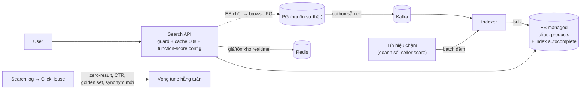

+++
title = "14.10. Search System — Phần 9 trong hành động"
date = "2026-07-13T18:50:00+07:00"
draft = false
tags = ["backend", "system-design"]
series = ["System Design — Tư Duy Thiết Kế Hệ Thống"]
+++

> Case study cuối cùng có vai trò đặc biệt: [Phần 9](/series/system-design/09-search/00-tong-quan/) đã cho đủ lý thuyết — bài này là **bài tập tổng hợp có lời giải**, đi qua đúng trình tự một team thật sẽ đi, để bạn đối chiếu với cách tự mình sẽ làm. Đọc theo cách của [README Phần 14](/series/system-design/14-case-studies/00-tong-quan/): dừng sau mỗi mục, tự trả lời trước, rồi so.

## 1. Business Requirement & Constraint

VietShop ([Phần 12](/series/system-design/12-evolution/00-tong-quan/)) ở giai đoạn 6+: 2M user, 800K SKU từ 10K seller. Search hiện tại là PostgreSQL `ILIKE` từ thời MVP — zero-result rate 22%, CTR search 11%, và đội data chỉ ra: **phiên có search chuyển đổi gấp 2.3 lần phiên duyệt** — nhưng search đang tệ. Bài toán được duyệt ngân sách như một *dự án doanh thu*, không phải dự án hạ tầng: đó là cách đúng để bài search được sinh ra.

## 2. FR & NFR — viết bằng ngôn ngữ sản phẩm

FR: search có dấu/không dấu/sai chính tả nhẹ; autocomplete < 3 ký tự đầu; filter (giá, danh mục, đánh giá, nơi bán) + facet đếm; sort (liên quan/giá/bán chạy); boost theo nghiệp vụ (tồn kho, khuyến mãi, uy tín seller).

NFR:

- Search p95 < 150ms, autocomplete p95 < 50ms ([9.2 §4 — hai SLO, hai index](/series/system-design/09-search/02-search-architecture/)).
- Sản phẩm mới/đổi giá hiển thị đúng trong search ≤ 60 giây ([9.2 §3 — độ trễ index là hợp đồng sản phẩm](/series/system-design/09-search/02-search-architecture/)).
- **Chỉ số chất lượng là KPI chính thức:** zero-result < 8%, CTR search > 18% — team search bị đánh giá bằng hai con số này, không bằng latency. Điểm khác biệt của bài search so với mọi bài khác trong Phần 14: *chất lượng kết quả là NFR số một*.

## 3. Scale Estimation & lựa chọn công nghệ

300K search/ngày hiện tại, kỳ vọng ×3 khi search tốt lên (search tốt *tạo ra* search — vòng lặp dương của UX) ≈ 1M/ngày ≈ ~40 QPS peak search + ~200 QPS autocomplete (mỗi search ~5 lần gõ). Index: 800K SKU × ~3KB document ≈ 2.4GB — **bé**. Ghi: 50K cập nhật sản phẩm/ngày + đổi giá hàng loạt khi có chiến dịch (spike 100K update/giờ).

Chạy qua khung [9.3 §3](/series/system-design/09-search/03-lua-chon-cong-nghe/): search là đường doanh thu (✓ đầu tư), dữ liệu vài triệu doc query vừa — PG FTS đủ? *Gần đủ về khối lượng*, nhưng FR đòi facet nặng + typo + boost đa tín hiệu + tiếng Việt tử tế — đúng các trần của PG FTS ([9.3 — giới hạn thật](/series/system-design/09-search/03-lua-chon-cong-nghe/)). **Chọn Elasticsearch/OpenSearch managed** (cluster nhỏ: 3 node × cỡ vừa — index 2.4GB là tí hon với ES; managed vì team chưa có kỹ năng vận hành cluster JVM — [5.6 §6](/series/system-design/05-data-layer/06-elasticsearch/)). Ghi vào ADR kèm điều kiện xem lại ([chương 00 §6](/series/system-design/00-tu-duy-thiet-ke/)).

## 4. Thiết kế — áp ba chương Phần 9 theo thứ tự

**Analyzer trước tiên** ([9.1 §3](/series/system-design/09-search/01-full-text-search/) — nơi 80% chất lượng): NFC normalize → lowercase → multi-field có dấu + không dấu (bản có dấu boost ×2) → synonym khởi tạo từ 200 cặp do team category viết + nuôi tiếp bằng search log → fuzzy chỉ bật khi khớp chặt < 5 kết quả. **Golden set 300 query** (lấy từ log thật: 100 đầu, 100 giữa, 100 đuôi + đúng các query đang zero-result) chấm điểm trước/sau — con số thắng thua của cả dự án.

**Pipeline** ([9.2 §3](/series/system-design/09-search/02-search-architecture/)): outbox có sẵn từ giai đoạn 7 ([12.7](/series/system-design/12-evolution/07-kafka-event-driven/)) → indexer consumer (idempotent theo `_id`, so version chống out-of-order) → bulk 5K doc/lần; enrich lúc index: tên + mô tả + danh mục + thuộc tính + tín hiệu chậm (doanh số 30 ngày, điểm seller — batch đêm); tín hiệu nhanh (giá sale từng phút, tồn kho) **để ngoài index**, lấy từ Redis lúc render ([9.2 §3 — ranh giới field nhanh/chậm](/series/system-design/09-search/02-search-architecture/)). Spike đổi giá 100K/giờ nhờ vậy *không chạm* ES — đi đường Redis; alias `products` từ ngày 1 cho rebuild.

**Query side:** hai index (search chính + autocomplete edge-ngram nuôi bằng query phổ biến từ log); function score trộn BM25 với tồn kho/khuyến mãi/seller — **hệ số đọc từ config, đổi không cần deploy**, vì tune ranking là việc *hằng tuần* của team; cache kết quả search phổ biến TTL 60s ([9.2 §6](/series/system-design/09-search/02-search-architecture/)); degraded mode: ES chết → API trả browse theo danh mục từ PG + banner "tìm kiếm đang bảo trì" ([13.4 — search là enhancement của browse](/series/system-design/13-production-failure-cases/04-distributed-failures/)).

## 5. Trade-off trung tâm

| Quyết định | Chọn | Giá |
|---|---|---|
| ES managed thay vì cố nốt PG FTS | Facet + typo + boost + tiếng Việt — đúng FR doanh thu | Mất "index cùng transaction" ([9.3 — lợi thế bị đánh giá thấp](/series/system-design/09-search/03-lua-chon-cong-nghe/)): nhận về pipeline + lag + drift phải quản |
| Giá/tồn kho ngoài index | Spike giá không đập ES; số liệu realtime | Thứ tự sort theo "liên quan" có thể lệch giá mới vài chục giây — chấp nhận, ghi rõ |
| Hệ số ranking trong config | Tune hằng tuần không cần release | Config sai = xáo kết quả toàn sàn ngay lập tức — mọi thay đổi qua golden set + canary % traffic |
| Golden set + A/B là trọng tài | Tune có kỷ luật, KPI đo được | Xây bộ đo trước khi xây tính năng — 2 tuần "không ra gì để demo": phần khó bán nhất với PM, và phần đáng tiền nhất |

## 6. Production & Evolution

- **Metric bốn nhóm** ([9.2 §6](/series/system-design/09-search/02-search-architecture/)): hạ tầng (cluster health, p95 hai index), pipeline (lag end-to-end đo bằng probe ghi-rồi-search, DLQ indexer), chất lượng (zero-result, CTR, refine rate — dashboard *tuần* cho cả team sản phẩm), đối soát (count ES vs PG mỗi đêm).
- **Kết quả kỳ vọng để đối chiếu thực tế** (đặt mục tiêu trước khi làm — kỷ luật [1.4 §4](/series/system-design/01-foundations/04-scale-estimation-capacity-planning/)): zero-result 22%→<8% (analyzer + synonym + fuzzy ăn phần lớn), CTR 11%→18%+ (ranking + boost), và search traffic tự tăng khi trải nghiệm tốt lên — đo lại sau 2 tháng, mô hình sai đâu sửa đó.
- **Evolution:** semantic/vector lai khi text đã tốt ([9.1 §4 — đứng trên nền, không thay nền](/series/system-design/09-search/01-full-text-search/)); personalization (re-rank theo lịch sử user); search ảnh; và một ngày nào đó — learning-to-rank khi log đủ dày. Mỗi bước đứng trên *cùng* pipeline và *cùng* bộ đo đã xây hôm nay.

## 7. Bài học rút ra — và lời kết cho toàn bộ Phần 14

1. **Bài search thắng ở bộ đo, không ở engine** — golden set + search log + KPI chất lượng được xây *trước* khi viết query DSL đầu tiên; mọi hệ có output "mềm" (search, ranking, AI — [14.9 §7](/series/system-design/14-case-studies/09-ai-platform/)) đều chung quy luật này.
2. **Tái sử dụng là kỹ năng kiến trúc cao nhất:** bài này gần như không phát minh gì — outbox có sẵn, khung Phần 9 áp nguyên, degraded mode theo Phần 13, ADR theo chương 00. Một Senior giỏi *giải* bài search; một Architect giỏi *nhận ra* bài search là tổ hợp của những bài đã giải.
3. Nhìn lại cả 10 case study + hành trình VietShop: mỗi domain có một bottleneck định hình (fan-out, connection, tiền, băng thông, geo, tenant, GPU, chất lượng) — nhưng bộ công cụ giải chúng lặp lại từ một tập nhỏ: **ước lượng, tách luồng theo NFR, log/ledger bất biến, queue đệm, cache có kỷ luật, idempotency, partition theo chủ sở hữu tự nhiên, đối soát, degraded mode, và đo trước khi tin.** Thuộc tập công cụ đó — và thuộc *câu hỏi* dẫn đến từng công cụ — chính là mục tiêu của toàn bộ tài liệu này.

---

*Hết Phần 14 — và hết tài liệu. Quay lại [mục lục chính](/series/system-design/00-muc-luc/).*
